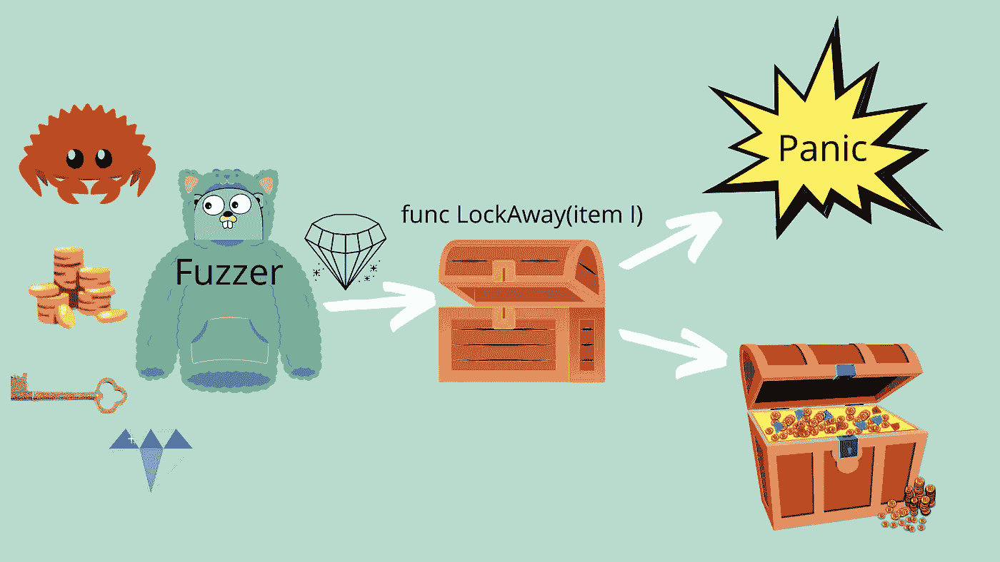
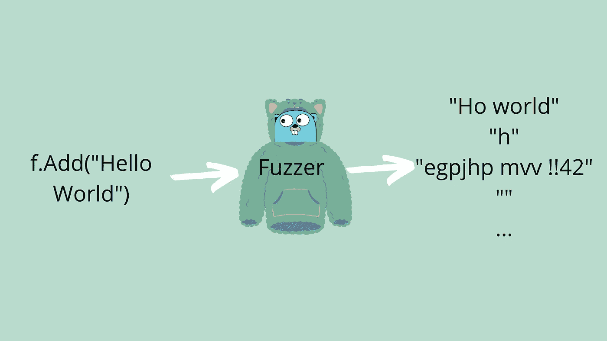

# 围棋模糊测试

> 原文：<https://towardsdatascience.com/fuzzing-tests-in-go-96eb08b7694d>

## 模糊化是一种自动为函数生成输入值来查找 bug 的技术



Go 中的 Fuzzing 允许我们测试随机生成的函数输入。图片由珀西·博尔梅尔提供。Gopher 由拓也·上田提供，原始 Go Gopher 由勒内·弗伦奇提供(CC BY 3.0)

Fuzzing 是作为 Go 1.18 中标准库的一部分发布的。这是一种很酷的方法，可以定位你从未想到的代码中的错误。我知道很多 bug 是使用第三方 fuzzers 的人在 Go 的标准库中发现的。

模糊化将是常规`testing`库的一部分，因为它是一种测试。它也可以和来自`testing`的其他工具一起使用，这很好。

在这篇文章中，我们将学习如何使用新的 fuzzer，以及 fuzzer 我们已经建立的 HTTP 处理程序。

在我们开始之前，你需要确保你运行的至少是 Go 1.18，你可以在我对 1.18 的修改中看到如何安装它。

[](https://medium.com/@percybolmer/go-1-18-comes-with-many-amazing-changes-d33ac0afd6ee) [## Go 1.18 带来了许多惊人的变化

### 期待已久的 Go 1.18 即将到来，它可能是很长一段时间以来讨论最多的 Go 更新…

medium.com](https://medium.com/@percybolmer/go-1-18-comes-with-many-amazing-changes-d33ac0afd6ee) 

这篇关于编程的文章的视频格式是 Youtube

## 设置模糊



向 fuzzer 添加语料库种子，以允许它基于它生成数据。图片由珀西·博尔梅尔提供。Gopher 由拓也·上田提供，原始 Go Gopher 由勒内·弗伦奇提供(CC BY 3.0)

为了开始 fuzzing，我创建了一个新项目，并初始化一个模块，我们将在里面工作。我们还需要一个以`_test.go`为后缀的文件，在我的例子中，我初始化了一个名为 Fuzzy 的模块和一个`main_test.go`

```
mkdir fuzzy
go mod init programmingpercy.tech/fuzzy
touch main_test.go
```

在我们模糊之前，我们需要一些模糊的东西。让我们创建一个处理程序来计算一个整型切片中的最大值。
我们将在处理程序中引入一个错误，看看我们如何通过 fuzzing 找到它，错误将是任何等于 50 的结果都会导致它失败。

带有已知错误的简单 HTTP 处理程序

## 这些模糊的东西是什么

是时候开始学习如何使用模糊器了。

如果你熟悉 Go 测试，这可能会非常容易。Go 中的测试是通过创建一个以`Test`为前缀的函数并接受输入参数`t *testing.T`来定义的。

同样的模式被用于模糊化，但是以`Fuzz`为前缀并接受新的`f *testing.F`。

定义模糊器很简单，只需使用*testing。f 作为输入而不是*测试。T

我们需要做的第一件事是为`testing.F`提供一个`Seed Corpus`，您应该将它视为示例数据。这是 fuzzer 将使用的数据，并将其修改为尝试的新输入。

种子应该尽可能地反映出函数的输入应该是什么样子，以获得模糊器的最佳结果。

添加种子是由接受以下数据类型的`f.Add()`完成的。

*   字符串，[]字节，符文
*   int，int8，int16，int32，int64
*   uint，uint8，unit16，uint32，uint64
*   浮动 32，浮动 64
*   弯曲件

请注意，您不能添加多种数据类型，如果您首先运行`f.Add("hello")`，然后运行`f.Add(10)`，它将会死机。

```
mismatched types in corpus entry: [int], want [string]
```

> 等等，但是我的函数需要多个输入参数？—愤怒的反 Fuzzer

如果需要多个输入参数，`f.Add()`接受可变数量的输入。因此，您可以添加许多示例数据输入，只需确保示例种子与您的函数输入参数的顺序相同。

模糊多个输入参数

现在我们知道了如何添加种子，让我们为处理程序和`Add`创建示例数据。我们将希望添加带有 JSON 数据的`[]byte`,因为我们正在模糊一个 HTTP 处理程序。

我们将首先设置一个 HTTP 服务器来托管我们正在模糊化的处理程序，并创建一些示例片段来提供给`Seed Corpus`。然后，我们将切片整理成适当的 JSON，并将它们添加到 fuzzer 中。

托管 HTTP 处理程序并添加种子语料库。

是时候实现模糊目标了。

要开始模糊化，我们必须使用`f.Fuzz()`，它接受一个函数作为输入。该函数是模糊目标，应该检查错误，准备数据，并触发我们正在模糊的函数。

到`Fuzz`的输入函数必须接受`testing.T`作为第一个参数，随后是添加到语料库的输入数据类型，以同样的顺序接受**。**

在我们的例子中，我们只需要传递`testing.T, []byte`，因为我们只给种子添加了一个[]字节。但是如果你添加了更多的输入，它们也需要在这里声明。

多个输入的外观示例

让我们添加模糊目标。我们将想要做以下事情

1.  将数据发送给我们的处理程序
2.  检查响应状态
3.  检查响应是否为 int。

你可能会想，我们应该检查返回值是否正确，如果你有另一个已知有效的函数，你可以这样做。但是大多数时候你不知道预期收益，因为你不知道模糊器产生了什么输入。

模糊器的初稿

终于到了运行 fuzzer 的时候了。为了启动 fuzzer，我们运行常规的`go test`命令，但是添加了`--fuzz=Fuzz`标志，标志值将被用作前缀，并以 Fuzz 开始所有方法。你可以把它变成你想要的，只匹配某些方法签名。

例如，要开始模糊化我们的`FuzzTestHTTPHandler`,您可以运行下面的代码。

```
go test --fuzz=FuzzTestHTTPHandler
```

这是有用的，当你在未来有多个模糊功能。

模糊化与常规测试有点不同，**的默认行为是一直运行，直到出现故障，**所以你要么需要取消模糊化，要么等到出现错误。还有第三个选项，添加`-fuzztime`标志会在设定时间后取消。

所以要跑 10 秒钟，你会跑

```
go test --fuzz=Fuzz -fuzztime=10s
```

确保运行 fuzzer，并等到它失败。您应该会看到类似于我的输出，但是因为输出是生成的，所以可能不一样。

```
--- FAIL: FuzzTestHTTPHandler (0.51s)
    --- FAIL: FuzzTestHTTPHandler (0.00s)
        main_test.go:80: Expected status code 200, got 400
        main_test.go:87: Error: invalid character 'j' looking for beginning of valueFailing input written to testdata\fuzz\FuzzTestHTTPHandler\582528ddfad69eb57775199a43e0f9fd5c94bba343ce7bb6724d4ebafe311ed4
    To re-run:
    go test -run=FuzzTestHTTPHandler/582528ddfad69eb57775199a43e0f9fd5c94bba343ce7bb6724d4ebafe311ed4
```

当 fuzzer 期间出现错误时，它将取消并将导致失败的输入参数写入文件。所有故障都被写入`testdata\fuzz\NameOfYourFuzz\inputID`。

在这种情况下，JSON 封送处理似乎失败了，让我们查看 fuzzer 文件的内容。

```
go test fuzz v1
[]byte("0")
```

第一行是关于 fuzzer 及其版本的信息。第二行是我们发送给 HTTP 处理程序的生成的有效负载。
这次失败了，因为 fuzzer 发送了一个原始的 0，这没什么，因为那不是正确的 JSON。

当您编写第一个 fuzzer 时，这种情况并不少见，所以让我们将 fuzzer 数据做得更好。我们只想测试有效载荷何时是真正的 JSON，因为我们已经知道任何错误的 JSON 有效载荷都会失败，并且应该失败。

您可以使用`t.Skip("reason of skipping")`跳过不正确的有效载荷，这在模糊化时很有用。我们将使用`json.Valid`函数来确保我们只将正确的 JSON 传递给处理程序。

现在只检查 json。有效是不够的，“0”是有效的 JSON。然而，我们可以尝试将数据解组到一个`ValuesRequest`结构，并跳过任何失败的有效载荷。这是一个过滤掉不良生成的有效载荷的好方法。

带有有效载荷验证的最终模糊器，以确保只测试真实数据

运行模糊器

```
go test -v --fuzz=Fuzz
```

让它运行一段时间，最终，你应该得到一个新的失败文件。该文件将向您显示检测到的错误，任何值 50 都会导致失败。

```
go test fuzz v1[]byte("{\"vAlues\":[50]}")
```

## 结论

好了，你现在可以写你的模糊了。我们使用的例子可能看起来很荒谬，因为你知道`value == 50`错误是由一个简单的 if 语句产生的。然而，为您的 HTTP 处理程序或任何其他方法编写 fuzzers 是检测难以发现的错误的好方法。

模糊器通常可以找到单元测试遗漏的 bug，因为单元测试通常只包含您输入的可能会导致失败的值。

正如您在示例中看到的，为 HTTP 处理程序编写 fuzzer 的代码并不多，而且一旦您做了几次，就可以很快实现新的代码，使您的代码堆栈更加健壮且没有错误。

你还在等什么，出去吧！

如果你想了解更多关于 Go 1.18 的变化，你可以在我的另一篇文章中阅读如何使用新的泛型。

[](https://medium.com/@percybolmer/learning-generics-in-go-318f53752ccd) [## 在围棋中学习泛型

### 泛型在更新 1.18(将于 2022 年 2 月发布)中推出，带有一系列其他闪亮的新功能。你可以…

medium.com](https://medium.com/@percybolmer/learning-generics-in-go-318f53752ccd)