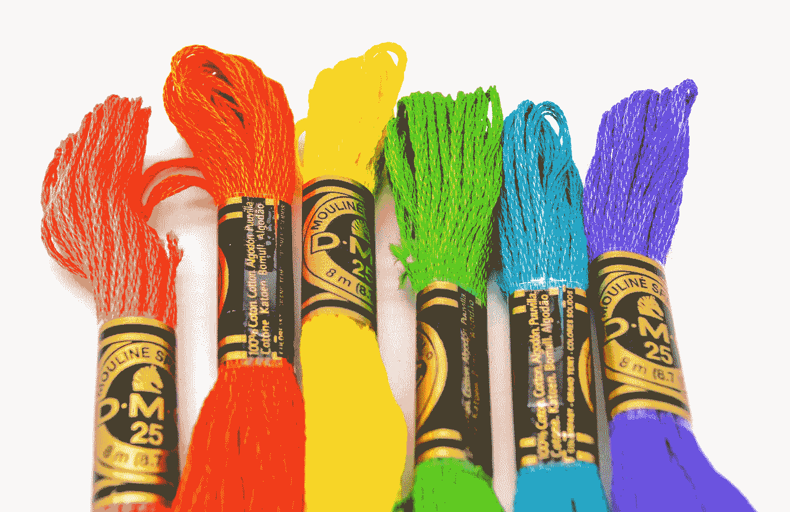
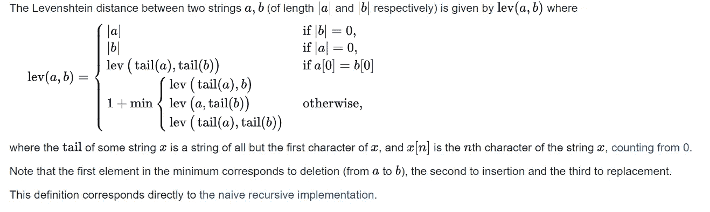
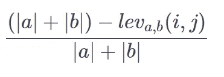
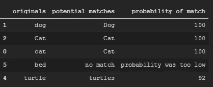

# 模糊字符串匹配—如何匹配不同的字符串

> 原文：<https://towardsdatascience.com/fuzzy-string-matching-how-to-match-strings-that-arent-identical-a686d2d59eac>

## 人类思维很容易注意到接近但不完美的匹配——这就是 Python 的工作方式。



梅尔·普尔在 [Unsplash](https://unsplash.com/s/photos/string?utm_source=unsplash&utm_medium=referral&utm_content=creditCopyText) 上的照片

# 介绍

在本教程中，您将学习如何近似匹配字符串，并通过查看各种示例来确定它们的相似程度。

我将在最后提供一个函数，您可以使用它将一个列表与另一个列表进行匹配，尽管它们可能没有完全相同的匹配。

您是否曾经想要比较引用同一事物的字符串，但它们的书写略有不同，有拼写错误或拼写错误？这是一个经常出现的问题。在大多数没有 ID 的数据集中，您将根据名称进行匹配，如果这些名称拼错了，那就有问题了。

以下是修复方法。

# 莱文斯坦距离

简而言之， [Levenshtein 距离](https://en.wikipedia.org/wiki/Levenshtein_distance) (LD)是一种度量两个序列或字符串之间差异的标准。通俗地说，LD 是将一个序列转换成另一个序列所必须进行的单独编辑的次数。编辑可以是*插入、删除或替换*。它以苏联数学家 [Vladimir Levenshtein](https://en.wikipedia.org/wiki/Vladimir_Levenshtein) 的名字命名，

例如，以下是一些示例的 LD:

*   *卡爪>卡爪* ( **1** —插入‘s’)
*   *卡爪>卡爪*(**2**-插入‘s’并用‘D’替换‘D’)
*   狗>猫( **3** -三个字母都被替换)

下面是来自维基百科的正式方程式，相对简单。如您所见，“D”与“D”不同，标点符号也被视为需要删除的字符。



【https://en.wikipedia.org/wiki/Levenshtein_distance 

直觉上(*我的意思是，在维基百科上阅读它们之后，它们在逻辑上对我来说是有意义的*)LD 有一些上限和下限。以下是一些进一步解释的定义。

*   它至少是两个字符串大小的差异(*至少是必须进行的加法的数量)。*
*   它至多是较长字符串的长度(*即使其中一个字符串的长度为零，也只需要增加与最大字符串的长度相等的长度)。*
*   当且仅当字符串相等时为零*(这需要解释吗？)*
*   如果字符串具有相同的大小，则[汉明距离](https://en.wikipedia.org/wiki/Hamming_distance)是 Levenshtein 距离的上限。汉明距离是两个字符串中对应符号不同的位置的数量。*(这相当于最少换人次数)*
*   两个字符串之间的 Levenshtein 距离不大于它们与第三个字符串之间的 Levenshtein 距离之和([三角形不等式](https://en.wikipedia.org/wiki/Triangle_inequality))。*(即使你让第一串和第三串尽可能的靠近，这也是成立的——试着用['猫'，'狗'，' At']举例)*

**由此，我们还可以计算 Levenshtein 比率(LR ),根据 LD 创建相似性比率。**



由作者创建

其中 a 和 b 的绝对值分别是 a 和 b 的长度。

因此，这就是你需要知道的关于 Levenshtein 测度的全部内容。下面是一些 python 的例子。

创作作者:[https://gist . github . com/ja sher 4994/d 06 ea 3 e 88461978 ede 2 AAA 0 fcfa 633 e 0](https://gist.github.com/jasher4994/d06ea3e88461978ede2aaa0fcfa633e0)

这是输出结果:


VS 作者的代码输出。

正如你所看到的，这工作得很好，但有同音异义词的问题，这取决于你使用它的上下文。如果你只需要一段将来可以使用的代码片段，你可以在这里找到:

创作作者:[https://gist . github . com/ja sher 4994/f 43 CBA 274232 E1 cf 6 db 36943089 e 93 c 4](https://gist.github.com/jasher4994/f43cba274232e1cf6db36943089e93c4)

# 模糊不清的包裹

长话短说，FuzzyWuzzy (FW)包做了 Levenshtein 包所做的一切，但更多。Levenshtein 包是一个很好的介绍，但是您最好在几乎所有情况下都使用 FW 包。

简单 LD 的 FW 输出完全相同，调用方式也完全相同，输出也完全相同。

创作作者:[https://gist . github . com/jasher 4994/27be 17 f 32 f 6b 79 CD 19d 634 EB 30 e 7706 e](https://gist.github.com/jasher4994/27be17f32f6b79cd19d634eb30e7706e)

但是这个令人眼花缭乱的软件包真正发挥作用的地方是它还能做什么。

## 子串匹配

该包可以匹配子字符串:

```
Str1 = "FC Barcelona" Str2 = "Barcelona"
Partial_Ratio = fuzz.partial_ratio(Str1.lower(),Str2.lower())
```

## 令牌排序

它还可以匹配逆序的字符串:

```
Str1 = "FC Barcelona" Str2 = "Barcelona FC"
Token_Sort_Ratio = fuzz.token_sort_ratio(Str1,Str2)Token set ratio
```

## 令牌集

以及相似但长度相差很大的字符串:

```
Str1 = "FC Barcelona" Str2 = "The victory went to FC Barcelona "
Token_Set_Ratio = fuzz.token_set_ratio(Str1,Str2)
```

# 模糊过程

对我来说，这是最有用的部分。你可以为所有可能的匹配计算一个分数，然后选择最大的——或者让 FW 为你做。所以我创建了一个简单的函数来做这件事，同时检查它是否成功。

所以在这里，函数做它在 tin 上所说的。它接受两个列表作为输入，第一个是您试图从第二个匹配的列表。例如，第一个列表可能是某人在输入框中输入的公司列表，第二个列表可能是实际的公司名称。

该函数使用 FW 中的 extractOne 方法创建两个新列表，“匹配”和“概率”。您还必须在这里导入“流程”。我在这里设置了它，以便它只在比率高于 90%时添加一个匹配。你可以把它改成任何适合你的，我推荐 90%以上，否则，你会开始得到一些严重的可疑匹配。如果没有找到匹配，它会插入‘no match’——我这样做是为了保持列表的长度不变。然后，我将它转换成熊猫数据帧，以利用输出。

所以使用下面的两个列表:

```
list1 = ['cat', 'dog', 'Cat', 'Dog', 'turtle', 'bed']list2 = ['cats', 'hotdog', 'Cat', 'Dog', 'turtles', 'bath']
```

运行函数并随机取样:

```
df = match_lists(list1, list2)df.sample(5)
```

(我意识到我是从 6 个观察值中抽取 5 个样本，但这只是为了向你展示我将如何在大范围内这样做。)

在熊猫数据框架中，您会得到以下结果:



由作者创建

然后你可以用一个简单的视力测试来看看这个功能做得有多好——这里看起来相当不错。

感谢阅读，我希望这能帮助你。

```
If I’ve inspired you to join medium I would be really grateful if you did it through this [link](https://jamesasher4994.medium.com/membership) — it will help to support me to write better content in the future.If you want to learn more about data science, become a certified data scientist, or land a job in data science, then checkout [365 data science](https://365datascience.pxf.io/c/3458822/791349/11148) through my [affiliate link.](https://365datascience.pxf.io/c/3458822/791349/11148)
```

这是我写的其他一些东西:

[](/how-to-easily-run-python-scripts-on-website-inputs-d5167bd4eb4b)  [](/how-to-easily-show-your-matplotlib-plots-and-pandas-dataframes-dynamically-on-your-website-a9613eff7ae3)  [](/how-to-easily-automate-your-keyboard-to-do-tasks-in-python-b698e98a5c40) 