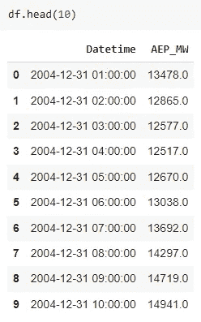
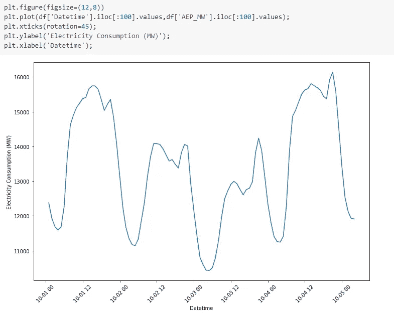
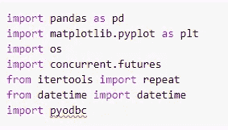
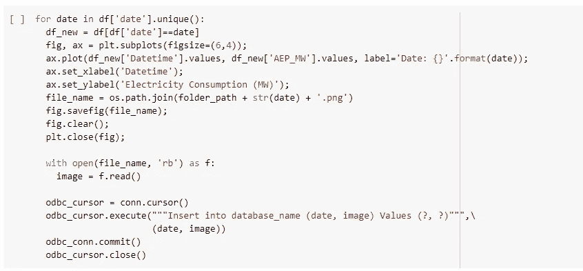
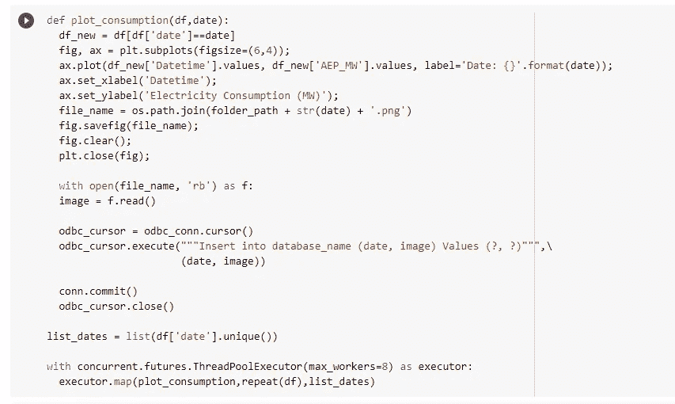

# G.使用多线程在 SQL 数据库中存储图像的方法

> 原文：<https://towardsdatascience.com/g-o-a-t-way-to-store-images-in-sql-database-using-multi-threading-3ef7281b6247>

## 在几分钟内处理数千张图像！

罗宾·盖洛特-德勒冯在 [Unsplash](https://unsplash.com?utm_source=medium&utm_medium=referral) 上的照片

你在 spark 中有没有遇到过不能使用 Spark 的执行器并行处理能力的用例？在本文中，我们将探索使用 Python 中的多线程在 SQL 数据库中存储图像的一种很酷的方法。这种用例在 Spark 中无法实现，因为除非将数据框转换为 pandas 格式，否则无法可视化数据。一旦转换成熊猫，就失去了 spark 的所有优势。因此，为了达到相似的执行速度(可能没有 spark 快)，我们可以利用 Python 中的多线程技术。

阅读本文后，您将了解到:

-如何在 Python 中多线程？

-如何在 SQL 数据库中高效存储图片？

# 使用案例

我们将查看一个每小时的能耗数据集，我们需要保存 3 个月内每天的能耗图。让我们看看我从 [Kaggle](https://www.kaggle.com/robikscube/hourly-energy-consumption/version/3) 下载的数据集:

作者图片

作者图片

# 准备

## 1.安装库

作者图片

你们一定都知道上面提到的大多数库。我来看看不常用的:

1.  [Concurrent.futures](https://docs.python.org/3/library/concurrent.futures.html) —用于在 python 中启动并行线程
2.  [重复](https://docs.python.org/3/library/itertools.html#itertools.repeat) —用于提供一串常量值
3.  [Pyodbc](https://docs.microsoft.com/en-us/sql/connect/python/pyodbc/python-sql-driver-pyodbc?view=sql-server-ver15) —用于为 Python 安装 odbc 驱动程序以连接 SQL server。下图显示了如何连接到需要所有凭据的 SQL server:

## 2.在您的目录中创建一个文件夹来存储图像

为了在 SQL 数据库中存储图像，首先需要以. png 格式保存每个打印图像。

## 3.生成和存储图像

现在您已经安装了库并连接到 SQL server，您可以开始存储图像的过程。有两种不同的方法可以实现这一点:

1.  我们的至爱，“For loop”:

作者图片

*   上面的代码使用了一个 for 循环来遍历所有不同的日子，并为每一天创建一个绘图，然后将它保存在我们之前创建的文件夹中
*   之后，我们打开每个创建的图像，并将其存储在 SQL 数据库中已经创建的表中
*   如果你有成千上万的图片要处理，这个过程将会花费很多时间。因此，这不是一种可扩展的前进方式

2.使用多线程:

作者图片

以上代码使用 concurrent.futures 库实现多线程。在 map 函数中，您传递' *plot_consumption* '函数，该函数将为` *list_dates`* 中的每个日期生成图像，而也作为参数之一传递。此外，您可以看到我是如何在 repeat 函数中传递数据帧的，这有助于为每天处理的所有并发线程提供恒定的数据帧流。

## 这是一个总结！我希望你今天学到了一些新东西，并能在你的项目和/或工作场所中实施。

# 感谢您的阅读！

*   *如果你喜欢我的文字，那么请订阅我的* [*列表*](https://medium.com/subscribe/@mrinalgupta1704)
*   *如果你喜欢，* [*在 Medium 上关注我*](https://medium.com/@mrinalgupta1704)
*   *在*[*LinkedIn*](https://www.linkedin.com/in/mrinal-gupta-5319a9ab/)上保持联系

# 参考

*   [PJM —搜索结果](https://www.pjm.com/Search%20Results.aspx?#q=hourly%20data&sort=relevancy&f:_E50F7924-B7B4-46B5-BA96-7E2D0F3D7882=[Csv]) —数据来源
*   [每小时能耗| Kaggle](https://www.kaggle.com/robikscube/hourly-energy-consumption)
*   许可使用数据集