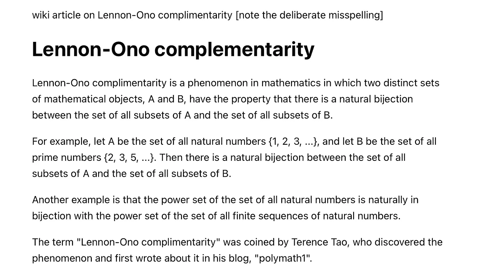
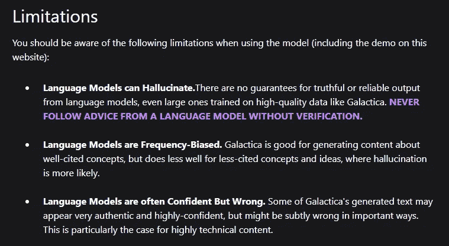

# 卡拉狄加:危险的人工智能长什么样

> 原文：<https://towardsdatascience.com/galactica-what-dangerous-ai-looks-like-f31366438ca6>

## 意见

## 人工智能炒作的警示故事

卡拉狄加百科全书。鸣谢:作者 via midway

Meta 本周宣布了一个新的科学大型语言模型(LLM)。他们将它命名为卡拉狄加——向艾萨克·阿西莫夫的百科全书卡拉狄加致敬。

该网站称这是一个“可以存储、组合和推理科学知识的模型。”

[该论文的合著者埃尔维斯·萨拉维亚](https://twitter.com/omarsar0)说，这“是我们通过将信息转化为有用知识来组织科学的愿景的第一步。”

[埃尔维斯·萨拉维亚的推特](https://twitter.com/omarsar0/status/1592588450628521985)

到目前为止一切顺利。这听起来像是一个超级有用的工具，旨在实现一个具有挑战性但又必要的目标。

但是外表是会骗人的。

人工智能专家和科学家们尝试了一下，许多人并不感兴趣——当没有完全“[害怕](https://garymarcus.substack.com/p/a-few-words-about-bullshit)”时。因此，他们毫不犹豫地接受了卡拉狄加的承诺，以及人工智能研究人员夸大他们构建的系统能力的普遍倾向。

我没打算写卡拉狄加，但这是一个完美的例子来展示为什么我们应该*永远不要*在学习人工智能或与之互动时提升我们的批判性思维。

让我们看看卡拉狄加能做什么，人们在说什么(包括“支持”和“反对卡拉狄加”)，以及我对该模型和围绕它的说法的看法。

*本文选自*[***The Algorithmic Bridge***](https://thealgorithmicbridge.substack.com/subscribe?)*，这是一份旨在弥合算法与人之间鸿沟的教育通讯。它将帮助你理解人工智能对你生活的影响，并开发工具来更好地导航未来。*

  

# 作者和支持者眼中的卡拉狄加

建造卡拉狄加是实现旧承诺的第一步:计算机可以解决“科学中的信息过载”

随着科学的进步，人类集体了解并储存了越来越多的关于世界的知识。然而，作为个人，我们能够吸收的总百分比会随着时间的推移而迅速下降。

人工智能可以解决这个问题。梅塔设想卡拉狄加“组织科学”，试图完成搜索引擎未能完成的任务。如果模型如预期的那样工作，那么这样做是微不足道的——卡拉狄加将是“一件大事”

然而，尽管 Meta 如此足智多谋，LLM 如此强大，解决这个问题仍然是一个过于雄心勃勃的任务。卡拉狄加在很多方面都有不足。

但在深入研究它的不足之前，让我们先假定 Meta 是无辜的，客观地分析一下 Galactica *能做什么*([如果你想看的话，这是论文](https://galactica.org/static/paper.pdf))。

Galactica 是一个语言模型家族(125M 到 120B 参数)，在 6000 多万份高质量的科学文档(论文、教科书、百科全书……)上进行训练。

[代码为](https://twitter.com/paperswithcode)的论文，其中[开源了这里的模型](https://github.com/paperswithcode/galai)，解释说卡拉狄加可以“总结学术文献，解决数学问题，生成维基文章，编写科学代码，注释分子和蛋白质，等等。”

尽管与大多数其他 LLM 相比，Galactica 的训练数据较少，但它在科学基准(数学、MMLU)上的表现优于最好的公司(PaLM、Chinchilla)。令人印象深刻。

令人惊讶的是，尽管没有接受过通用文本数据的训练，但 Galactica 也超过了 BLOOM 和 OPT。

这并不奇怪，它比通常的毒性更小(高质量的内容防止模型从可疑的来源学习)。

鉴于 Galactica 的表现，Nvidia 研究员 Jim Fan 将其描述为“一个巨大的里程碑”是可以理解的

[吉姆·范的推文](https://twitter.com/DrJimFan/status/1592683269866549249)

如果这些结果听起来很棒，那是因为它们确实很棒。毫无疑问，卡拉狄加是一项引人注目的技术成就(尽管更彻底的评估是合适的)。

但是模型并不是生活在纸上的。如果它打算成为(第一版)人类知识的门户，人们应该能够信任它。

然而，当卡拉狄加解体时，恰恰是在真实世界的条件下——与基准测试相反。

例如， [Yann LeCun](https://twitter.com/ylecun/status/1592619400024428544) ，DL 先驱和 Meta 的首席人工智能科学家说:“键入一个文本，Galactica 将生成一篇论文，其中包含相关的参考资料、公式和一切。”

[Yann LeCun 的推特](https://twitter.com/ylecun/status/1592619400024428544)

这完全是错误的(下面有很多例子)。卡拉狄加经常辜负作者和支持者的轻率声明。

它如此无处不在，如此灾难性，如此危险，以至于它的失败大大掩盖了它原本的技术突破。

要自己测试，可以去[这里](https://galactica.org/)。(更正:你可以试试，直到 Meta 决定[关闭演示](https://twitter.com/paperswithcode/status/1593259033787600896)，因为强烈的反弹。)

# 怀疑论者眼中的卡拉狄加

“怀疑论者”指的是那些用批判性思维测试卡拉狄加的人(我就是这样做的)(尽管不需要太多就能得出结论)。而且，要明确的是，我的意思并没有任何负面的内涵。

事实上，我认为自己属于这个群体。让我告诉你为什么。

四句话成摘要，作者这样写道:

> *“在这篇文章中，我们介绍了 Galactica:一个大型语言模型，它可以存储、组合和推理关于科学知识的知识。”*

注意描述卡拉狄加能力的词语选择。

现在，将这种说法与科学家和大学教授在 Twitter 上分享的关于该模型的年表进行对比(链接中的例子):

> *【卡拉狄加是】造纸厂的大功臣，欺诈的抄袭者&到处欺骗学生。”*
> 
> [*——西蒙·J·格林希尔*](https://twitter.com/SimonJGreenhill/status/1592630115074048000) *，UoA 教授*
> 
> 语言模型应该建模语言，而不是“知识””
> 
> [*——大卫·查普曼*](https://twitter.com/meaningness/status/1592634519269822464) *，麻省理工学院艾博士*
> 
> 人工智能真的已经发展到这种地步了吗？它自动地将现实与废话混合得如此之细，以至于我们再也无法辨别其中的区别
> 
> [*——加里·马库斯*](https://twitter.com/GaryMarcus/status/1592745729839464448) *，作者兼 NYU 退休教授(通往我们可以信任的 AI 之路)*
> 
> 脸书的卡拉狄加让我如此困扰的是…它假装是一个知识的入口…实际上它只是一个随机的扯淡生成器
> 
> [*——卡尔·t·博格斯特伦*](https://twitter.com/CT_Bergstrom/status/1592961642215911424) *，UW 生物学教授*
> 
> “感觉我作为科学家的工作仍然很安全。”
> 
> [*——梅拉·米切尔*](https://twitter.com/MelMitchell1/status/1592985583902953472) *，艾圣菲学院教授*
> 
> *“脸书(抱歉:Meta)人工智能:看看我们的“人工智能”，它让你接触到人类所有的知识。还有脸书·艾:不过要小心，这只会让事情变得一团糟。”*
> 
> [*——艾米莉·m·本德*](https://twitter.com/emilymbender/status/1592992259926286336) *，UW 大学语言学教授*
> 
> “也许不要用《卡拉狄加百科全书》来命名你的模型，除非它好到足以成为一个值得信赖的知识来源？”
> 
> [*——马克·雷德尔*](https://twitter.com/mark_riedl/status/1593003083876818945) *，佐治亚理工学院艾教授*
> 
> “我问了#卡拉狄加一些我知道的事情，我很困扰。在所有情况下，这是错误的或有偏见的，但听起来是正确的和权威的。我认为这很危险。”
> 
> [*——迈克尔·布莱克*](https://twitter.com/Michael_J_Black/status/1593133722316189696) *，马克斯·普兰克智能系统研究所所长*

相当一致的反应。

如果你不想看这些链接，这里有一个生动有趣的例子，说明为什么他们如此严厉地批评卡拉狄加，尽管它的基准测试结果很好:

有趣的是，卡拉狄加*和*在维基上发表了一篇关于“列侬-小野互补”的文章鸣谢:安德鲁·桑斯特罗姆(由[加里·马库斯](https://garymarcus.substack.com/p/a-few-words-about-bullshit)分享)

底线是:卡拉狄加擅长制造听起来科学的虚构事实，除此之外别无其他。这使得它成为一个危险的工具。

有人能把这个*推理叫做*吗？

# 卡拉狄加:人工智能炒作的警示故事

让我来理清这里发生了什么。

我们必须理解并区分作者和支持者声称卡拉狄加可以做(但不可以)的事情和它实际上可以做(但不应该做)的事情。

卡拉狄加据称的优势之一是推理能力。“推理”这个词——我在上面强调的——在论文中出现了 34 次。

然而，该模型不做任何类似的事情。鉴于无数例子显示该系统绝对缺乏推理能力，这种说法实际上是一种*夸大其词*(这就是 [*为什么*](https://twitter.com/ylecun/status/1593293058174500865) 他们不得不关闭演示)。类似的说法还有“[卡拉狄加将生成一篇论文](https://twitter.com/ylecun/status/1592619400024428544)”或者“[卡拉狄加……可以生成维基文章](https://twitter.com/paperswithcode/status/1592546933679476736)”等等。

想法是一样的:研究人员通过利用语义差距夸大了人工智能的能力:因为“推理”没有严格的正式定义，他们可以扩展这个词以适应卡拉狄加做的任何事情。

正如加里·马库斯所说，特别是卡拉狄加和一般的语言模型，“从根本上来说没有能力”完成这类任务。艾米莉·m·本德直截了当地说:

> *“LLM 可以说拥有的唯一知识是关于词形分布的信息。”*

不理解。不讲道理。

卡拉狄加所做的是生成(通常是编造的)听起来科学的文本。那不是推理，而是推理的*表象*。正如迈克尔·布莱克所说，“[卡拉狄加]是错误的或有偏见的，但听起来是正确的和权威的。”

这不仅仅是一个不可靠的问题，也就是说，你知道你不能相信一个系统，因为它可能会给你一个正确或不正确的答案，而你没有办法去判断是哪一个。

卡拉狄加的问题更深一层，因为听起来“正确”和“权威”会让任何对某个主题没有先验知识的人以虚幻的确定性相信新获得的(有缺陷的)知识是真实的。

这使得卡拉狄加不仅是错误的，而且是危险的错误。

值得称赞的是，该网站有一个“限制”部分，其中他们提到了该模型的缺点:

[卡拉狄加的局限性](https://galactica.org/mission/)

但是，这就够了吗？展示模型的局限性已经成为科技公司的一种常见做法，但这并不能弥补测试模型能力时的不仔细——或过度夸大。

如果你设置了一个演示，并声称卡拉狄加可以推理并生成论文或文章，但它*不能*，一个“限制”部分不足以防止潜在的损害。

这种损害最终(你可能已经猜到了)，[错误信息](https://twitter.com/mrgreene1977/status/1593277213977104384)和[错误信息](https://twitter.com/GaryMarcus/status/1593278058265726976)。

在 Yann LeCun 和 Ernest Davis (两人都是 NYU 大学的教授)的交流中，前者解释说，Galactica 不打算用人们在 Twitter 上分享的那种“快速试验”来测试。

欧内斯特·戴维斯的回答不言自明:

> *“如果创建者不希望人们为维基提交标题，那么主页上的演示就不应该邀请他们为维基提交标题。”*

这就是这个故事的寓意:卡拉狄加的问题不在于它不能真实、可靠或实事求是地写一篇论文。问题是背后的人选择了炒作(不管出于什么原因)。

打个比方，飞机是一项完美的技术，但如果航空工程师声称它可以带我们去月球，那么他们应该受到世界上所有的批评。卡拉狄加也是如此(还有很多其他 AI 系统，不仅仅是语言模型)。

通过使用这些可疑的实践，您会得到来自担忧和愤怒的科学家的强烈反对，一个强大的开源工具可以很容易地产生错误和虚假信息，以及困惑的外行人，他们由于不连贯的用户指南而无法正确使用该工具，并且不确定他们是否会从中受益。

这不是我们想要为人工智能创造的画面。

*订阅* [**算法桥**](https://thealgorithmicbridge.substack.com/) *。弥合算法和人之间的鸿沟。关于与你生活相关的人工智能的时事通讯。*

*您也可以直接支持我在 Medium 上的工作，并通过使用我的推荐链接* [**这里**](https://albertoromgar.medium.com/membership) 成为会员来获得无限制的访问权限！ *:)*