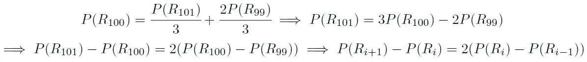
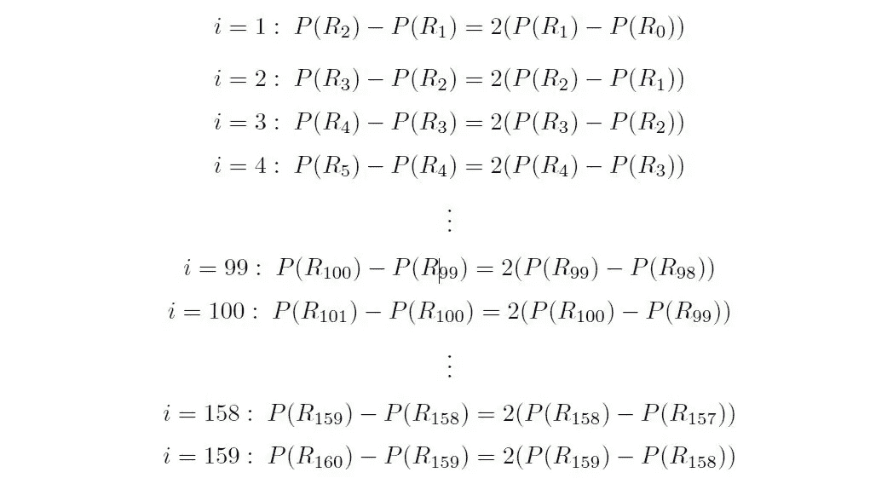
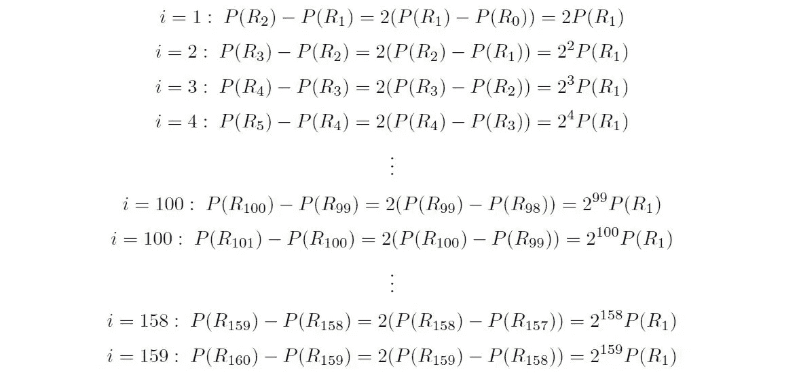
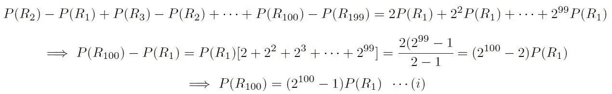
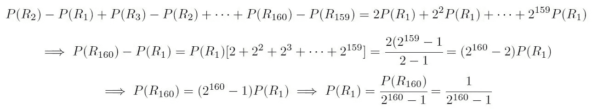
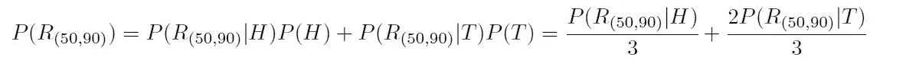
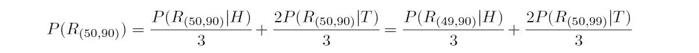
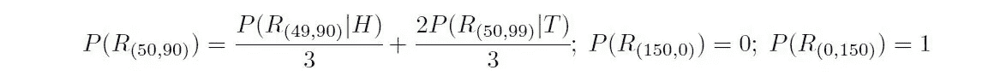
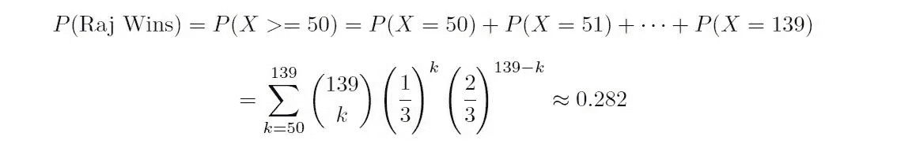

# 赌徒的破产问题:一个古老的概率

> 原文：<https://towardsdatascience.com/gamblers-ruin-problem-a-probability-antiquity-6d3f5fe20812>

## 理解概率论中最著名的问题之一


扑克牌和扑克筹码和骰子，图像由 [Pixabay](https://www.pexels.com/photo/cards-casino-chance-chip-269630/)

赌徒破产是概率论中最基本的概念之一。第一次提到它可以追溯到 17 世纪布莱士·帕斯卡和皮埃尔·费马之间的一封书信往来。该问题涉及在以下条件下确定游戏者获胜的概率:

1.  他们一开始都有固定数额的钱。
2.  在整个游戏过程中，他们中任何一方获胜的概率都是不变的。
3.  游戏继续进行，直到他们中的任何一个用完了钱。

一个例子是考虑两个赌徒 Raj 和 Mir。据了解，他们分别从₹100 和₹60 开始。赌徒们赌连续掷硬币的结果。如果硬币正面朝上，拉吉赢了，米尔必须把₹1 给拉吉。否则，米尔赢了，拉杰必须把₹1 给米尔。游戏继续进行，直到其中一个玩家输掉所有的钱。还假设硬币是倾斜的，正面着地的概率是 1/3。我们现在想确定 Raj 赢得比赛的概率。在我们开始解决这个问题之前，有几件事情需要注意:

1.  我们不知道游戏需要多少回合才能结束，有可能 Mir 每局都输，在这种情况下回合数将是 60。也有可能游戏永远不会终止，在这种情况下，他们每个人都交替获胜。这两种情况都是可能的(尽管概率很低)，它们之间无限可能的其他情况也是如此。
2.  在解决统计学中的问题时(通常在计算机科学中也是如此)，确定问题的不变量通常是很重要的，也就是说，问题的某些方面总是不变的，不会改变或依赖于子问题的结果。对我们来说，不变量是赌客拥有的钱的总数。不管这个游戏是什么状态，拉杰和米尔的钱数是不变的:₹100 + ₹60 = ₹160.唯一改变的是两个赌徒的钱数。这对我们有什么用？嗯，这意味着我们只需要在任何给定的时间点跟踪其中一个赌徒的钱。另一个游戏者的钱可以通过简单地从两个游戏者的总钱数中减去该数额来获得(游戏的不变量)。例如，如果拉杰在游戏中的某个时刻有₹85，我们可以说米尔在那个时刻有₹160— ₹85 = ₹75。(请注意，这个问题有一些变体可能不成立，我们将在本文末尾讨论其中一个变体)。
3.  这些问题经常使用马尔可夫链模型来建模。但是，在本文中，我们将使用条件概率方法和一些建模技术来简化这种方法。关键的想法是将游戏延伸到过去和未来，以考虑不同的可能性。稍后我们将看到如何做到这一点。

让我们从定义一些事件开始:

1.  让 R₁₀₀表示拉吉赢得比赛的事件，因为他从₹100.开始请注意，不变性意味着我们不必在游戏开始时跟踪 Mir 的数量。
2.  设 H 表示硬币在第一次投掷时正面朝上。
3.  让 T 表示硬币在第一次翻转时反面着地的事件。

有了这些定义，我们可以定义 P(R₁₀₀)，拉杰赢得游戏的概率，因为他从₹100 开始，条件是第一次翻转的结果:


现在，我们观察到，如果拉吉在第一场比赛中获胜，那么拉吉最终会和₹101.在一起这可以解释为 Raj 和₹101.开始比赛的情况同样，如果拉吉在第一场比赛中输了，那么拉吉就会和₹99.在一起这可以解释为 Raj 和₹99.开始比赛的情况因此，我们有:


因此，我们已经设法获得，看起来像一个循环关系的东西。我们已经定义了 Raj 获胜的概率，假设他从₹100 开始递归，根据他从₹101 开始获胜的概率和他从₹99.开始获胜的概率剩下的是解决递归关系。为了解决这个递归问题，我们需要在时间上向后和/或向前扩展这个问题，直到我们达到一个基本条件，例如 P(Rᵢ已知。我们如何做到这一点？有两个基本条件可以帮助我们解决递归问题:

1.如果有人告诉我们拉吉是从₹0 开始的，那我们对拉吉获胜的可能性有什么看法呢？对，应该是 0！为什么？因为如果 Raj 一开始就没钱，他就已经输了。

2.如果有人告诉我们拉吉是从₹160 开始的，那我们对拉吉获胜的可能性有什么看法呢？对，应该是 1！为什么？因为如果 Raj 一开始就有所有的钱，他已经赢了这场比赛。

因此，我们有以下信息:


在解决这个递归问题之前，我们以稍微不同的方式写下递归关系，以简化我们的解决方案:



现在我们已经获得了一个递归关系和基本条件，我们可以通过回溯游戏来求解递归公式。太棒了。这给了我们:



我们将 I 的值从 1 到 159，因为我们的递归关系将允许 i + 1 = 159 + 1 =160 的最大值(Raj 可以拥有的最大金额)和 I-1 = 1–1 = 0 的最小值(Raj 可以拥有的最小金额)。我们代入 0°和 160°的基本情况解，得到以下结果:



如果我们加上前 99 个方程(1 ≤ i ≤ 99)，我们得到:



请注意，书写递归关系的形式允许我们取消所有项，只留下其中的两项。另外，请注意，我们已经使用了几何级数公式来计算 2 的幂和。现在，如果我们知道 P(R₁)，我们可以计算 P(R₁₀₀)，这将解决我们的问题！为了找到 P(R₁)，我们将前面显示的所有 159 个等式相加，并使用第二个基本条件，即 p(r₁₆₀= 1:



将该结果代入等式(I ),我们得到:


我们中的一些人可能会对这个结果感到惊讶，因为 Raj 的起点要高得多。但是，一旦你意识到 Raj 在每场比赛中获胜的几率大约是 Mir 获胜几率的一半，你很快就会明白为什么概率值开始呈指数衰减，这使得 Raj 赢得比赛的几率几乎为零。

事实上，您可以推广上述公式，假设 Raj 从某个₹A 开始，Mir 从某个₹B.开始。如果正面的概率为α，则您的递归关系和基本情况将由下式给出:


如前所述求解上述递归公式将给出广义赌徒破产问题的如下解:


注意，上述等式仅在α ≠ 0.5 时成立。如果α = 0.5，问题就变得很简单，因为钱多的游戏者更有可能赢，因为他们在每场游戏中的获胜概率是相同的。在这种情况下，解决方案很简单:


解决了这个版本的赌徒倾家荡产问题，我们再来看另一个版本的问题:

考虑两个赌徒 Raj 和 Mir。据了解，他们分别从₹100 和₹60 开始。赌徒们赌连续掷硬币的结果。如果硬币正面朝上，拉吉赢了，₹1.归他否则，米尔赢了，得到了₹1.游戏继续进行，直到其中一个玩家得到₹150.还假设硬币是倾斜的，正面着地的概率是 1/3。我们现在想确定 Raj 赢得比赛的概率。

这个问题和之前的问题有什么不同？

1.  获胜条件:现在宣布获胜者是首先得到₹150 的人。
2.  In-variance:我们不再拥有游戏中总量的不变性。由于交易不再涉及从 Raj 到 Mir 的金额转移，在游戏中的任何点都可能有任何不确定的总金额。这意味着在游戏中的任何时候，我们都要记录 Raj 和 Mir 的钱数。

有两种方法可以解决这个赌徒破产的变种。Pascal 提出的第一种方法包括遵循我们之前使用的相同建模策略:根据第一次投掷的结果来确定 Raj 获胜的概率，以获得递归关系，确定基本情况，并求解递归公式以获得解决方案。另外，请注意，找到 Raj 获胜的概率与确定在 Mir 赢得 90 场比赛之前 Raj 赢得 50 场比赛的概率是一样的。因此，我们将概率建模如下:

我们让 R₍₅₀,₉₀₎表示 Raj 在 Mir 赢得 90 场比赛之前赢得 50 场比赛的事件。请注意我们是如何跟踪两者的:Raj 赢得的收益数和 Mir 赢得的收益数(由于我们之前拥有的方差属性的损失)。因此，



现在，我们观察到如果 Raj 赢了第一场比赛，那么 Raj 需要再赢 49 场比赛。同样，如果 Mir 在第一场比赛中获胜，那么 Mir 需要再赢 89 场比赛。因此，



和以前一样，我们可以确定递归问题的基本情况:

1.  如果给我们米尔从₹150 开始，(注意，这对应于 R₍₁₅₀,₀₎)我们能说拉吉获胜的概率是多少？对，应该是 0！为什么？因为如果米尔有₹150 开始，米尔已经赢得了比赛。
2.  如果我们知道拉吉是从₹150 开始的，(注意这对应于 R₍₀,₁₅₀₎)，我们能说拉吉获胜的概率是多少？对，应该是 1！为什么？因为如果拉杰有了₹150，他就已经赢了。

因此，我们有以下信息:



就像以前一样，我们可以解决上述递归问题，以获得期望的概率。然而，现在解决上述问题要复杂得多，因为我们要处理两个变量来跟踪每个玩家要赢得整个赌博必须赢得的游戏数量。我们可以编写一个小的计算机程序来解决上述问题。我用 Python 编写了下面的递归解决方案来帮助我们找到解决方案(我还添加了一些记忆来加快速度):

```
def memoize(f):
    table = {}
    def helper(*args):
        if args not in table:
            table[args] = f(*args)
        return table[args]
    return helper

@memoize 
def gambler_ruin(r, m, p):
    if r == 0:
        return 1
    if m == 0:
        return 0
    else:
        return p*gambler_ruin(r-1, m, p) + (1-p)*gambler_ruin(r, m-1, p)

print(gambler_ruin(50, 90, 1/3))
```

运行上面的程序给了我们问题的解 0.282，即 Raj 获胜的概率是 0.282，比上一个例子高得多。这是因为在前一个问题中，每次米尔赢了就意味着拉吉失去了₹1。但是，对于这个问题，即使 Mir 赢了一局，Raj 仍然需要赢相同数量的局来赢得整个赌博。

最后，让我们看看解决这个问题的另一种方法，这种方法早些时候由费马在他给帕斯卡的信中提出。这包括将问题建模为二项式分布。回想一下，二项式分布给出了 n 次试验中 k 次成功的概率，每次成功的概率为 p:


我们如何使用二项分布来模拟这个问题？我们被要求找出在 Mir 赢 90 场比赛之前 Raj 赢 50 场比赛的概率。因此，如果进行 90 + 50 -1 = 139 个游戏，我们保证会有一个赢家。请注意，这与之前的问题不同，因为之前对投掷次数没有限制。Raj 和 Mir 之间的连续变化意味着无限跑的可能性。然而，对于这个问题，由于我们在 139 场比赛中保证有一个赢家，所以我们可以使用二项分布来确定 Raj 获胜的概率。

假设，我们将游戏延长到 139 次投掷。如果 139 次投掷中有 50 次以上是正面，拉吉获胜。否则，米尔赢了。设 X 是 139 次投掷中投掷头数的随机变量，每次投掷头的概率为 1/3。因此:


因此，Raj 的获胜概率由下式给出:



上述总和可以使用任何计算器(或编写另一个计算机程序)进行评估。这两种方法给出相同的结果也就不足为奇了。

因此，我们已经讨论了赌徒破产问题的两个版本，理解了问题条件的含义，并查看了一些解决这些问题的建模策略。处理这些问题的第一步包括识别 apt 模型，该模型在计算上是可行的，并且利用了任何相关的不变性。接下来是建立模型，例如通过将期望概率取决于特定子事件的结果。一旦获得了模型，我们就开始使用该模型来获得最优解。这可以递归地完成(在确定合适的基本情况之后),或者通过利用一些众所周知的概率分布的属性来完成。最后，我们试图分析模型的结果，试图平衡直觉和实验结果之间的任何冲突。

感谢阅读！希望你喜欢这篇文章！