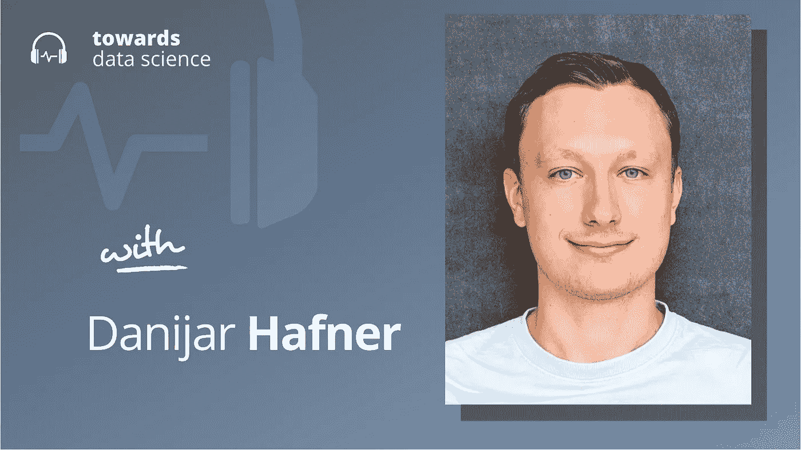

# 一路游戏到 AGI

> 原文：<https://towardsdatascience.com/gaming-our-way-to-agi-2a0e44a5e691>

## [播客](https://towardsdatascience.com/tagged/tds-podcast)

# 一路游戏到 AGI

## 丹尼尔·哈夫纳论强化学习代理的程序游戏生成

[苹果](https://podcasts.apple.com/ca/podcast/towards-data-science/id1470952338?mt=2) | [谷歌](https://www.google.com/podcasts?feed=aHR0cHM6Ly9hbmNob3IuZm0vcy8zNmI0ODQ0L3BvZGNhc3QvcnNz) | [SPOTIFY](https://open.spotify.com/show/63diy2DtpHzQfeNVxAPZgU) | [其他](https://anchor.fm/towardsdatascience)

*编者按:TDS 播客由杰雷米·哈里斯主持，他是人工智能安全初创公司墨丘利的联合创始人。每周，Jeremie 都会与该领域前沿的研究人员和商业领袖聊天，以解开围绕数据科学、机器学习和人工智能的最紧迫问题。*

直到最近，人工智能系统还很狭窄——它们只能执行明确训练过的特定任务。虽然狭窄的系统显然是有用的，但人工智能的精髓是建立更灵活、更通用的系统。

但是，如果没有我们可以优化的良好的性能指标，或者我们至少可以用来衡量泛化能力的指标，这是不可能的。不知何故，我们需要找出需要增加的数字，以便让我们更接近一般能力的代理人。这就是我们在本期播客中与丹尼尔·哈夫纳一起探讨的问题。丹尼亚尔是多伦多[大学](http://learning.cs.toronto.edu/)人工智能专业的博士生，师从[吉米巴](https://scholar.google.com/citations?user=ymzxRhAAAAAJ&hl=en&oi=ao)和[杰弗里辛顿](https://scholar.google.com/citations?user=JicYPdAAAAAJ&hl=en&oi=ao)以及[谷歌大脑](https://research.google/teams/brain/)和[矢量研究所](https://vectorinstitute.ai/)的研究员。

Danijar 一直在研究具有泛化能力的 RL 代理的性能度量和基准问题。作为这项工作的一部分，他最近发布了 Crafter，这是一个可以在程序上生成复杂环境的工具，非常像《我的世界》，具有需要收集的资源，可以开发的工具，以及需要避免或击败的敌人。为了在手工艺环境中取得成功，代理需要稳健地计划、探索和测试不同的策略，这使他们能够解锁某些游戏中的成就。

Crafter 是研究人员正在探索的越来越多的策略的一部分，以找出我们如何能够基准化和测量通用人工智能的性能，它还告诉我们一些关于人工智能状态的有趣事情:我们定义需要正确概括能力的任务的能力越来越变得与人工智能模型架构的创新一样重要。在这一集的 TDS 播客中，Danijar 和我一起谈论了 Crafter、强化学习以及人工智能研究人员在致力于一般智能时面临的巨大挑战。

以下是我在对话中最喜欢的一些观点:

*   Crafter 环境包括一系列可实现的目标，每一个目标都包括第一次执行一个特定的游戏任务。其中一些任务很简单，可以由当前最先进的 RL 代理相当一致地完成(例如，寻找食物来源并收获它们)。但有些更具挑战性，因为它们涉及到对其他任务的依赖:例如，一个“收集铁”任务只能在一个“制造石镐”任务已经完成后才能完成。结果是一个相当深的科技树，只能由学会计划的代理完成。
*   因为不同的任务需要不同的能力，Crafter 环境可以给开发者一种方法来描述他们的 RL 代理。通过测量智能体在可实现任务的全部分布中的平均表现，他们获得了智能体能力的指纹，该指纹表明智能体在多大程度上掌握了规划和探索等技能，这些技能与概括能力密切相关。
*   开发机器学习基准的一个挑战性方面是确保它们调整到正确的难度水平。好的基准测试很难掌握(这样他们就可以激励和指导这个领域的进展)，但也很容易处理(这样开发人员就有足够的信号来迭代和改进他们的模型)。
*   关于人工智能的未来，一个有趣的辩论与算法的巨大改进或计算资源可用性的增加将在多大程度上带来进一步的进展有关。我们越来越多地看到，强化学习的前沿成果来自基于模型的系统，这些系统比无模型的系统更多地使用计算，RL 的进展与计算预算的增长密切相关(如 MuZero 和 EfficientZero)。对一些人来说，这表明当前的人工智能技术可能足以达到人类水平的性能，只需相对较小的调整，如果它们只是随着更多的计算而扩大的话。虽然 Danijar 看到了这一论点的一些优点，但他确实认为，在达到人类水平的人工智能之前，我们必须在算法设计方面取得根本性的进步，而不仅仅是利用原始的计算能力。

你可以点击这里在 Twitter 上关注丹尼尔。

## **章节:**

*   0:00 介绍
*   2:25 测量概括
*   5:40 什么是工匠？
*   11:10 克拉夫特和《我的世界》的区别
*   20:10 代理行为
*   25:30 合并比例模型和强化学习
*   29:30 的数据效率
*   38:00 分层学习
*   43:20 人级系统
*   文化重叠
*   49:50 总结