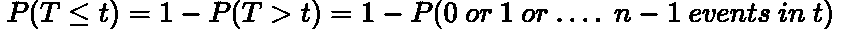
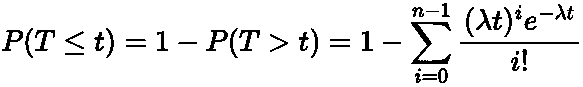
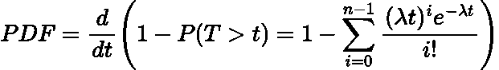
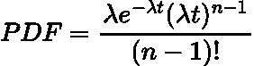
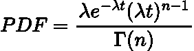

# 伽马分布简单解释

> 原文：<https://towardsdatascience.com/gamma-distribution-simply-explained-d95a9de16278>

## 伽马分布及其起源的解释


[m.](https://unsplash.com/@m_____me?utm_source=medium&utm_medium=referral) 在 [Unsplash](https://unsplash.com?utm_source=medium&utm_medium=referral) 上拍照

# 介绍

在我之前的文章中，我们讨论并推导了指数分布，你可以在这里查看:

[](/exponential-distribution-simply-explained-349d05b1bdb8)  

简而言之，**指数分布计算泊松过程中事件之间等待时间的概率。**

> 如果你不熟悉[泊松过程/分布，](https://en.wikipedia.org/wiki/Poisson_distribution)我强烈推荐你在继续这篇文章之前阅读一下。

指数分布的问题在于，它只能推断出**第一个事件的等待时间的概率。**然而，**伽马分布**给出了等待时间的概率，直到第***n***事件。

在这篇文章中，我们将推导伽玛分布，并获得其背后的一些直觉。

# 衍生物

如你所料，伽马分布的推导类似于指数分布。

我们首先说我们想要等待时间****第 n(n)***事件发生。对于伽玛分布 ***T*** 是**随机变量**。这意味着我们需要 n-1 个*事件及时发生**

******

***作者在 LaTeX 中生成的方程。***

***现在我们需要使用**泊松分布的** [**概率质量函数(PMF):**](https://en.wikipedia.org/wiki/Probability_mass_function) 来统计 ***t*** 时间段内发生***0******n-1***事件的概率***

****

**作者在 LaTeX 中生成的方程。**

**这里， ***n*** 是时间段 ***t*** 内发生的**事件数，带有**速率(泊松)参数** ***λ*** ，表示给定时间段内的预期事件数，例如每小时 5 个索赔。****

**上面的公式是 [**累积分布函数(CDF)的定义。**](https://en.wikipedia.org/wiki/Cumulative_distribution_function) 要提取[**概率密度函数(PDF)**](https://en.wikipedia.org/wiki/Probability_density_function) 我们只需要找到**CDF**相对于 ***t*** 的导数，作为随机变量。**

****

**作者在 LaTeX 中生成的方程。**

**现在这个求导是相当棘手的，所以我在这里省略了整个过程。不过有兴趣的读者可以在这里找到[的完整推导。](https://online.stat.psu.edu/stat414/lesson/15/15.4)**

**PDF 的最终版本如下:**

****

**作者在 LaTeX 中生成的方程。**

**我们做到了！**

# **伽马函数**

**该分布被命名为伽马分布的原因是因为它包含了 [**伽马函数:**](https://en.wikipedia.org/wiki/Gamma_function)**

****

**作者在 LaTeX 中生成的方程。**

**其中γ是希腊符号γ。因此，重写我们的 PDF:**

****

**作者在 LaTeX 中生成的方程。**

# **情节**

**因此，伽马分布由两个值参数化:**

*   *****λ，*事件发生率****
*   *****n* ，你所等待的事件的数量****

**下面是用 Python 创建的伽马分布图，其中我们有 ***n = 3*** :**

```
**# import packages
import numpy as np
import scipy.stats as stats 
import matplotlib.pyplot as plt# get distributions
x = np.linspace(0, 20, 1000)
y1 = stats.gamma.pdf(x, a=3, scale=0.5)
y2 = stats.gamma.pdf(x, a=3, scale=1)
y3 = stats.gamma.pdf(x, a=3, scale=2)# plot
plt.figure(figsize=(15,7))
plt.plot(x, y1, label='λ=2')
plt.plot(x, y2, label='λ=1')
plt.plot(x, y3, label='λ=0.5')
plt.title('n=3, Waiting Till The 3rd Event', fontsize=24)
plt.xticks(fontsize=20)
plt.yticks(fontsize=20)
plt.legend(fontsize=20)
plt.ylabel('PDF', fontsize=20)
plt.xlabel('Random Variable T', fontsize=20)
plt.show()**
```

> **注:以上代码中 **a = n** 在本博客中**刻度为 1/λ。****

****

**作者用 Python 生成的图。**

**事件之间的预期等待时间等于 ***1/λ，*** 这是有意义的，因为当发生次数增加时，事件之间的预期时间应该减少。因此，随着 ***λ*** 变小，事件之间的预期时间增加。这在上面的图中可以观察到，我们看到第三个事件的平均等待时间随着 ***λ*** 变小而增加。**

# **结论**

**在这篇博客中，我们对指数分布进行了归纳，得出伽玛分布，给出了等待时间的概率，直到第*事件。在我的下一篇博客中，我们将讨论卡方分布，这是伽玛分布的一个子集，以及它在统计学中的许多用途！***

# ***和我联系！***

*   ***[*要想在媒体上阅读无限的故事，请务必在这里注册！*](/@egorhowell/membership) 💜***
*   **[*在我发布注册邮件通知时获得更新！*T13*😀*](/subscribe/@egorhowell)**
*   **[*领英*](https://www.linkedin.com/in/egor-howell-092a721b3/) 👔**
*   **[*碎碎念*](https://twitter.com/EgorHowell) 🖊**
*   **[*github*](https://github.com/egorhowell)*🖥***
*   ***[](https://www.kaggle.com/egorphysics)**🏅*****

> ***(所有表情符号由 [OpenMoji](https://openmoji.org/) 设计——开源表情符号和图标项目。许可证: [CC BY-SA 4.0](https://creativecommons.org/licenses/by-sa/4.0/#)***