# GANfolk:使用人工智能创建虚构人物的肖像，作为非功能性物品出售

> 原文：<https://towardsdatascience.com/ganfolk-using-ai-to-create-portraits-of-fictional-people-to-sell-as-nfts-6e24f5214ed1>

## 如何使用 StyleGAN2、VQGAN 和 GPT-3 从开源图像中合成不同的字符

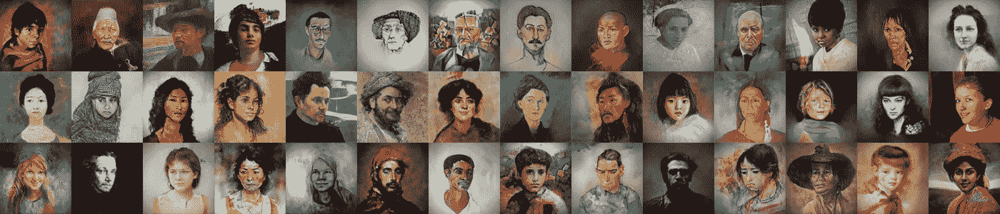

**GANfolk 样本**，图片作者

我之前在 Medium 上写过关于使用人工智能创造视觉艺术的文章，比如[抽象画](/ganshare-creating-and-curating-art-with-ai-for-fun-and-profit-1b3b4dcd7376)和[风景画](/ganscapes-using-ai-to-create-new-impressionist-paintings-d6af1cf94c56)。在我的研究中，我注意到生成敌对网络(GANs)似乎很难创建人的形象。我决定正面迎接这个挑战，所以我用画和人的照片训练了两只甘。然后我把这些图片作为 NFT 放在 OpenSea 上一个名为 [GANfolk](https://opensea.io/collection/ganfolk) 的收藏中出售。

请注意，我是在知识共享署名共享许可下发布训练图像数据集、源代码和训练模型的。这意味着你可以使用我的代码来创建你自己的数字人画并出售它们，只要你给我署名。有关详细信息，请参见下面的源代码部分。

# 系统概况

这里是 GANfolk 系统的概述。您可以在下面的章节中找到组件和流程的详细信息。

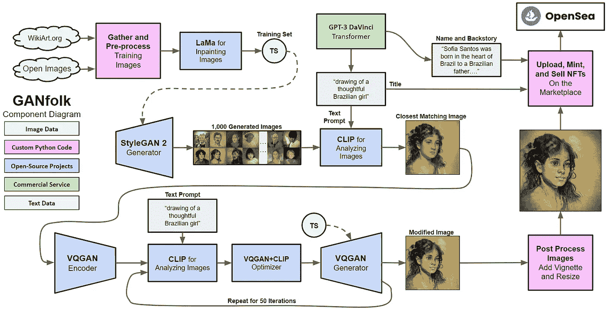

**赣方言成分**，作者配图

我首先写了一个脚本来收集在 [WikiArt](https://www.wikiart.org/) 上公开的人们的画作，以及来自谷歌 [Open Images](https://storage.googleapis.com/openimages/web/index.html) 数据集的开源图像。我通过对齐面部特征和使用 LaMa 修复系统填充任何空白点来预处理图像[1]。然后我用 5400 张图片的 GANfolk 训练集训练了两个 GANs，StyleGAN 2 ADA [2]和 VQGAN [3]。我收集了 2700 幅旧的人物绘画和 2700 幅新的人物照片。

对于创建过程的第一步，经过训练的 StyleGAN 2 系统生成了 1000 幅图像作为基线集。我使用 OpenAI [4]的 GPT-3 为图片生成文本提示，比如“一个体贴的巴西女孩的画像”然后，我使用同样来自 OpenAI 的 CLIP 系统[5]，找到与提示匹配的最佳图像。我选择了最好的图片，并将其输入经过训练的 VQGAN 系统进行进一步修改，以使图像与文本提示更加匹配。

我回到 GPT 3 号，让它为每张照片写一个名字和一个简短的背景故事。作为后期处理步骤，我添加了一个晕影效果，并将图像尺寸放大了四倍(从 512x512 到 2048x2048)。经过温和的编辑，我上传了照片和背景故事到 OpenSea 作为 [GANfolk](https://opensea.io/collection/ganfolk) NFTs 出售。

# 先前的工作

在我进入 GANfolk 的细节之前，这里有一个简短的部分，关于其他人在生成人物肖像方面所做的工作。

## Flickr-Faces-HQ 数据集

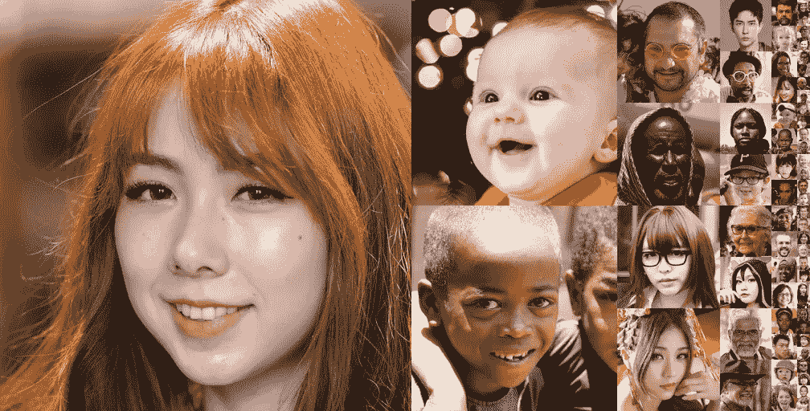

**来自 Flickr-Faces-HQ 数据集**的样本，图片来源: [NVidia](https://github.com/NVlabs/ffhq-dataset)

在开发他们的 StyleGAN 系列生成网络的同时，NVidia 发布了一个名为 Flickr-Faces-HQ Dataset (FFHQ)的人物照片数据集。据英伟达称…

> …[该]数据集由 70，000 张分辨率为 1024×1024 的高质量 PNG 图像组成，并且在年龄、种族和图像背景方面存在相当大的差异。

尽管 FFHQ 图像的质量和种类都非常好，但 NVidia 还是以[非商业条款](https://raw.githubusercontent.com/NVlabs/ffhq-dataset/master/LICENSE.txt)发布了数据集。此外，我发现这些脸似乎剪得太紧了，不适合拍出好的肖像。

## MetFaces 数据集

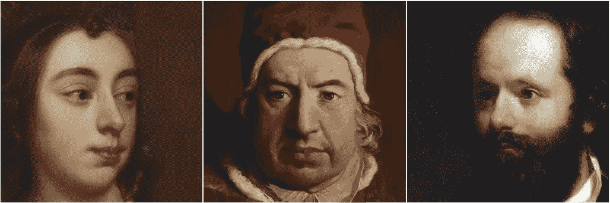

**来自 MetFaces 数据集的样本，**图像来源: [NVidia](https://github.com/NVlabs/metfaces-dataset)

NVidia 还发布了 MetFaces 数据集，这些人脸来自大都会艺术博物馆的画作

> 数据集由 1，336 张分辨率为 1024×1024 的高质量 PNG 图像组成。这些图像通过[大都会艺术博物馆收藏 API](https://metmuseum.github.io/) 下载，并使用 [dlib](http://dlib.net/) 自动对齐和裁剪。各种自动过滤器被用来修剪集合。

同样，NVidia 根据非商业条款发布了数据集，他们对人脸使用了类似的紧密裁剪。

下面是使用 StyleGAN 2 ADA 在 FFHQ 数据集上训练并使用 MetFaces 数据集微调后新生成的图像。

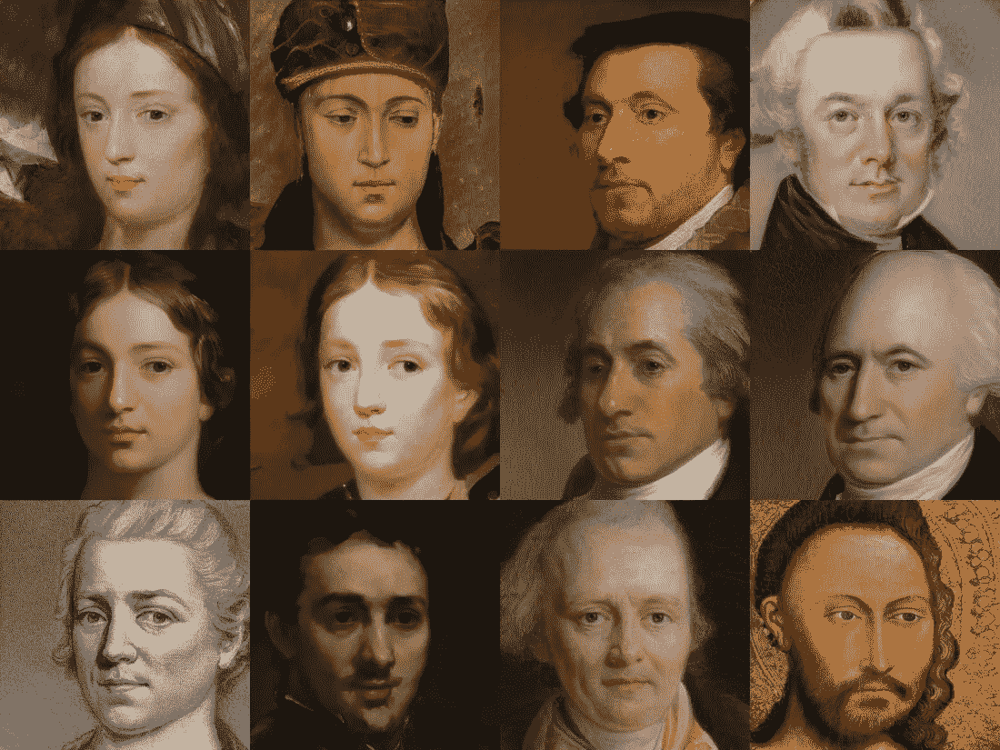

**StyleGAN 2 ADA**输出，图像来源: [NVidia](https://arxiv.org/pdf/2006.06676.pdf)

虽然结果令人印象深刻，但毫不奇怪，结果似乎裁剪得太紧了。除了数据集，NVidia 还根据[非商业条款](https://github.com/NVlabs/stylegan2-ada/blob/main/LICENSE.txt)发布了官方源代码，因此这些人脸不能作为 NFT 出售。此外，在生成的面孔中似乎明显缺乏文化多样性。

# GANfolk 系统组件

我将在接下来的小节中讨论 GANfolk 系统中使用的组件和过程的细节。

## 采集和预处理训练图像

我写了两个脚本来为 GANfolk 收集源图像。第一个收集了 19 世纪和 20 世纪早期 WikiArt 上的公共领域绘画。第二个从谷歌的开放图像数据集中收集肖像。该数据集由 Flickr 上根据 CC-BY-SA 许可发布的照片组成，该许可允许商业使用。

为了找到并定位图像中的人脸，我使用了一个名为 [DLIB](https://github.com/davisking/dlib) 的包中的人脸识别算法。我修改了[面部识别](https://gist.github.com/robgon-art/ba854bc3c986297e57b71bfab541cf86)代码来更宽松地裁剪面部。这是一些来自 WikiArt 的画作的结果。

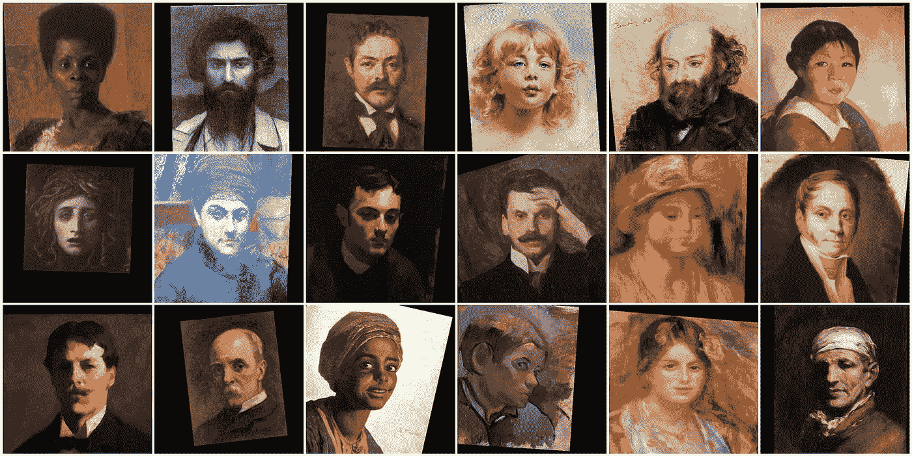

**排列整齐的 WikiArt.com 肖像**，图片由作者提供

虽然肖像周围有更多的负空间，但它确实在大多数图像周围拾取了许多空白的黑色区域。这是因为原始图片没有足够的背景区域来考虑脸部方向的旋转和缩放。

为了弥补这一点，我使用了罗曼·苏沃罗夫等人开发的修复人工智能系统，名为“大遮罩(LaMa)修复”。该系统将自动“填充”由第二个遮罩图像指定的图像部分。这是我写的和喇嘛一起修补的[代码](https://gist.github.com/robgon-art/f5a283e437e9029b7a6442bdbf2eeb81)。下面是从 WikiArt 修复样本肖像的结果。

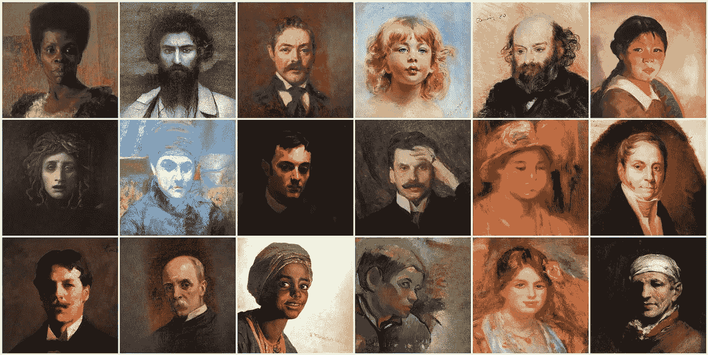

**来自 WikiArt.com 的修复肖像**，作者图片

这是一张经过相同预处理步骤后的图片样本。

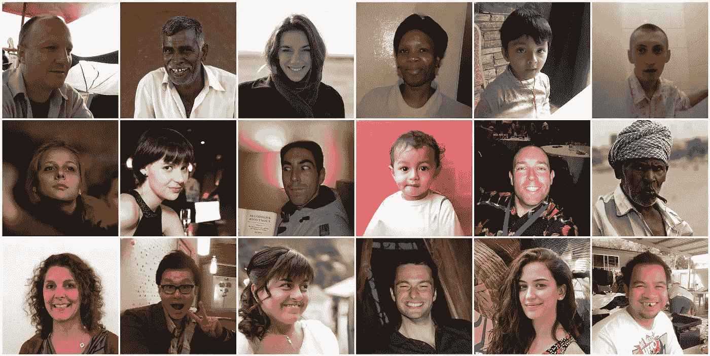

**修复公开图像中的肖像**，作者图片

照片中似乎有各种各样的风格、年龄和种族。并且，在大多数情况下，修复的效果是不可见的。

## 两个甘的故事

我在这个项目中使用了两个 GAN，一个是由 Kim Seonghyeon(又名 rosinality)独立实现的 StyleGAN2，另一个是由 Patrick Esser 等人实现的 VQGAN。

在我之前的研究中，我发现 StyleGAN2 在生成的图像中创建一个与训练数据中的类型大致相似的全局结构方面做得非常好。然而，图像细节经常模糊或缺失。但是 VQGAN 是完全互补的。它不知道如何创建一个全局结构，但它在填充现实的图像细节方面做得很好。使用两种 gan 是两全其美的。

## 使用 GPT-3 生成图像提示

为了开始创建过程，我使用 GPT-3 来提示制作图像。我真的要求 GPT-3 达芬奇指令模型这样做:

```
**"Create prompts to render fictional people at different ages and nationalities."**
```

源代码这里是[这里是](https://gist.github.com/robgon-art/e4dcdba846e7f57875496cb95fb2ca03)。典型结果如下。

```
**drawing of a thoughtful Brazilian girl
acrylic painting of a sassy Mexican girl
charcoal sketch of an inquisitive Turkish boy
pencil drawing of a determined Indian woman
ink drawing of a playful Japanese girl
acrylic painting of an optimistic Spanish boy**
```

我使用这些提示有两个目的:(1)作为 CLIP 的输入，指导 GANs 生成相应的图像；(2)作为 NFT 的标题。

## 使用 StyleGAN2 和 CLIP 生成基线图像

生成提示后，我运行 StyleGAN2 来生成 1000 幅随机的人物画像。然后，我使用 OpenAI 的 CLIP 系统找到与提示最匹配的图像。正如我在[早期文章](/using-openais-clip-to-search-for-design-patents-7fcc63d91033)中描述的，CLIP 系统有一个文本编码器和一个图像编码器，用于确定短语和图像之间的相似性。

以下是 StyleGAN 2 生成的最符合提示的前 14 幅图像，“绘制一个有思想的巴西女孩。”

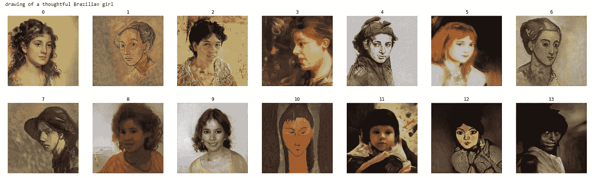

**结果来自 GANfolk StyleGAN2 生成的图片**，图片作者

你可以在结果中看到各种各样的风格。有些看起来像图画；有些看起来像照片。虽然有些人看起来很体贴，但很难说她们看起来像来自巴西的女孩。所以我选择了系列中的第一个来看看 VQGAN 可以用它做什么。

## 使用 VQGAN 细化细节

为了找到与提示匹配的图像，我从 StyleGAN2 中提取了一个结果图像，并使用 VQGAN 对其进行了迭代优化。感谢[凯瑟琳·克劳森](https://github.com/crowsonkb)所做的工作以及[贾斯汀·约翰](https://colab.research.google.com/github/justinjohn0306/VQGAN-CLIP/blob/main/VQGAN%2BCLIP_%28z%2Bquantize_method_with_augmentations%2C_user_friendly_interface%29.ipynb#scrollTo=c3d7a8be-73ce-4cee-be70-e21c1210a7a6)的进一步修改，我再次使用 CLIP 来分析图像的每次迭代，并引导 VQGAN 修改图像以更好地匹配提示。这是结果。

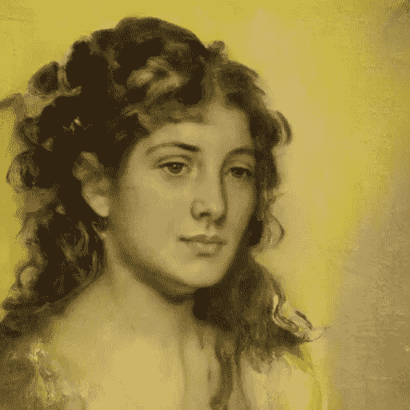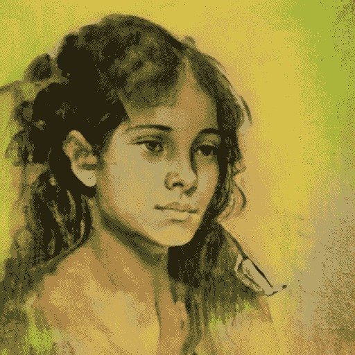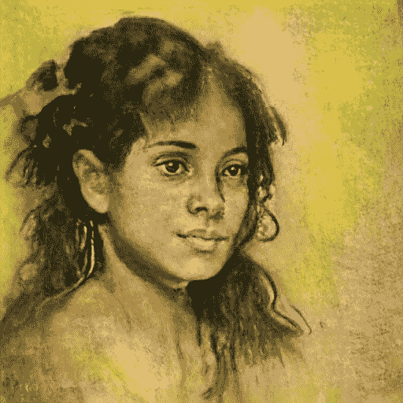

**来自 GANfolk VQGAN 的结果提炼出一张图片**，图片作者

上面的图像是使用 VQGAN 和 CLIP 来匹配提示“绘制一个有思想的巴西女孩”的迭代次数 0、25 和 50 你可以看到照片中的女人变得更年轻，或许“更巴西化”此外，肖像风格变得更像素描而不是油画。

## 图像后处理

我对每张图片进行了几个后期处理步骤，使它们看起来完美统一:

1.  添加了一个晕影来淡化图像的角落；
2.  使用模糊蒙版使细节更加清晰(可选)；
3.  执行超分辨率调整，将图像尺寸从 512x512 增加到 2048x2048

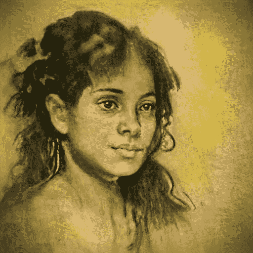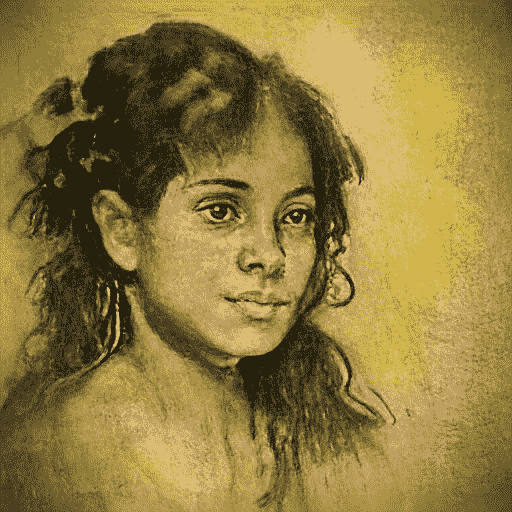

**从左到右，原始图像、渐晕效果后的图像和模糊蒙版效果后的图像**，作者的图像

这有点微妙，但你可以看到晕影效果如何强调了中心的主题，模糊蒙版效果锐化了细节。这里是[晕影](https://gist.github.com/robgon-art/781be13086e9d4202a3fe8f3041e4747)和[反锐化掩模效果](https://gist.github.com/robgon-art/d39731f69a355a93536e856dc2f82e01)的源代码。

StyleGAN2 和 VQGAN 生成的图像分辨率为 512x512 像素。我使用了德国 Idealo 公司的超分辨率调整系统来提高分辨率。在调整尺寸之前，我给图像添加了一点随机噪声来创造一种绘画效果。这里的源代码是。下面是调整到 2048x2048 的样图。你可以点击图片放大，查看细节。

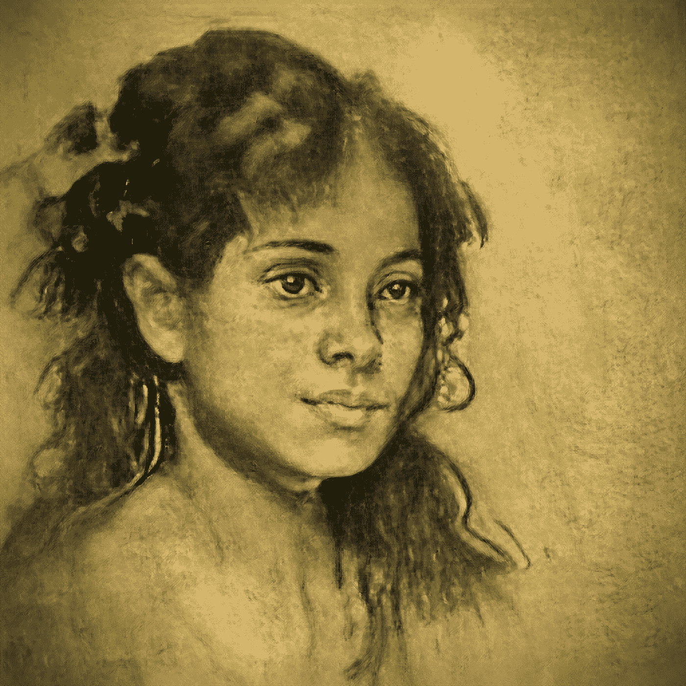

一个深思熟虑的巴西女孩的画像，作者图片

## 使用 GPT-3 创建虚构人物的名字和背景故事

在将图片发布到 OpenSea marketplace 之前，我决定通过使用 GPT-3 达芬奇指令系统为虚构的人创建名字和背景故事来“增加人们对 NFTs 的兴趣”。

我用来创建名字的提示如下。

```
**Create a name for a thoughtful Brazilian girl.****First name:**
```

GPT-3 系统的回应是:

```
**Sophia  Last name:  Santos**
```

我注意到系统有时会出现一个名人的名字，所以我写了一些代码来检查这个人是否有维基百科页面。然后我创建了一个循环来不断生成名字，直到它在维基百科上创建了一个*而不是*。这里的代码是[这里是](https://gist.github.com/robgon-art/2ac0974c5d143c5b3d43c0ffa5497812)。

然后，我使用类似的技术为每个虚构的人创建一个背景故事。我使用的提示如下。

```
**Create a brief backstory for Sophia Santos, a thoughtful Brazilian girl.**
```

GPT 三号写道:

```
**Sofia Santos was born in the heart of Brazil to a Brazilian father and an American mother. Sofia grew up in a bilingual household and learned to appreciate both of her cultures. Sofia is a thoughtful and intelligent young woman who always looks for ways to help others.**
```

结果相当不错！我的合作者兼评论家珍妮弗花时间阅读了 GANfolk 的全部 100 篇背景故事，其中只有几篇需要编辑。

**在 NFT 露天市场上铸造 GANfolk**

对于我早期的 NFT 项目， [GANshare](/ganshare-creating-and-curating-art-with-ai-for-fun-and-profit-1b3b4dcd7376) ，我选择使用多边形区块链，因为它比 Etherium 更环保。出于同样的原因，我决定将 GANfolk 系列放在多边形链上。一旦我创建了所有 100 张带有名字和背景故事的图片，上传并把它们做成 NFT 就非常简单了。你现在可以在 OpenSea 上看到整个 GANfolk 系列。

# 结果

这里是前 5 个 GANfolk，显示了经过后处理的 StyleGAN2 和 VQGAN 的输出图像。

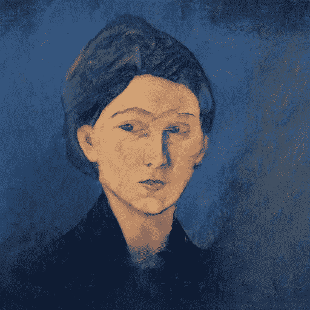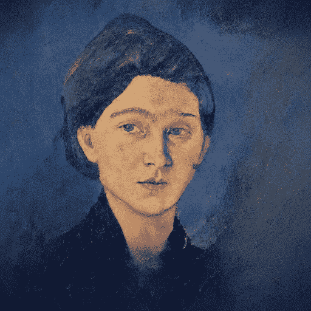

**GANfolk #1，**图片作者

一幅神秘的法国女人的画，玛蒂尔德·杜布瓦
玛蒂尔德·杜布瓦出生在法国南部的小镇圣·让·德·鲁兹。她是一位富有的航运巨头和一位歌剧演员的独生女。从年轻时起，玛蒂尔德就表现出对艺术的热爱。
上市[OpenSea](https://opensea.io/assets/matic/0x2953399124f0cbb46d2cbacd8a89cf0599974963/95949048702184002022994543019454797960309252011183799747181743845102298595329)

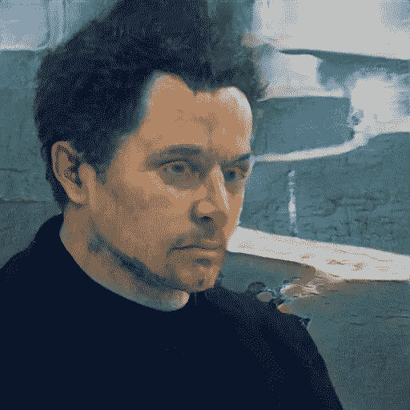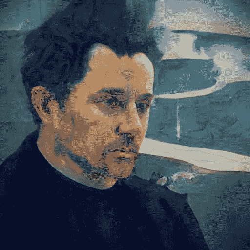

**GANfolk #2，**图片作者

**GANfolk # 2——专注的葡萄牙男子 joo Silva** joo Silva 于 1984 年出生于葡萄牙里斯本。他从小就对了解周围的世界和不同的文化感兴趣。16 岁时，他和家人搬到了美国，他在加州完成了高中学业。
在[上挂牌 **OpenSea** 上挂牌](https://opensea.io/assets/matic/0x2953399124f0cbb46d2cbacd8a89cf0599974963/95949048702184002022994543019454797960309252011183799747181743846201810223105)

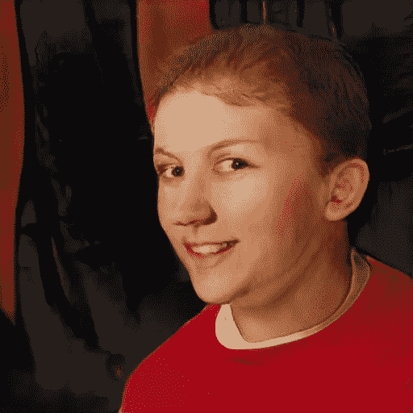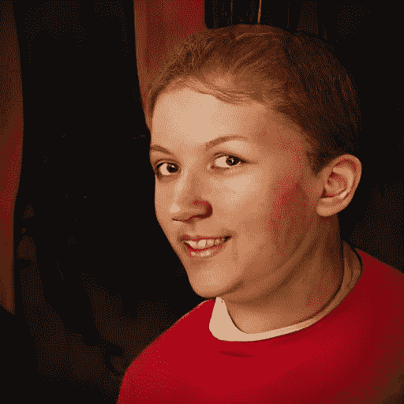

**GANfolk #3，**图片作者

一张淘气的英国少年奈杰尔·拉克斯珀的照片奈杰尔·拉克斯珀出生于富裕的英国父母，他们把他宠坏了。他很快成为一个麻烦的少年，总是在学校和法律上惹麻烦。他的父母想尽一切办法让他守规矩，但都没用。奈杰尔喜欢制造麻烦，喜欢看到父母脸上失望的表情。
在[上市 **OpenSea** 上市](https://opensea.io/assets/matic/0x2953399124f0cbb46d2cbacd8a89cf0599974963/95949048702184002022994543019454797960309252011183799747181743847301321850881)

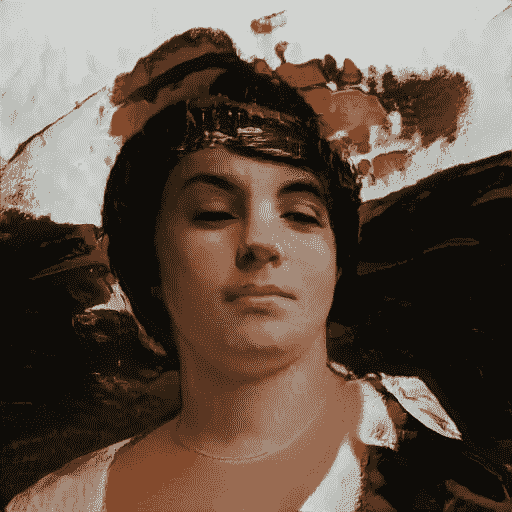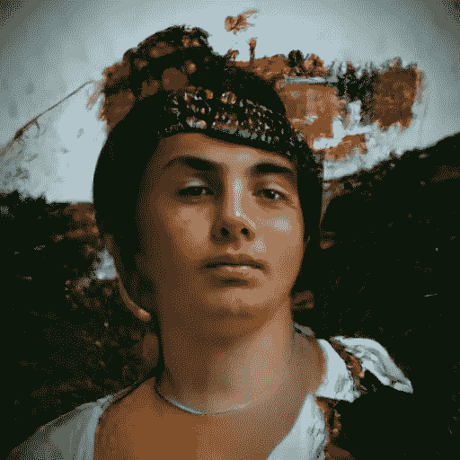

**GANfolk #4，**图片作者

斯特凡·斯托伊切科夫是一名坚忍的保加利亚少年，斯特凡·斯托伊切科夫出生在保加利亚中心的一个小镇上。他的父母是勤劳的农民，他们教会了他诚实、正直和自力更生的重要性。斯特凡一直是一个安静、自省的孩子，他喜欢花时间阅读、学习和探索周围的自然世界。
上市[上市 **OpenSea** 上市](https://opensea.io/assets/matic/0x2953399124f0cbb46d2cbacd8a89cf0599974963/95949048702184002022994543019454797960309252011183799747181743848400833478657)

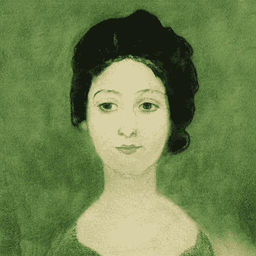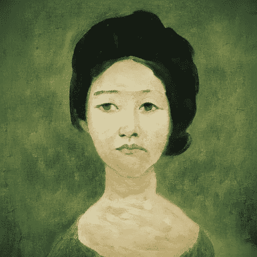

**GANfolk #5，**图片作者

**GANfolk # 5——一位忧心忡忡的韩国妇女的画像，金春熙** 金春熙在首尔郊区长大。从小，她就被教导家庭和传统价值观的重要性。她的父母向她灌输了强烈的职业道德，她很快就树立了勤奋工作的名声。
上市[OpenSea](https://opensea.io/assets/matic/0x2953399124f0cbb46d2cbacd8a89cf0599974963/95949048702184002022994543019454797960309252011183799747181743849500345106433)

你可以在这里看到所有的 100 个 GANfolk，[https://opensea.io/collection/ganfolk](https://opensea.io/collection/ganfolk)

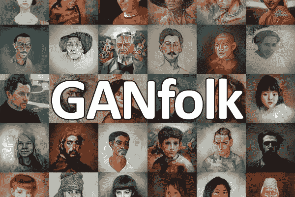

<https://opensea.io/collection/ganfolk>**，图片作者**

# **结论**

**在这个项目中，我学到了很多关于 GANs 的优点和缺点。正如我上面提到的，StyleGAN2 生成了整体形式良好的体面图像，尽管它们通常缺乏精细的细节。VQGAN 是互补的，因为它不知道如何创建具有全局形式的图像，但如果它从一张具有体面形式的图片开始，它在添加细节方面做得很好，主要是在使用剪辑系统时。**

**在这个项目中，我也注意到了对欧洲人的偏见。《StyleGAN2》在塑造不同国籍的人物形象时似乎有些吃力。这可能是由于训练图像缺乏多样性，尤其是来自 WikiArt 的绘画。但 CLIP 似乎知道世界各地的人长什么样，VQGAN 负责适当修改图像。**

# **源代码**

**我收集的 5400 张图片可以在 [Kaggle](https://www.kaggle.com/robgonsalves/ganfolk) 上找到。这个项目的[源代码](https://github.com/robgon-art/GANfolk)可以在 GitHub 上获得。我在 [CC BY-SA 许可](https://creativecommons.org/licenses/by-sa/4.0/)下发布训练图像、源代码和训练模型。**

****

**知识共享署名共享**

**如果您使用这些资源来创建新的图像，请给出这样的归属:此图像是由 [Robert A. Gonsalves](https://robgon.medium.com/) 与 [GANfolk](https://opensea.io/collection/ganfolk) 一起创建的。**

# **感谢**

**我要感谢詹尼弗·林和奥利弗·斯特瑞普对本文的帮助。**

# **参考**

**[1]R .苏沃罗夫等人的 LaMa，[分辨率稳健的大型蒙版修复与傅里叶卷积](https://arxiv.org/pdf/2109.07161.pdf) (2021)**

**[2]t . Karras 等人的 StyleGAN2 ADA，[用有限的数据训练生成式对抗网络](https://arxiv.org/pdf/2006.06676.pdf) (2020)**

**[3]p . Esser、R. Rombach 和 B. Ommer 的 VQGAN，[驯服高分辨率图像合成的变形金刚](https://arxiv.org/pdf/2012.09841.pdf) (2020 年)**

**[4]汤姆·布朗等著的《GPT-3》，[语言模型是一次性学习者](https://arxiv.org/pdf/2005.14165.pdf) (2020)**

**[5]a .拉德福德等人的剪辑，[从自然语言监督中学习可转移的视觉模型](https://cdn.openai.com/papers/Learning_Transferable_Visual_Models_From_Natural_Language_Supervision.pdf) (2021)**

**为了无限制地访问 Medium 上的所有文章，[成为](https://robgon.medium.com/membership)的会员，每月支付 5 美元。非会员每月只能看三个锁定的故事。**