# GANomaly 论文综述:通过对抗训练的半监督异常检测

> 原文：<https://towardsdatascience.com/ganomaly-paper-review-semi-supervised-anomaly-detection-via-adversarial-training-a6f7a64a265f>

## 一种结合自动编码器和生成式对抗网络的异常检测模型

图片由 [Unsplash](https://unsplash.com/photos/DdVCpBoHlv0) 上的 [Ine Carriquiry](https://unsplash.com/@ineka) 拍摄

*本文是* [*论文综述:视觉异常检测的修复重建*](/paper-review-reconstruction-by-inpainting-for-visual-anomaly-detection-70dcf3063c07) *的续篇。在上一篇文章中，我回顾了一种新颖的方法，它通过将带有随机块的图像传递到 U-net 来提高异常检测性能。本教程有助于您理解如何使用自动编码器进行异常检测。我还对撰写专门研究视觉异常检测的论文的评论感兴趣，这是我在研究奖学金期间发现的。很少有帖子涉及异常检测和计算机视觉之间的交叉，因此，我想以某种方式填补这一空白。*

异常检测是一个众所周知的问题，包括从正常样本中识别异常样本。这个问题很有挑战性，因为正常类的样本量大于异常类。在计算机视觉中，由于数据量小，图像种类有限，这就更难了。

在文献中，很少有模型是为这种类型的任务提出的。在自动编码器方面有相当多的工作，但是当数据集包含具有复杂模式的图像时，例如 CIFAR10，它们被证明是过于简单的模型。为此，GANomaly 被提议作为通用异常检测架构，其:

*   利用**对抗训练**，典型的 GANs，学习数据分布
*   使用**编码器-解码器架构**作为发生器网络

在这篇文章中，我将回顾介绍这种新颖的异常检测模型的文章。

## 概述

1.  **要求**
2.  [**加诺马利**](#cc2c)
3.  [**数据集**](#d936)
4.  [**结果**](#57b0)

# 1.要求

当你阅读一篇论文时，有些概念是理所当然的。为了不迷失在这篇评论中，我建议您快速浏览这一部分。

*   [**自动编码器**](#7d49)
*   
*   **[**对抗性自动编码器**](#285d)**

## **自动编码器**

**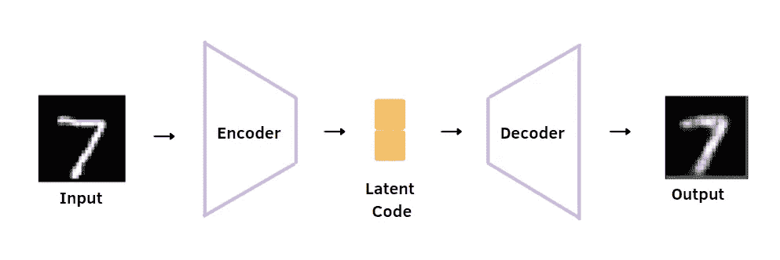**

**自动编码器的体系结构。作者插图。**

**自动编码器是一种以无监督方式训练的神经网络结构。目标是将输入的最相关特征提取到输入的编码表示中，称为潜在空间表示，然后将其解压缩以获得原始输入。自动编码器由两个神经网络组成:**

*   ****编码器**，将输入的信息压缩成低维的**潜码**。**
*   ****解码器**从解压缩的潜在代码开始重建原始输入。**

## **生成对抗网络**

**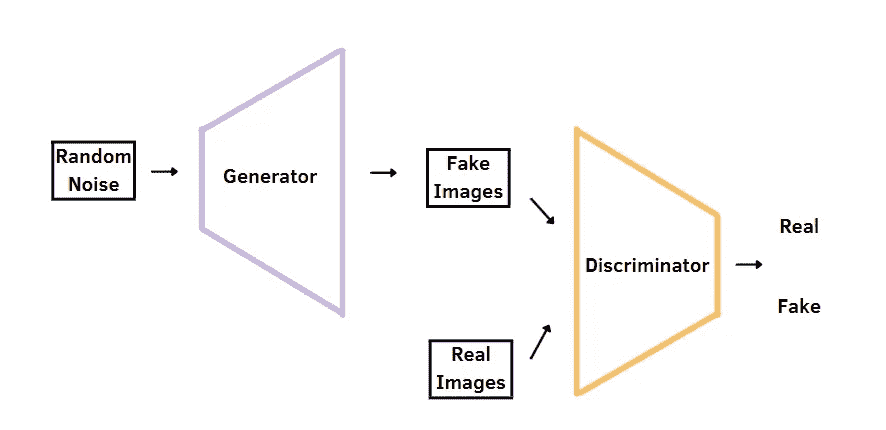**

**甘斯的建筑。作者插图。**

**生成式对抗网络是强大的算法，由以生成真实图像而闻名的 Ian Goodfellow 首次引入。它们以无人监督的方式进行训练，由两种神经网络结构组成:**

*   ****发生器**接收随机输入并产生类似真实数据的样本。**
*   ****鉴别器**试图将生成器生成的假样本与数据集的真实样本区分开来。**

**用来解释这些生成模型的常见类比是艺术伪造者和艺术研究者的例子。艺术伪造者(创造者)试图创作写实主义绘画，这些绘画类似于真实绘画的特征，而艺术调查员检查哪些绘画是真的，哪些绘画是假的。**

**主要思想是这**两个神经网络互相竞争**。在训练开始时，鉴别器比生成器工作得更好，生成器产生的数据明显是假的。随着历元数量的增加，发生器提高了其生成逼真图像的能力，可以欺骗鉴别器。主要目标是在生成器生成数据时达到**平衡点**，该数据与训练数据无法区分，在这种情况下，鉴别器将无法解决其任务。**

## **对抗自动编码器**

**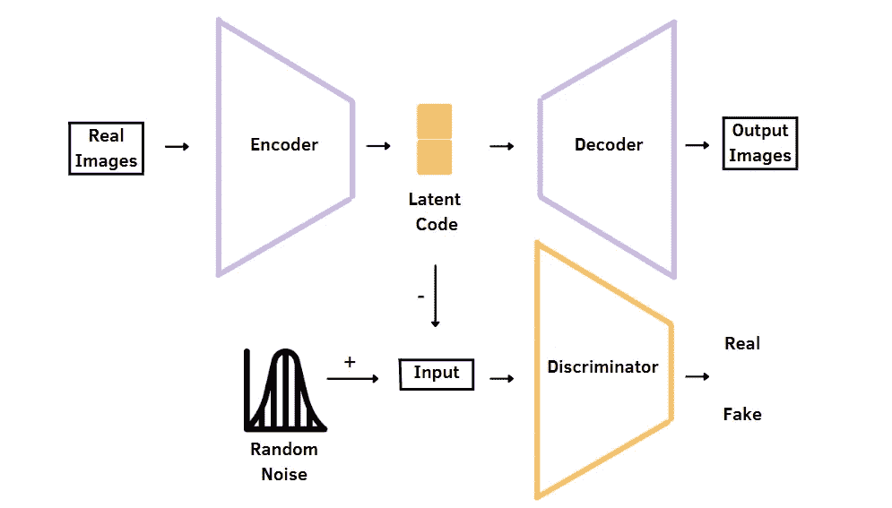**

**对抗性自动编码器的体系结构。作者插图。**

**对抗性自动编码器(AAE)是一种概率性自动编码器，它利用了 GANs 的思想，**对抗性训练**，将特定的先验分布(例如高斯分布)强加到自动编码器的潜在代码分布上。**

**对抗性自动编码器中有不同的组件:**

*   ****通过最小化重构误差来训练自动编码器**,以从潜在代码 z 开始重构原始输入 x。**
*   ****发生器**是自动编码器的编码器。**
*   ****鉴别器**将利用先验产生的**真样本**与**产生的样本**(或假样本)区分开来，这些样本对应于自动编码器获得的隐藏代码。**

**训练对抗性自动编码器有两个主要阶段:**

*   ****重建阶段**:自动编码器学习从潜在代码重建原始图像 x**
*   ****正则化阶段:**第一步是训练鉴别器对隐藏码 z 和使用先验 z’生成的样本进行分类。之后，生成器(也是自动编码器的编码器)被更新以欺骗鉴别模型 d。主要目标是使鉴别器认为**隐藏代码来自真实的先验分布**。**

# **2.加诺马利**

**GANomaly 是一种异常检测模型，它采用对抗性训练来捕获数据分布。在某些方面，它与对抗性自动编码器非常相似，因为它将传统的自动编码器与 GANs 相结合，但在 AAE 方面也有差异，这将在下面的段落中探讨。**

*   ****如何应用于异常检测？****
*   ****GANomaly 的主要部件****
*   ****目标函数****
*   ****模型测试****

## **它是如何应用于异常检测的？**

**异常检测有一个正式的问题定义:**

*   **训练数据集仅包含正常图像，而测试数据集包括正常和异常样本。**
*   **在训练期间，模型仅学习正态数据分布。**
*   **在训练阶段完成后，我们希望在测试样本上评估模型。假设在训练期间没有通过的异常样本应该比正常图像输出更高的异常分数。**

## **GANomaly 的主要组件**

**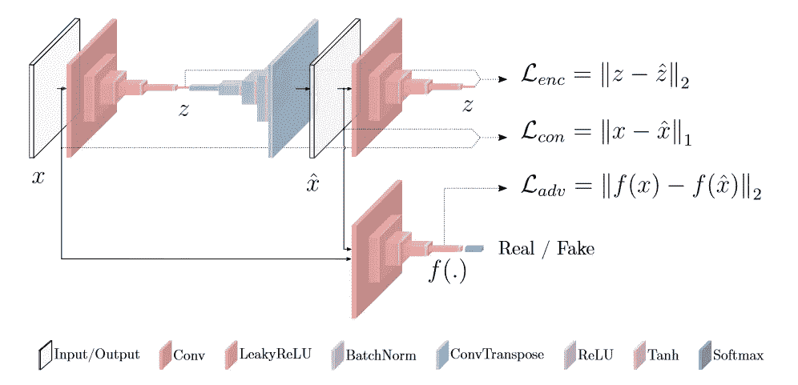**

**加诺马利的建筑[1]。**

**与对抗性自动编码器类似，GANomaly 由不同的组件组成。该方法包括两个编码器、一个解码器和一个判别模型。**

*   ****Autoencoder** ，其也是模型的生成器，通过使用编码器和解码器网络学习重构原始输入。**
*   ****鉴别器**被训练来区分输入(真样本)和重建(假样本)。**
*   **第二**编码器**包括重构为潜在代码 z’。**

## **目标函数**

**在模型的训练期间，目标函数组合了三个不同的损失函数，这些损失函数中的每一个都是通过不同的子网络获得的:**

*   ****对抗损失**是原始图像 x 的特征表示和生成图像 G(x)的特征表示之间的 L2 距离。在这个损失函数中，f(x)被定义为对于给定的输入 x 输出鉴别器 D 的中间层的函数。对抗性损失用于用生成的图像欺骗鉴别模型 D。**

**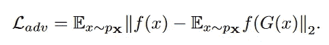**

*   ****上下文损失**是原始输入 x 和生成图像 G(x)之间的 L1 距离。这种损失对于添加关于输入的上下文信息很重要。**

**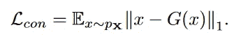**

*   ****编码器损耗**是输入的瓶颈特征 z 和生成图像的编码特征 z’之间的 L2 距离。以这种方式，生成器学习如何对正常样本的生成图像的特征进行编码。**

**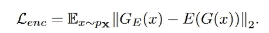**

**因此，目标函数考虑了这三种类型的损失:**

**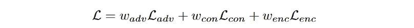**

**其中 w_{adv}、w_{con}和 w_{enc}分别是对抗损失、上下文损失和编码器损失的权重参数。**

## **模型检验**

**在评估期间，模型使用**编码器损耗**来输出每个测试图像的异常分数:**

**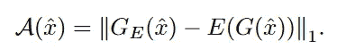**

**每个测试图像的异常分数[1]。**

**在计算异常分数之后，它们被归一化到 0 和 1 之间的范围内:**

**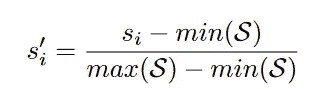**

**异常分数的最小-最大归一化[1]。**

# **3.数据集**

**有四个数据集被认为是评估异常检测框架的基准。前两个数据集是众所周知的玩具数据集**和 [**CIFAR10**](https://www.cs.toronto.edu/~kriz/cifar.html) ，其中一个类被视为异常，其余被视为正常。剩下的数据集是**大学行李异常数据集** (UBA)和**全枪对操作良性** (FFOB)。****

******UBA** 是一个行李 x 光数据集，包含 230，275 个图像补片。目标是自动检测来自安全 X 射线扫描的威胁。在样本中，有三个异常类，刀、枪和枪组件，如下例所示。****

******FFOB** 是英国政府的数据集，提供了 4，680 件火器全武器为异常类，67，672 件操作良性为正常类。****

****为了尊重问题的正式表述，所有这些数据集的正常样本被分成 80%用于训练，20%用于测试。只有在评估期间，模型才会看到异常样本。****

# ****4.结果****

****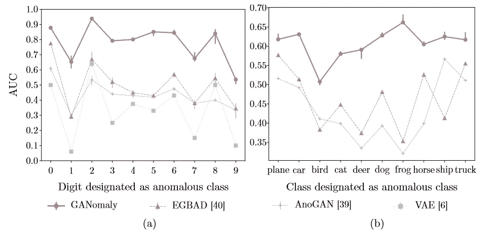****

****图 1:MNIST(a)和 CIFAR10 (b)数据集的 AUC 结果。他们还使用 3 种不同的随机种子来考虑变异[1]。****

****图 1 比较了 MNIST 和 CIFAR10 数据集的 AUC 结果。在这两种情况下，GANomaly 的 AUC 都高于 EGBAD、AnoGAN 和 VAE。****

****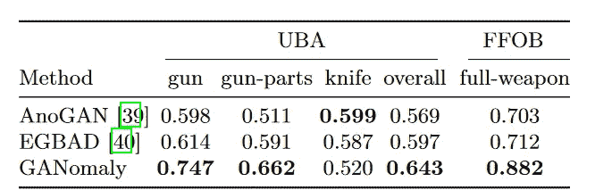****

****表 1:UBA 和 FFOB 数据集的 AUC 结果[1]。****

****从表 1 中，值得注意的是，在 UBA 数据集上，除了刀之外，GANomaly 在所有异常类上都表现得更好。此外，异常检测方法优于其他模型，在 UBA 和 FFOB 数据集上分别达到 0.643 和 0.882****

****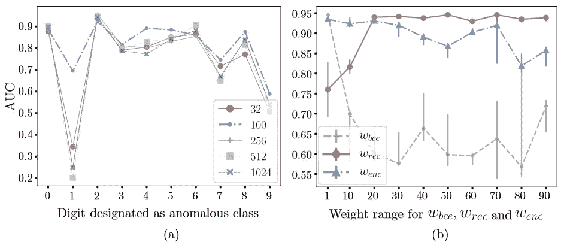****

****图 2:MNIST 数据集上的结果，其中 2 是异常类。(a)通过改变潜在向量 z 的大小来分析模型性能；(b)加权损失对整体模型性能的影响[1]。****

****图 2 显示了超参数的变化，如潜在向量的大小和损失的权重，如何影响 MNIST 数据集上 GANomaly 的性能。z 等于 100 时获得最高 AUC，而在右侧，w_{bce}=1、w_{rec}=50 和 w_{enc}=1 时获得最佳性能。****

****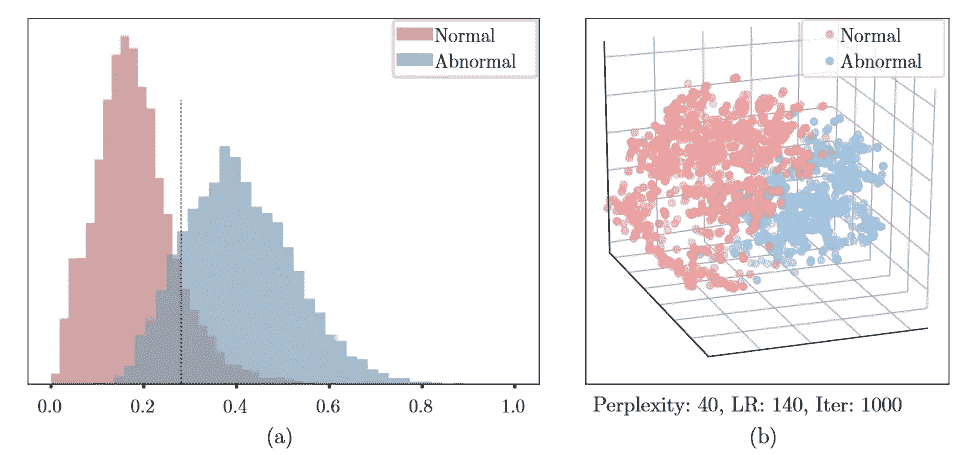****

****图 3: (a)正常和异常测试实例的**异常分数**直方图。(b)使用**t-SNE**【1】从鉴别器的最后一个卷积层提取的特征的 3d 可视化。****

****图 3 突出显示了正常样品和异常样品之间的明显区别。****

# ****外卖食品****

****我希望你喜欢这篇关于 GANomaly 的评论。图像中的异常检测具有挑战性，简单的技术不足以识别异常。此外，缺乏专门用于异常检测的图像数据集，当数据集中没有足够的信息时，无监督方法最适合。****

****几个月前，我发现了一个适合异常检测的图像数据集，称为 **MVTec AD 数据集**。这是一个新颖而全面的工业数据集，由 15 个类别的 5354 幅高分辨率图像组成。训练集仅由正常图像组成，而测试集包含缺陷和无缺陷图像。我试图用这个数据集实现 GANomaly。这里的 GitHub 代码是[这里是](https://github.com/eugeniaring/ganomaly-MVTec-AD)。****

****如果你想探索异常检测的其他技术，建议你去看看其他解释 [**Skip-GANomaly**](https://arxiv.org/abs/1901.08954) 和 [**AnoGAN**](https://arxiv.org/abs/1703.05921) 的论文。如果你有其他关于阅读的建议，请告诉我，分享知识是提高的最好方法。感谢阅读。祝您愉快！****

******参考文献:******

****[1] [加诺玛利:通过对抗训练进行半监督异常检测](https://arxiv.org/abs/1805.06725)，S. Akcay，A. Atapour-Abarghouei 和 T. P. Breckon，(2018)****

****[2] [对抗性自动编码器](https://arxiv.org/abs/1511.05644)，a .马克扎尼，j .施伦斯& N .贾伊特利，I .古德费勒，b .弗雷，(2016)****

## ****Github 知识库****

 ****[## GitHub-samet-akcay/gano maly:gano maly:通过对抗训练的半监督异常检测

### 此回购不再维护。GANomaly 实现已经被添加到 anomalib 中，它是…

github.com](https://github.com/samet-akcay/ganomaly)**** 

****你喜欢我的文章吗？ [*成为会员*](https://eugenia-anello.medium.com/membership) *每天无限获取数据科学新帖！这是一种间接的支持我的方式，不会给你带来任何额外的费用。如果您已经是会员，* [*订阅*](https://eugenia-anello.medium.com/subscribe) *每当我发布新的数据科学和 python 指南时，您都会收到电子邮件！*****