# GANs:生成对抗网络——一种先进的数据生成解决方案

> 原文：<https://towardsdatascience.com/gans-generative-adversarial-networks-an-advanced-solution-for-data-generation-2ac9756a8a99>

## 神经网络

## 对什么是 gan、它们如何工作以及如何用 Python 构建它们的全面解释

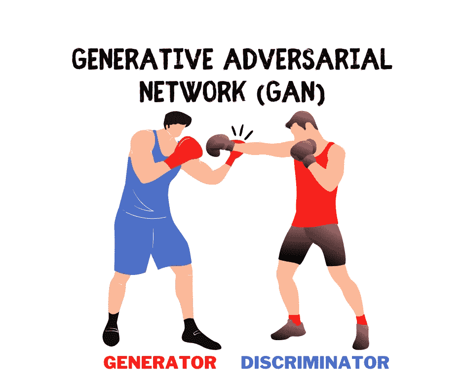

生成对抗网络。图片作者。

# 介绍

在数据科学社区中，对生成性对抗网络(gan)有太多的炒作。但是，当你开始了解它们时，你马上就会明白为什么了。GAN 架构是一个天才的设置，释放了现实数据生成和增强的潜力。

在本文中，我将带您了解 GANs 的基础知识，并向您展示如何使用 Keras/Tensorflow 库用 Python 编写一个 GANs。

# 内容

*   机器学习算法领域内的 gan
*   GAN 架构及其工作原理的直观解释
*   一个详细的 Python 例子向您展示了如何从头构建一个 GAN

# 机器学习算法领域内的 gan

即使是经验丰富的数据科学家也很容易迷失在数百种不同的机器学习算法中。为了有助于这一点，我对一些最常见的算法进行了分类，并创建了一个可视化的旭日图，如下所示。

注意，一些算法足够灵活，可以应用于不同的任务。因此，任何分类的尝试都不会完美。尽管如此，能够看到高层视图仍然有巨大的价值。

下图是**互动**，请**点击了解👇在不同的类别上**揭示更多。

您会发现 GAN 是神经网络的一个子类，包含不同的变体，如基本 GAN(本文的重点)、条件 GAN(cGAN)、深度卷积 GAN(DCGAN)以及我将在未来文章中介绍的其他类型。

机器学习算法分类。由[作者](https://solclover.com/)创作的互动图表。

***如果你喜欢数据科学和机器学习*** *，请* [*订阅*](https://bit.ly/3sItbfx) *获取我的新文章的邮件。如果你不是中等会员，可以在这里加入*<https://bit.ly/36Mozgu>**。**

# *GAN 架构及其工作原理的直观解释*

*生成敌对网络是深度学习机器，将两个独立的模型结合到一个架构中。这两个组件是:*

*   *发电机模型*
*   *鉴别器模型*

*这两种模式在零和游戏中相互竞争。生成器模型试图生成类似于问题域中的新数据样本。与此同时，鉴别器会尝试识别所呈现的示例是假的(来自生成器)还是真的(来自实际的数据域)。*

*发生器和鉴别器之间的竞争使它们成为对手，这就给了 GANs 这个名字。*

## *发电机模型*

*让我们看看生成器模型，看看它是如何创建新的数据样本的。*

*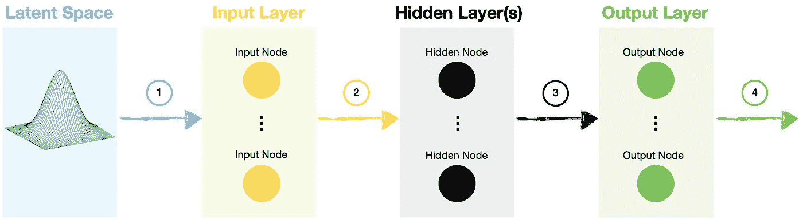*

*发电机型号。图片由[作者](https://solclover.com/)提供。*

1.  *生成器模型从潜在空间中采样一个随机向量。这个空间遵循高斯分布，维数由我们指定。随机向量播种生成过程，因为我们使用它作为神经网络的输入。*
2.  *输入沿着标准路径通过具有一个或多个隐藏层的网络。在简单 GAN 的情况下，这将是一堆密集连接的层，而深度卷积 GAN (DCGAN)也将包含卷积层。*
3.  *数据流入输出层，我们可以在其中进行最终调整，以确保发生器输出具有所需的形状，能够馈入鉴频器。*
4.  *最后，我们可以使用这些假的(生成的)样本来尝试和愚弄鉴别器。*

## *鉴别器模型*

*接下来，我们来看看鉴别器模型是如何构造的。*

*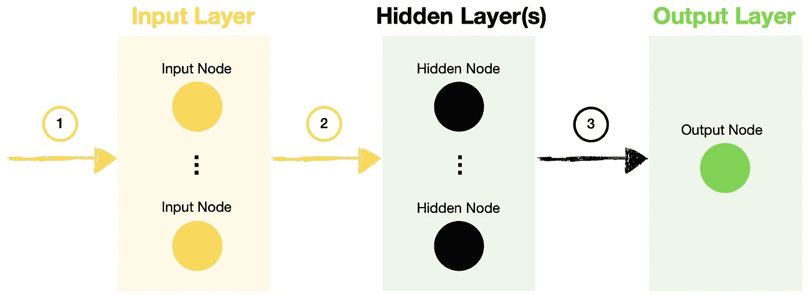*

*鉴别器模型。图片 bu [作者](https://solclover.com/)。*

1.  *鉴别器模型的输入是真实样本(从问题域中抽取)和虚假样本(由生成器模型创建)的组合。*
2.  *数据通过一个或多个隐藏层的网络，就像你在任何其他神经网络中一样。*
3.  *一旦我们到达输出层，鉴别器决定样本是真的还是假的(生成的)。*

*总之，鉴别器与标准的神经网络分类模型没有什么不同。*

## *GAN 模型*

*生成性对抗网络结合了相互竞争的生成器和鉴别器模型。下面的 GAN 架构图说明了这两种模型是如何互连的。*

*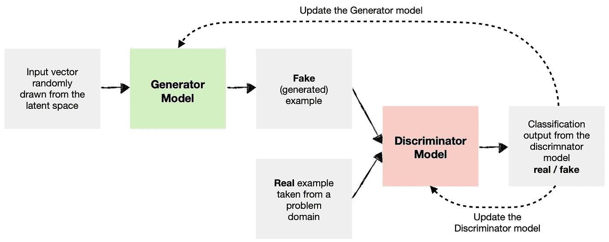*

*GAN 模型架构。图片由[作者](https://solclover.com/)提供。*

*正如您在图中看到的，我们向鉴别器模型提供了假的(生成的)和真实的例子，训练它来区分这两个类。*

*随着鉴别器在区分真实和虚假例子方面变得更好，生成器模型的权重和偏差得到更新，以使其产生更有说服力的假货。*

*该过程持续指定数量的时期，发生器和鉴别器试图更好地完成它们的特定任务。最后，在极限处，来自发电机模型的输出变得与真实的难以区分，鉴别器模型收敛到 0.5 的中性预测。*

*[](https://solclover.com/membership)**[](https://www.linkedin.com/in/saulius-dobilas/)*

# *一个详细的 Python 例子向您展示了如何从头构建一个 GAN*

*这个例子的目的是让你对 GANs 的工作原理有一个基本的了解。因此，我们将把它应用于一个简单的问题。*

## *设置*

*我们需要获得以下库:*

*   *[熊猫](https://pandas.pydata.org/docs/)、 [Numpy](https://numpy.org/) 和 [Math](https://docs.python.org/3.8/library/math.html) 用于数据生成和操作*
*   *用于数据可视化的 [Matplotlib](https://matplotlib.org/stable/index.html) 、 [Graphviz](https://graphviz.org/) 和 [Plotly](https://plotly.com/python/) (可选)*
*   *[Tensorflow/Keras](https://www.tensorflow.org/api_docs/python/tf) 用于构建神经网络*

*让我们导入库:*

*上面的代码打印了本例中使用的包版本:*

```
*Tensorflow/Keras: 2.7.0
numpy: 1.21.4
pandas: 1.3.4
matplotlib: 3.5.1
graphviz: 0.19.1
plotly: 5.4.0*
```

*接下来，我们将创建一个圆，并获取其边缘(圆周)上的点的坐标。然后我们通过训练生成器和鉴别器来教甘“识别”和“产生”这样一个圆。*

*上面的代码生成 1，000 个点，并绘制一个显示我们的圆的图形。*

*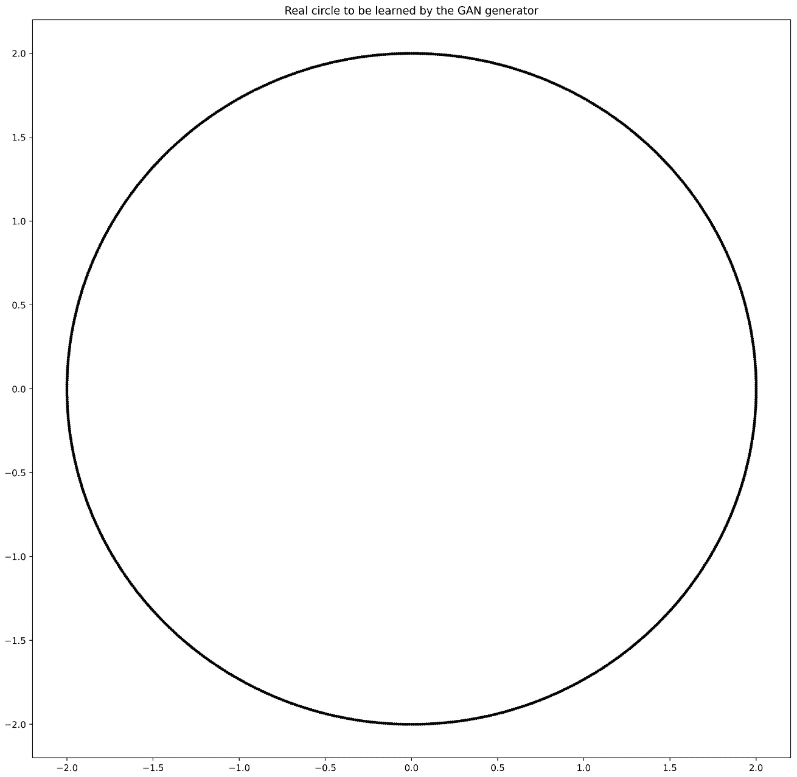*

*由 1000 个点组成的圆。图片由[作者](https://solclover.com/)提供。*

## *创建 GAN 模型*

*现在我们已经准备好了数据，让我们定义和组装我们的模型。我们将从发电机开始:*

*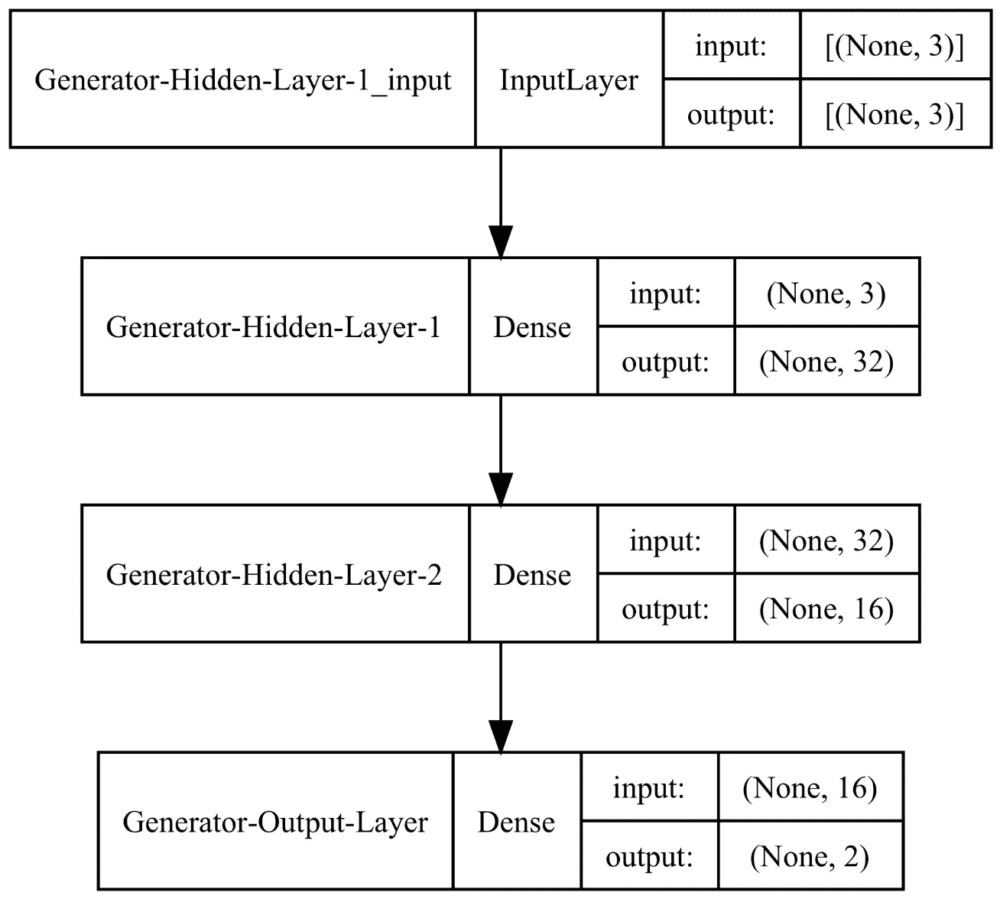*

*发电机模型图。图片由[作者](https://solclover.com/)提供。*

*如你所见，我们的生成器有三个输入节点，因为我们决定从一个三维潜在空间中绘制一个随机向量。注意，我们可以自由选择潜在的空间维度。*

*同时，输出有两个值，分别对应于一个点在 2D 空间中的 x 和 y 坐标。*

*接下来，我们建立鉴别器模型:*

*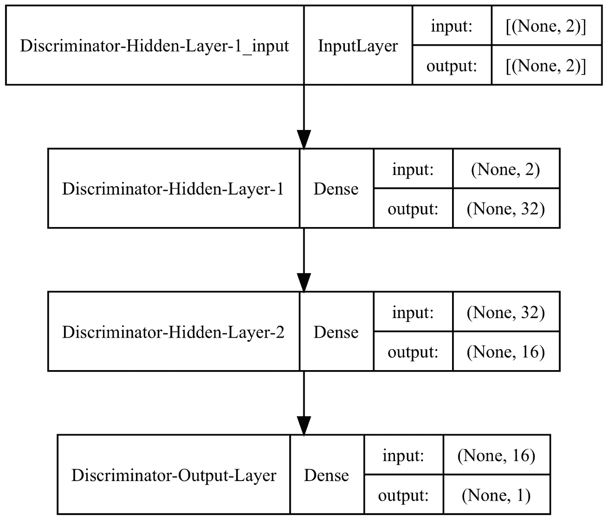*

*鉴别器模型图。图片由[作者](https://solclover.com/)提供。*

*鉴频器输入有两个值，与发生器输出对齐。与此同时，鉴别器输出只是一个单一的值，告诉我们模型对数据是真/假有多有信心。*

*接下来，我们将这两个模型结合起来创建一个 GAN。下面代码中的一个关键细节是我们使鉴别器模型不可训练。我们这样做是因为我们希望使用真实和虚假(生成)数据的组合来分别训练鉴别器。稍后您将看到我们是如何做到这一点的。*

*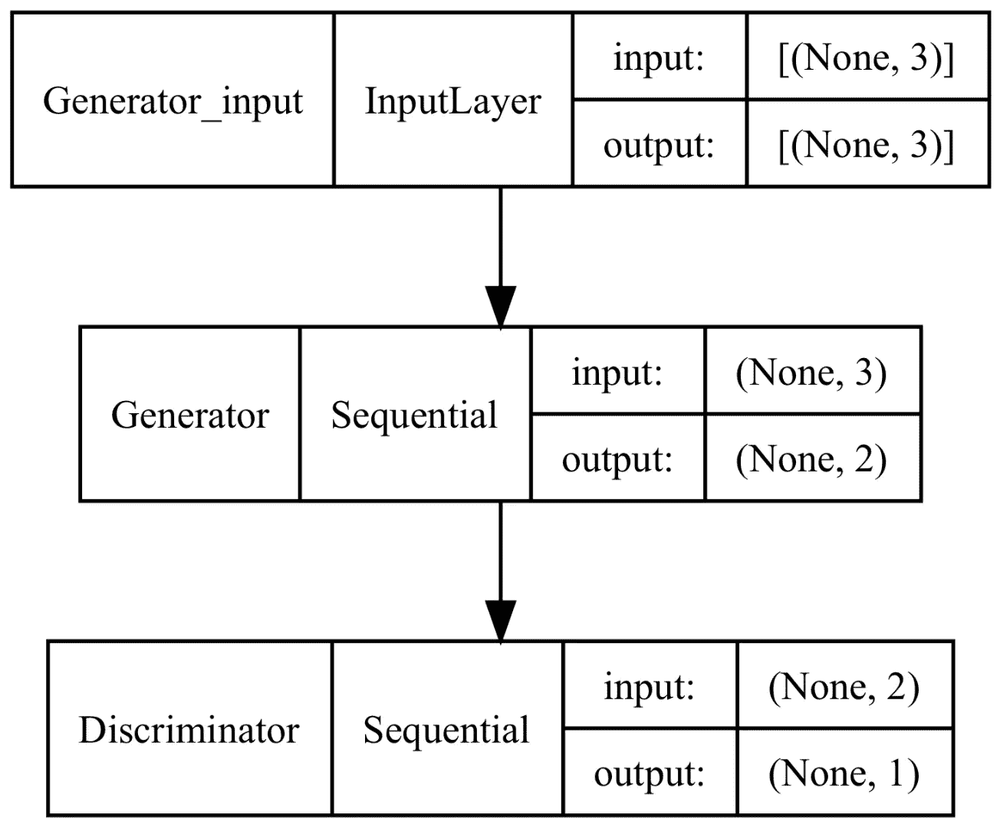*

*GAN 模型图。图片由[作者](https://solclover.com/)提供。*

## *为发生器和鉴频器准备输入*

*我们将创建三个简单的函数来帮助我们为这两个模型采样/生成数据。*

*第一个从圆中采样真实点，第二个从潜在空间中绘制随机向量，第三个将潜在变量传递到生成器模型中以生成假样本。*

## *模型训练和评估*

*最后两个函数将帮助我们训练模型，并在指定的时间间隔评估结果。*

*让我们首先创建模型性能评估函数:*

*正如您所看到的，上面的函数分别在真实和虚假(生成)点上评估鉴别器。然后绘制 2D 散点图，显示这些点在 2D 平面上的位置。*

*最后，培训功能:*

*如前所述，我们通过传递一批 50%真实和 50%虚假(生成)的样本来分别训练鉴别器。同时，发电机训练通过组合 GAN 模型进行。*

## *结果*

*让我们调用训练函数来显示一些结果:*

```
*# Train GAN model
train(gen_model, dis_model, gan_model, latent_dim)*
```

*时段 0 的结果:*

*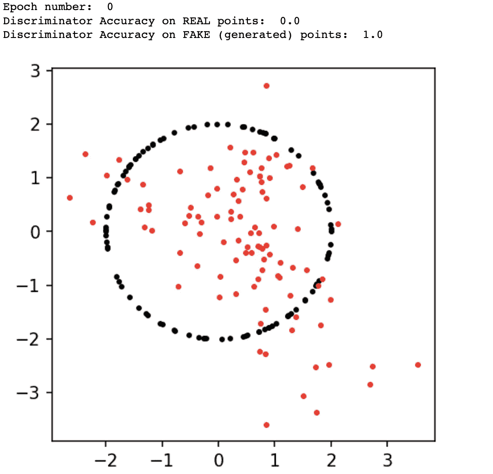*

*0 个时期后的 GAN 性能。图片由[作者](https://solclover.com/)提供。*

*第 3，000 纪元时的结果:*

*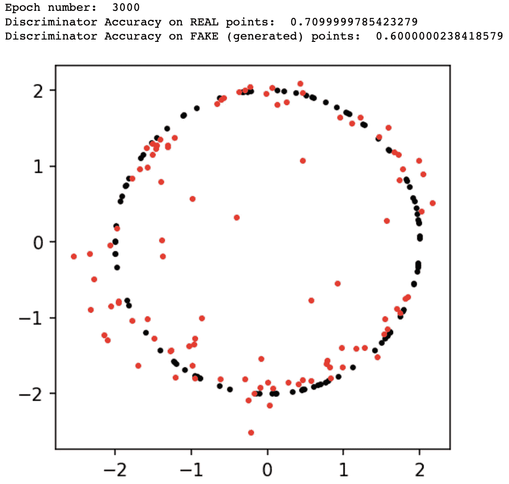*

*3000 个周期后的 GAN 性能。图片由[作者](https://solclover.com/)提供。*

*第 10，000 个纪元时的结果:*

*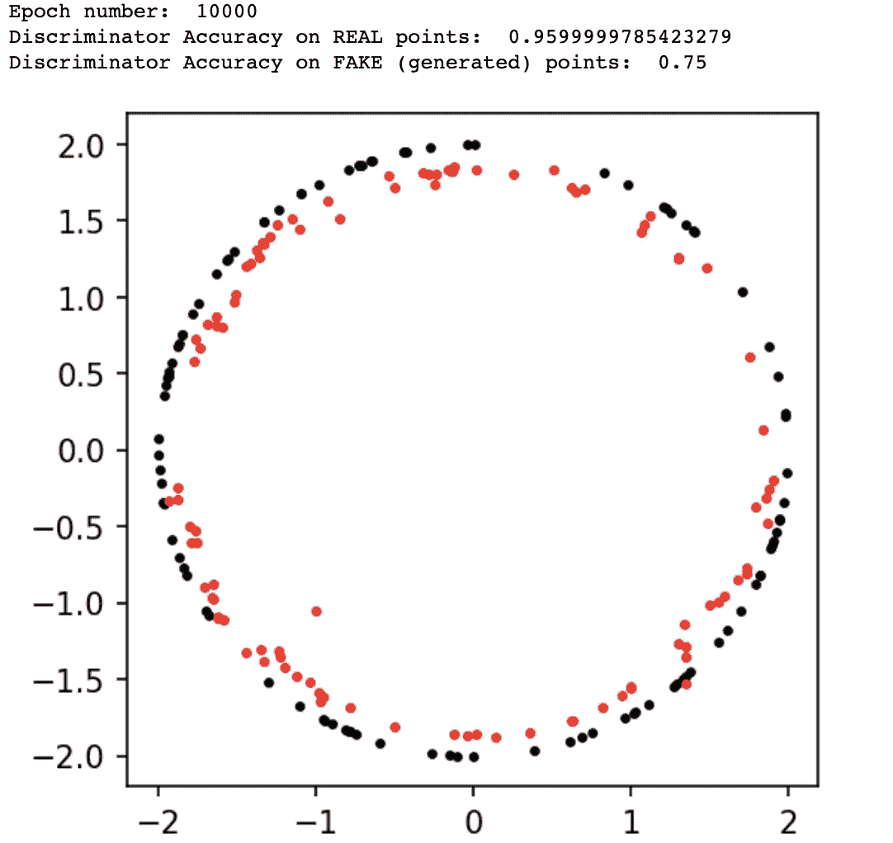*

*10，000 个时代后的 GAN 性能。图片由[作者](https://solclover.com/)提供。*

*我们可以看到生成器在每一步都有所改进。然而，在 10，000 个时代之后，通过识别大多数真实的例子和相当一部分假的(生成的)例子，鉴别器仍然表现良好。因此，我们可以继续训练模型 10，000 个纪元，以获得更好的结果。*

*比较上述模型性能的另一种方法是查看真实和虚假点分布的汇总统计数据:*

*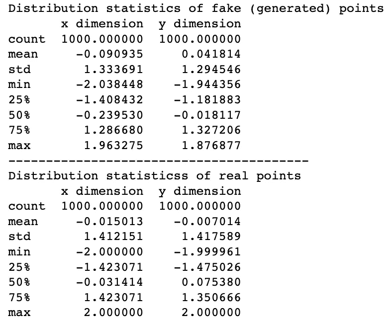*

*真实和虚假(生成的)点分布统计的比较。图片作者[作者](https://solclover.com/)。*

*上述情况清楚地表明，分布的差异相对较小。*

# *结束语*

*我希望我的文章已经让您很好地理解了 GANs 是如何工作的。**如果您想了解更高级版本的 GAN，**如条件 GAN (cGAN)或深度卷积 GAN (DCGAN)，请[订阅](https://bit.ly/3uJnQFT)，以便在我发布文章后立即收到您的收件箱。*

***如果你还不是媒体会员**，请考虑通过我下面的个性化链接加入，解锁包括我自己在内的成千上万伟大作家的文章。*

*<https://bit.ly/3J6StZI>  

最后，你可以在我的 [**GitHub 库**](https://github.com/SolClover/Art052_NN_GAN) 上找到本文使用的完整 Python 代码，作为 Jupyter 笔记本。

干杯！🤓
**索尔·多比拉斯*** 

*一些相关的文章你可能会感兴趣:*

*</transposed-convolutional-neural-networks-how-to-increase-the-resolution-of-your-image-d1ec27700c6a>  </vae-variational-autoencoders-how-to-employ-neural-networks-to-generate-new-images-bdeb216ed2c0> *