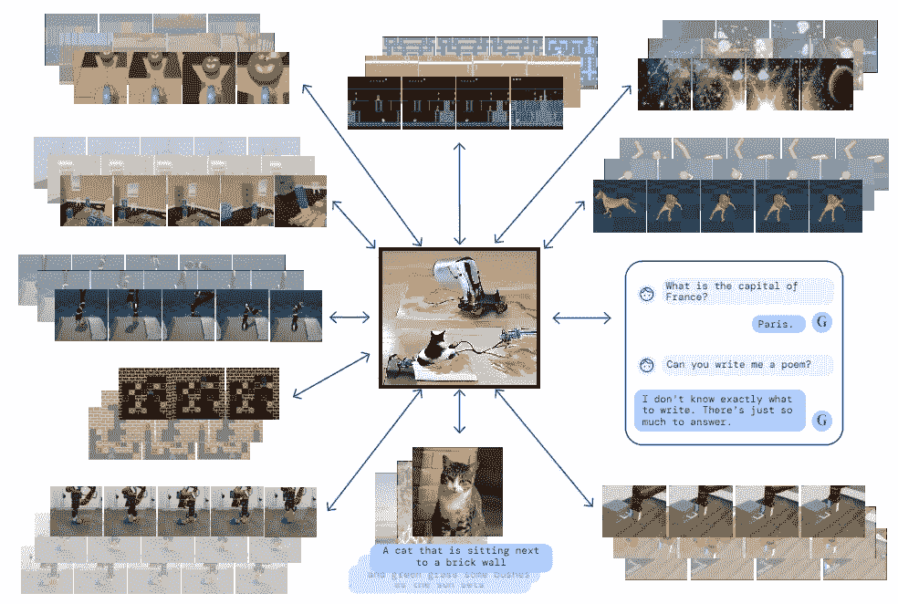

# 加托，来自 Deepmind 的最新作品。走向真 AI？

> 原文：<https://towardsdatascience.com/gato-the-latest-from-deepmind-towards-true-ai-1ac06e1d18cd>

## 迄今为止最先进的通才网络

## 加托可以玩游戏、生成文本、处理图像和控制机械臂。而且还不算太大。真 AI 上来了吗？

深度学习领域进展迅速，Deepmind 的最新作品就是一个很好的例子。他们的加托模型能够学习玩 Atari 游戏，生成逼真的文本，处理图像，控制机械臂等等，所有这些都是通过相同的神经网络实现的。受大规模语言模型的启发，Deepmind 应用了类似的方法，但扩展到了文本输出领域之外。

作者根据 Deepmind 在 arXiv (CC By 4.0)的[预印本中的一张免费使用的图像组成的图。](https://arxiv.org/abs/2205.06175)

## 加托是如何运作的

这个新的 AGI(在[人工通用智能](https://en.wikipedia.org/wiki/Artificial_general_intelligence)之后)作为一个多模态、多任务、多体现的网络工作，这意味着同一个网络(即具有单组权重的单个架构)可以执行所有任务，尽管涉及本质上不同种类的输入和输出。

虽然 Deepmind 展示加托的预印本不是很详细，但它足够清楚，因为它深深植根于用于自然语言处理和文本生成的变形金刚。然而，它不仅用文本训练，还用图像训练(已经有了像 Dall 这样的模型。e)、作用在机械臂上的扭矩、玩电脑游戏时的按钮按压等。实质上，加托处理所有类型的输入，并根据上下文决定是否输出可理解的文本(例如聊天、总结或翻译文本等)。)、或扭矩功率(用于机械臂的致动器)、或按钮按压(用于玩游戏)等。

因此，加托展示了基于变压器的机器学习架构的多功能性，并展示了它们如何适应各种任务。在过去的十年中，我们看到了神经网络在玩游戏、翻译文本、图像字幕等方面的惊人应用。但是加托足够通用，使用一组砝码和一个相对简单的架构，就可以自己完成所有这些任务。这与需要集成多个模块以便一起工作的专用网络相反，专用网络的集成取决于要解决的问题。

此外，令人印象深刻的是，加托甚至还没有接近我们所见过的最大的神经网络！“只有”12 亿权重，可与 OpenAI 的 GPT-2 语言模型、*即*相比，比 GPT-3(1750 亿权重)和其他现代语言处理网络小 2 个数量级以上。

在加托上的结果也支持先前的发现，即来自不同性质的数据的训练导致对所提供的信息的更好学习。就像人类从多个同步信息源了解他们的世界一样！这整个想法完全进入了近年来机器学习领域最有趣的趋势之一:[多模态](http://multicomp.cs.cmu.edu/multimodal-machine-learning/)——处理和整合各种类型数据的能力。

## 论 AGIs 的潜力——走向真正的 AI？

> 我从来不喜欢人工智能这个词。我过去认为没有什么能打败人脑。然而…

与一年前相比，新兴 AGIs 背后的潜力更加有趣，当然也更加强大。这些模型能够用一个软件解决各种复杂的任务，使它们非常通用。如果一个这样的模型从现在起十年后发展起来，在类似机器人的硬件中运行，有移动的手段和适当的输入和输出外围设备，我们很可能会迈出坚实的步伐，创造出具有真正人工智能的真正的人造生物。毕竟，我们的大脑在某种程度上是非常复杂的神经网络，连接和整合感官信息以输出我们的行动。从虚无的角度来看，没有什么能阻止这种数据处理在计算机上进行，而不是有机地进行。

就在 3 年前，我绝对不会说这些，尤其是没有想到人工智能有一天会成为现实。现在，我不太确定，社区的情绪是相似的:他们现在估计，到 2030 年，我们可能会有基于机器的系统，具有与人类相同的通用推理和解决问题的任务。两年前预计的年份是 2200 年左右，并且一直在缓慢下降:

 [## 第一个弱通用人工智能系统何时会被设计、测试并公之于众？

### 自该领域开始以来，人工智能(AI)研究的目标一直是开发一种基于机器的…

www.metaculus.com](https://www.metaculus.com/questions/3479/date-weakly-general-ai-system-is-devised/) 

虽然这只是盲目的预测，背后没有坚实的模型，但这一趋势确实反映了该领域正在迈出的巨大步伐。我现在不认为一个机器人可以在某一天和你下棋，第二天玩拼字游戏，在你不在家的时候给你的植物浇水，甚至根据天气预报和你的植物看起来如何做出自己的决定，智能地为你总结新闻，为你做饭，甚至为什么不帮助你发展你的想法。多面手 AI 可能比我们想象的更快到达。

# 关键读数

Deepmind 在 arXiv 上关于加托的预印本:

 [## 多面手经纪人

### 受大规模语言建模进展的启发，我们应用类似的方法来构建一个通才…

arxiv.org](https://arxiv.org/abs/2205.06175) 

在 Deepmind 的网站上:

 [## 多面手经纪人

### 受大规模语言建模进展的启发，我们将类似的方法应用于构建一个单一的…

www.deepmind.com](https://www.deepmind.com/publications/a-generalist-agent) 

关于机器学习中的多模态:

 [## 多模态机器学习| MultiComp

### 我们周围的世界涉及多种形式——我们看到物体，听到声音，感觉纹理，闻到气味，等等…

multicomp.cs.cmu.edu](http://multicomp.cs.cmu.edu/multimodal-machine-learning/) 

我写的一些关于使用 GPT-3 和 VQGAN-CLIP 的文章，我用它们做了很多实验，重点是 web 开发:

 [## 这个“人造梦”程序是如何工作的，以及你如何用它创造你自己的艺术作品

### 你不需要知道任何编程-只要有一个谷歌帐户。这里有一篇直截了当的文章，评论…

towardsdatascience.com](/how-this-artificial-dreaming-program-works-and-how-you-can-create-your-own-artwork-with-it-387e5fb369d9)  [## 基于网络的聊天机器人项目，模块 2:GPT-3-生成的答复与数据库辅助…

### 这个项目的第二部分跨越网络编程，数学，人工智能，等等

towardsdatascience.com](/web-based-chatbot-project-module-2-gpt-3-generated-responses-assisted-with-a-database-for-1ee2a0f4aad4)  [## 设计测试来衡量 GPT-3 的基础科学知识

### 学生可以从 OpenAI 的最新语言模型中学习并将其用作全天候顾问吗？学生可以用它来…

towardsdatascience.com](/devising-tests-to-measure-gpt-3s-knowledge-of-the-basic-sciences-4bbfcde8286b)  [## 经过长期训练的类似 GPT 3 的模特可能成为未来生物学生的全天候导师

### 尽管其他科目的成绩相当令人沮丧，但 GPT-3 在生物方面表现相当好，如果它…

towardsdatascience.com](/gpt-3-like-models-with-extended-training-could-be-the-future-24-7-tutors-for-biology-students-904d2ae7986a) 

www.lucianoabriata.com*[***我写作并拍摄我广泛兴趣范围内的一切事物:自然、科学、技术、编程等等。***](https://www.lucianoabriata.com/) **[***成为媒介会员***](https://lucianosphere.medium.com/membership) *访问其所有故事(我免费获得小额收入的平台的附属链接)和* [***订阅获取我的新故事***](https://lucianosphere.medium.com/subscribe) ***通过电子邮件*** *。到* ***咨询关于小职位*** *查看我的* [***服务页面这里***](https://lucianoabriata.altervista.org/services/index.html) *。你可以* [***这里联系我***](https://lucianoabriata.altervista.org/office/contact.html) ***。******