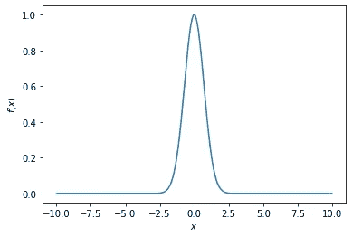
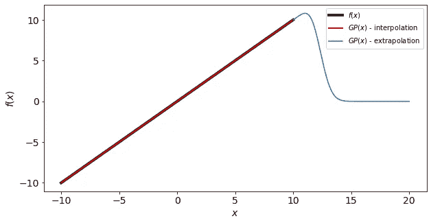
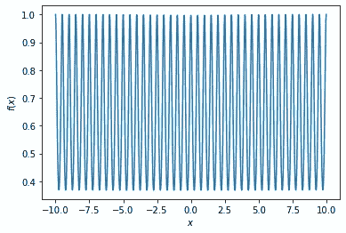
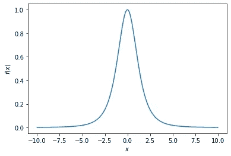
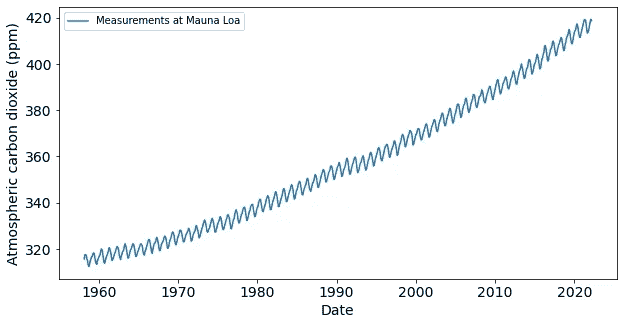
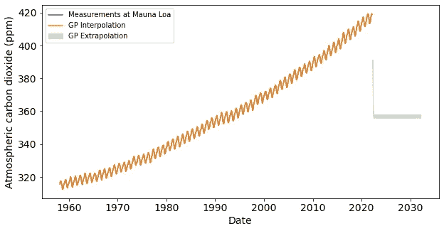
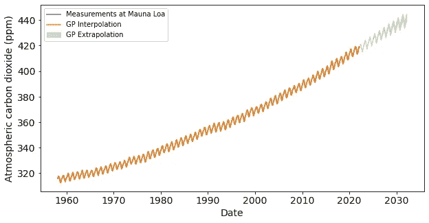

# 高斯过程核

> 原文：<https://towardsdatascience.com/gaussian-process-kernels-96bafb4dd63e>

## 不仅仅是径向基函数

在[之前的文章](/gaussian-process-models-7ebce1feb83d)中，我们探讨了高斯过程模型如何工作的基本原理——我们探讨了数学细节，并推导了高斯过程回归模型的解析解。我们还演示了如何使用高斯过程回归模型来模拟一些简单的数据。在本文中，我们将通过探索可用于现实生活数据建模的各种协方差核来深入探讨高斯过程模型的主题。本文假设您已经很好地理解了高斯过程模型——如果您还不太熟悉它们，请先阅读[以前的文章](/gaussian-process-models-7ebce1feb83d)！


阿布扎比的沙漠。由[萨吉蒙·萨哈德万](https://unsplash.com/@ssclicks?utm_source=unsplash&utm_medium=referral&utm_content=creditCopyText)在 [Unsplash](https://unsplash.com/?utm_source=unsplash&utm_medium=referral&utm_content=creditCopyText) 拍摄。

# 高斯过程模型的快速回顾

对于某目标的 *φ* 观测值**y**=*y*₁、 *y* ₂、……y*ᵩ*]ᵀ对应*t19】一组 *φ* 输入特性**x**=**x**₁、 **x** ₂、…**x**t3t*

高斯过程模型对 *yᵩ* ₊₁平均值的预测为:

*μ*=**k**ᵀ**c**⁻**y**，

相应的预测方差为:

*s*=*c-*kᵀ**c**⁻**k**，

其中协方差矩阵 **C** 具有元素:

**C** [ *n* ，*m*]=*k*(**x***ₙ*，**x***ₘ*)+*σδₙₘ*，

协方差向量 **k** 具有元素:

**k***n**= k*(**x***ₙ*， **x** *ᵩ* ₊₁)，

以及标量 *c* :

*c*=*k*(**x***ᵩ*₊₁，**x***ᵩ*₊₁)+*σ*，

其中 *σ* 是高斯噪声的标准差，*k*(**x**t20】ₙ，**x**t24】ₘ)是我们接下来要探讨的核函数。

# 高斯过程核

高斯过程模型中使用的核函数*k*(**x***ₙ*， **x** *ₘ* )是其核心——核函数本质上告诉模型两个数据点( **x** *ₙ* ， **x** *ₘ* )有多相似。有几个内核函数可用于不同类型的数据，我们将在本节中研究其中的几个。

## 径向基函数核



一维高斯函数。作者创造的形象。

也许最广泛使用的核可能是径向基函数核(也称为二次指数核、平方指数核或高斯核):

*k*(**x**t48】ₙ，**x**ₘ)= exp(-| |**x***ₙ*-**x***ₘ*| |/2*l*)，

其中 *L* 为内核长度刻度。这个内核在很多机器学习库中默认使用，比如 [scikit-learn](https://scikit-learn.org/stable/modules/generated/sklearn.gaussian_process.GaussianProcessRegressor.html#sklearn.gaussian_process.GaussianProcessRegressor) 。

一般来说，高斯过程模型将不能外推超过距离训练数据 *L* 的距离，如下图所示——对于*f*(*x*)=*x*的模型外推(蓝色曲线)会随着 *x* 远离训练数据(黑色曲线)而很快失败，即使内插(红色曲线)在

```
from sklearn.gaussian_process import GaussianProcessRegressor
import numpy as np
import matplotlib.pyplot as plt# Create some toy data for the Gaussian process regressor model.
dx = 0.1
x = np.arange(-10, 10 + dx, dx)
X = x.reshape(-1, 1)
y = x * 1# Fit the model to the toy data.
gpr = GaussianProcessRegressor()
gpr.fit(X, y)# Perform interpolation prediction.
y_pred_in = gpr.predict(X)# Create some data for extrapolation prediction.
x_out = np.arange(10, 20 + dx, dx)
X_out = x_out.reshape(-1, 1)# Perform extrapolation prediction. The model should 
# not perform very well here.
y_pred_out = gpr.predict(X_out)plt.plot(x, y, "k", linewidth = 6)
plt.plot(x, y_pred_in, "r")
plt.plot(x_out, y_pred_out, "b")
plt.legend(["Training data", "Interpolation", "Extrapolation"])
plt.xlabel("x")
plt.ylabel("f(x)")
plt.show()
```



函数的高斯过程模型(黑色曲线):f(x) = x 使用径向基函数核。插值(红色曲线)非常好，而外推(蓝色曲线)很快失败。作者创造的形象。

## 常数核

常数内核是最基本的内核，定义如下:

*k*(**x**t82】ₙ，**x**t86】ₘ)=*κ*，

其中 *κ* 是某个常数值。

## 白噪声核

不出所料，白噪声核用于模拟数据中的白噪声:

*k*(**x**t8】ₙ，**x**ₘ)=*ν*δ*ₙₘ*，

其中 *ν* 是某个噪声水平值。

## 指数正弦平方核



一维指数正弦平方函数。作者创造的形象。

指数正弦平方核本质上是正弦的，因此能够模拟周期性数据:

*k*(**x**t24】ₙ，**x**t28】ₘ)= exp(-2/*l*(sin(π|**x***ₙ*-**x***ₘ*|/*p*))，

其中 *L* 是内核长度刻度，而 *p* 是内核周期。

## 有理二次核



一维有理二次核。作者创造的形象。

有理二次核等价于多个不同长度尺度的径向基函数核的和。

*k*(**x**ₙ，**x**t54】ₘ)=(1+| |**x**t58】ₙ-**x***ₘ*| |/(2*al*))⁻*ᵃ*，

其中 *L* 是内核长度标度，而 *a* 确定大标度和小标度变化的权重。

# 内核的组合

我们不仅可以在高斯过程模型中单独使用各种核函数，还可以将它们组合起来，以使模型更加强大！例如，我们将使用具有自定义内核的高斯过程模型来模拟在莫纳罗亚测量的大气二氧化碳[的变化。这些数据是由 NOAA 提供的，公众可以免费使用。我只从下载的文件中提取了`year`、`month`和`average`列。使用`pandas`库的 csv 文件。](https://gml.noaa.gov/ccgg/trends/)

如下图所示，自 1958 年以来，测量的大气二氧化碳浓度一直在稳步上升，具有明显的周期性趋势。我们将尝试从今天开始推断未来 10 年(120 个月)的趋势。



莫纳罗亚的大气一氧化碳测量值(ppm)。作者创造的形象。

如果我们天真地使用 scikit-learn 中的默认径向基函数，我们会发现该模型能够很好地插值训练数据，但完全无法外推至未来，如下图所示。



使用默认设置(即使用径向基函数核)训练的高斯过程模型完全不能对未来进行任何种类的外推。作者创造的形象。

为了使用高斯过程模型有效地对数据建模，我们需要在制作模型时投入更多的精力！我们使用 [Rasmussen 和 Williams (2006)](http://gaussianprocess.org/gpml/chapters/RW.pdf) 中概述的方程(5.15)—( 5.19)来创建定制的核函数，以便尽可能精确地模拟数据。

## 长期上升趋势

为了模拟长期上升趋势，我们使用具有大时间尺度的径向基函数核:

*k*₁(**x**ₙ，**x***ₘ*)=*a*exp(-| |**x***ₙ*-**x***ₘ*| |/2*l*₁)，

其中 *A* = 59.3， *L* ₁ = 390。

使用较大的时间尺度可确保模型能够捕捉时间序列中的长期趋势和变化。

## 周期性趋势

我们使用指数正弦平方核来模拟时间序列中的年度周期。此外，为了解决数据周期性的漂移，我们向周期性内核添加径向基函数因子:

*k*₂(**x**t32】ₙ，**x**t36】ₘ)=*b*exp(-| |**x**ₙ-**x***ₘ*|/2*l*₂₁-2/*l*₂₂(sin

其中 *B* = 2.33， *L* ₂₁ = 2330， *L* ₂₂ = 1.26， *p* = 1.09。

## 中期和短期违规行为

时间序列数据中的中期和短期不规则性可以使用有理二次核来建模，该核能够捕捉大范围的长度尺度:

*k*₃(**x***ₙ*，**x***ₘ*)=*c*(1+| |**x***ₙ*-**x***ₘ*|/(2*al*₃))⁻

其中 *C* = 0.596， *a* = 0.145， *L* ₃ = 4.74。

## **噪音**

使用径向基函数核和白噪声核的组合对数据中的噪声进行建模:

*k*₄(**x**ₙ，**x**t8】ₘ)=*d*exp(-| |**x***ₙ*-**x***ₘ*| |/2*l*₄)+*ν*δ*ₙₘ*，

其中 *D* = 0.183， *L* ₄ = 0.133， *ν =* 0.0111。

## 在高斯过程模型中组合核

用于模拟二氧化碳时间序列的自定义内核是:

*CO2 _ kernel*=*k*₁(**x***ₙ*，**x***ₘ*)+*k*₂(**x***ₙ*，**x***ₘ*+*k*₃(**x**

```
# Kernel of the trained sklearn Gaussian process regressor: 
print(gpr.kernel_)59.3**2 * RBF(length_scale=390) + 2.33**2 * RBF(length_scale=2.33e+03) * ExpSineSquared(length_scale=1.26, periodicity=1.09) + 0.596**2 * RationalQuadratic(alpha=0.145, length_scale=4.74) + 0.183**2 * RBF(length_scale=0.133) + WhiteKernel(noise_level=0.0111)
```

如下图所示，由此产生的经过训练的高斯过程模型能够对大约 10 年后的大气二氧化碳浓度进行外推。与使用默认径向基函数核训练的原始模型相比，这是一个巨大的改进。

注意，随着预测日期和训练数据之间的距离增加，外推的方差变得更大。尽管如此，该模型已经能够捕捉长期上升趋势以及训练数据中的年度周期性！



使用包含长期、中期、短期长度尺度以及周期性的定制内核训练的高斯过程回归模型能够推断出大气二氧化碳在不久的将来的变化。作者创造的形象。

# 结束语

在今天的文章中，我们更详细地探讨了可用于高斯过程模型的各种内核。虽然径向基函数核被广泛使用，并且在大多数情况下都应该工作良好，但我们表明，使用精心制作的核将允许我们在不久的将来有效地对某些数据集进行预测。

对于机器学习从业者来说，很好地理解模型如何工作，以及如何调整模型确实是一项基本技能！如果你想更详细地了解高斯过程模型，我强烈推荐你同时阅读[大卫·k·杜文瑙德(2014)](https://www.cs.toronto.edu/~duvenaud/thesis.pdf) 和[拉斯姆森和威廉姆斯(2006)](http://gaussianprocess.org/gpml/chapters/RW.pdf) 。感谢您的阅读！

# 参考

[1] C. M. Bishop (2006)， [*模式识别与机器学习*](https://www.microsoft.com/en-us/research/uploads/prod/2006/01/Bishop-Pattern-Recognition-and-Machine-Learning-2006.pdf) ，【斯普林格】。
[2]大卫·k·杜文瑙德(2014)。 [*用高斯过程自动构建模型*](https://www.cs.toronto.edu/~duvenaud/thesis.pdf) ，剑桥大学博士论文。
【3】[https://sci kit-learn . org/stable/modules/Gaussian _ process . html](https://scikit-learn.org/stable/modules/gaussian_process.html)
【4】卡尔·e·拉斯姆森和克里斯托弗·k·I·威廉姆斯(2006)。 [*机器学习的高斯过程*](http://gaussianprocess.org/gpml/chapters/RW.pdf) ，麻省理工出版社。
[5]二氧化碳数据来自:Pieter Tans 博士*、* NOAA/GML *、([gml.noaa.gov/ccgg/trends/](http://gml.noaa.gov/ccgg/trends/))*、T29)和斯克里普斯海洋研究所的 Ralph Keeling 博士。**