# 推广你的模型:EfficientNetV2 和猫和狗的例子

> 原文：<https://towardsdatascience.com/generalizing-your-model-an-example-with-efficientnetv2-and-cats-dogs-6903740dfe2c>

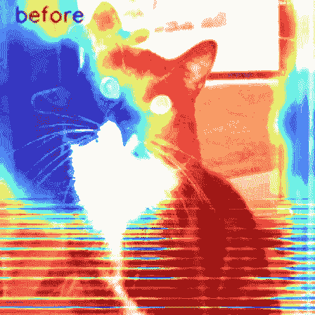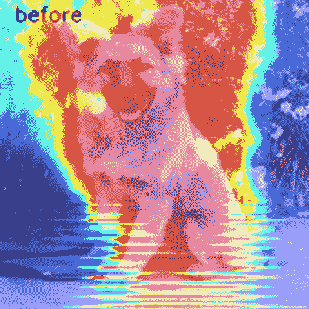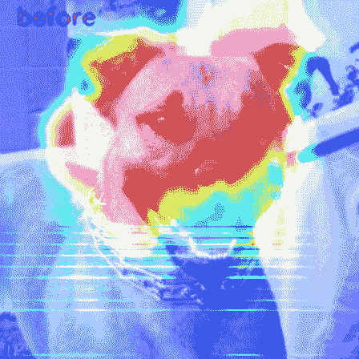

作者图片

考虑一下这个场景。你正在使用最新的 CNN 网络架构 EfficientNetV2 来训练一个图像分类器。您已经取得了令人印象深刻的训练准确性(> 95%)，但模型学习评估样本的效果远不如训练样本。

作为机器学习工程师，我们明白我们的模型只有在看不见的数据上表现良好时才是好的。这就引出了一个问题:

*我们如何提高网络在不可见数据上的性能？*

当我们的模型过度拟合时，两个最常见的修正是:

1.  在更多样本上训练我们的模型
2.  改变我们模型的复杂性

由于获取数据是昂贵的(时间+成本),在这篇博客中，我们将专注于通过增强管道和改变模型复杂性来转换数据。在专注于建筑安全和安保的建筑科技初创公司 [Forsight](https://forsight.ai/) ，我们的机器学习团队使用这些策略来产生更好的通用模型。

*你可以在 CNN 解读* [*这里*](https://medium.com/@daniel.reiff2/understand-your-algorithm-with-grad-cam-d3b62fce353) *和 PPE 检测* [*这里*](https://medium.com/swlh/construction-feat-tf2-object-detection-api-4465a3937c87) *中了解我们的工作。*

在本文中，我们将使用一个猫和狗的数据集，向您展示如何微调您的模型，并提高看不见的数据的性能。您可以很容易地扩展这个示例，并使用它来改进您自己的模型！让我们跳进来。

# 数据集和模型

我们将使用来自 [kaggle](https://www.kaggle.com/c/dogs-vs-cats/data) 的高质量数据集，用一个经典的图像分类问题,保持简单。让我们拍摄 20，000 张图片，并在其中的 16，000 张图片上进行训练。剩余的 4，000 幅图像将用于评估。

我们将从基线 EfficientNetV2B0 模型体系结构开始。基础模型将位于输入/标准化层和二进制分类头之间。二进制分类头将包括一个全局平均池层、一个 35%下降的下降层和一个密集预测层。该模型将使用 Adam 优化器训练 100 个时期。为了更快地收敛，我们将使用 1 周期学习率计划，最大值为 0.001。1 周期学习率由两个阶段组成，以实现超收敛。在第一阶段，我们使用余弦退火将学习速率逐渐提高到最大。在第二阶段，我们使用余弦退火将学习率再次降低到 0。你可以在这里阅读更多相关信息[。](https://www.avanwyk.com/tensorflow-2-super-convergence-with-the-1cycle-policy/)

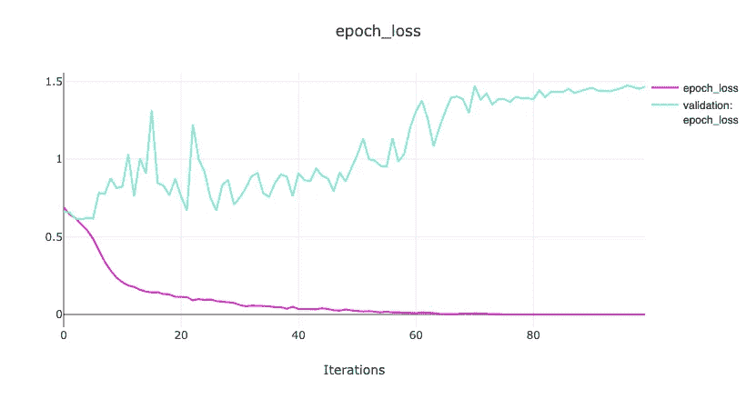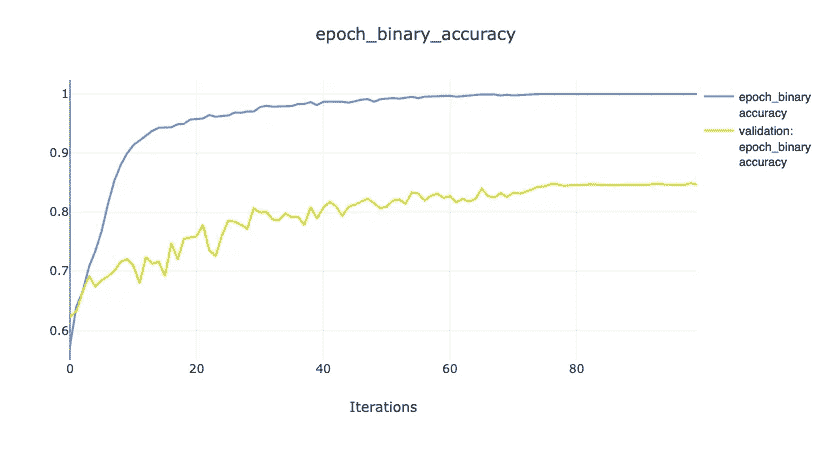

结果(图片由作者提供)

在 100 个时期之后，该模型已经非常好地学习了训练数据，准确率接近 100%。但是验证损失正在增加，这表明我们过度适应训练数据，验证准确率停留在 85%左右，这还不够好！让我们开始微调模型，以提高图像增强管道在验证样本上的性能。

# 图像增强

数据扩充是一系列保留输出标签的输入转换。这是增加数据集大小和多样性的常用技术。对于影像数据集，常见的变换包括像素级操作，如更改颜色、亮度和添加噪声。像旋转和翻转这样的图像级变换也很常见。让我们在模型训练之前将图像增强管道插入到更大的数据管道中。在一些简单的二元分类问题中，降低模型复杂度也有助于防止过拟合。但在这个例子中，我们将使用图像增强管道来增加训练集的多样性，并有望减少过度拟合。

对于管道，我们将使用[albuminations](https://albumentations.ai/)，这是一个快速灵活的库，广泛用于工业、研究、竞赛和项目。我们将实现像素级的变换:模糊、随机亮度对比、rgb 偏移和噪声。之后，我们将实现图像水平转换:水平翻转和随机旋转 90 度。最后，我们将添加图像压缩。您可以探索不同的增强，序列转换成管道，并用您自己的图像测试一切[这里](https://albumentations-demo.herokuapp.com/)！下面是我们的完整管道，带有示例输入&输出图像:

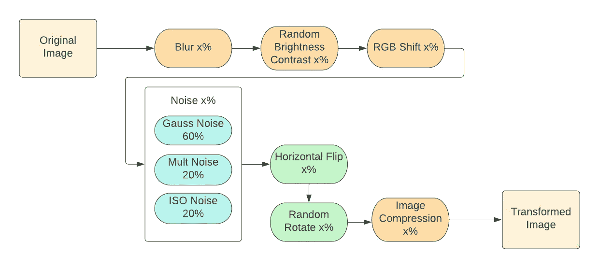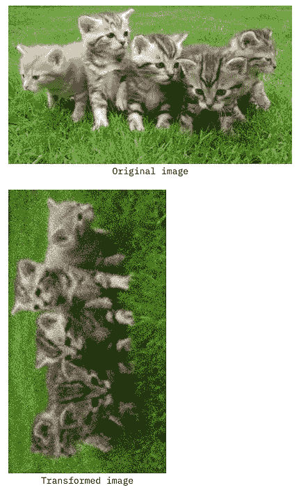

增强管道(图片由作者提供)

让我们通过研究每个增强应用于每个训练样本的概率来试验管道。现在，我们将保持简单，并应用相同的概率，x，到每一个增加。但在未来，这种可能性可以微调。我们将把这个概率从 0%逐渐增加到 33%。我们将使用上面详述的相同 b0 模型，所有其他参数将保持不变。

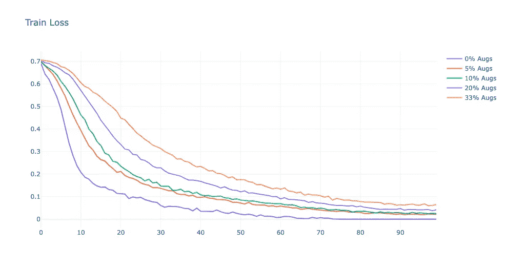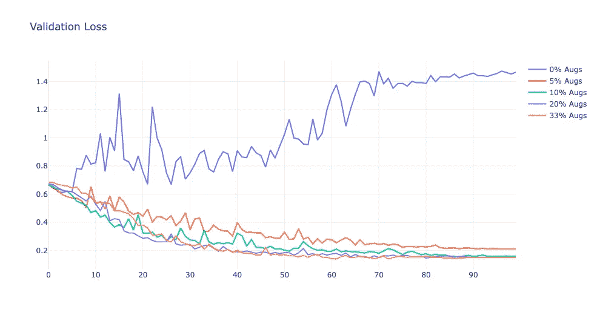

增强管道实验结果(图片由作者提供)

增强管道提高了模型在不可见数据上的性能，每次应用增强的可能性只有 5%!当我们训练模型时，验证损失不再增加，表明模型不再过度拟合。将概率提高到 10%+会随着收益递减而进一步减少验证损失。另一方面，当我们增加增量%时，训练性能受到影响。这是因为当训练样本不断变化时，模型更难在训练样本中学习模式。但是模型对评价集的把握更好，这正是我们想要的！模型权重现在明显较少受训练集中的细节和噪声的影响。接下来，让我们将增强概率参数设置为 33%。既然模型没有过度拟合，我们就可以通过试验模型的复杂性来进一步提高看不见的数据的性能。

# 模型复杂性

2021 年，谭明星和郭怡广推出了更小、更高效的 EfficientNet 版本 EfficientNetV2。在研究了 EfficientNet 中的瓶颈之后，他们设计了一个新的参数搜索空间，这产生了一个改进的模型架构。你可以阅读更多关于模型架构和参数搜索过程的信息[点击](https://arxiv.org/pdf/2104.00298.pdf) ✎编辑。他们还引入了一种新的非均匀缩放策略，其中层逐渐添加到后期阶段，并通过深度参数(层)和宽度参数(通道)按比例放大，以创建更复杂的模型。作者使用他们改进的参数搜索空间创建了一个基线模型 EfficientNetV2B0，然后使用他们的缩放策略创建了更复杂的模型。我们将对更复杂的模型进行实验，但也会通过缩小深度参数来降低基线模型的复杂性。以下是我们将尝试的所有模型的概述:

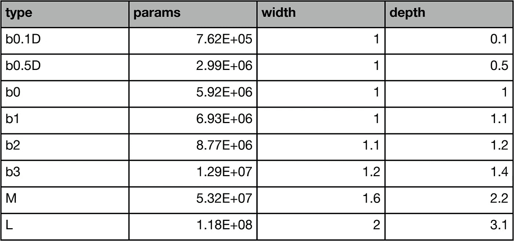

作者图片

我们感兴趣的是模型复杂性和模型在看不见的数据上的表现之间的关系。这使我们提出以下问题:

*基线模型对于手头的分类任务来说是否过于复杂？这会导致模型学习训练集中的噪声吗？*

*基线模型不够复杂吗？区分猫和狗需要更多的复杂性吗？*

我们将尝试通过上表中详细列出的各种复杂性的训练模型来回答这些问题。我们将使用一个增强管道，每个转换有 33%的机会被应用。所有其他模型和数据集参数将保持不变。

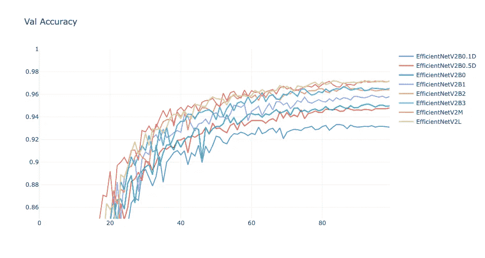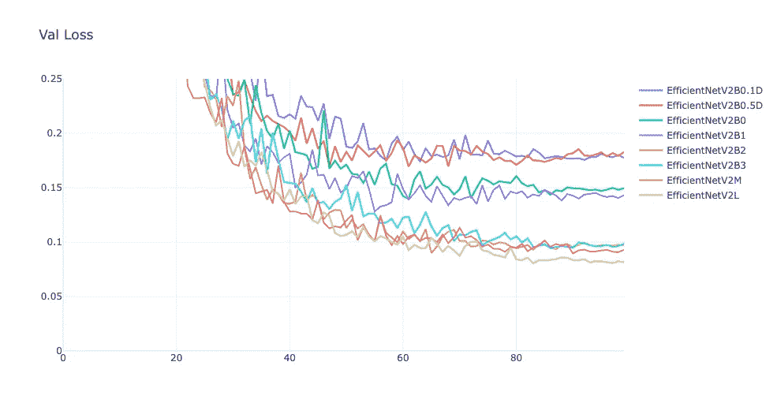

作者图片

增加模型的复杂性会提高对不可见数据的处理能力！当将模型复杂性从 b0 基线模型中的 5.92E+6 个参数增加到 L 模型中的 1.18E+8 个参数时，我们能够将验证损失减少 45%。从直觉上讲，区分猫和狗将受益于更复杂的模型。不同品种的猫和狗的外貌差异很大。有些品种的狗看起来很像猫，反之亦然。此外，该模型不能使用颜色和大小等基本特征来区分。需要考虑更复杂的特征，如面部结构和爪子。让我们用 Grad-CAM 来分析模型看不到的样本。红色区域是导致模型将图像分类为猫或狗的区别特征。你可以在这里阅读更多关于 Grad-CAM [解释算法的内容。](https://medium.com/@daniel.reiff2/understand-your-algorithm-with-grad-cam-d3b62fce353)

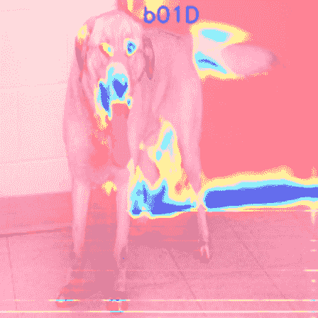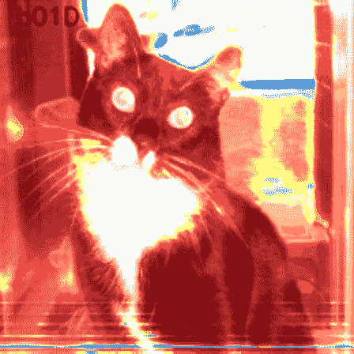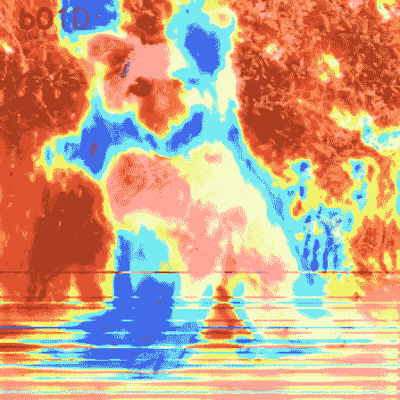

作者图片

在这两个狗样本中，随着我们增加模型的复杂性，红色区域更加精确地符合狗的身体。在低复杂度下，红色区域包括部分背景，表明这些模型没有真正学会狗的区别特征。特别令人吃惊的是，对于右边的狗来说，随着我们逐渐增加复杂度，红色区域从背景中转移出来，并以狗的脸和鼻子为目标。

对于 cat 示例，关注点无处不在，尤其是在不太复杂的模型中。B0–3 模型强调图像的所有部分，除了猫的脸。但是，当我们继续添加更多的复杂性，红色区域在猫的脸上归零。最复杂的模型，L，强调猫的胡须，我们知道这是一个显著的特征！

# 结论

在这篇博客中，我们希望提供一些有用的见解和工具，来提高你的模型在看不见的数据上的性能。在猫和狗的帮助下，我们探索了一种图像增强管道来减少过度拟合。此外，我们还试验了不同的模型复杂性。在这个例子中，我们见证了更多的复杂性如何帮助我们的模型聚焦于更复杂的特性。**最重要的是，我们使用这些工具将未知数据的模型准确率从大约 85%提高到大约 97%！**即使有最好的模型和增强管道，我们的模型仍然会出现一些样本错误。正如你在下面看到的，一些狗的样本看起来像猫(左图)，反之亦然(右图)。

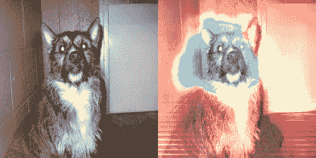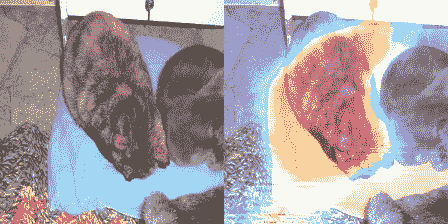

狗(左)和猫(右)(图片由作者提供)

在机器学习中，我们只能通过在我们的架构和管道中试验参数来提高模型性能。我们希望这篇文章能为您提供关于如何充分利用数据的宝贵见解！

*如果你对这个话题感兴趣，并且你愿意研究类似的问题，请联系我们***。**

# *参考*

1.  *谭明星，郭诉乐，2021，“高效网络 2:更小的模型和更快的训练”，*
2.  *Jason Browlnee，“使用机器学习算法的过度拟合和欠拟合”，[https://machineellingmastery . com/over fit-and-under fitting-With-Machine-Learning-Algorithms/](https://machinelearningmastery.com/overfitting-and-underfitting-with-machine-learning-algorithms/)*
3.  *卡格尔猫狗数据集，[https://www.microsoft.com/en-us/download/details.aspx?id=54765](https://www.microsoft.com/en-us/download/details.aspx?id=54765) 。许可:社区数据许可协议-许可-版本 2.0。本协议对结果的使用、修改或共享不施加任何限制或义务*
4.  *“Tensorflow 2 中具有 1 周期策略的超级收敛，[https://www . avan wyk . com/tensor flow-2-Super-convergence-with-1 cycle-Policy/](https://www.avanwyk.com/tensorflow-2-super-convergence-with-the-1cycle-policy/)*
5.  *Jason Brownlee，“如何避免深度学习神经网络中的过拟合”，[https://machineellingmastery . com/introduction-to-regulatory-to-reduce-over fitting-and-improve-generalization-error/](https://machinelearningmastery.com/introduction-to-regularization-to-reduce-overfitting-and-improve-generalization-error/)*