# 用 Python 从图像生成三维网格

> 原文：<https://towardsdatascience.com/generate-a-3d-mesh-from-an-image-with-python-12210c73e5cc>

## 将深度学习与 3D 数据处理相结合以生成网格

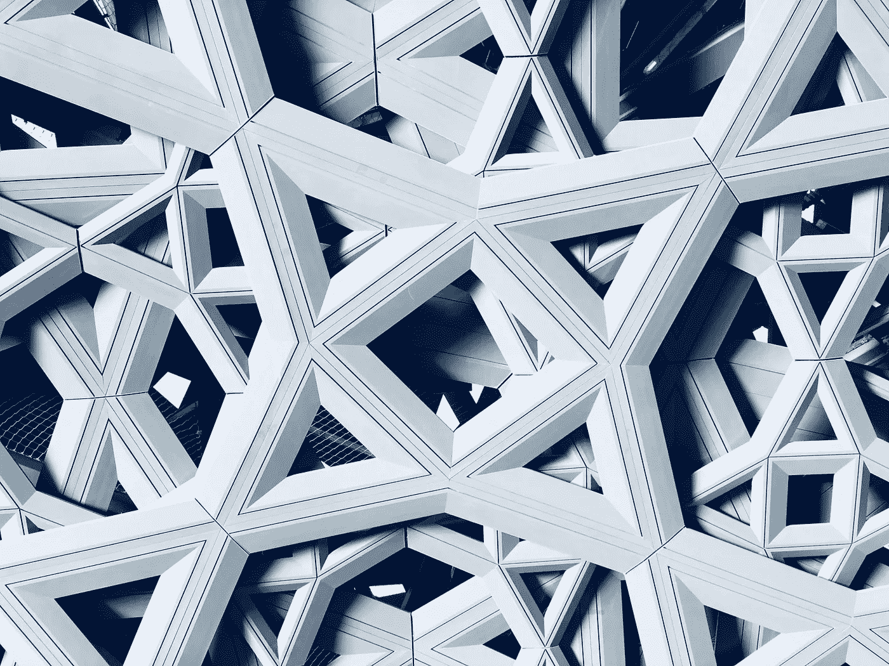

阿尔瓦罗·皮诺在 [Unsplash](https://unsplash.com/s/photos/abstract-triangles?utm_source=unsplash&utm_medium=referral&utm_content=creditCopyText) 拍摄的照片

几年前，从一张 2D 图片生成一个 3D 网格似乎是一项非常困难的任务。如今，由于深度学习的进步，已经开发了多个单目深度估计模型，它们可以从任何图像提供精确的深度图。通过这个贴图，可以通过执行表面重建来生成网格。

# 介绍

单目深度估计是在给定单个 RGB 图像的情况下，估计每个像素的深度值(相对于相机的距离)的任务。单目深度估计模型的输出是一个**深度图**，它基本上是一个矩阵，其中每个元素对应于输入图像中相关像素的预测深度。

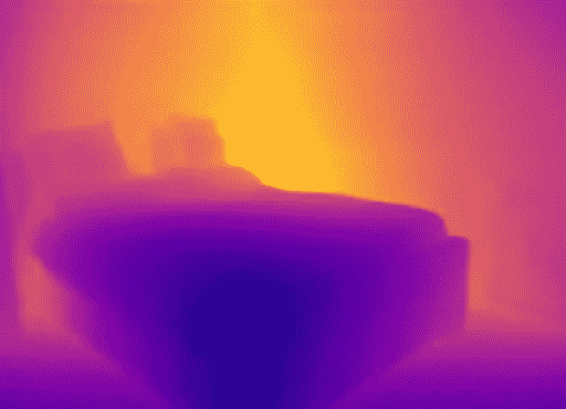

深度图。图片由作者提供。

深度图中的点可以被视为具有 3 轴坐标的点的集合。由于映射是一个矩阵，每个元素都有 *x* 和 *y* 组件(它的列和行)。而 *z* 分量是其存储值，是点 *(x，y)* 的预测深度。在 3D 数据处理领域，一列 *(x，y，z)* 点被称为**点云**。

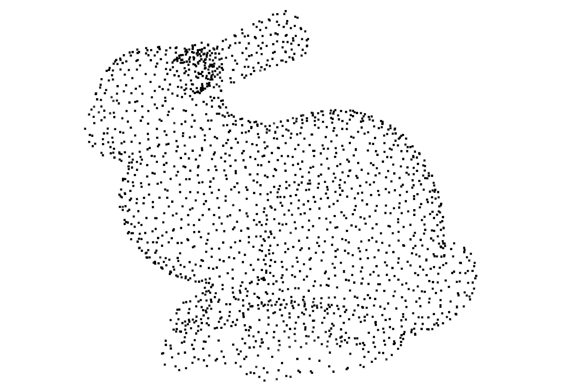

一个点云。原始文件由 [Open3D](https://github.com/isl-org/Open3D) 制作。

从非结构化的点云开始，可以获得一个**网格**。网格是由顶点和多边形集合组成的 3D 对象表示**。**最常见的网格类型是**三角形网格**，它由一组通过公共边或顶点连接的三维三角形组成。在文献中，有几种方法可以从点云中获得三角形网格，最流行的是 Alpha shape、Ball pivoting 和 Poisson 曲面重建。这些方法被称为**表面重建算法**。

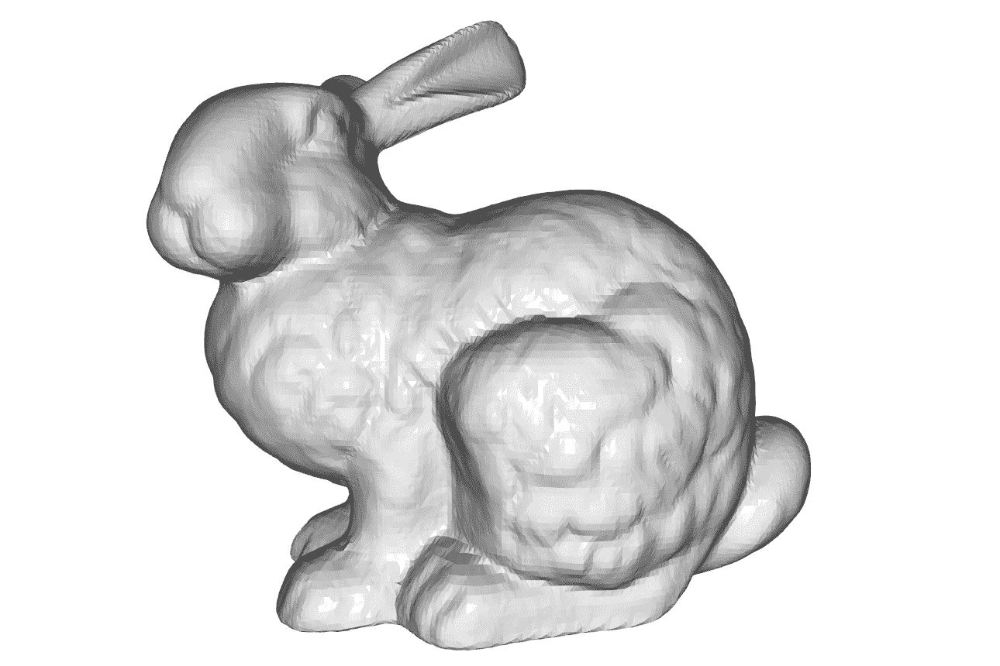

三角形网格。原始文件由 [Open3D](https://github.com/isl-org/Open3D) 生成。

本指南中使用的从图像生成网格的过程由三个阶段组成:

1.  **深度估计** —使用单目深度估计模型生成输入图像的深度图。
2.  **点云构建** —深度图转换成点云。
3.  **网格生成**—从点云中，使用表面重建算法生成一个网格。

要遵循指南中说明的不同步骤，您需要一个图像。如果你手边没有，你可以下载这个:

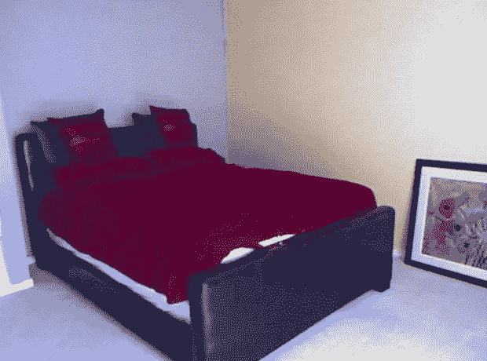

一间卧室。图片来自 [NYU 深度 V2](https://cs.nyu.edu/~silberman/datasets/nyu_depth_v2.html) 。

# 1.深度估计

本指南选择的单目深度估计模型是 GLPN⁴.在[抱脸模型轮毂](https://huggingface.co/models)上有。可以通过使用拥抱脸库[变形金刚](https://huggingface.co/docs/transformers/index)从这个中枢检索模型。

要安装 PyPI 最新版本的变压器，请使用:

```
pip install transformers
```

上面的代码用于估计输入图像的深度:

为了使用 GLPN，Transformers 库提供了两个类:`GLPNFeatureExtractor`，用于预处理每个输入和`GLPNForDepthEstimation`，即模型类。

由于其架构，模型输出大小为:

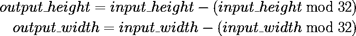

输出大小。使用 [CodeCogs](https://www.codecogs.com/latex/eqneditor.php) 生成的图像。

因此，`image`的大小被调整为 32 的高度和宽度的倍数。否则，模型的输出将小于输入。这是必需的，因为点云将使用图像像素绘制，为此，输入图像和输出深度图必须具有相同的大小。

由于单目深度估计模型难以在边界附近获得高质量的预测，`output`被中心裁剪(第 33 行)。为了保持输入和输出之间的相同尺寸，还将`image`居中裁剪(第 34 行)。

以下是一些预测:

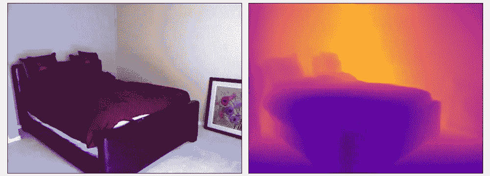

卧室的深度预测。来自 [NYU 深度 V2](https://cs.nyu.edu/~silberman/datasets/nyu_depth_v2.html) 的输入图像。

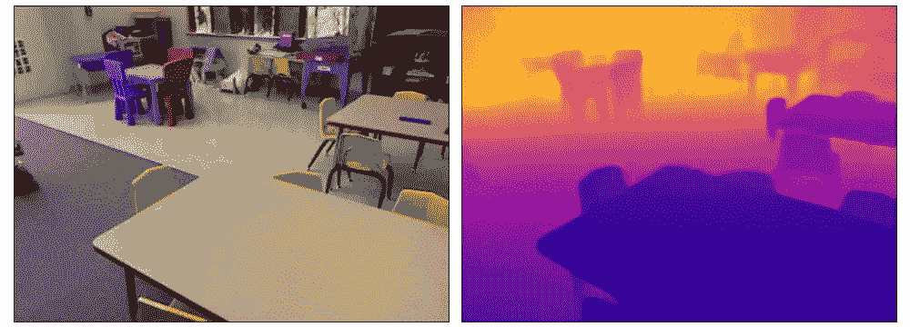

游戏室的深度预测。来自 [NYU 深度 V2](https://cs.nyu.edu/~silberman/datasets/nyu_depth_v2.html) 的输入图像。

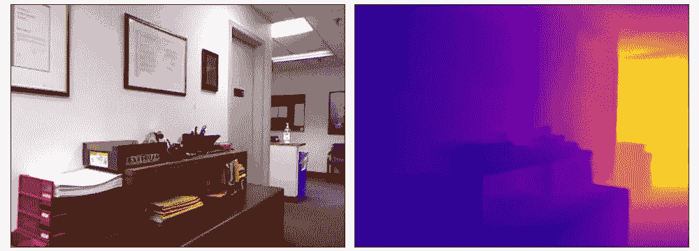

办公室的深度预测。来自 [NYU 深度 V2](https://cs.nyu.edu/~silberman/datasets/nyu_depth_v2.html) 的输入图像。

# 2.点云构建

对于本指南的 3D 处理部分，将使用 Open3D⁵。对于这种任务，它可能是最好的 Python 库。

要从 PyPI 安装最新版本的 Open3D，请使用:

```
pip install open3d
```

以下代码将估计的深度贴图转换为 Open3D 点云对象:

一个 **RGBD 图像**仅仅是一个 RGB 图像和它对应的深度图像的组合。PinholeCameraIntrinsic 类存储所谓的内在相机矩阵。通过这个矩阵，Open3D 可以从 RGBD 图像创建一个点云，点之间的间距正确。保持固有参数不变。有关更多详细信息，请参见指南末尾的附加资源。

要可视化点云，请使用:

```
o3d.visualization.draw_geometries([pcd])
```

# 3.网格生成

在文献中可用于此任务的各种方法中，该指南使用泊松表面重建算法。选择这种方法是因为它通常能提供更好、更平滑的结果。

此代码使用泊松算法从上一步中获得的点云生成网格:

首先，代码从点云中删除离群值。由于各种原因，点云可能包含噪声和伪像。在这种情况下，模型可能预测了一些深度，如果与其邻居相比，这些深度变化太大。

下一步是正常的估计。法线是垂直于表面或对象的向量(因此具有大小和方向),为了处理泊松算法，必须对其进行估计。有关这些向量的更多详细信息，请参见本指南末尾的附加资源。

最后，执行算法。`depth`值定义了网格的详细程度。除了增加网格质量之外，更高的深度值也会增加输出尺寸。

如果你更喜欢使用程序来可视化网格，我建议下载 [MeshLab](https://www.meshlab.net/) ，因为有一些 3D 可视化程序不能渲染颜色。

这是最后的结果:

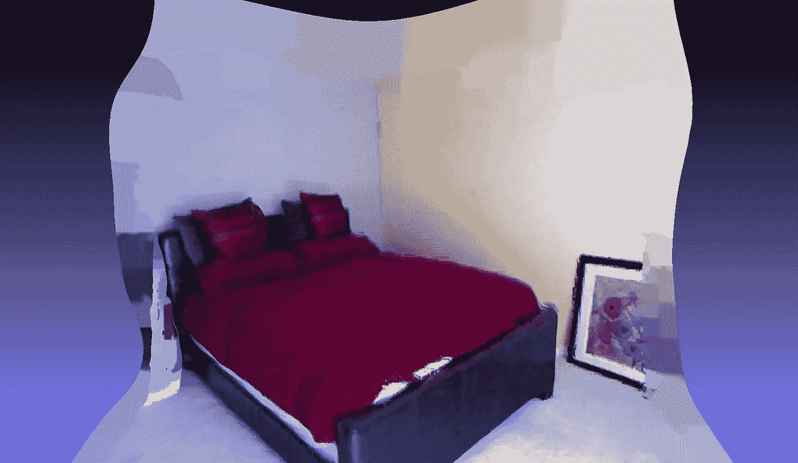

生成的网格。图片由作者提供。

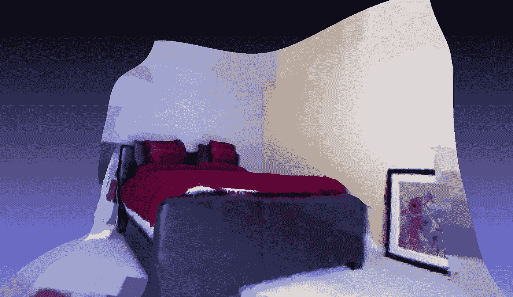

生成的网格(从另一个角度)。图片由作者提供。

由于最终结果根据`depth`值而变化，这是不同结果之间的比较:

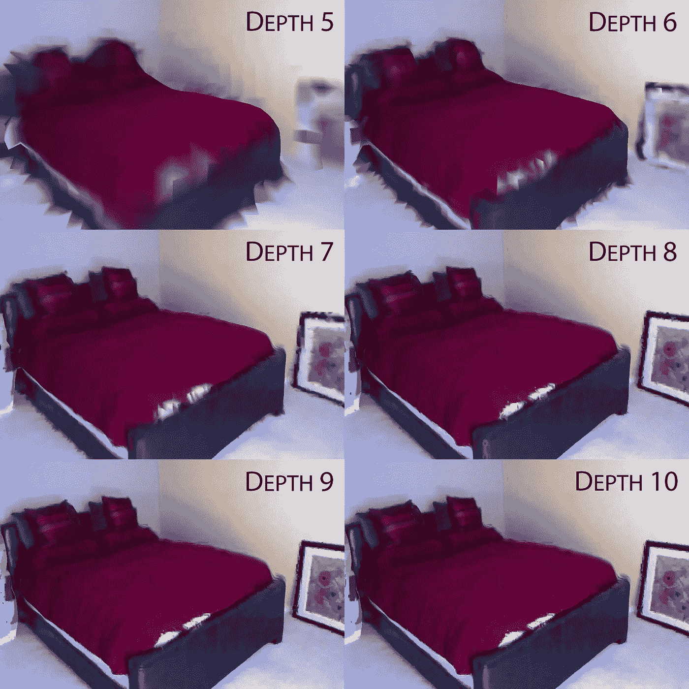

不同深度值之间的比较。图片由作者提供。

使用`depth=5`的算法得到 375 KB 网格，`depth=6`到 1.2 MB，`depth=7`到 5 MB，`depth=8`到 19 MB，`depth=9`到 70MB，而使用`depth=10`到 86 MB。

# 结论

尽管只使用了一张图片，效果还是很不错的。借助一些 3D 编辑，你可以达到更好的效果。由于本指南不能完全涵盖 3D 数据处理的所有细节，我建议您阅读下面的其他资源，以更好地理解所涉及的所有方面。

## **附加资源**

*   [针孔摄像机型号](https://en.wikipedia.org/wiki/Pinhole_camera_model)
*   [内在和外在矩阵](https://en.wikipedia.org/wiki/Camera_resectioning)
*   [法线](https://en.wikipedia.org/wiki/Normal_(geometry))
*   [Open3D 官方文档](http://www.open3d.org/docs/release/)

这个项目的演示可在[这里](https://huggingface.co/spaces/mattiagatti/image2mesh)获得。

感谢阅读，我希望你发现这是有用的。

# 参考

[1] H. Edelsbrunner 和 E. P. Mücke，[三维阿尔法形状](https://arxiv.org/abs/math/9410208) (1994 年)

[2] F. Bernardini，J. Mittleman，H. Rushmeier，C. Silva 和 G. Taubin，[用于表面重建的球旋转算法](http://The ball-pivoting algorithm for surface reconstruction) (1999)

[3] M. Kazhdan，M. Bolitho 和 H. Hoppe，[泊松表面重建](https://www.cs.jhu.edu/~misha/MyPapers/SGP06.pdf) (2006)

[4] D. Kim，W. Ga，P. Ahn，D. Joo，S. Chun 和 J. Kim，[利用垂直切割深度进行单目深度估计的全局-局部路径网络](https://arxiv.org/abs/2201.07436) (2022)

[5] Q. Zhou，J. Park 和 V. Koltun， [Open3D:用于 3D 数据处理的现代图书馆](https://arxiv.org/abs/1801.09847) (2018)

[6] N. Silberman，D. Hoiem，P. Kohli 和 Rob Fergus，[室内分割和支持从 RGBD 图像推断](https://cs.nyu.edu/~silberman/papers/indoor_seg_support.pdf) (2012)