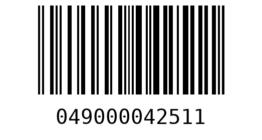

# 使用 Python 生成条形码

> 原文：<https://towardsdatascience.com/generate-barcode-using-python-2da187f46954>

## 根据您的各种需求创建条形码的过程指南


[迈克·沃尔特](https://unsplash.com/@ml1989?utm_source=unsplash&utm_medium=referral&utm_content=creditCopyText)在 [Unsplash](https://unsplash.com/s/photos/barcode?utm_source=unsplash&utm_medium=referral&utm_content=creditCopyText) 上拍照

**目录**

*   介绍
*   支持的格式
*   使用 Python 创建条形码
*   结论

# 介绍

在本教程中，您将了解不同类型的条形码、它们存储的数据以及如何使用 Python 生成它们。

在当今的零售和电子商务领域，条形码已成为 POS 和仓储系统的必备条件。了解如何使用、生成和解码它们，将有助于数据科学家和数据工程师优化销售和物流流程。

条形码是以机器可读格式表示数据的方式之一。

条形码的概念最初是在 1951 年基于莫尔斯电码开发的。我们现在随处可见的竖线条形码格式是在 1973 年开发的。

条形码的成功故事始于多年后，当时它们开始被用于商店的结账系统，以帮助收银员自动获取每件产品的信息，而不是一件一件地查找。

条形码是二维码的前身，两者的主要区别在于其格式和存储的数据量。

条形码显示为带有几条垂直线的矩形，而二维码显示为内部形状各异的正方形。这种复杂程度使得二维码可以存储比条形码多得多的数据。

现在我们知道了什么是条形码以及如何使用它们，让我们深入条形码格式的细节，并使用 Python 实际创建我们的第一个条形码。

为了继续学习本教程，我们需要以下 Python 库: *python-barcode* 。

如果您没有安装它，请打开“命令提示符”(在 Windows 上)并使用以下代码安装它:

```
pip install python-barcode
```

# 支持的格式

python-barcode 库支持多种条形码格式:

*   **代码 39** 它包括大写字母、数字和一些特殊字符。它可以是可变长度的，最大为条形码的大小。
*   **代码 128** 它包括大写字母、小写字母、数字和一些特殊字符。它可以是可变长度的，最大为条形码的大小。
*   **PZN7** 是代码 39 的变体，编码 6 位数字+ 1 位校验位。这种类型的条形码主要用于德国的药品。
*   **EAN-13** 它包括 12 位数字+ 1 位校验位，用于编码主要在北美以外使用的 GTIN-13(全球贸易项目编号)。
*   **EAN-8** 
*   **JAN** JAN(日本商品编号)是 EAN-13 的变体，其中前两位数字必须是 45 或 49(日本)。
*   ISBN-13
    ISBN-13(国际标准书号)与 EAN-13 相似，只是有一个特殊的前缀。
*   ISBN-10(国际标准书号)是 ISBN-13 的一个子类型，一直使用到 2005 年 12 月 31 日。
*   **ISSN** ISSN(国际标准序列号)使用一个 8 位数代码来唯一标识出版物、杂志等。
*   **UPC-A** UPC-A 是 UPC(通用产品代码)的标准版本，由 12 位数字组成。
*   **EAN-14** 
*   GS1–128
    它是代码 128 的变体，用于商业和工业中的货物。这种类型的条形码可以包括多个数据字段。

该库还支持更多的格式。要使用 Python 检查受支持格式的完整列表，可以运行以下代码:

您应该得到:

```
['codabar', 'code128', 'code39', 'ean', 'ean13', 'ean13-guard', 'ean14', 'ean8', 'ean8-guard', 'gs1', 'gs1_128', 'gtin', 'isbn', 'isbn10', 'isbn13', 'issn', 'itf', 'jan', 'nw-7', 'pzn', 'upc', 'upca']
```

# 使用 Python 创建条形码

在本节中，我们将使用 Python 创建一个条形码。

作为一个例子，我们使用与可口可乐罐(12 盎司)相关的一个 [UPC-A](https://www.upcitemdb.com/upc/49000042511) 。): 049000042511.

你可以在商店出售的一些可口可乐罐上看到这个条形码。

首先，让我们导入所需的依赖项:

接下来，我们将定义条形码内容，在我们的例子中是 UPC 号，它必须是字符串格式:

由于我们将创建一个 UPC 条形码，因此需要引用适当的条形码格式:

现在，我们可以创建条形码并将其呈现为 PNG 文件:

您应该会看到 *generated_barcode.png* 出现在与您的 **main.py** 文件相同的目录中，该文件应该是这个条形码图像:



作者图片

使用 Python 创建条形码的完整代码:

# 结论

在本文中，我们探讨了如何使用 Python 生成条形码。

任何零售组织当前传输的数据量都是数百万行，包含他们库存中每件商品的信息。了解如何生成条形码和 QR 码是实施自动化系统和改善许多零售和电子商务企业物流流程的一个重要优势。

如果你有任何问题或对一些编辑有建议，请随时在下面留下评论，并查看我的更多 [Python 编程](https://pyshark.com/category/python-programming/)教程。

*原载于 2022 年 6 月 6 日*[*【https://pyshark.com】*](https://pyshark.com/generate-barcode-using-python/)*。*