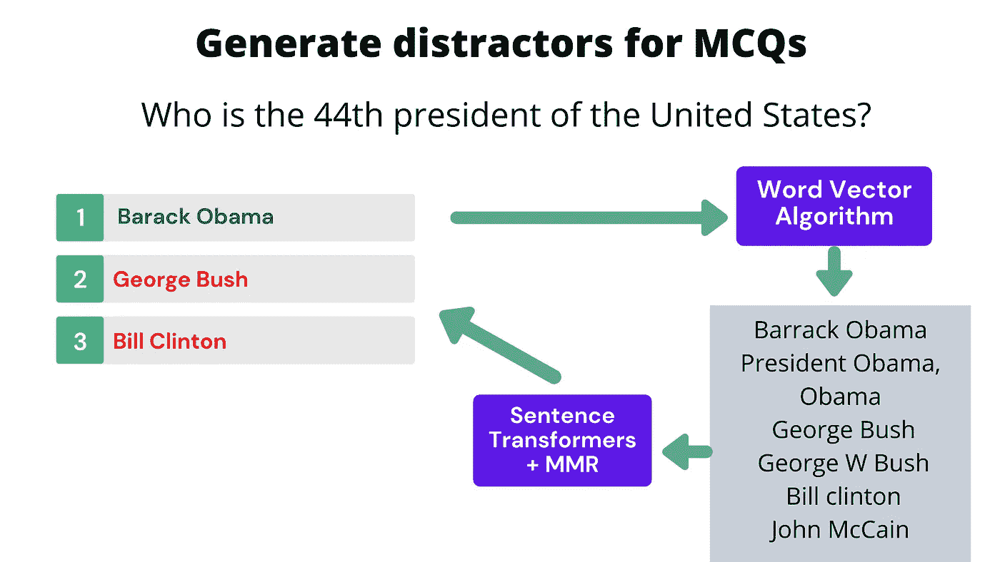

# 使用单词向量、句子转换器和 MMR 算法为 mcq 生成干扰项

> 原文：<https://towardsdatascience.com/generate-distractors-for-mcqs-using-word-vectors-sentence-transformers-and-mmr-algorithm-e3e5b3a90076>

## 使用 NLP 为 Edtech 中的 mcq 生成错误答案

图片来自 [Pixabay](https://pixabay.com/illustrations/quiz-exam-questionnaire-2137664/)

如果你是在 NLP 和 Edtech 的十字路口工作，你迟早会遇到给定问题和答案产生干扰子(错误答案选择)的问题，自动使用 NLP。

# 什么是干扰物？

干扰物是选择题的**错误答案**。

例如，如果一个给定的选择题的正确答案是**巴拉克奥巴马**，那么我们需要产生错误的选择(干扰物)，比如**乔治布什、比尔克林顿、唐纳德川普、**等等。

作者图片

给出一个正确的答案，你如何找到干扰物？

基于知识图寻找干扰物的方法有几种，还有像 [word2vec](https://en.wikipedia.org/wiki/Word2vec) 、fastText 等无监督算法。其中一些可以在我之前的博文[中找到。](/3-ways-to-generate-distractors-wrong-choices-for-mcqs-using-natural-language-processing-d52477a56812)

让我们把重点放在 [Sense2vec](https://github.com/explosion/sense2vec) 上，它与 word2vec 在同一行，在 word 2 vec 中，您使用给定的单词或短语进行查询，并在向量空间中获得相似的单词/短语。

假设我们有一个**问题**和一个**正确答案**。

谁是美国第 44 任总统？巴拉克·奥巴马

现在的目标是为单词“巴拉克·奥巴马”找到错误的答案选项(干扰物)。那可能是其他总统或总统候选人。

但是有一个问题！如果您使用“巴拉克·奥巴马”查询 sense2vec，您将会遇到许多近似重复和拼写错误的单词，如巴拉克·奥巴马、奥巴马总统、奥巴马等，您需要过滤这些单词。你也会遇到其他的复制品，比如乔治·布什，乔治·W·布什等等，你只需要保留一个作为干扰物。

sense2vec 算法中与“巴拉克·奥巴马”相似的词:

巴拉克·奥巴马
奥巴马总统
奥巴马
乔治·布什
小布什
比尔·克林顿
约翰·麦凯恩

我们如何处理这个过滤近似重复的问题？我们可以有效地使用句子转换器嵌入和最大边际相关性来实现这一点。我们马上就会看到代码是如何实现的！

# 该算法

本教程完整代码的 colab 笔记本可以在这里找到[。](https://colab.research.google.com/drive/1O_edRdaX-F9kVJrPM-TYM-j8yWtX8yQE?usp=sharing)

让我们从安装 sense2vec 库并下载和初始化 sense2vec 模型开始。

让我们用搜索词“巴拉克·奥巴马”来看看 sense2vec 会输出什么

**输出:**

['巴拉克·奥巴马'，'乔治·W·布什'，'罗纳德·里根'，'乔治·布什'，'约翰·麦凯恩'，'吉米·卡特'，'奥巴马总统'，'比尔·克林顿'，'奥巴马'，'希拉里·克林顿'，'总统'，'莎拉·佩林'，'总统'，'南希·佩洛西']

现在，为了有效地过滤近似重复，让我们使用[句子转换器](https://www.sbert.net/)将原始答案单词以及来自 sense2vec 中相似单词结果的每个单词转换为向量。

现在我们已经为每个单词/短语嵌入了一个向量，我们的目标是在嵌入空间中挑选前 N 个不同的(彼此远离的)单词。

我们选择题案例中的 n 可能是**四个**。因此，我们反复地想要为我们的搜索关键词(“巴拉克·奥巴马”)挑选三个最多样化的单词/短语。但是我们如何实现这一点呢？

我们有最大边际关联(MMR)来拯救我们！KeyBert 库中有 [Maarten Grootendorst](https://medium.com/u/22405c3b2875?source=post_page-----e3e5b3a90076--------------------------------) 很棒的 [MMR 算法实现！](https://maartengr.github.io/KeyBERT/api/mmr.html)

引用上面的 MMR 算法实现页面-

MMR 考虑关键字/关键短语与文档的相似性，以及已经选择的关键字和关键短语的相似性。这导致选择相对于文档最大化其多样性的关键词。

这里的文档可以用我们原来的查询关键字(巴拉克·奥巴马)来代替。我们将稍微修改 MMR 算法，以便选择的第一个单词是我们的原始关键字(巴拉克·奥巴马), MMR 算法顺序选择的其余单词应该与原始关键字不同，并且与现有列表中的单词不同。这确保了我们通过根据多样性标准不选择它们来消除近似重复。此外，该算法具有控制多样性的参数。

你可以看到输出是-

巴拉克·奥巴马
———
约翰·麦凯恩
乔治·W·布什
莎拉·佩林
比尔·克林顿

您可以清楚地看到，类似“巴拉克·奥巴马”、“乔治·w·布什”、“乔治·布什”、“奥巴马总统”、“奥巴马”等的近似重复项被过滤掉，不会出现在最终输出中。

# 结论

词向量算法可以被用作一种手段来为给定正确答案的多项选择问题生成干扰项(错误选择)。

但是由于单词向量算法中涉及的训练的非监督性质，许多相似的单词和近似重复的单词被返回。

由于这些单词有时语义相似，所以在短语中使用单词编辑距离或单词匹配效果不好。因此，我们使用基于转换器的算法 [SBERT](https://www.sbert.net/) ，将任何短语或单词转换成向量，并过滤那里的邻居。这些算法被训练来将拼写错误的单词以及语义相似的单词放置在嵌入空间的附近。

从给定的一组可能的干扰物中，我们可以使用最大边际关联(MMR)算法有效地选择前四个不同的关键字/短语作为 MCQ 的干扰物。

祝 NLP 探索愉快，如果你喜欢它的内容，请随时在[推特上找到我。](https://twitter.com/ramsri_goutham)

如果你想学习使用变形金刚的现代自然语言处理，看看我的课程[使用自然语言处理的问题生成](https://www.udemy.com/course/question-generation-using-natural-language-processing/?referralCode=C8EA86A28F5398CBF763)