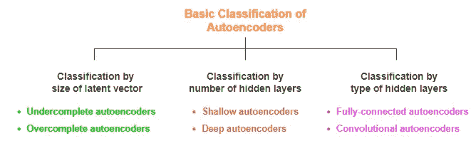
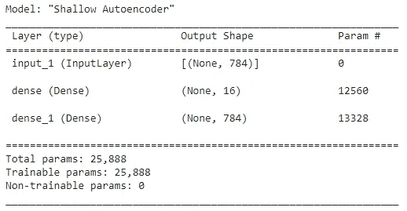
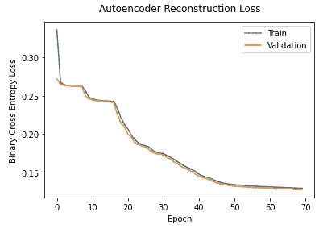
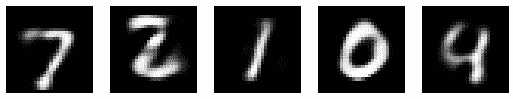
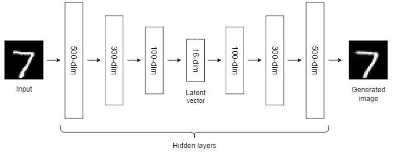
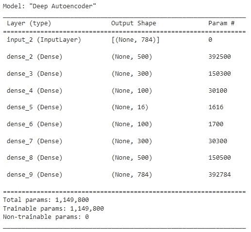
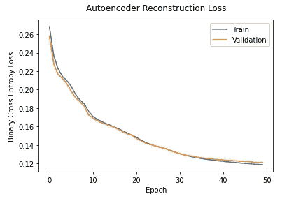
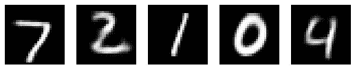
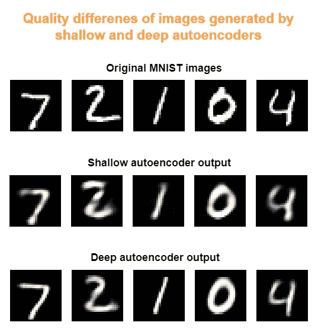
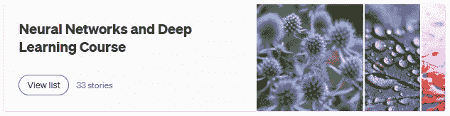

# 使用 Keras 中的浅层和深层自动编码器生成 MNIST 数字

> 原文：<https://towardsdatascience.com/generate-mnist-digits-using-shallow-and-deep-autoencoders-in-keras-fb011dd3fec3>

## 使用函数式 API —神经网络和深度学习课程:第 29 部分

原照片由 [refargotohp](https://unsplash.com/@refargotohp?utm_source=unsplash&utm_medium=referral&utm_content=creditCopyText) 在 [Unsplash](https://unsplash.com/?utm_source=unsplash&utm_medium=referral&utm_content=creditCopyText) 上拍摄，由作者编辑

如果我们忽略了算法的实际应用，那么算法是没有用的。

我们已经讨论了自动编码器背后的原理。是时候讨论它们的实际应用了。在此之前，您应该知道自动编码器是如何在 Keras 中实现的。

因此，在本文中，我将通过在 MNIST 数据上构建两个自动编码器模型来讨论自动编码器的 Keras 实现(参见最后的数据集[引文](#a6cd))。还将定义一些与自动编码器模型架构相关的重要关键字。

## 先决条件

我推荐你阅读下面的文章作为这篇文章的先决条件。

*   [**深度学习中的自动编码器介绍**](https://rukshanpramoditha.medium.com/an-introduction-to-autoencoders-in-deep-learning-ab5a5861f81e) (推荐使用，因为你需要在实现之前了解自动编码器的原理)
*   [**构建 Keras 模型的两种不同方式:顺序 API 和函数 API**](https://rukshanpramoditha.medium.com/two-different-ways-to-build-keras-models-sequential-api-and-functional-api-868e64594820) (推荐使用，因为您将在这里使用 Keras 函数 API 来构建 autoencoder 模型)
*   [**获取、理解并准备 MNIST 数据集**](https://rukshanpramoditha.medium.com/acquire-understand-and-prepare-the-mnist-dataset-3d71a84e07e7) (推荐使用，因为您将在此使用 MNIST 数据集构建自动编码器模型)

# 自动编码器的基本分类

让我们从自动编码器模型的一些基本分类和定义与自动编码器相关的重要关键字开始。

**自动编码器的基本分类**(图片由作者提供，用 draw.io 制作)

## 欠完整与过完整自动编码器

当自动编码器的潜在向量的维数小于输入的维数时，称为 ***欠完备自动编码器*** 。这种类型的自动编码器通常只尝试学习数据中最重要的特征。

相反，当自动编码器的潜在向量的维数大于或等于输入的维数时，它被称为 ***过完全自动编码器*** ，它试图复制输入而不学习任何重要的特征。

我们将在这里构建的自动编码器模型属于*欠完整自动编码器*类别。

## 浅层自动编码器与深层自动编码器

只有一个隐藏层的自动编码器称为 ***浅层自动编码器*** ，而有多个隐藏层的自动编码器称为 ***深层自动编码器*** ，在某些情况下也称为 ***多层自动编码器*** 。

## 自动编码器中不同类型的层

自动编码器的编码器和解码器部分可以使用全连接(密集)层来构建。但是，它们不仅限于完全连接的层。诸如卷积层的其他层类型可以用于自动编码器的编码器和解码器部分。

# 设计 MNIST 数据自动编码器的体系结构

## 浅层自动编码器

首先，我们将为 MNIST 数据构建一个带有一个隐藏层的自动编码器，并查看模型的输出。我们将使用 Keras 函数式 API 方法。

**浅层自动编码器架构**(图片由作者提供，用 draw.io 制作)

*   **步骤 1:** 定义浅层自动编码器架构。

**编码浅层自动编码器的架构**(作者代码)

**浅层自动编码器架构**(图片由作者提供)

自动编码器输出层的大小应该与其输入层的大小相同。否则，输入的重建将是不可能的。

上面代码中的 ***autoencoder*** 变量包含编码器和解码器两部分。调用`autoencoder.fit()`将输入压缩成潜向量，然后将给定的输入重构为输出。调用`autoencoder.predict()`为新的输入数据执行这个过程。

上述代码中的 ***latent_model*** 变量输出输入的潜在表示。它包含输入的最重要的特征，并且一旦被训练就可以用于维数减少的目的，这在这里是可选的。调用`latent_model.fit()`将输入映射到潜在空间。调用`latent_model.predict()`编码新的输入数据。

*   **步骤 2:** 采集并准备 MNIST 数据集。

(作者代码)

注意，自动编码器不需要标签，因为它们是无监督的学习算法。

*   **第三步:**编译、训练、监控损失函数。

(作者代码)

(图片由作者提供)

调用`compile()`方法为训练准备模型。也就是说，我们声明损失函数的类型和模型的优化器。

通常，我们使用`(X_train, y_train)`训练我们的模型，使用`(X_test, y_test)`验证我们的模型。但是，在这里，我们使用`(X_train, X_train)`训练我们的自动编码器模型，并使用`(X_test, X_test)`验证我们的自动编码器模型。我们忽略了`y_train`和`y_test`部分。这是因为自动编码器是不需要标签的无监督学习算法，输入和输出应该是相同的。

*   **第四步:**通过重构输入来测试模型。

我们可以绘制原始 MNIST 数字如下:

(作者代码)

**原始 MNIST 图片**(图片由作者提供)

我们还可以通过我们的浅层自动编码器模型来绘制重建的 MNIST 数字。

(作者代码)

**浅层自动编码器重建 MNIST 数字**(图片作者提供)

重建的图像与原始图像不太匹配，但它们仍然是可识别的。换句话说，重建图像的质量并不完美。原因是我们在自动编码器模型中只使用了一个隐藏层。这不足以捕捉 MNSIT 数字数据中复杂的非线性模式。因此，在下一节，我们将增加隐藏层的数量，并建立一个深度(多层)自动编码器。

## 深层(多层)自动编码器

现在，我们将为 MNIST 数据构建一个具有多个隐藏层的自动编码器，并查看模型的输出。我们将使用 Keras 函数式 API 方法。

**深度自动编码器架构**(图片由作者提供，用 draw.io 制作)

*   **步骤 1:** 定义深度自动编码器架构。

**编码深度自动编码器的架构**(作者代码)

**深度自动编码器架构**(图片由作者提供)

*   **步骤 2:** 如前所述采集并准备 MNIST 数据集。
*   **第三步:**编译、训练、监控损失函数。

(作者代码)

(图片由作者提供)

*   **第四步:**通过重构输入来测试模型。

我们可以像前面一样画出原始的 MNIST 数字。

**原始 MNIST 图片**(图片由作者提供)

我们也可以像前面一样通过我们的深度自动编码器模型来绘制重建的 MNIST 数字。

**深度自动编码器重建的 MNIST 数字**(图片由作者提供)

这一次，重建图像的质量有所提高！这是因为我们在自动编码器中使用了许多隐藏层。

下面是对比。

(图片由作者提供)

只有一个隐藏层的浅层自动编码器在生成 MNIST 数字上表现不佳。这是因为单个隐藏层不足以捕捉 MNIST 数据中存在的更复杂的非线性模式。具有多个隐藏层的深层(多层)自动编码器在产生 MNIST 数字方面表现良好。

随着我们增加隐藏层的数量(一个超参数！)在自动编码器中，模型倾向于很好地学习复杂的非线性关系。我们可以尝试不同数量的隐藏层。这是自动编码器中的一种超参数调整。自动编码器的其他重要超参数是*潜在向量的维数*、*隐藏层中的节点数*、*损失函数的类型*、*优化器的类型*、*学习速率*、*批量大小*、*时期数*以及隐藏层中使用的激活函数的类型*。*

*相反，自动编码器的参数是与全连接层中的每个节点相关联的权重和偏差。*

*当训练自动编码器时，我们试图通过最小化损失函数来最小化重建误差，该损失函数在训练的每个时期多次更新权重和偏差(参数)的值。*

*今天的帖子到此结束。*

*如果您有任何问题或反馈，请告诉我。*

## *阅读下一篇(推荐)*

*   *阅读我的“[神经网络和深度学习课程](https://rukshanpramoditha.medium.com/list/neural-networks-and-deep-learning-course-a2779b9c3f75)”的所有剧集。*

*

**点击图片进入我的神经网络和深度学习课程**(作者截图)* 

## *支持我当作家*

*我希望你喜欢阅读这篇文章。如果你愿意支持我成为一名作家，请考虑注册成为会员，不受限制地接触媒体。它只需要每月 5 美元，我会收到你的会员费的一部分。*

*<https://rukshanpramoditha.medium.com/membership>  

*或者，您也可以考虑通过点击本文底部的* ***给小费*** *按钮进行小额捐赠。*

非常感谢你一直以来的支持！下一篇文章再见。祝大家学习愉快！* 

## *MNIST 数据集信息*

*   ***引用:**邓，l，2012。用于机器学习研究的手写数字图像 mnist 数据库。 **IEEE 信号处理杂志**，29(6)，第 141–142 页。*
*   *【http://yann.lecun.com/exdb/mnist/】来源:*
*   ***许可:***Yann le Cun*(NYU 库朗研究所)和 *Corinna Cortes* (纽约谷歌实验室)持有 MNIST 数据集的版权，该数据集在*知识共享署名-共享 4.0 国际许可*([**CC BY-SA**](https://creativecommons.org/licenses/by-sa/4.0/))下可用。你可以在这里了解更多关于不同数据集许可类型的信息。*

*[鲁克山普拉莫迪塔](https://medium.com/u/f90a3bb1d400?source=post_page-----fb011dd3fec3--------------------------------)
**2022–08–09***