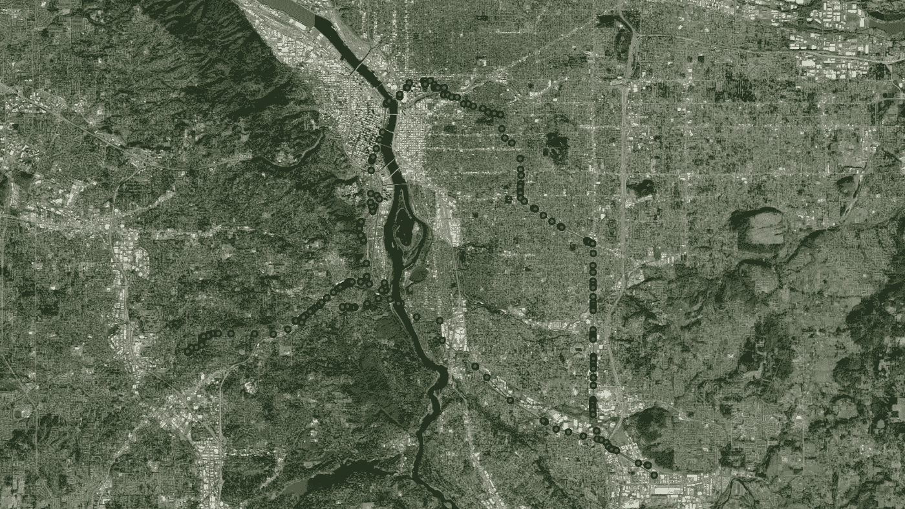
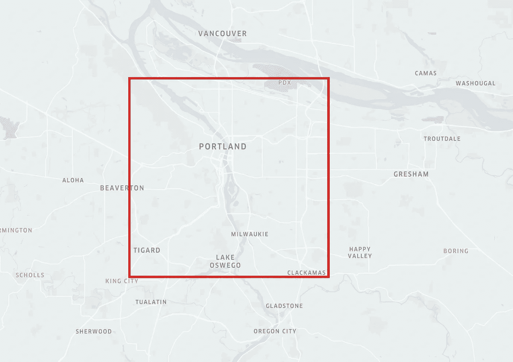
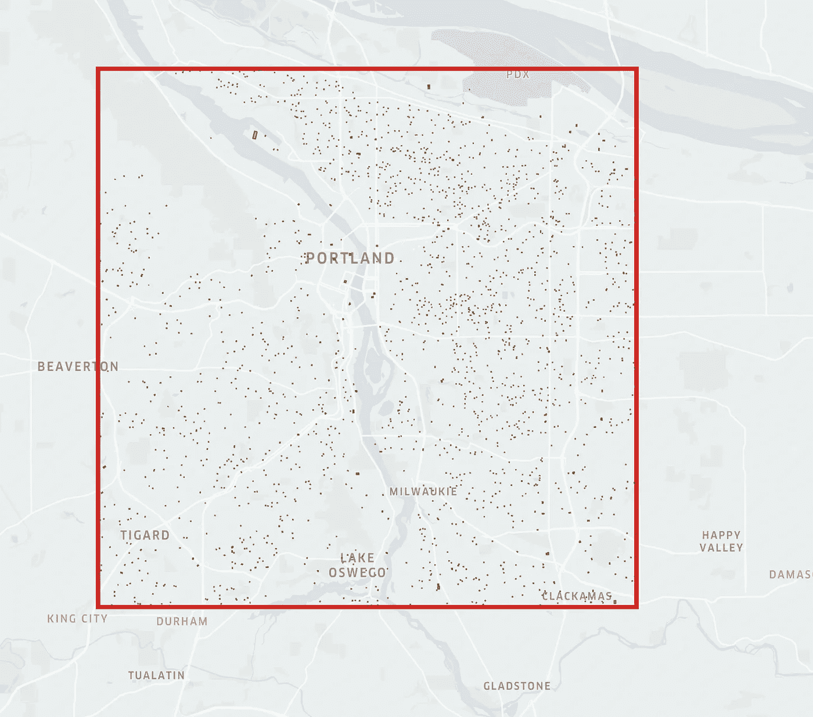
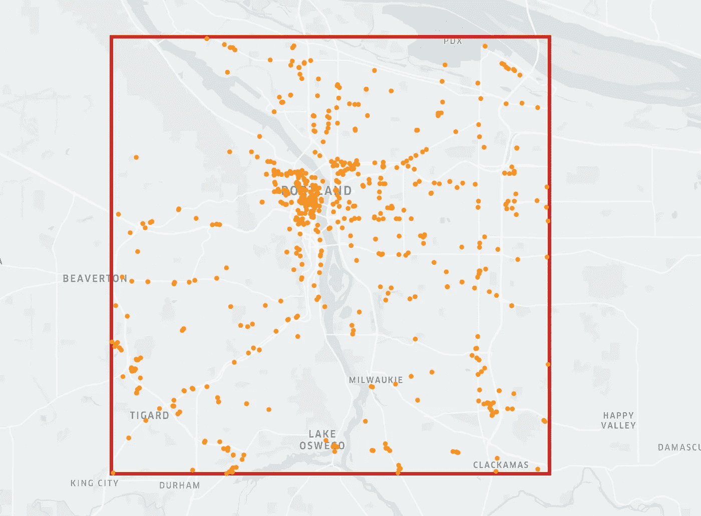
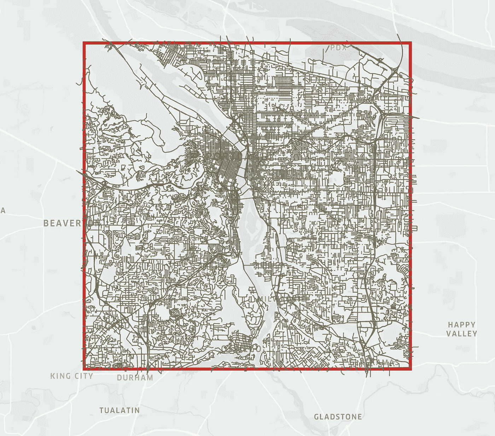

# 生成合成移动性数据

> 原文：<https://towardsdatascience.com/generate-synthetic-mobility-data-a32894f1a253>

## 合成移动性数据生成的简单解决方案建议

使用 Kepler.gl 可视化

移动性数据是通过正常活动被动产生的设备的地理位置。从交通规划到移民预测，它都有重要的应用。由于移动数据很少且难以收集，研究人员已经开始探索综合生成数据的解决方案。

在本文中，我将讨论一个生成合成移动数据的简单解决方案。该合成数据可用于研究目的和训练/微调算法。例如，可以综合生成标记的移动性数据，并训练模型来预测城市交通拥堵。然后，经过训练的模型可以应用于现实生活中的数据。

代码可以在这里找到[，你也可以用](https://github.com/aloncohen1/synthetic_mobility_data_generator)[这个 colab](https://colab.research.google.com/drive/1b7Plly940-GYgjNdP0C-klabDyPiMfUg?usp=sharing) 笔记本自己试试。

# 数据

要合成生成的数据将代表从蜂窝电话设备收集的位置数据记录。通常，此类数据包含以下属性:

*   phone_id —手机的唯一标识符
*   phone_type —手机操作系统(iOS / Android)
*   时间戳(纪元时间)
*   纬度
*   经度
*   精确度(以米为单位)

# 方法学

# A 部分—获取公共位置数据

在美国选择一个地点，创建一个 x 米的 bbox(边界框)。接下来，获取公共数据集:

*   **居住地点—**bbox 内的建筑样本( [ArcGIS Rest API](https://services.arcgis.com/P3ePLMYs2RVChkJx/ArcGIS/rest/services/MSBFP2/FeatureServer/0) )
*   **兴趣点**(兴趣点)bbox 内的业务。( [Kaggle 数据集](https://gist.github.com/aloncohen1/f3e7df8833f4d7ddca78486dfc9ec969))
*   **道路**—bbox 内的所有道路，以图形表示( [OSM 立交桥 API](https://wiki.openstreetmap.org/wiki/Overpass_API) ，使用 [osmnx](https://osmnx.readthedocs.io/en/stable/osmnx.html) )

## **创建一个边界框**

使用 Kepler.gl 可视化

## 获取 ArcGIS **居住地点**

使用 arcgis_rest_url 获取 bbox 中建筑物的多边形。
*限于 2000 个多边形样本。

使用 Kepler.gl 可视化

## 获取 Kaggle POIs 数据集

使用 Kaggle API 下载 POIs 数据集。然后对其进行解析，将其加载到 geopandas，并将数据集过滤为 bbox 内的点。

使用 Kepler.gl 可视化

## 从天桥 API 获取 OSM 道路

使用 Kepler.gl 可视化

# B 部分—生成合成时间线

现在，我们已经拥有了创建电话时间表所需的一切— **居住位置**(将用于在家里、家人和朋友家的停留)、**poi**位置(将用于商店访问)和**道路**(将用于停留之间的驾驶)。在生成实际的移动性数据之前，我们将生成一个**合成时间线**来保存手机停留及其时间框架。

## 合成时间轴逻辑

综合时间线逻辑将在开始日期和结束日期之间的所有日期上迭代，并随机化在工作场所、居住位置和兴趣点的停留。为了保证正常的人类行为，逻辑将只产生工作日的工作停留，并确保用户晚上回家。

运行逻辑之前，请确保:

*   设置随机的家庭和工作地点
*   设定时间框架(开始日期和结束日期)
*   设置给定日期要访问的最大兴趣点和最大居住位置

下面的 gif 显示了我们合成时间线的第一天

使用 Kepler.gl 可视化

# C 部分—生成合成流动性数据(信号)

我们的合成时间线已经准备好了，需要一个新的逻辑把它翻译成合成信号。我们的时间表中的第一个事件是寄宿家庭(00:00 -> 08:00)，所以让我们从为这次住宿生成信号开始。

## 静态模式信号

以下脚本将生成停留开始和停留结束之间的信号数据帧。采样率(相邻信号之间的时间间隔)是一个可配置的参数。我把它设置为 600 秒(5 分钟)。每一个信号最近，lng 将被随机“噪声因子”所噪声化

在第一次停留时应用该逻辑将产生以下输出:

使用 Kepler.gl 可视化

## 驱动模式信号

我们时间线上的下一个事件是在“住所 1290”的停留，但是在为这次停留生成信号之前，我们需要为将我们的电话从其起点(家)带到其目的地(“住所 1290”)的驱动器生成信号。

为此，我们将使用道路图并寻找从起点到终点的最短路径。然后，我们将以 60 秒的采样率在有序路段上随机生成信号。

这就是合成驱动信号在地图上的样子:

使用 Kepler.gl 可视化

## 全合成移动性数据生成

在我们的最后一步，我们将迭代我们所有的合成时间线。对于每次停留，我们将生成静态模式信号，并且在每两次停留之间，我们将生成驱动模式信号。

**轰！**我们现在拥有由开源软件包和免费数据生成的完整的合成移动数据

使用 Kepler.gl 可视化

# 结论

生成合成移动性数据是可行，且不需要特殊的资源。我们需要的所有数据都在那里，可以免费使用。话虽如此，仍有改进的余地:

1.  逻辑的幼稚——逻辑非常简单，所以输出并不真正代表**完整的**人类行为(例如出国旅行、移民等)..)
2.  逻辑的效率——逻辑需要一些时间来运行。主要的瓶颈是驱动生成部分(最短路径计算)
3.  逻辑的覆盖范围——逻辑仅支持美国，这是因为我使用了 [USBuildingFootprints](https://github.com/microsoft/USBuildingFootprints) 非常准确，但不幸的是，它仅覆盖美国。

如前所述，代码可以在[这里](https://github.com/aloncohen1/synthetic_mobility_data_generator)找到，你可以用[这个 colab](https://colab.research.google.com/drive/1b7Plly940-GYgjNdP0C-klabDyPiMfUg?usp=sharing) 笔记本自己试试。

*除非另有说明，所有图片均为作者所有。

*感谢您的阅读！*