# 在 R 中生成调色板

> 原文：<https://towardsdatascience.com/generating-color-palettes-in-r-64394117a662>

## 从图像生成调色板的 R 包列表

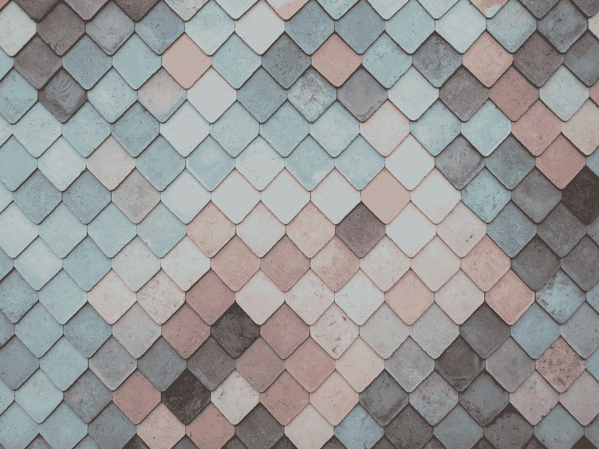

安德鲁·雷德利在 [Unsplash](https://unsplash.com?utm_source=medium&utm_medium=referral) 上的照片

<https://abhinav-malasi.medium.com/membership>  

在过去的几个月里，我一直在尝试生成艺术，但我的大部分艺术作品都以灰色为结尾。我从来没有办法让我的作品看起来像你在网上看到的其他艺术家的作品一样漂亮。

所以，我开始从网上使用调色板提取工具。这让我思考，我在 R 本身有这些选项吗？因为从在线编辑器中复制十六进制代码是非常无聊的。我搜索并找到了一些 R 包，它们有能力从图像中提取调色板，并对结果进行充分的控制。

为了展示包的功能，我将使用来自`imgpalr`包的图像作为参考。为了保持一致，调色板的大小固定为 10。要复制你的作品，别忘了播种。我们开始吧。

# 帕莱特

作者:安德烈亚·西里洛

一个简单而强大的工具，从图像中提取颜色并创建调色板。颜色提取器使用 k-means 算法。

这个包使用`create_palette()`来创建调色板。开始工作的基本参数是提供文件路径、调色板的大小以及将变量的类型设置为分类。通过提供亮度和饱和度的临界值参数，可以进行进一步的微调。

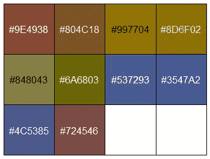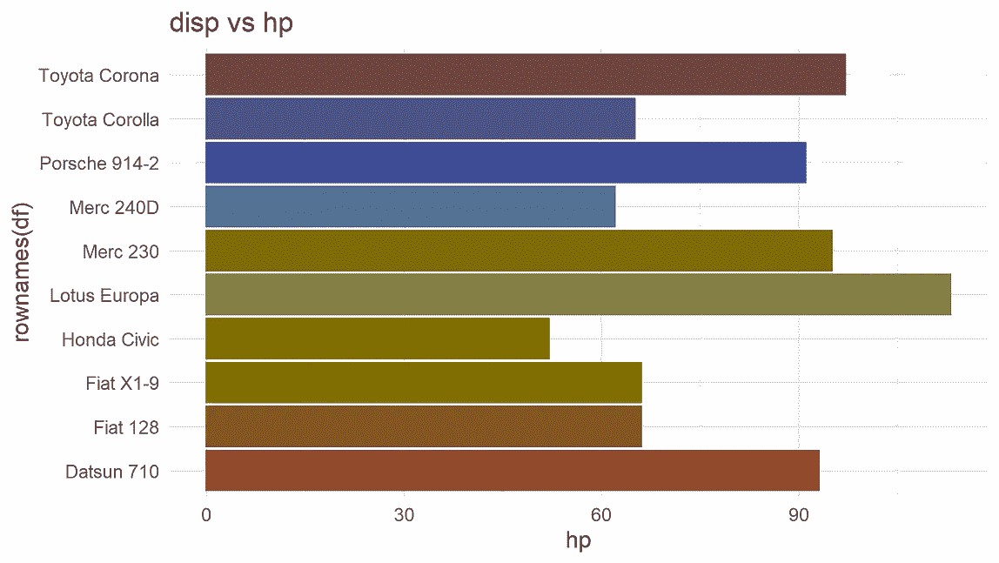

提取的调色板(L)，提取的调色板用于使用 ggplot (R)绘图。(图片由作者提供)

上述调色板的变体通过将参数`filter_on_low_brightness`和`filter_on_saturation`的值设置为`FALSE`来实现。

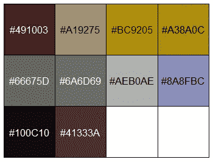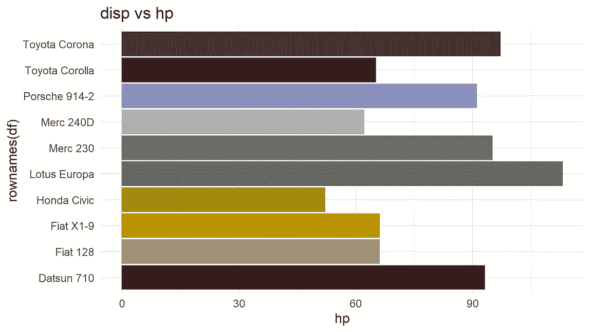

提取的变体调色板(L)，用于使用 ggplot (R)绘图的变体提取调色板。(图片由作者提供)

甚至连上帝都认可这个方案。

# imgpalr

作者:马修·莱昂纳维茨

Imgpalr 还使用 k-means 算法来创建调色板。调色板生成器的`image_pal()`功能可以更广泛地控制从图像创建调色板。基本参数包括文件路径和要识别的颜色数量。通过设置参数的范围，如`saturation`、`brightness`和`bw`(用于黑白像素)，可以调整生成的调色板。参数`type`有助于定义顺序的、定性的或发散的调色板。此外，可以使用`seq_by`参数通过`hsv`、`svh`或`vhs`对连续调色板进行排序。此外，还可以调整 k-means 集群大小参数。

下面的调色板是用默认值生成的。

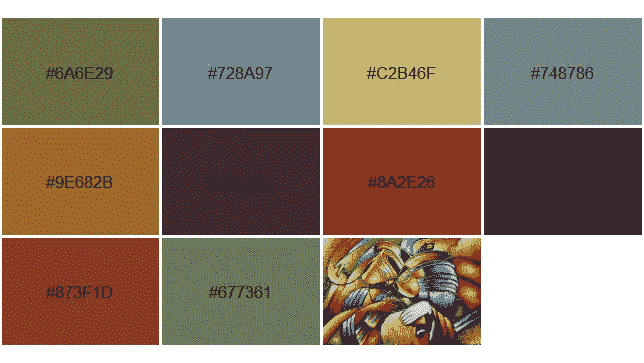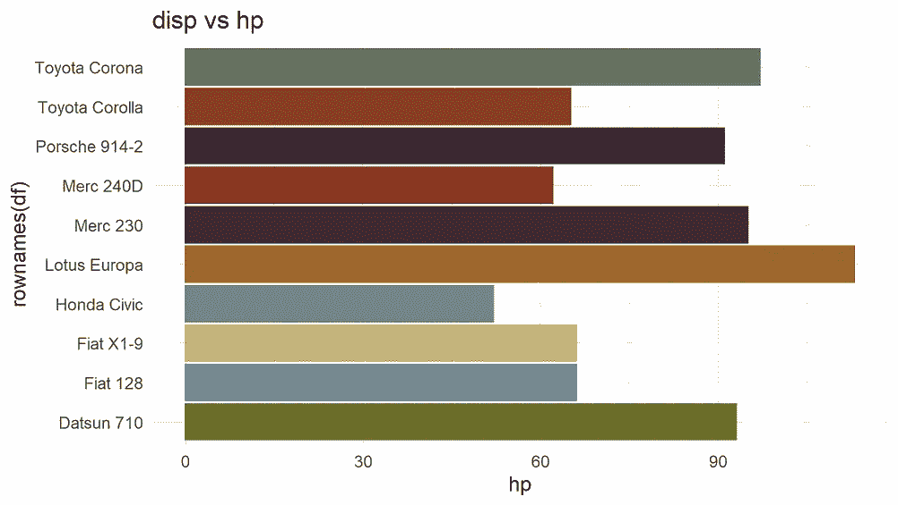

用默认值生成调色板(L)，调色板用于绘图目的(R)。(图片由作者提供)

只需改变截止饱和度范围，调色板可以调整如下所示。

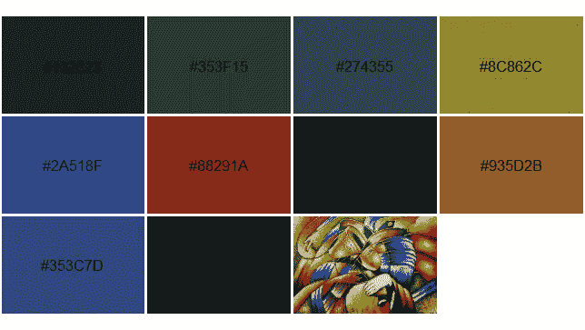

通过调整饱和度范围生成的调色板(L)，调色板用于绘图目的(R)。(图片由作者提供)

# colorfindr

作者:大卫·尊巴赫和玛拉·阿威克

该包使用`get_colors()`函数提取颜色。除了使用基于频率的参数`top_n`定义调色板的大小。也可以通过使用`min_share`参数定义颜色共享来创建调色板。`min_share`参数的取值范围在 0-1 之间。它还包含使用参数`exclude_col`和`exclude_rad`从调色板中排除颜色的选项。`make_palette()`函数创建调色板。它可以选择设置两种流行的聚类技术:k-means 和中位数切割。可以使用参数`clust_method`设置集群的选择。

使用默认设置生成调色板，并将`clust_method`参数设置为 kmeans。

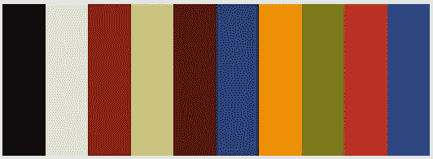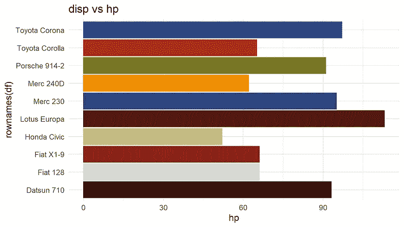

使用 k-means 的调色板生成。(图片由作者提供)

这是当`clust_method`的参数设置为中间切割时生成的调色板。

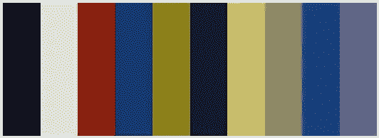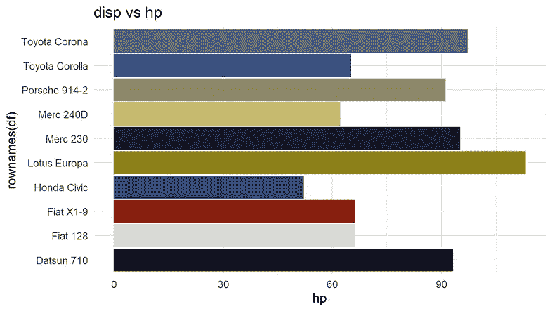

使用中间切割生成调色板。(图片由作者提供)

# 边缘调色板

作者:乔尔·卡尔森

该软件包使用中值切割算法从图像中提取主色。`image_palette()`函数用于提取颜色。像往常一样，参数是图像路径、调色板的颜色数量、`choice`参数定义了如何选择颜色的函数。

该软件包具有其他与 ggplot2 集成的酷功能。函数`scale_color_image()`和`scale_fill_image()`可以直接使用 ggplot2 中生成的调色板。

下面的调色板是使用默认设置生成的，调色板的颜色数设置为 10。

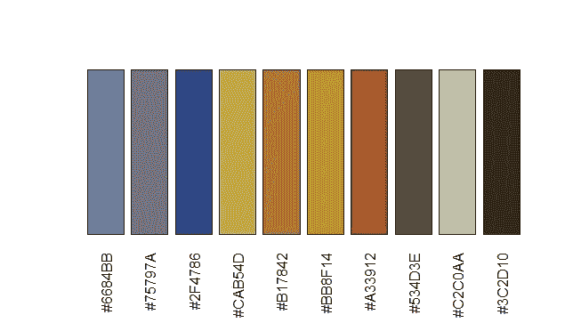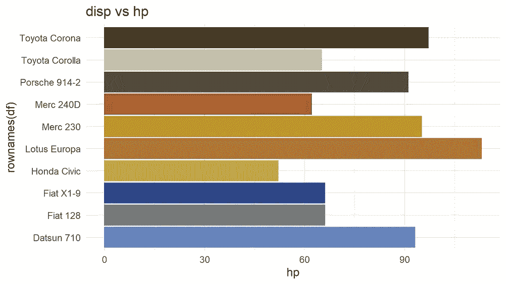

使用默认设置生成的调色板。(图片由作者提供)

下面的图是使用 scale_color_image()和 scale_fill_image()函数生成调色板而生成的。这种变化是通过将`choice`参数设置为 min 来实现的。

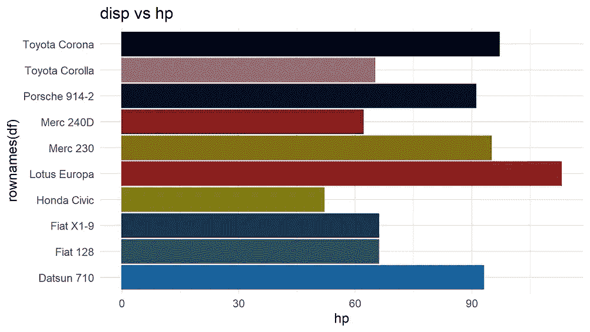

通过将 choice 参数设置为 min 生成的调色板变量。(图片由作者提供)

# 魔法

作者:rOpenSci

Magick 是 r 中用于图像处理的 goto 包。该包有一个名为`image_quantize()`的函数，它为我们完成了这个任务，但不是一条简单的路径。Chisato 的博客对此做了很好的解释。

使用的代码:

这些是我发现在 r 中生成个性化调色板非常有用的一些包，我希望这对你们有些人有帮助。

<https://abhinav-malasi.medium.com/subscribe>  

## 参考

1.  [https://github.com/AndreaCirilloAC/paletter](https://github.com/AndreaCirilloAC/paletter)

2.[https://github.com/leonawicz/imgpalr](https://github.com/leonawicz/imgpalr)

3.[https://github.com/zumbov2/colorfindr](https://github.com/zumbov2/colorfindr)

4.[https://cran . r-project . org/web/packages/magick/vignettes/intro . html](https://cran.r-project.org/web/packages/magick/vignettes/intro.html)

5.[https://www . r-bloggers . com/2019/01/用图像量化从图像中提取颜色/](https://www.r-bloggers.com/2019/01/extracting-colours-from-your-images-with-image-quantization/)

*可以在* [*LinkedIn*](https://www.linkedin.com/in/abhinav-malasi/) *和*[*Twitter*](https://twitter.com/malasi_abhinav)*上与我连线，跟随我的数据科学和数据可视化之旅。或者您可以在 Medium 上关注我，了解有关 R 和 ggplot2 包的数据可视化的最新文章。*