# 生成催眠像素模式

> 原文：<https://towardsdatascience.com/generating-hypnotizing-pixel-patterns-c1ab2a07d104>

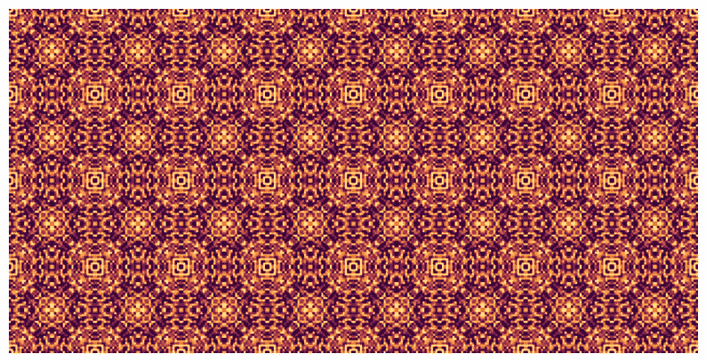

生成的像素模式。点击放大。图片作者。

## 一个关于对称、纤维艺术和埃舍尔的故事。

你还记得当你折叠一张纸，剪开它，展开后你会有一个漂亮的星星或雪花图案吗？当你在切割的时候，你没有很高的期望。但是展开后，对称就可以了，让你的纸看起来像魔术一样！重复相同的图案真的很强大，在艺术上做得非常好。在这篇文章中，我将与你分享如何用简单的技巧创造美丽的图案。

自制的“雪花”，我尝试了 20 年，真的很简单，它们看起来不漂亮吗？🤩图片作者。

# 对称

当某样东西在经过某种变换后保持不变或映射到自身时，称之为对称。下面是两种最常见的对称类型。

## 反射对称

当您可以通过线中的反射将对象映射到自身时，就会发生反射或线对称。

反射对称的例子，树在水中映射到它们自己。由[亚当·伯基特](https://unsplash.com/@abrkett?utm_source=medium&utm_medium=referral)拍摄。

## 旋转对称

如果您可以将一个对象围绕其中心点旋转 360 度，并且该对象映射到自身两次或更多次，这称为旋转对称。两次或更多，因为一次总是在 360 度完成。物体映射到自身的次数称为旋转对称的次数。你可以查一下序后图中的雪花，它们的旋转对称顺序等于 6。

一种特殊类型的旋转对称被称为*点对称*，当一个对象围绕其中心点旋转 180 度后映射到自身时，就会发生这种情况。检测点对称很容易:当一个物体上下看起来一样，像大写字母 H 或 N，它是点对称的。

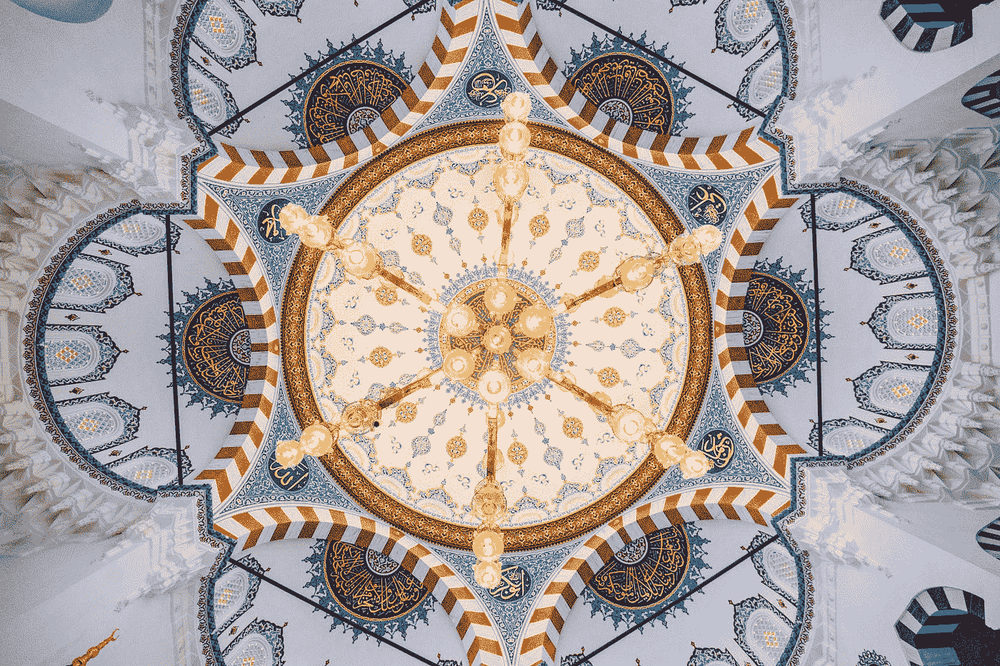

你能认出这张图片中的反射、旋转和点对称吗？照片由[巴迪·阿巴斯](https://unsplash.com/@bady?utm_source=medium&utm_medium=referral)在 [Unsplash](https://unsplash.com?utm_source=medium&utm_medium=referral) 上拍摄

# 创建像素模式

像素模式被纤维艺术家广泛使用。你可以用它们来编织花边、缝纫和各种编织。你真的经常看到钻石图案，在下面的图片中，你可以发现一些不同形式的钻石。

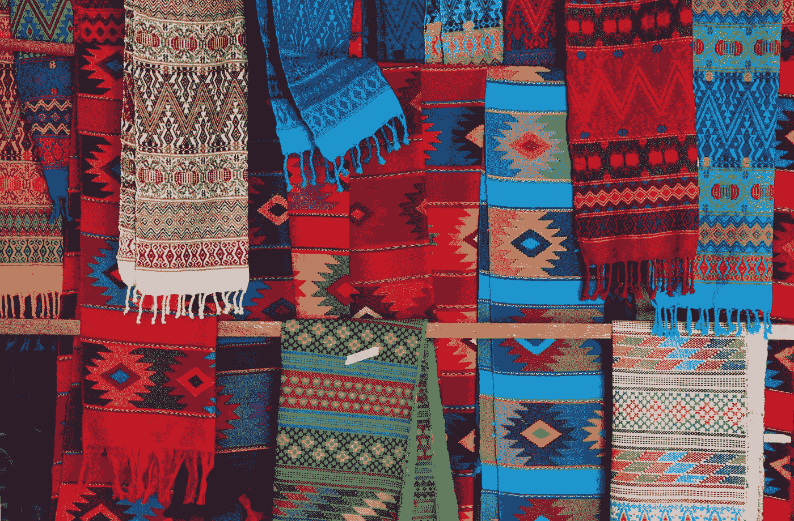

analuisa gamboa 在 [Unsplash](https://unsplash.com?utm_source=medium&utm_medium=referral) 上拍摄的照片

手工创建像素模式需要花费大量时间。如果我们利用计算机的能力为我们工作会怎么样？有了计算机，理论上可以创造所有可能的像素模式！会不会带来新的有趣的模式？我尝试了许多不同的方法来创建模式。它们基于对称和重复的原则。可能性是无穷无尽的，因为它可以玩大小，颜色，以及旋转和重复的方式。

第一步很简单。在这一步中，从 *n* x *n* 个像素创建一个矩阵(在第一个例子中低于 6×6)。矩阵中随机填充了 0 和 1。零代表白色，一代表黑色。下面你可以看到一些生成的矩阵。他们没什么特别的，对吧？但是当矩阵被镜像、旋转和复制时会发生什么呢？

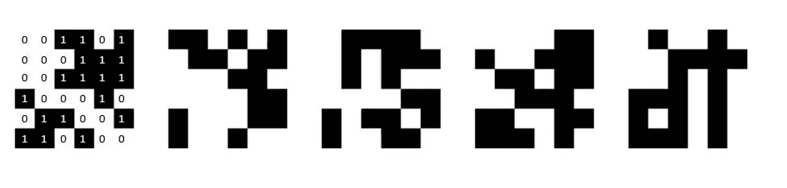

5 种不同的 6x6 随机黑白像素模式。在第一张图中，你可以看到从 0 和 1 矩阵到黑白矩阵的转换。

## 镜子，镜子…

如果我们取一个矩阵，向右镜像，然后向下镜像，然后水平和垂直复制几次结果，结果如下:

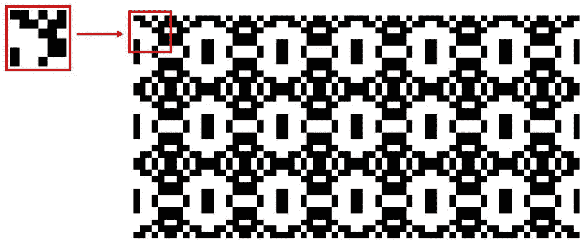

我们从左上角的 6x6 矩阵开始。然后向右镜像，向下镜像，复制。我们的第一个图案诞生了！

## 旋转，重复

而不是镜像(反射对称)，当我们旋转矩阵时会发生什么(旋转对称)？我们可以用不同的方法来做这件事，每种方法都有不同的结果。下面，使用与上图相同的矩阵。旋转给了我们一个完全不同的模式。

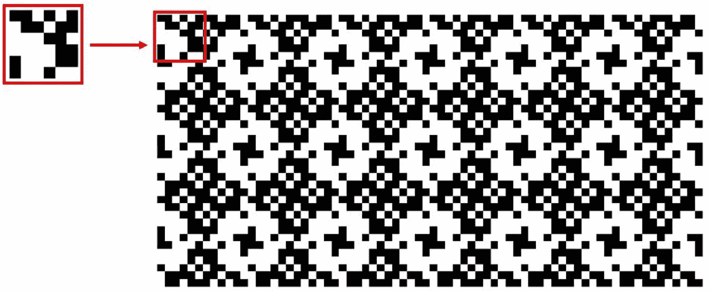

矩阵向左旋转了 90 度。你也认得这种图案的花吗？

结合旋转和镜像也是可以的，旋转到另一边。下面一个 gif 用一些不同的方式生成图案。

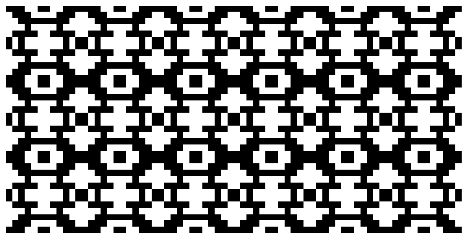

以不同方式生成模式的示例。

## 使矩阵对角线对称

除了使用我们的方阵，我们还可以给它们增加一个“对称维度”。我们可以使矩阵对角对称。这给了我们这样的矩阵:

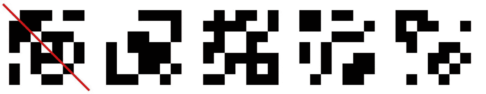

对角线具有反射对称性的 7x7 矩阵。

这给了我们这样的模式:

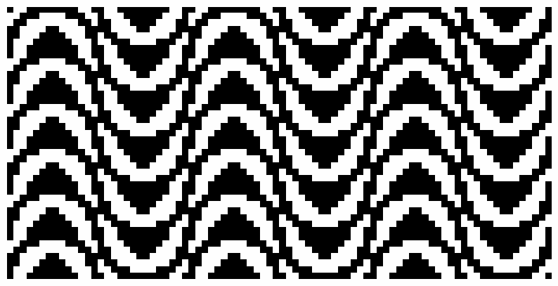

由 7×7 对角对称矩阵生成的模式。

## 通过反转颜色创建镶嵌

那埃舍尔呢。我希望你知道这位伟大的艺术家，他创作了最美丽、最迷人的画作。如果没有，那就去看看[他的代表作](https://www.escherinhetpaleis.nl/about-escher/masterpieces/?lang=en)(你不会后悔的)。他的特色[镶嵌](https://www.google.nl/search?q=tessellation+escher)，在那里他完全用动物填充一个表面(大部分时间)真的很鼓舞人心。

我们能通过反转矩阵的颜色并复制它们来模仿这种效果吗？我尝试了两种不同的方法:水平切换矩阵的颜色，每一行都复制了相同的矩阵，第一行是黑/白，第二行是白/黑，第三行是黑/白，依此类推:

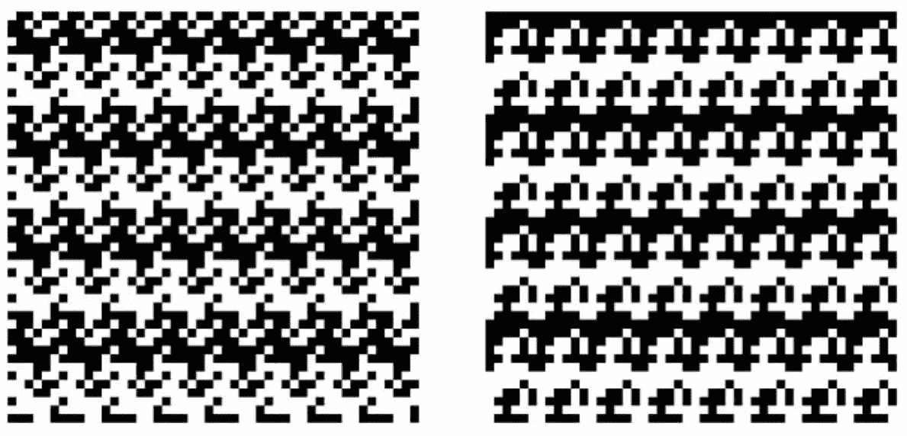

水平切换矩阵的颜色。带着一些幻想，我看到海马在左边，中世纪的军人在右边排成一行。

另一种方法是对角切换颜色，其中每个黑/白矩阵都被其自身的白/黑版本包围:

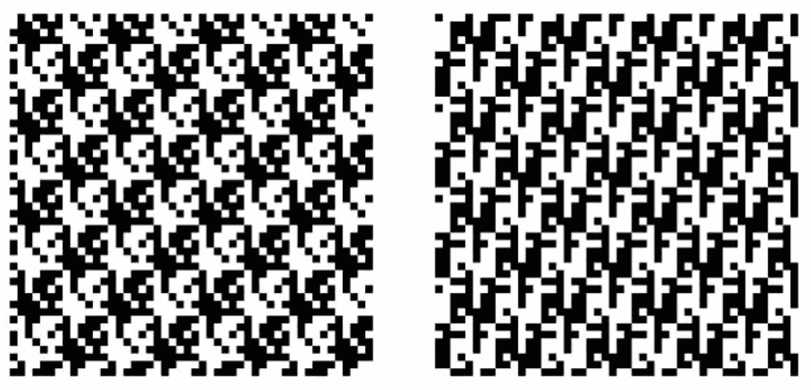

对角切换矩阵的颜色；我看到左边是飞龙，右边是公鸡。

它远非完美，但这些结果可以用作灵感和绘制自己的镶嵌图的起点。

## 使用模式

到目前为止，已经有两种模式出现了。一个在麦克拉梅，一个在框架编织。

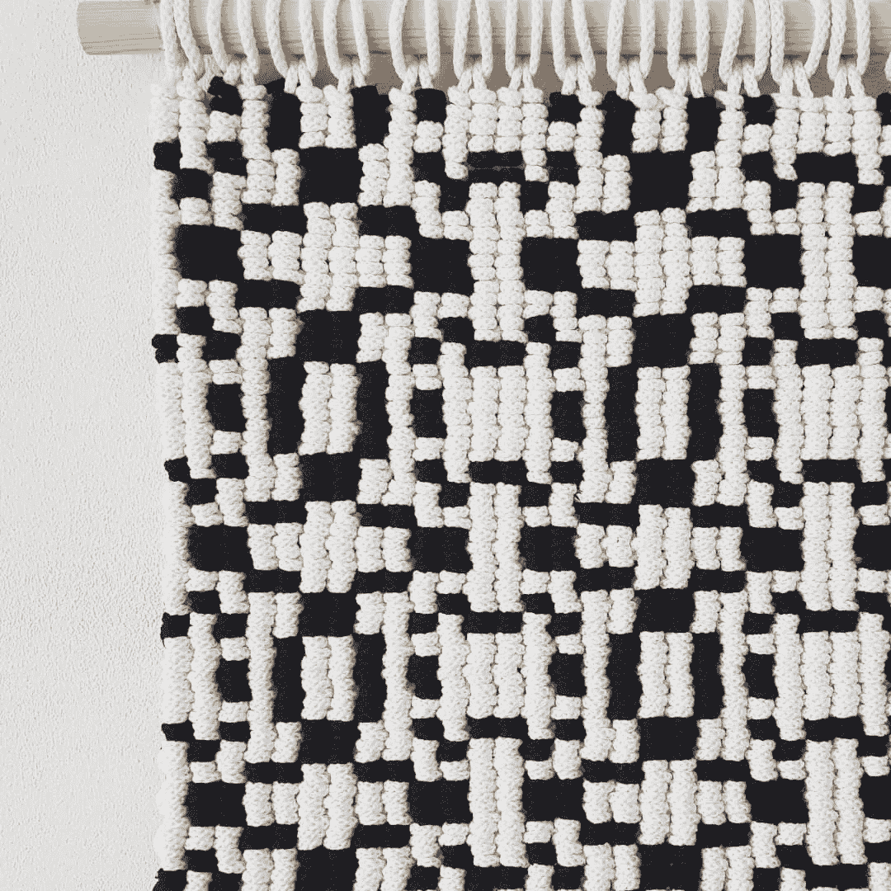

macramé中使用的图案。图片作者。

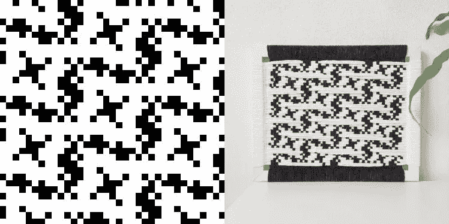

使用左侧图案制作的框架编织。图片作者。

## 其他设置

玩不同数量的颜色、不同颜色的地图和不同大小的矩阵真的很有趣。下面是一些我特别喜欢的图案。正如我前面提到的，可能性是无穷无尽的！在这篇文章中，我只触及了皮毛。

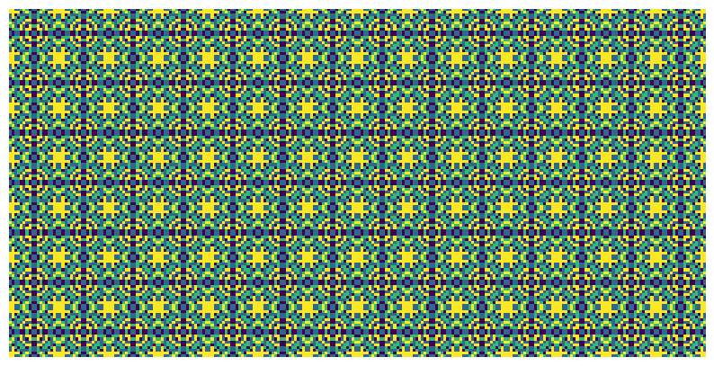

# 结论

我希望你喜欢这个穿越模式和对称世界的小旅程。有了一些基本的 python(用于创建模式的编程语言)知识，就很容易受到启发，创建令人着迷的像素模式！而如果你没有任何 python 知识，就从剪刀和布开始吧！或者看一段分形的视频，其中的模式无限延续。

如果你想玩 python 代码，请联系我。目前，代码还没有公开。

如果你对我的纤维艺术感兴趣，[在 Instagram](https://www.instagram.com/endlessropedesigns/) 上关注我，看看我的作品。我不得不说大部分作品都不是由电脑程序激发的(目前还不是)😉).

感谢阅读！❤

> 本文是系列文章的第一篇。我以三种不同的方式使用了本文中生成的像素模式。第一种方法是在神经风格转移中回答这个问题:当我们将像素模式与图像和图片结合时会发生什么？我也把它们作为生成性对抗网络的输入。最后，我用它们来训练变分自动编码器，以发现潜在空间，并在生成的模式之间进行插值。点击链接阅读这些文章。(如果没有链接，我还没发表这些文章呢！)

*别忘了* [*订阅*](https://hennie-de-harder.medium.com/subscribe) *如果你想在我发表新文章时收到电子邮件。*