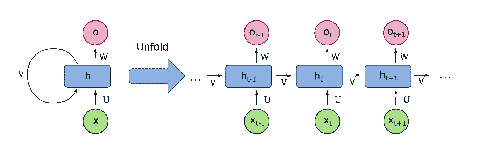
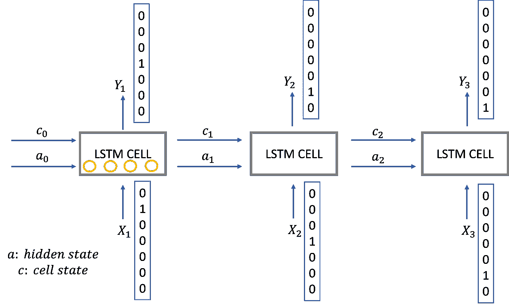
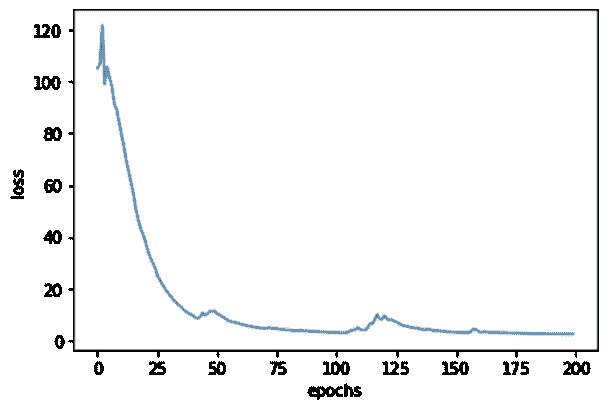

# 利用 LSTM 神经网络生成新的卡尔纳蒂克音乐模式

> 原文：<https://towardsdatascience.com/generating-new-carnatic-music-patterns-using-lstm-neural-networks-e71de1dce019>

## 卡纳蒂克音乐以一些积木的丰富循环模式为特色——使其成为探索基于人工智能的音乐生成的丰富游乐场。让我们看看 LSTM 是如何创作新的基本作品的

# 卡尔纳蒂克音乐中的积木

卡纳蒂克音乐是两种印度古典音乐形式之一(另一种是印度斯坦音乐)。与西方古典音乐不同，西方古典音乐中的作品被设定为一个特定的调(例如贝多芬的 C 小调第五交响曲)并且以多种调式为特征；卡尔纳蒂克的音乐作品大多被设定为一种独特的调式，称为 Raga。例如，Raga Sankarabharanam 对应于爱奥尼亚调式(通常称为大调音阶)。

由于这种对特定模式的关注，卡尔纳蒂克音乐以复杂的循环模式为特色，这通常可以被认为是建立在基本模式的基础上，几乎就像是重复片段的等价物。事实上，在卡纳蒂克音乐中，人们最先学到的东西之一就是萨拉里·瓦拉赛(Sarali varas ais)，这是对基本的完整拉格(raga)的修改:

> T2 [] S n d p | m g | r S

其中“s r g m p d n S”是组成完整音阶的 8 个音符。例如，如果我们谈论 c 大调音阶中的三卡拉巴拉那，对应的将是“C D E F G A B C”。“|”和“||”表示节拍小节。“||”代表一个周期的结束(这里是 8 拍)，“|”代表一个特征音程。这个简单的上升和下降模式是第一个 Sarali Varisai，还有 13 个变化如下图所示:

Sarali Varisai 的另一个例子是:

> S r g m | p d | S r | |
> S r g m | p d | n S | |
> S n d p | m g | S n | |
> S n d p | m g | r S | |

本文的目标是训练一个人工智能模型，从 13 个 Sarali vari sai 中生成一个新的 Sarali Varasai，这些 Sarali vari sai 的长度都是 44 个字符(不包括第一个字符)。

# LSTM 神经网络

长短期记忆(LSTM)神经网络被大量用于模拟循环模式和时间相关现象。LSTM 旨在提供长期和短期记忆来模拟序列模式。据报道，LSTM 架构是 20 世纪被引用最多的神经网络[。](https://people.idsia.ch/~juergen/most-cited-neural-nets.html)

传统的神经网络在给定某个输入向量的情况下预测输出。例如，MNIST 数据集的特征是从 0 到 9 的数字化手写数字。人们可以开发一个基本的神经网络，以相当不错的精度来预测给定手写数字的数字，而不是在训练模型时看到的数字。


[修改自 MIT 6。S191:深度学习介绍](https://colab.research.google.com/github/aamini/introtodeeplearning/blob/master/lab2/Part1_MNIST.ipynb#scrollTo=gKA_J7bdP33T)

然而，这些神经网络没有对信息的持久性进行建模——这是一个缺点。例如，如果您想预测未来的一些事情，比如一天后的股票市场，如果您仅基于当前特征(相当于一幅图像中的所有像素)进行预测，您将会丢失有价值的信息。天气预报也是如此，甚至只是知道电影中接下来会发生什么。接下来的几分钟不仅仅取决于电影的当前位置，还取决于角色的历史。

这种持久性可以通过递归神经网络(RNNs)来建模。在一个简单的 RNN 中，有神经网络来模拟每一个时间步，其中 2 个输入是系统的先前状态；和一个考虑历史的向量。在下图中，您可以看到，在每一步 t，RNN 都接受一个输入 x_t，以及一个从过去的历史中累积的输入 v。这种模型的一个例子可以是例如一个句子的语言翻译——从英语到法语。在这种情况下，RNN 模型的想法是，不仅当前单词在建模相应的法语单词时有用，而且句子中前面单词的历史也有用。



[RNN 展开](https://en.wikipedia.org/wiki/Recurrent_neural_network#/media/File:Recurrent_neural_network_unfold.svg)

rnn 的一个主要问题是它们不能处理大序列，这是由于在多次迭代中混合了非常小或非常大的数。LSTMs 通过为每个单元设置一个单独的“门”来克服这种限制，该门可以选择性地让信息通过。这样，他们可以通过忘记中间的一些无关紧要的连接，但同时跟踪一些重要的连接，来处理更长范围的依赖性。



用基本的 LSTM 细胞来模拟依赖于过去历史的循环模式|塞犍陀·维维克

# 为卡纳蒂克·萨拉里·瓦拉塞一代建立一个 LSTM 模式

首先，我定义了与 14 个不同的 Sarali Varasais 相对应的 14 个字符串，并创建了一个连接除第一个以外的所有字符串的列表(第一个字符串比其余的都小)。

```
x1=”s r g m | p d | n S || S n d p | m g | r s ||”
x2=”s r s r | s r | g m || s r g m | p d | n S || S n S n | S n | d p || S n d p | m g | r s ||”
x3=”s r g s | r g | s r || s r g m | p d | n S || S n d s | n d | s n || S n d p | m g | r s ||”
x4=”s r g m | s r | g m || s r g m | p d | n s || S n d p | S n | d p || S n d p | m g | r s ||”
x5=”s r g m | p , | s r || s r g m | p d | n S || S n d p | m , | S n || S n d p | m g | r s ||”
x6=”s r g m | p d | s r || s r g m | p d | n S || S n d p | m g | S n || S n d p | m g | r s ||”
x7=”s r g m | p d | n , || s r g m | p d | n S || S n d p | m g | r , || S n d p | m g | r s ||”
x8=”s r g m | p m | g r || s r g m | p d | n S || S n d p | m p | d n || S n d p | m g | r s ||”
x9=”s r g m | p m | d p || s r g m | p d | n S || S n d p | m p | g m || S n d p | m g | r s ||”x10=”s r g m | p , | g m || p , , , | p , | , , || g m p d | n d | p m || g m p g | m g | r s ||”
x11=”S , n d | n , | d p || d , p m | p , | p , || g m p d | n d | p m || g m p g | m g | r s ||”
x12=”S S n d | n n | d p || d d p m | p , | p , || g m p d | n d | p m || g m p g | m g | r s ||”
x13=”s r g r | g , | g m || p m p , | d p | d , || m p d p | d n | d p || m p d p | m g | r s ||”
x14=”s r g m | p , | p , || d d p , | m m | p , || d n S , | S n | d p || S n d p | m g | r s ||”l1=[]
l1.append([i for i in x2.split(" ") if i])
l1.append([i for i in x3.split(" ") if i])
l1.append([i for i in x4.split(" ") if i])
l1.append([i for i in x5.split(" ") if i])
l1.append([i for i in x6.split(" ") if i])
l1.append([i for i in x7.split(" ") if i])
l1.append([i for i in x8.split(" ") if i])
l1.append([i for i in x9.split(" ") if i])
l1.append([i for i in x10.split(" ") if i])
l1.append([i for i in x11.split(" ") if i])
l1.append([i for i in x12.split(" ") if i])
l1.append([i for i in x13.split(" ") if i])
l1.append([i for i in x14.split(" ") if i])
```

有 11 个不同的音符(' S '，' r '，' g '，' m '，' p '，' d '，' n '，' S '，' | '，'，' )，其中' S '表示第一个音符的高音版本，' | '和' || '是特征音程，'，'只是一个延长音符的间隔。使用这个信息，我开发了一个热编码，其中 X 的维数是 X= (13，44，11)，对应于 13 个萨拉里变奏，44 个音符组成每个萨拉里变奏(包括音程)，11 对应于一个热编码维数。

y 是向左移动一步的 X；即时间步长 t 处的 Y 与时间步长 t+1 处的 X 相同。因此，游戏现在将预测给定前一个音符的下一个音符(LSTM 也考虑音符的历史)。

```
for i in range(0,len(l1)):
 values = array(l1[i])
 onehot_encoded = onehot_encoder.transform(values.reshape(len(values), 1))
 X[i,:]=onehot_encoded

 values=np.roll(values,-1)
 onehot_encoded = onehot_encoder.transform(values.reshape(len(values), 1))
 Y[:,i,:]=onehot_encoded
```

接下来，我们的想法是训练一个 LSTM 模型，根据之前的值(X)来预测后续的音符(Y)。

```
n_values = 11 # number of music values
reshaper = Reshape((1, n_values)) 
LSTM_cell = LSTM(n_a, return_state = True) 
densor = Dense(n_values, activation=’softmax’)def djmodel(Tx, LSTM_cell, densor, reshaper):
    """
    Implement the djmodel composed of Tx LSTM cells where each cell is responsible
    for learning the following note based on the previous note and context.
    Each cell has the following schema: 
            [X_{t}, a_{t-1}, c0_{t-1}] -> RESHAPE() -> LSTM() -> DENSE()
    Arguments:
        Tx -- length of the sequences in the corpus
        LSTM_cell -- LSTM layer instance
        densor -- Dense layer instance
        reshaper -- Reshape layer instance

    Returns:
        model -- a keras instance model with inputs [X, a0, c0]
    """
    # Get the shape of input values
    n_values = densor.units

    # Get the number of the hidden state vector
    n_a = LSTM_cell.units

    # Define the input layer and specify the shape
    X = Input(shape=(Tx, n_values)) 

    # Define the initial hidden state a0 and initial cell state c0
    # using `Input`
    a0 = Input(shape=(n_a,), name='a0')
    c0 = Input(shape=(n_a,), name='c0')
    a = a0
    c = c0

    outputs = []

    # Step 2: Loop over tx
    for t in range(Tx):

        # Step 2.A: select the "t"th time step vector from X. 
        x = X[:,t,:]
        # Step 2.B: Use reshaper to reshape x to be (1, n_values) (≈1 line)
        x = reshaper(x)
        #print(x.shape)
        # Step 2.C: Perform one step of the LSTM_cell
        a, _, c = LSTM_cell(inputs=x, initial_state=[a,c])
        # Step 2.D: Apply densor to the hidden state output of LSTM_Cell
        out = densor(a)
        # Step 2.E: add the output to "outputs"
        outputs=outputs+[out]

    # Step 3: Create model instance
    model = Model(inputs=[X, a0, c0], outputs=outputs)

    return modelmodel = djmodel(Tx=44, LSTM_cell=LSTM_cell, densor=densor, reshaper=reshaper)history = model.fit([X, a0, c0], list(Y), epochs=200, verbose = 1)
```

如你所见，对于 200 个训练时期，损失下降了——这意味着该模型在 Saralivarisai 内更好地理解(并可能复制)模式。



在卡纳蒂克音乐序列上训练 LSTM |塞犍陀·维维克

经过训练后，LSTM 细胞可以用来产生音乐:

```
def music_inference_model(LSTM_cell, densor, Ty=44):
    """
    Uses the trained "LSTM_cell" and "densor" from model() to generate a sequence of values.

    Arguments:
    LSTM_cell -- the trained "LSTM_cell" from model(), Keras layer object
    densor -- the trained "densor" from model(), Keras layer object
    Ty -- integer, number of time steps to generate

    Returns:
    inference_model -- Keras model instance
    """

    # Get the shape of input values
    n_values = densor.units
    # Get the number of the hidden state vector
    n_a = LSTM_cell.units

    # Define the input of your model with a shape 
    x0 = Input(shape=(1, n_values))

    # Define s0, initial hidden state for the decoder LSTM
    a0 = Input(shape=(n_a,), name='a0')
    c0 = Input(shape=(n_a,), name='c0')
    a = a0
    c = c0
    x = x0 outputs = []

    # Step 2: Loop over Ty and generate a value at every time step
    for t in range(Ty):
        # Step 2.A: Perform one step of LSTM_cell. Use "x", not "x0" (≈1 line)
        a, _, c = LSTM_cell(x, initial_state=[a,c])

        # Step 2.B: Apply Dense layer to the hidden state output of the LSTM_cell (≈1 line)
        out = densor(a)
        # Step 2.C: Append the prediction "out" to "outputs". out.shape = (None, 90) (≈1 line)
        outputs.append(out)
        #print(out.shape)

        # Step 2.D: 
        # Select the next value according to "out",
        # Set "x" to be the one-hot representation of the selected value
        # See instructions above.
        x = tf.math.argmax(out,axis=-1)
        #print(x.shape)
        x = tf.one_hot(x,n_values)
        # Step 2.E: 
        # Use RepeatVector(1) to convert x into a tensor with shape=(None, 1, 90)
        #print(x.shape)
        x = RepeatVector(1)(x)

    # Step 3: Create model instance with the correct "inputs" and "outputs" (≈1 line)
    inference_model = Model(inputs=[x0, a0, c0], outputs=outputs)

    return inference_modelinference_model = music_inference_model(LSTM_cell, densor, Ty = 44)
```

然后我们可以给推理模型随机初始化的输入:

```
def predict_and_sample(inference_model, x_initializer = x_initializer, a_initializer = a_initializer, 
                       c_initializer = c_initializer):
    """
    Predicts the next value of values using the inference model.

    Arguments:
    inference_model -- Keras model instance for inference time
    x_initializer -- numpy array of shape (1, 1, 90), one-hot vector initializing the values generation
    a_initializer -- numpy array of shape (1, n_a), initializing the hidden state of the LSTM_cell
    c_initializer -- numpy array of shape (1, n_a), initializing the cell state of the LSTM_cel

    Returns:
    results -- numpy-array of shape (Ty, 90), matrix of one-hot vectors representing the values generated
    indices -- numpy-array of shape (Ty, 1), matrix of indices representing the values generated
    """

    n_values = x_initializer.shape[2]

 given x_initializer, a_initializer and c_initializer.
    pred = inference_model.predict([x_initializer,a_initializer,c_initializer])
    # Step 2: Convert "pred" into an np.array() of indices with the maximum probabilities
    indices = np.argmax(pred,axis=-1)
    # Step 3: Convert indices to one-hot vectors, the shape of the results should be (Ty, n_values)
    results = to_categorical(indices, num_classes=n_values)

    return results, indicesx_initializer = np.random.rand(1, 1, n_values)
a_initializer = np.random.rand(1, n_a)
c_initializer = np.random.rand(1, n_a)results, indices = predict_and_sample(inference_model, x_initializer, a_initializer, c_initializer)notes=[]
for i in range(0,len(results[:,0])):
    inverted = label_encoder.inverse_transform([argmax(results[i, :])])[0]
    notes.append(inverted)print(' '.join(e for e in notes))
```

**这是 LSTM 预测的:**

> d | n S | d p || d d p m | p，| p，|| g m p d | n d | p m || g m p g | m g | r s || S n d

有趣的是，它很好地生成了一个结构良好的 2 行组合，尽管是在一个周期的中间开始的。这可能是因为我们如何通过输入前一个音符来训练 LSTM 细胞——这有效地使用了周期性边界，并使其成为一个循环模型。

通过将“n d”放在前面，我们得到一个新的 Sarali Varisai，如下所示:

> S n d d | n S | d p ||
> d d p m | p，| p，| |
> g m p d | n d | p m | |
> g m p g | m g | r S | |

这是我唱这首歌的录音:

# 结论

在本文中，我将展示如何使用 LSTM——一种经典的递归神经网络架构来生成基本的 Carnatic Saralivarse 模式。由于这些基本模式构成了更复杂的卡尔纳蒂克音乐作品的基础，使用先进的人工智能算法来生成更复杂的作品可能会令人兴奋。

LSTMs 仍然受到递归神经网络固有的顺序性质的困扰——这也使得它们很难并行进行计算。最近，变形金刚席卷了自然语言处理领域。就像在阅读或翻译一个句子时，人们需要注意句子的各个部分一样，变形金刚被设计成使用自我注意来消除重复连接，并提供同时关注多个单词的能力。同样，如果有足够多的数据，变形金刚也可以用来理解和创作新的音乐。

如果你在音乐和 AI 的交汇点有其他想法，欢迎联系！

您可以在这个 GitHub repo 中找到代码:

[](https://github.com/skandavivek/LSTM-Carnatic-Music-Generation) [## GitHub-skandavivek/LSTM-卡纳蒂克-音乐-生成:生成新的卡纳蒂克音乐模式使用…

### 此时您不能执行该操作。您已使用另一个标签页或窗口登录。您已在另一个选项卡中注销，或者…

github.com](https://github.com/skandavivek/LSTM-Carnatic-Music-Generation) 

*如果你还不是中会员，想支持我这样的作家，可以通过我的推荐链接随意报名:*[*【https://skanda-vivek.medium.com/membership】*](https://skanda-vivek.medium.com/membership)

[*关注我*](https://medium.com/@skanda.vivek) *如果你喜欢这篇文章——我经常在数据科学、音乐、安全和社会的界面上写作。*

*每周数据透视* [*订阅此处*](https://skandavivek.substack.com/) *！*

## **参考文献:**

1.  [*序列模型| Coursera*](https://www.coursera.org/learn/nlp-sequence-models?)
2.  [*长短期记忆—维基百科*](https://en.wikipedia.org/wiki/Long_short-term_memory#:~:text=Long%20short-term%20memory%20%28%20LSTM%29%20is%20an%20artificial,standard%20feedforward%20neural%20networks%2C%20LSTM%20has%20feedback%20connections.)
3.  [*麻省理工 6。S191:深度学习介绍*](https://colab.research.google.com/github/aamini/introtodeeplearning/blob/master/lab2/Part1_MNIST.ipynb#scrollTo=gKA_J7bdP33T)