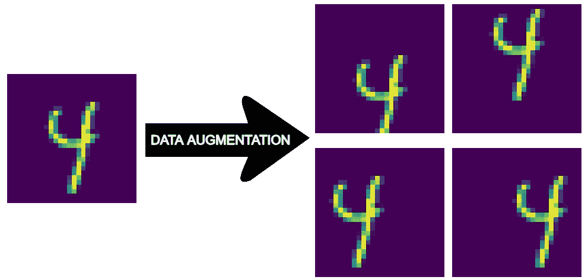
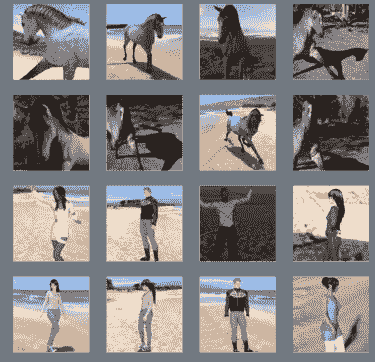
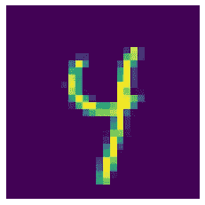
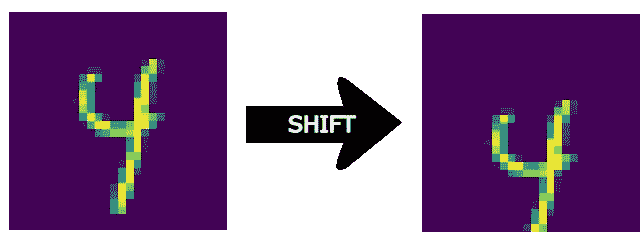
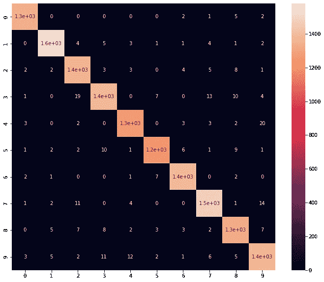

# 生成合成数据以训练 OCR 学习算法

> 原文：<https://towardsdatascience.com/generating-synthetic-data-to-train-an-ocr-learning-algorithm-4889f443fe92>

## 编码和解释合成数据生成的过程，以提高 OCR 学习算法的准确性



数据扩充的效果。来源:作者。

提高低偏差学习算法性能的最可靠方法之一是在大量数据上对其进行训练。尽管获取额外数据的过程看起来可能是一项昂贵的努力，但存在一种令人着迷的技术，允许机器学习从业者生成潜在的无限量的人工数据: [**人工数据合成**](https://en.wikipedia.org/wiki/Synthetic_data) 。

在本文中，我将展示用于生成合成数据的技术，并将它应用于一个众所周知的[光学字符识别问题](/optical-character-recognition-with-knn-classifier-10fd220ed797)。

## 目录:

*   人工数据合成
*   MNIST 光学字符识别
*   生成人造图像
*   模型选择和培训
*   评估数据扩充的效果

# 人工数据合成

人工数据合成是以编程方式生成新数据实例的过程，这些数据实例有效地近似底层真实数据。真实数据可以定义为通过真实生活调查或直接测量收集的数据，而人工数据是作为计算机模拟的结果收集的。基本要求是模拟数据[反映原始数据](https://research.aimultiple.com/synthetic-data-generation/)的统计特性。截至目前，人工数据生成并不适合每一个机器学习问题，通常需要一定的创造力和洞察力才能将其应用于特定问题。

这种做法可以分为两种截然不同的变化:

*   从头开始生成数据:我们没有任何数据，我们希望创建一个近似真实数据的训练集
*   从小规模的训练集生成数据:我们已经拥有一些训练数据，但我们希望增加它的规模

在本文中，我将探讨后者，因为我已经可以访问数据集。

人工数据合成的基本原理是多样化的。如介绍中所述，一个目标是增加训练规模，作为提高算法性能的手段。另一方面，可以执行相同的技术来[保护敏感数据](https://research.aimultiple.com/synthetic-data/)，例如个人身份信息(PII)或个人健康信息(PHI)。最后，合成数据在那些数据稀缺或收集成本高昂的应用中发挥着重要作用。这方面的一个例子是异常检测或欺诈检测:欺诈交易的样本很少，人为伪造它们可能很方便。



马和人的人造图像。来源:[谷歌开发者](https://developers.google.com/codelabs/tensorflow-5-compleximages#0)

合成数据经常被用于开发计算机视觉中的学习模型，因为在一些情况下，用计算机生成的数据训练的算法在现实世界中也是有效的。这方面的一个应用由[的这篇研究论文](https://openaccess.thecvf.com/content_CVPR_2020/papers/Mu_Learning_From_Synthetic_Animals_CVPR_2020_paper.pdf)来表示，其中使用动物的 CAD 模型来训练学习模型。在这个谷歌开发者笔记本中提供了一个实际应用，其中一个模型用马和人的人工图像进行训练。

最后但同样重要的是，数据扩充在避免过度拟合方面带来了有益的效果。过度拟合模型意味着算法在处理某种类型的数据时变得非常出色，但是，如果我们要求模型处理稍微不同类型的数据，模型的性能将会迅速下降。解决这个问题的一个简单方法是在学习阶段向模型提供更多不同的数据。

考虑这个简单的二进制分类任务:识别狗和猫。如果在训练数据中，所有示例都表示站立或坐着的猫，则模型可能很难正确分类下蛋猫的图像，如下图所示。


产卵猫。来源: [Unisplash](https://unsplash.com/photos/IAX2lziq8aw)

一个简单的解决方案是将训练集中的图像旋转 90 °,使它们看起来像下蛋的猫。以这种方式，学习算法更有可能识别更广泛种类的猫图像的特征。

# MNIST 光学字符识别

人工数据在像[光学字符识别](https://en.wikipedia.org/wiki/Optical_character_recognition) (OCR)这样的应用中尤其有益，在这些应用中，训练集的大小在模型的广义准确性中起着重要作用。出于这个原因，我想探索合成数据可以做些什么来提高基于 [MNIST](http://yann.lecun.com/exdb/mnist/) 库的学习模型的性能。

光学字符识别是一种能够将印刷或手写字符转换为机器可读文本的技术。许多 OCR 模型的训练基于 MNIST 数据集，这是一个手写数字的大型数据库。它包含 70，000 个 28x28 像素的灰度色图。

在[这篇文章](/optical-character-recognition-with-knn-classifier-10fd220ed797)中，我开发了一个基于 KNN 分类器算法的简单数字识别学习模型。现在的目标是评估一个更大的训练集如何对模型的准确性有价值。

# 生成人造图像

考虑到训练集由非常小的图像组成，它可以通过在 4 个主要方向(左、右、上、下)上移动每个图像 1 个像素来扩展。通过这种方式，原始数据集被复制了五份。用于图像数据扩充的其他技术是旋转、剪切、缩放、镜像等等。

第一步是导入数据集并检查数据样本的外观。

```
# Import the library
from sklearn.datasets import fetch_openml# Import the dataset
mnist = fetch_openml('mnist_784', version = 1)
mnist.keys()# Fetch the data
X = mnist["data"].values
y = mnist["target"].astype(np.uint8).values# Define function to print the images
def print_digit(index):
  example = X[index]
  example = example.reshape(28,28)
  plt.imshow(example, cmap='viridis')
  plt.axis('off')# Give a look at some images
print_digit(26)
```

输出应该如下所示:



在分割了训练集和测试集之后，我定义了数据扩充的函数。它将图像和定义移动方向和幅度的向量作为输入。移动的结果是，图像的一些像素将会是空白的。为了保持图像的原始形状，我们可以定义这些像素的填充方法。默认情况下，它们用 0.0 的浮点数填充。

```
from sklearn.model_selection import train_test_split
from scipy.ndimage import shift# Split train test set
X_train, X_test, y_train, y_test = train_test_split(X, y, test_size=0.2, random_state=42)# Define function to shift an image by a given vector
def shift_digit(img, vector, fill_with=0.0):
  img = img.reshape(28,28)
  img_shifted = shift(img, vector, cval=fill_with)
  # Return unrolled image array
  return img_shifted.flatten()
```

我们来看看将原图下移 5 个像素的效果。

```
shift1 = shift_digit(X[26], (5,0))
plt.imshow(shift1.reshape(28,28), cmap='viridis')
```



下移图像的效果。来源:作者。

接下来的步骤是获取训练集中的每幅图像，并在 4 个主要方向上移动 1 个像素。测试集保持不变。

```
# Convert dataset into lists
X_train_augment = list(X_train)
y_train_augment = list(y_train)# Loop through training images and shift them
for (dx, dy) in ((1,0), (0,1), (-1,0), (0,-1)):
  for image, label in zip(X_train, y_train):
    row_shifted = shift_digit(image, (dx, dy))
    # Append shifted image and label
    X_train_augment.append(row_shifted)
    y_train_augment.append(label)# Convert back to np.array
X_train_augment= np.array(X_train_augment)
y_train_augment= np.array(y_train_augment)
```

原始训练集包含 56000 个训练样本，扩充后的训练集包含 280000 个样本。

# 模型选择和培训

为了衡量人工数据合成的好处，我将使用 2 个随机森林分类器分别在原始集和扩充集上训练它们。然后，我将在相同的测试集上比较它们的准确度分数。

由于随机森林分类器的工作原理超出了本文的范围，我建议阅读本[介绍性指南](/understanding-random-forest-58381e0602d2#:~:text=The%20random%20forest%20is%20a,that%20of%20any%20individual%20tree.)。简而言之，随机森林是决策树的集合。为了确保多样性，通常在训练集的不同随机子集上训练树([有或没有替换](https://scikit-learn.org/stable/modules/ensemble.html))。在多数投票后，随机森林考虑每个弱分类器的决定，并输出聚合预测。

对于原始训练集和扩充集，我在相同的参数空间上执行交叉验证。

```
from sklearn.ensemble import RandomForestClassifier
from sklearn.model_selection import GridSearchCV# Initialize the classifier
clf = RandomForestClassifier(random_state=42)# Definte the parameter space
param_space = {'n_estimators': [100, 200], 'min_samples_split': range(2,8,2)}# Find best parameters in the parameter space without augmentation
grid_no_augment = GridSearchCV(clf, param_grid=param_space, scoring="accuracy", n_jobs=-1, cv=5, verbose=4)
grid_no_augment.fit(X_train, y_train)# Find best parameters in the parameter space with augmentation
grid_augment = GridSearchCV(clf, param_grid=param_space, scoring="accuracy", n_jobs=-1, cv=5, verbose=4)
grid_augment.fit(X_train_augment, y_train_augment)
```

# 评估数据扩充的效果

现在这两个模型都训练好了，我可以评估它们的准确性了。

```
from sklearn.metrics import accuracy_score# Get the models
model_no_augment = grid_no_augment.best_estimator_
model_augment = grid_augment.best_estimator_# Evaluate the models accuracies
accuracy_no_augment = accuracy_score(y_test, model_no_augment.predict(X_test))
accuracy_augment = accuracy_score(y_test, model_augment.predict(X_test))
```

结果显示，未经增强的准确率为 96.8%，而基于增强数据训练的相同模型的准确率为 97.8%。仅通过将训练集中的每幅图像移动 1 个像素，该模型的准确度就提高了整整 1%。原因之一是模型变得不太容易过度适应训练集。

对于最后一个分析，我将计算混淆矩阵，以了解哪些是最常见的分类错误。



混乱矩阵。来源:作者。

可以看出，最常见的错误分类是 9 被错误地归类为 4，2 被归类为 3。

# 结论

数据扩充被证明是计算机视觉的一种有效技术，因为它允许廉价而简单地提高模型的性能。

尽管如此，重要的是要记住，在某些情况下，数据扩充并不同样有效。一种情况是测试集与原始训练集非常相似。在这种情况下，增加训练集是没有帮助的，因为模型将根据与测试阶段遇到的数据不同的数据进行训练。