# Python 中使用 Skip-Gram 算法和深度学习从文本数据生成单词嵌入

> 原文：<https://towardsdatascience.com/generating-word-embeddings-from-text-data-using-skip-gram-algorithm-and-deep-learning-in-python-a8873b225ab6>

## 使用人工神经网络和 Gensim 介绍自然语言处理中的嵌入


莱昂纳多·大久保俊郎在 [Unsplash](https://unsplash.com?utm_source=medium&utm_medium=referral) 上的照片

# 1.介绍

NLP 中最大的挑战是设计一种方法来表示单词的意思。这是一个关键的组成部分，因为不同的人以不同的方式传达相同的信息。例如，“我喜欢这里的食物”和“食物质量似乎不错”。我爱死了！”在一天结束的时候，两个文本都反映了一个由一系列单词或短语代表的想法或思想。在分布语义学中，一个词的含义是由最频繁出现在附近的词给出的。当一个**词(w)** 出现在一个句子中时，其 ***上下文*** 是出现在附近(在固定的窗口大小内)的词的集合或序列。例如，

1.  “我们可以使用传统的*机器* **学习** *算法*来创建驱动程序模型。”
2.  “建*深* **学** *框架*是当务之急。”
3.  “我们能否使用传统的方法，将*学习* **转向** *提高绩效？”*

在 NLP 中，我们可以使用**学习**的上下文词(例如，(机器，算法)，(深度，框架)，(转移，朝向))来构建**学习的向量表示。稍后我们会谈到单词向量。**

# 2.什么是单词嵌入？

在自然语言处理(NLP)中使用单词嵌入来描述如何为文本分析表示单词。通常，这种表示采用实值向量的形式，该向量对单词的含义进行编码，期望在向量空间中彼此更接近的单词将具有相似的含义。在称为单词嵌入的过程中，每个单词被表示为预定向量空间中的实值向量。这种方法被称为深度学习，因为每个单词都被分配给一个向量，向量值就像神经网络一样被学习(Jason Browniee，2017)。

## 2.1 嵌入的示例

对每个单词采用密集分布的表示对于产生嵌入的方法是必要的。通常具有几十、几百甚至几千维的实值向量代表每个单词。相比之下，稀疏单词表示，如一键编码，需要数千或数百万维。

这是一个简单的例子，展示了两个不同的单词在三维空间中的表现。请注意，向量符号和假设值表示单词“Angel”和“Eugene”

**天使= 3i + 4j + 5k，尤金= 2i + 4j + 4k**

嵌入的妙处在于它允许我们计算单词的相似度。这里的相似代表语境，不一定代表意义。比如说，如果我们用一个余弦相似度，那么**相似度(安吉尔，尤金)=(3 x2+4 x4+5 x4)/(sqrt((3+4+5))x sqrt(2+4+4))= 42/42.42 = 0.99 或者 99%** 相似度。您可能想知道为什么这种相似性在 NLP 中很重要。这纯粹是为了让模型将单词上下文化，以便出现在相似上下文中的单词具有相似的含义。为了验证这一点，我们来看看下面的两句话。

1.  "安吉尔和尤金正在做一个项目提案，并计划明天推出."
2.  “Eugene 对模型验证的意见似乎是正确的。安吉尔，你能实现这些改变吗？”

虽然我们在这里看的是两句话，看起来安吉尔和尤金是队友；因此，相似性仍然很高。同样，这不是单词是否有相似的意思，而是它们是否出现在相似的上下文中或共现。

# 3.基本嵌入模型

## 3.1 简单概率模型

简单的概率模型可以使用链式规则来计算单词在文本中出现的概率。它可以使用组合关系来识别共现单词并计算它们的概率。下面的例子。

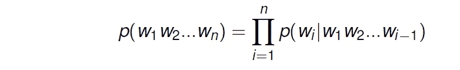

**公式 1:** 简单概率模型。作者使用 Latex & Jupyter 笔记本创建的图像。

p(天使玩的好)= p(天使)x p(玩|天使)x p(玩的好|天使)。计算这些概率需要计算单词和术语的出现次数。尽管越来越复杂和精确，像这样的直接概率模型还没有达到很好的性能。

## 3.2 Word2vec

学习单词向量的框架叫做 Word2vec。Word2vec 是一个神经网络，它使用单词“矢量化”来解析文本。它接受文本语料库作为输入，并产生代表语料库中的单词的一组特征向量。将相似的词向量在向量空间中分组在一起是 Word2vec 的目标和好处。Word2Vec 中有两种截然不同的架构:**跳格**和**连续字包** (CBOW)。

假设我们有大量的文本。在固定的词汇表中，每个单词由一个向量表示。我们使用以下逐步方法计算嵌入:

*   浏览文本的每个位置 **t** ，每个位置都有一个 ***居中的单词*** **c**
*   ***语境(或“外界”)*** 中的词表示为 **o**
*   使用 **c** 和 **o** 的词向量的相似度，计算给定 **c** 的 **o** 的**可能性**。(反之亦然)
*   继续修改单词向量到**增加这种可能性**

## 跳过克模型

在跳格模型中，我们试图对给定特定单词的上下文单词(例如，单词窗口大小)进行建模。

例如，如果我们有文本“Angel 踢足球踢得好”，考虑足球作为中心词(假设)，剩余的词成为上下文。窗口大小表示我们想要考虑多少上下文单词。窗口大小示例和使用两个不同示例计算概率的过程。

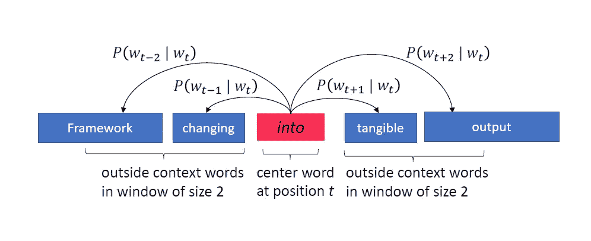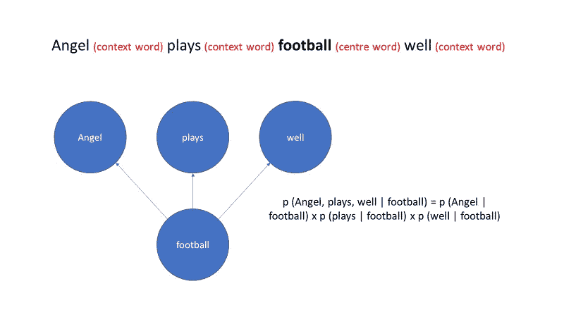

**图 1:** 跳格模型示例。图表用两个不同的例子展示了中心词和上下文词的概念。这里 t 表示中心单词的位置，而 t-1 和 t+1 表示上下文单词的位置。作者使用 PowerPoint 创建的图像。

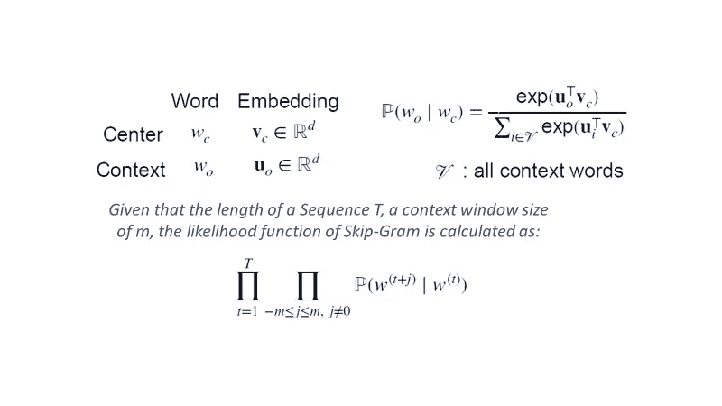

**图二。**说明了 Skip Gram 模型的似然函数。在真实的单词中，训练一种算法来最大化这种可能性，这将导致使用嵌入更准确地表示单词。图片由作者使用 Latex & Jupyter 笔记本创建。

## 使用 Gensim 生成基于跳格图的嵌入的 3.2.1.1 示例

Gensim 是一个开源框架，使用现代统计机器学习进行无监督的主题建模、文档索引、嵌入创建和其他 NLP 功能。我们将使用 Gensim 中的一些标准文本来创建单词嵌入。

```
#----------------------------------------Install and import necessary libraries-----------------------------------# !pip install contractionsimport re, string, unicodedata                          # Import Regex, string and unicodedata.
import contractions                                     # Import contractions library.
from bs4 import BeautifulSoup                           # Import BeautifulSoup.import numpy as np                                      # Import numpy.
import pandas as pd                                     # Import pandas.
import nltk                                             # Import Natural Language Tool-Kit.# nltk.download('stopwords')                              # Download Stopwords.
# nltk.download('punkt')
# nltk.download('wordnet')from nltk.corpus import stopwords                       # Import stopwords.
from nltk.tokenize import word_tokenize, sent_tokenize  # Import Tokenizer.
from nltk.stem.wordnet import WordNetLemmatizer         # Import Lemmatizer. For removing stem words
import unicodedata                                      # Removing accented characters
from nltk.stem import LancasterStemmerfrom IPython.display import display
```

这些包对于数据清理和预处理非常有用。

```
import gensimfrom gensim.models import Word2Vecfrom gensim.test.utils import common_textscommon_texts[['human', 'interface', 'computer'],
 ['survey', 'user', 'computer', 'system', 'response', 'time'],
 ['eps', 'user', 'interface', 'system'],
 ['system', 'human', 'system', 'eps'],
 ['user', 'response', 'time'],
 ['trees'],
 ['graph', 'trees'],
 ['graph', 'minors', 'trees'],
 ['graph', 'minors', 'survey']]
```

在 Word2Vec()中使用 sg=1 创建一个跳格模型。向量大小表示由模型产生的每个单词的嵌入数量。窗口表示窗口大小，即用于生成嵌入的上下文单词的数量。

```
model = Word2Vec(sentences=common_texts, vector_size=3, window=5, min_count=1, workers=4, sg=1)
model.save(“word2vec.model”)print("Embeddings of a Word computer with 3 as Embedding Dimension")print(model.wv['computer'])print("Embeddings of a Word Tree with 3 as Embedding Dimension")print(model.wv['trees'])print("Embeddings of a Word Graph with 3 as Embedding Dimension")print(model.wv['graph'])Embeddings of a Word computer with 3 as Embedding Dimension
[ 0.19234174 -0.2507943  -0.13124168]
Embeddings of a Word Tree with 3 as Embedding Dimension
[ 0.21529572  0.2990996  -0.16718094]
Embeddings of a Word Graph with 3 as Embedding Dimension
[ 0.3003091  -0.31009832 -0.23722696]
```

我们现在将这些嵌入转换成一个列表，并使用 matplotlib()创建一个可视化。如果您检查嵌入的值，它们可能没有什么意义，但是当用图形表示时，它们应该看起来彼此更接近。

```
inter_array=model.wv['human']
comp_array=model.wv['user']
tree_array=model.wv['interface']from mpl_toolkits import mplot3d
import numpy as np
import matplotlib.pyplot as plt%matplotlib inline

c=[10,20,30]labels=['human', 'user', 'interface']fig = plt.figure(figsize=(10, 8))

ax = plt.axes(projection ='3d')

# defining all 3 axes
z = [comp_array[2], inter_array[2], tree_array[2]]
x = [comp_array[0], inter_array[0], tree_array[0]]
y = [comp_array[1], inter_array[1], tree_array[1]]

# plotting
ax.scatter(x, y, z, color=['red','green','blue'])ax.text(comp_array[0],comp_array[1],comp_array[2], "human")
ax.text(inter_array[0],inter_array[1],inter_array[2], "user")
ax.text(tree_array[0],tree_array[1],tree_array[2], "interface")ax.legend(loc="lower right")ax.set_title('3D Representation of words - computer, graph, and tree')
plt.show()
```

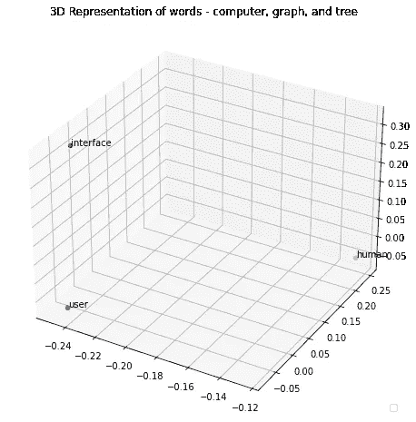

**图 3。**使用从 Gensim 生成的嵌入，单词“界面”、“用户”和“人”的三维表示。作者使用 Jupyter 笔记本创建的图像。

## 3.2.2 连续词袋(CBOW)

在连续词袋(CBOW)模型中，我们试图在给定其周围词(例如，词窗口大小)的情况下对中心词进行建模。

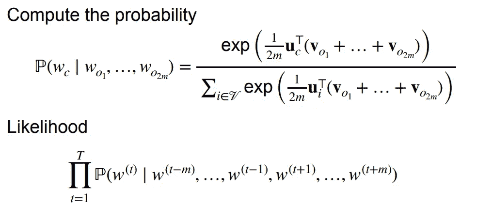

**图 4:**CBOW 模型的例子。与 Skip Gram 类似，CBOW 的可能性函数如上所示。作者使用 Jupyter 笔记本和 Latex 创建的图像。

# 4.从头开始实现 Skip Gram 模型

我们将使用随机生成的关于梅西和罗纳尔多的数据，并通过训练神经网络模型来尝试和开发单词嵌入(Bujokas，2020)。我们将把嵌入的大小保持为两个，允许我们用 Python 创建一个图，并直观地检查给定上下文中哪些单词是相似的。你可以在这里找到作者[生成的样本数据。](https://github.com/angeleastbengal/Data-Collection)

## 4.1 基本 NLP 库

```
import itertools
import pandas as pd
import numpy as np
import re
import os
from tqdm import tqdm#----------------------Drawing the embeddings in Python
import matplotlib.pyplot as plt#-----------------------Deep learning: ANN to create and train embeddings
from tensorflow.keras.models import Modelfrom tensorflow.keras.layers import Input, Dense
```

## 4.2 用户自定义函数:从数据到字典的单词/记号

创建字典的用户定义函数，其中键代表唯一的单词，键值是索引或索引。

```
def create_unique_word_to_dict(sample):
    """
    User defined function that creates a dictionary where the keys represents unique words
    and key values are indices or indexes
    """
    #-------Extracting all the unique words from our sample text and sorting them alphabetically
    #-------set allows us to remove any duplicated words and extract only the unique ones
    words_list = list(set(sample))

    #-------------Sort applied here

    words_list.sort()#------Creating a dictionary for each unique words in the sample text
    unique_word_dict_containing_text = {}

    for i, word in enumerate(words_list): #------For each word in the document

        unique_word_dict_containing_text.update({
            word: i

        })return unique_word_dict_containing_text
```

## 4.3 用户自定义功能:数据清理或文本预处理

这是一个自定义的文本预处理函数。人们可以增强这里使用的停用词列表，以说明更频繁使用的不需要的词。我们使用该功能执行以下操作:

*   删除标点符号
*   删除号码
*   删除空白
*   删除停用词
*   返回清除的文本

```
def text_preprocessing_custom(sample_text):

    #---------------Custome Text Preprocessing created as UDF-----------------------------

    #----------------Regular expression for Punctuations------------------

    punctuations = r''';:'"\,<>./?*_“~'''

    #---------------Stop Words (Custom List)--------------------

    stop_words=['i', 'dont', 'we', 'had','and', 'are', 'of', 'a', 'is', 'the', 'in', 'be',\
                'will', 'this', 'with', 'if', 'be', 'as', 'to', 'is', 'don\'t']

    """
    A method to preproces text
    """
    for x in sample_text.lower():

        if x in punctuations: 

            sample_text = sample_text.replace(x, "")#-------------Removing words that have numbers in them using regular expression---------
    sample_text = re.sub(r'\w*\d\w*', '', sample_text)#-------------Removing whitespaces---------------------
    sample_text = re.sub(r'\s+', ' ', sample_text).strip()# --------Convert to lower case----------------------
    sample_text = sample_text.lower()#--------------Converting all our text to a list------------------
    sample_text = sample_text.split(' ')#--------------Deleting empty strings---------------------
    sample_text = [x for x in sample_text if x!='']# Stopword removal

    sample_text = [x for x in sample_text if x not in stop_words]return sample_text
```

## 4.4 数据预处理和[中心，上下文]单词生成

牢记 Skip Gram 模型的概念，我们需要创建一个框架，允许我们使用大小为 2 的窗口从文本中识别中心词和上下文词的所有组合。请注意，给定文本中的每个单词(经过预处理后)在一个实例中可以是中心单词，在另一个实例中可以是上下文单词。理想情况下，我们允许文本中的每个单词作为中心单词，然后相应地找到相关的上下文单词。

```
from scipy import sparsesample = pd.read_csv('Text Football.csv') #-----Reading text datasample = [x for x in sample['Discussion']]print("--"*50)print("Text in the File")print("--"*50)print(sample)
#----------------------------------------Defining the window for context----------------------------------------
window_size = 2
#----------------------------------------Creating empty lists to store texts---------------
word_lists = []
all_text = []#----------------Combines preprocessed texts from the Sample Datafor text in sample:
#----------------------------------------Cleaning the text
    text = text_preprocessing_custom(text)

    all_text += text#-------------------------Iterating across each word in a text
    for i, word in enumerate(text):for ws in range(window_size):if i + 1 + ws < len(text):

                    word_lists.append([word] + [text[(i + 1 + ws)]])if i - ws - 1 >= 0:
                    word_lists.append([word] + [text[(i - ws - 1)]])

unique_word_dict = create_unique_word_to_dict(all_text)print("--"*50)
print("Text to Sequence in post cleaning")
print("--"*50)
print(unique_word_dict)
print("--"*50)
print("Text to WordList [main word, context word]")
print("--"*50)
print(word_lists)
```

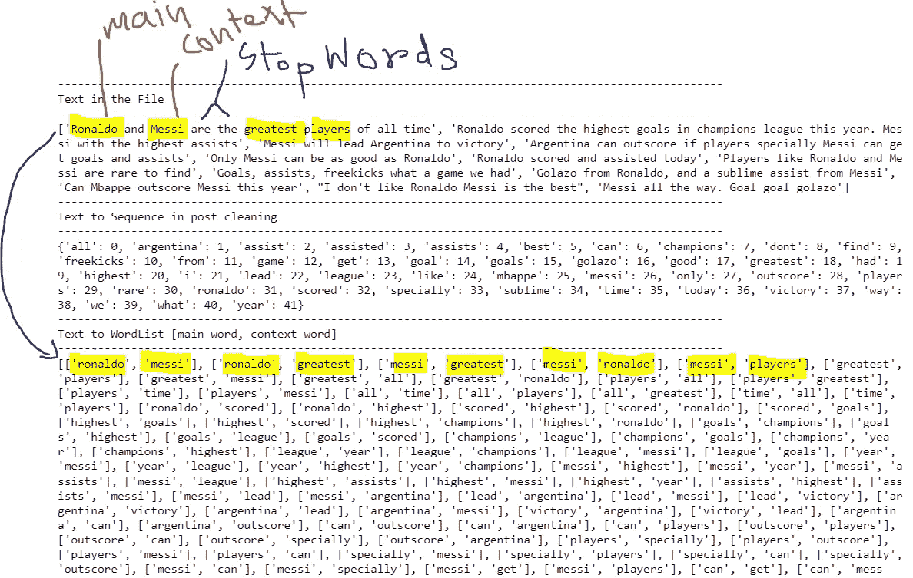

**图 5:** 如何生成中心(主要)和上下文单词的示例。作者使用 Jupyter 笔记本创建的图像。

## 4.5 为神经网络生成输入和输出数据

我们现在将使用主要单词(中心单词)作为神经网络的输入，使用上下文单词作为输出。输入和输出层之间的深层致密层将学习嵌入。想法是在单个隐藏层内训练一个 2 神经元神经网络，其中在训练模型时学习的权重将反映从数据中学习的嵌入。为了让我们的数据与 Tensorflow 架构兼容，我们对上面生成的主单词和上下文单词列表执行了一次热编码(OHE)。

```
def create_OHE_data(word_dict, word_lists):#----------------------------------------Defining the number of unique words----------------------------------------
    n_unique_words = len(word_dict)#----------------------------------------Getting all the unique words----------------------------------------
    words = list(word_dict.keys())#----------------------------------------Creating the X and Y matrices using one hot encoding---------------------------------
    X = []
    Y = []for i, word_list in tqdm(enumerate(word_lists)):#----------------------------------------Getting Indicies----------------------------------------index_main_word = word_dict.get(word_list[0])
        index_context_word = word_dict.get(word_list[1])#----------------------------------------Creating the placeholders   
        Xrow = np.zeros(n_unique_words)
        Yrow = np.zeros(n_unique_words)#----------------------------------------One hot encoding the main word, Input Matrix
        Xrow[index_main_word] = 1#----------------------------------------One hot encoding the Y matrix words, Output Matrix 
        Yrow[index_context_word] = 1#----------------------------------------Appending to the main matrices
        X.append(Xrow)
        Y.append(Yrow)#------------------------Converting the matrices into a sparse format because the vast majority of the data are 0s
    X_Matrix = sparse.csr_matrix(X)
    Y_Matrix = sparse.csr_matrix(Y)print("--"*50)
    print("Input Data [Showing the First Record]")
    print("--"*50)print(X_Matrix.todense()[0])
    print(X_Matrix.todense().shape)print("--"*50)
    print("Output Data [Showing the first record]")
    print("--"*50)print(Y_Matrix.todense()[0])
    print(Y_Matrix.todense().shape)

    return X_Matrix, Y_MatrixX, Y = create_OHE_data(unique_word_dict, word_lists)
```

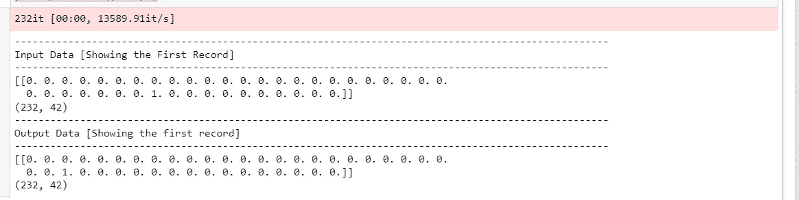

**图 6:**OHE 生成输入输出数据的例子。作者使用 Jupyter 笔记本创建的图像。

## 4.6 训练神经网络以生成嵌入

下面展示了一个示例架构的外观。

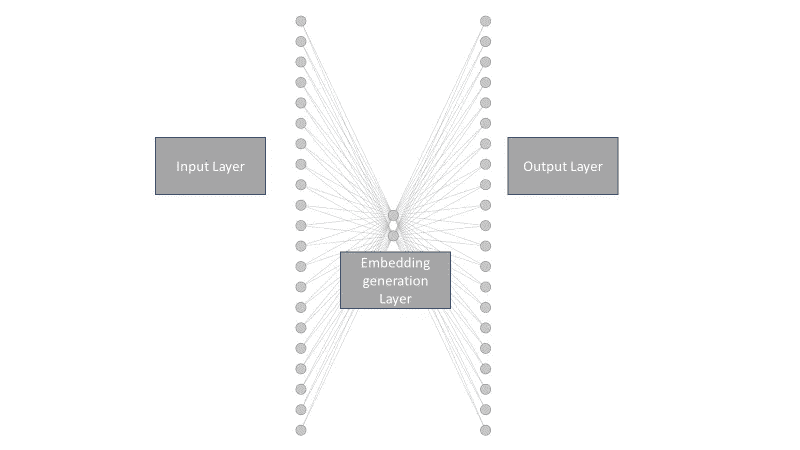

**图 7:** 示出了用于训练嵌入的双神经元神经网络。作者使用 PowerPoint 开发的图像。

```
from tensorflow.keras.models import Sequentialdef embedding_model():

    model=Sequential()

    model.add(Dense(2, input_shape=(X.shape[1],), activation='relu'))

    model.add(Dense(units=Y.shape[1], activation='softmax'))

    model.compile(loss = 'categorical_crossentropy', optimizer = 'adam')

    return modelmodel_embbedding=embedding_model()model_embbedding.summary()#----------------------------------------Optimizing the network weights----------------------------------------
model_embbedding.fit(
    x=X.todense(), 
    y=Y.todense(), 
    batch_size=64,
    epochs=1000,
    verbose=0
    )#----------------------------------------Obtaining the weights from the neural network----------------------------------------
#----------------------------------------These weights are equivalent to word embeddings--------------------------------------weights = model_embbedding.get_weights()[0] #---embeddings#----------------------------------------Creating Dictionary to Store Embeddings----------------------------------------
embedding_dict = {}
for word in words_list: 
    embedding_dict.update({
        word: weights[unique_word_dict.get(word)]
        })
embedding_dict
```

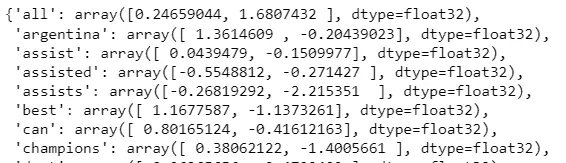

**图 8:** 从模型中生成的嵌入示例。作者使用 Jupyter 笔记本创建的图像。

```
# !pip install ann_visualizerfrom ann_visualizer.visualize import ann_vizann_viz(model_embbedding, view=True, filename='embed.pdf', title='ANN Architecture for embedding')
```

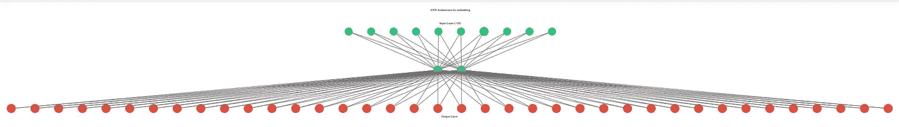

**图九。**说明了用于生成嵌入的人工神经网络架构。作者使用 Jupyter + ann_visualizer()开发的图片

[](/how-to-visualize-neural-network-architectures-in-python-567cd2aa6d62) [## 如何用 Python 可视化神经网络架构

### 使用 Jupyter 或 Google Colab 创建神经网络图示的快速指南

towardsdatascience.com](/how-to-visualize-neural-network-architectures-in-python-567cd2aa6d62) 

## 4.7 直观地表示学习到的嵌入

```
#----------------------------------------Ploting the embeddings----------------------------------------
plt.figure(figsize=(15, 10))import seaborn as snssns.set(color_codes=True)plt.title("Embeddings")for word in list(unique_word_dict.keys()):

    coord = embedding_dict.get(word) #------------------------Extracting Embeddings

    plt.scatter(coord[0], coord[1]) #-----------------------Plotting Embeddings

    plt.annotate(word, (coord[0], coord[1]))  #----------------Annotate tokens
```

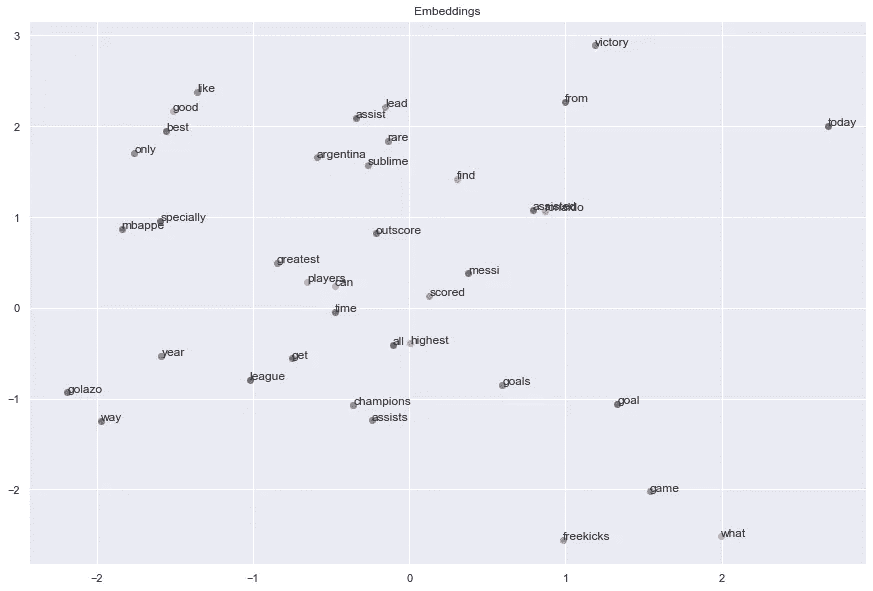

**图 9:** 从模型中生成的嵌入的可视化表示。作者使用 Jupyter 笔记本创建的图像。

## 4.8 观察

在足球界，梅西和罗纳尔多经常被全球球迷拿来比较。因此，它们更有可能在数据中同时出现。像“最伟大”、“球员”、“得分”和“得分外”这样的术语经常被用来评论球员的表现。使用随机生成的 12 个文本，我们在上图中捕捉到了这些变化和共现。注意少数停用词没有被删除；因此他们出现在情节中。这可以使用我们的 text_preprocessing_custom()函数来增强。正如前面所反映的，当我们研究数值时，图 8 中的嵌入可能没有多大意义。尽管如此，当绘制时，我们推断在相似上下文中使用的共现单词看起来彼此更接近。

# 5.结论

Tensorflow 的递归神经网络提供了一个嵌入层，可以在我们训练分类器模型时自动从文本中生成嵌入。这个过程包括使用文本矢量化将单词或句子映射到向量或一组数字。我们的独热向量——稀疏，因为它的大多数条目都是零——被嵌入层转换成密集的嵌入向量(密集，因为维度小得多，并且所有元素都是自然数)。它只需要一个完全连接的层来构成这个嵌入层(张量流，n.d .)。然而，当我们训练分类模型时，训练嵌入是耗时的。在这种情况下，如果我们有大量的数据，生成嵌入的灵活性允许我们减少创建分类模型所涉及的计算时间。嵌入也是比传统方法更好的单词表示，如单词袋和词频-逆文档频率。其他预先训练的模型，如伯特，生物伯特，手套，Edu 伯特等。，为用户提供使用预训练模型生成嵌入的灵活性。

# 6.参考

1.  布约卡斯，E. (2020 年 5 月 30 日)。创建单词嵌入:使用深度学习在 Python 中编码 Word2Vec 算法。从中观网站检索:[https://towards data science . com/creating-word-embeddings-coding-the-word 2 vec-algorithm-in-python-using-deep-learning-b 337d 0 ba 17 a 8](/creating-word-embeddings-coding-the-word2vec-algorithm-in-python-using-deep-learning-b337d0ba17a8)
2.  杰森·布朗尼。(2017 年 10 月 10 日)。什么是文本的单词嵌入？从机器学习大师网站检索:[https://machinelementmastery . com/what-are-word-embedding/](https://machinelearningmastery.com/what-are-word-embeddings/)
3.  张量流。(未注明)。基于 RNN 的文本分类。从 TensorFlow 网站检索:[https://www . tensor flow . org/text/tutorials/text _ classification _ rnn](https://www.tensorflow.org/text/tutorials/text_classification_rnn)

*关于作者:高级分析专家和管理顾问，帮助公司通过对组织数据的商业、技术和数学的组合找到各种问题的解决方案。一个数据科学爱好者，在这里分享、学习、贡献；可以和我在* [*上联系*](https://www.linkedin.com/in/angel-das-9532bb12a/) *和* [*推特*](https://twitter.com/dasangel07_andy)*；*