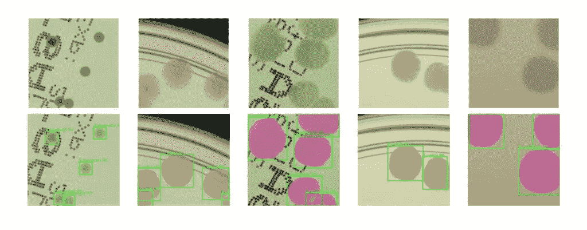
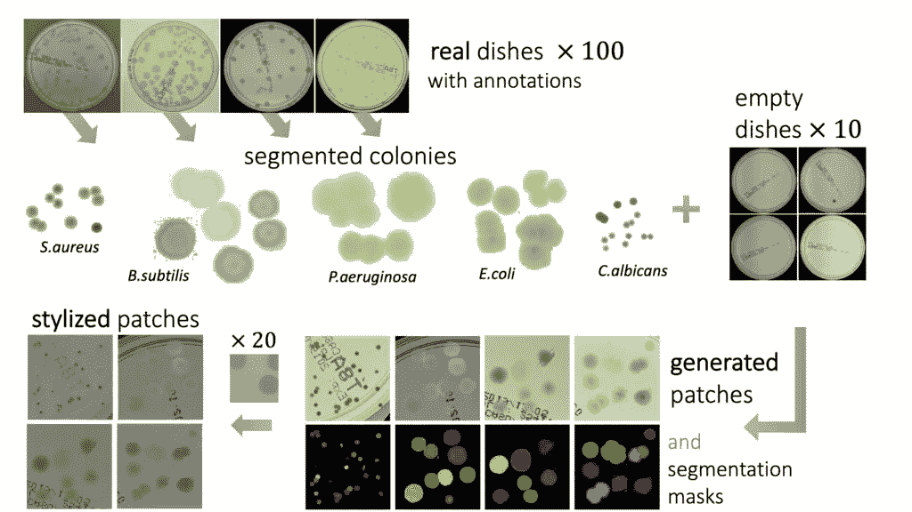
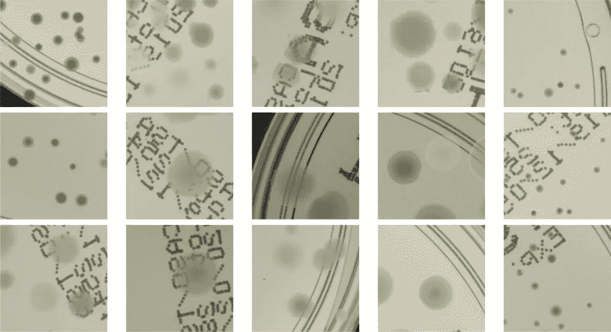
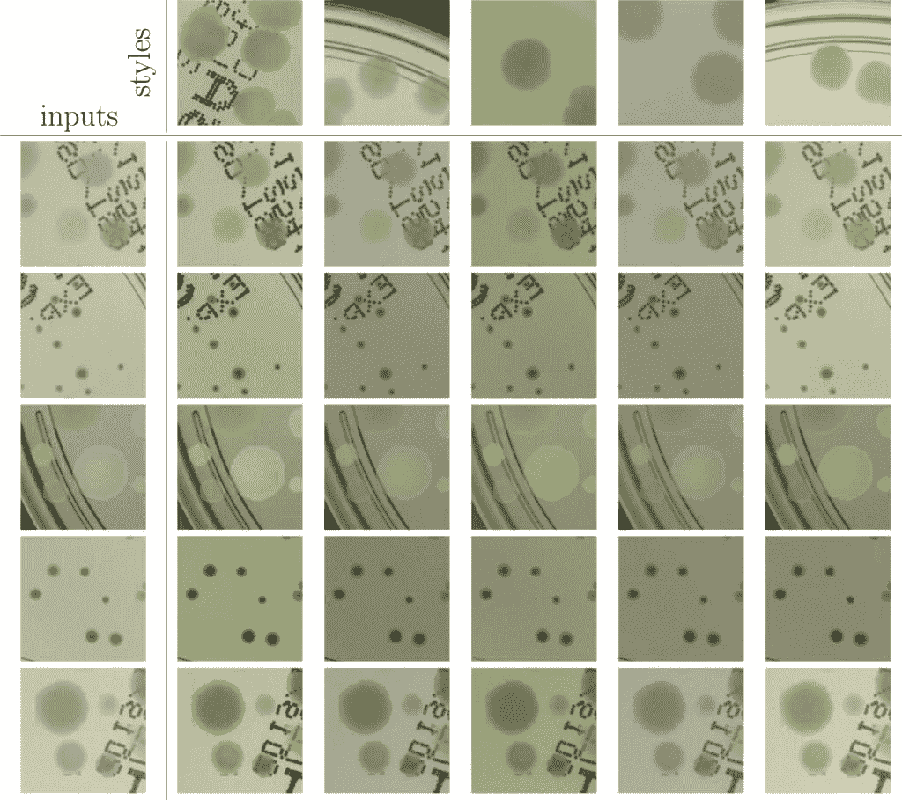
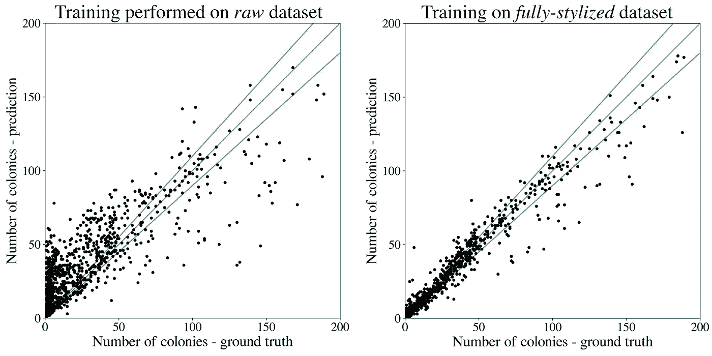

# 具有深度学习风格转移的合成微生物数据集的生成

> 原文：<https://towardsdatascience.com/generation-of-a-synthetic-microbial-dataset-with-deep-learning-style-transfer-d6b879aaaf2d>

## 生成用于训练深度学习检测器的带注释的合成数据集的有效策略

*作者* [*雅罗斯瓦夫*](https://medium.com/@jaroslaw.pawlowski) *和* [*西尔维娅*](https://medium.com/@sylwia.majchrowska) *。*

作者图片。

**深度学习模型**实现了比传统计算机视觉算法高得多的精确度。当使用传统方法进行图像识别时，特征提取算法是手动调整的，这在许多情况下是一个耗时的过程。相反，在深度卷积网络中，特征工程是自动执行的——网络学习如何自己提取最佳特征图，并在后续卷积中优化内核，以仅保留图像中的相关信息。

所以现在我们不需要花费数周时间来寻找最佳参数。但这是有代价的。为了通过复杂的深度学习模型获得足够的结果，我们需要足够大的数据集。收集和注释大数据集需要大量的时间和财力。此外，贴标过程本身也具有挑战性。**合成数据**是一种很有前途的替代方法，可以解决缺乏足够大的数据集的问题，并减少与收集此类数据相关的资源和成本[1]。此外，它可能有助于机构共享知识，例如高度专业化领域的数据集，同时保护个人隐私。

我们的目标是[识别培养皿上的微生物菌落](https://neurosys.com/recognition-and-counting-of-microorganisms)——这是微生物学中的典型任务。即使对训练有素的专业人员来说，这项任务也很难完成，因为有些菌落容易聚集和重叠，因此非专业人员很难分辨。在这篇文章中，我们将提出一种有效的策略来生成一个由微生物图像组成的**带注释的合成数据集**，我们已经在[自然*科学报告*杂志](https://www.nature.com/articles/s41598-022-09264-z)【2】上发表了该数据集。然后，生成的数据集用于以完全监督的方式**训练**深度学习**对象检测器**。该生成器采用传统的计算机视觉算法以及神经类型的传输方法进行数据扩充。我们表明，该方法能够合成逼真图像的数据集，该数据集可用于训练能够定位、分割和分类五种不同微生物物种的神经网络模型。我们的方法比[收集并标记一大组带有注释的真实图像](https://neurosys.com/annotated-germs-automated-recognition-agar)需要更少的资源来获得有用的数据集。

> 我们表明，从 100 幅真实图像开始，我们可以生成数据来训练一个检测器，该检测器可以获得与同一检测器相当的结果[3]，但要在一个真实的、大几十倍的[微生物数据集](https://agar.neurosys.com/) [4]上进行训练，该数据集包含超过 7k 幅图像。

# 生成合成数据集

现在让我们详细描述该方法。目标是生成带有微生物菌落的合成图像，这些图像将在以后用于训练深度学习检测和分割模型。管道如图 1 所示。注意，我们的生成框架的 Python 实现的源代码是公开可用的。

*图一。一种合成数据集生成流水线方案。使用传统的计算机视觉算法从真实图像中分割出微生物菌落，然后随机排列在空盘子的碎片上，给出带有精确注释的合成补丁。为了提高生成的数据的真实性，然后使用神经风格转移方法对面片进行风格化。图改编自[2]。*

我们从培养皿的标记真实图像开始，使用传统的计算机视觉算法进行菌落分割，包括适当的过滤、CIELab 颜色空间中的阈值处理和基于能量的分割——我们使用强大的 [Chan-Vese 算法](https://scikit-image.org/docs/stable/auto_examples/segmentation/plot_chan_vese.html)。为了获得一个平衡的工作数据集，我们从最近推出的[琼脂数据集](https://agar.neurosys.com/)【4】的*高分辨率*子集中为 5 种微生物物种中的每一种随机选择 20 张图像(总共给出 100 张图像)，这些图像可以根据请求从[这个站点](https://agar.neurosys.com/)免费下载。

第二步，**将分割的菌落和菌落簇随机排列在空培养皿的碎片上**(我们称之为贴片)。我们从 10 个真实的空盘子图像中随机选择一个片段。我们重复这个步骤很多次，把随后的集群放在随机的地方，确保它们不重叠。与此同时，**我们存储了放置在小块上的聚类中每个菌落的位置及其分割掩码**，为该小块创建了一个注释字典。我们在图 2 中展示了生成的合成补丁的例子。

*图二。在风格化步骤之前具有微生物菌落的合成贴片的实例。图改编自[2]。*

正如我们在图 2 中所看到的，在某些情况下，菌落不能很好地与背景融合，它们的颜色与背景颜色不匹配。为了解决这个问题并**提高生成数据的真实性**，在第三步中，我们使用神经类型转移方法应用**数据扩充。我们将风格从作为风格载体的选定实像之一转移到给定的原始面片。我们选择了 20 个具有显著不同光照条件的真实片段，以增加生成的碎片的多样性。风格化步骤后的示例性贴片如图 3 所示。我们使用[5]中介绍的快速有效的深度学习风格化算法。这种方法为我们的原始微生物图像提供了最真实的风格化，而不会引入任何不想要的伪像。**

*图 3。生成的微生物图像的风格化。五个合成补片(左)使用五个真实图像(上)的样式进行风格化。图改编自[2]。*

# 训练深度学习模型

使用这种方法，我们生成了大约 50k 个补丁，然后进行了风格化处理。所进行的实验背后的想法是**使用合成数据**训练一个神经网络模型来检测微生物菌落，然后**用培养皿上的细菌菌落在真实图像**上测试其性能。我们使用我们的合成数据集训练流行的 R-CNN 检测器。图 4 给出了对琼脂数据集的真实斑块进行级联 R-CNN [6]检测器评估的示例。该模型在不同光照条件下检测各种大小的微生物菌落表现得相当好。

自动实例分割是在许多生物医学应用中有用的任务。在面片生成过程中，我们还为每个菌落存储一个像素级的分割掩模。我们使用这些额外的信息来训练深度学习实例分割模型——Mask R-CNN[7]，它扩展了我们已经训练过的 R-CNN 检测器。真实样本的分割结果也呈现在图 4 中。获得的不同微生物菌落类型的实例分割正确地再现了菌落形状。

*图四。真实数据上的微生物菌落检测示例(用绿色边框标记)—来自琼脂数据集的不同微生物种类的培养皿片段。例如分割的结果被呈现为颜色分割遮罩。图改编自[2]。*

物体检测在微生物学中的主要应用之一是对培养皿上生长的微生物菌落进行自动计数。我们通过将其与标准方法进行比较来验证所提出的合成数据集生成方法，在标准方法中，我们收集大的真实数据集并训练检测器用于菌落识别和计数任务。

我们在使用来自*高分辨率*琼脂子集的 **100** 图像生成的 50k 大数据集上训练 R-CNN 检测器(Cascade ),并在与【4】中执行的相同任务中测试微生物菌落计数。结果如图 5(右)所示。结果表明，合成数据集的检测精度和计数误差仅比同一检测器稍差[3]，但在包含超过 **7k** 真实图像的整个大数据集上进行训练，给出了大约 65k 个面片。同样清楚的是，**引入风格转移增强大大提高了检测质量**，并且在没有风格化步骤的情况下，结果相当差——参见图 5(左)中的*原始*数据集的结果，即在没有风格化步骤的情况下获得的结果。

*图 5。对两个不同的合成训练数据集的真实数据进行微生物菌落计数测试:**raw——无风格化(左)和风格化(右)。风格化大大提高了检测性能。在理想的检测中，代表单个培养皿图像的每个黑点应该位于 y = x 黑线上。图改编自[2]。*

# 摘要

我们引入了一种有效的策略来生成培养皿微生物图像的带注释的合成数据集，该数据集可用于以完全监督的方式训练深度学习模型。通过使用传统的计算机视觉技术，辅以深度神经类型转移算法，我们能够建立一个仅提供 100 幅真实图像的微生物数据生成器。与收集和标记包含数千幅真实图像的大型数据集相比，它需要的精力和资源要少得多。

> 我们证明了该方法在微生物检测和分割中的有效性，但是我们期望该方法具有灵活性和通用性，还可以应用于科学和工业的其他领域来检测各种对象。

# 参考

[1][https://blogs . NVIDIA . com/blog/2021/06/08/what-is-synthetic-data](https://blogs.nvidia.com/blog/2021/06/08/what-is-synthetic-data)

[2]j . paw owski，S. Majchrowska 和 T. Golan，*具有深度学习风格转移的微生物菌落数据集的生成*，科学报告 12，5212 (2022)。[https://doi.org/10.1038/s41598-022-09264-z](https://doi.org/10.1038/s41598-022-09264-z)

[3]检测 mAP = 0.416(越大越好)，计数 MAE = 4.49(越小越好)指标，与 mAP = 0.520 和 MAE = 4.31 相比，获得了相同的检测器，但使用琼脂数据集进行了训练[4]。

[4] S. Majchrowska，J. Pawł owski，G. Guł，T. Bonus，A. Hanas，A. Loch，A. Pawlak，J. Roszkowiak，T. Golan 和 Z. Drulis-Kawa，*琼脂微生物菌落数据集用于深度学习检测* (2021)。可在 arXiv[[arXiv:2108.01234](https://arxiv.org/abs/2108.01234)]获得预印本。

[5]，叶春阳，，*用于真实感风格传递的高分辨率网络* (2019)。预印本可从 atXiv[[arXiv:1904.11617](https://arxiv.org/abs/1904.11617)]获得。

[6]蔡志勇和，*级联 R-CNN:深入研究高质量目标检测*，IEEE/CVF 计算机视觉与模式识别会议，6154–6162(2018)。

[7] K. He，G. Gkioxari，P. Dollár，R. Girshick， *Mask R-CNN* ，IEEE 计算机视觉国际会议(ICCV)，2980–2988(2017)。

作为精明增长运营计划的一部分，该项目由欧洲区域发展基金下的欧盟基金共同资助。作为国家研究与发展中心的一部分实施的项目:快速通道。

*原载于 2022 年 5 月 06 日*[*【https://neurosys.com】*](https://neurosys.com/deep-learning-synthetic-microbial-dataset)*。*