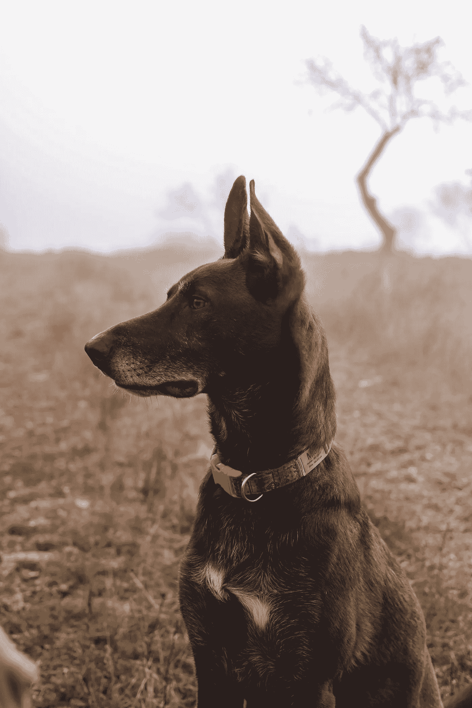

# 生成性对抗学习

> 原文：<https://towardsdatascience.com/generative-adversarial-learning-b1d5b4f6b2bc>

## **从生成性到“加对抗性”**



由[german Kaser](https://unsplash.com/@germio?utm_source=unsplash&utm_medium=referral&utm_content=creditCopyText)在 [Unsplash](https://unsplash.com/s/photos/generating-real-data?utm_source=unsplash&utm_medium=referral&utm_content=creditCopyText) 上拍摄的照片

假设我们有一个真实图像的数据集。比如各种场景下的狮子图片。从这个数据集中，我们希望机器学习生成看起来像真实图像的新图像。

生成对抗网络，简称 GANs，是解决这一问题的一种令人信服的方法。

GAN 包括两个模型，一个发生器和一个鉴别器。生成器生成合成图像。鉴别器被训练来区分真实图像和合成图像。

生成器通过来自鉴别器的反馈进行学习。鉴别器识别它检测到的合成图像中的哪些是假的。发电机显然应该产生更少的能量。因为它们很容易被发现是假货。

发电机和鉴别器在战斗中被锁定。他们试图超越彼此。来回的竞争改善了这两者。

一旦(并且如果)发生器变得足够好以至于鉴别器不能可靠地区分真实图像和合成图像，则该过程停止。比乱猜要好。

**让我们从生成开始**

为了理解鉴别器所扮演的角色，首先让我们把它排除在外。

假设我们已经在真实图像数据集上训练了一个初始的无监督生成模型。它生成的图像有多真实？如果不够现实，我们如何通过机器学习来改善它？

评估生成器质量的一种自然方法是通过一种典型的模型优度的非监督测量。例如模型与验证集(即训练集的保留子集)的拟合程度。使用最大似然或更简单的标准，如平方和。

在现实环境中，这是不够有效的。

为什么不呢？

现实世界通常是巨大的。训练集是从复杂分布中抽取的微小部分。事实上，所有的实像可能只是宇宙中很小很小的一部分。来自宇宙的随机样本几乎肯定会被检测为赝品。

举个例子。一百万像素的二进制图像。宇宙的大小是“二的百万次方”。拥有十亿张图片的狮子真实图片训练集仍然只是很小的一部分。它们来自一个非常复杂的分布。也就是说，对真正的狮子图像进行表面上的小变形，就能让它看起来不真实。

让我们用一个不同的例子来阐述“表面的小失真”。

假设我们有一个非常大的实际手写 0 和 1 的数据集。说所有 1 的图像都是由直线组成的。假设在这个数据集上训练的生成器的第一个版本生成了许多轮廓弯曲的 1。(也许生成器被数据集中的 0 搞糊涂了。它们是弯曲的。)

我们如何判断发电机还不够好，因为它正在产生*弯曲的*1？

在验证集上评估我们的模型的适应性可能不会很好。验证集没有任何曲线 1。

这告诉我们以下几点。为了评估生成器的适用性，我们还应该查看它生成的合成图像样本，以及它们与真实图像的关系。

这里有一个来自教育环境的类比。要区分哪些学生已经掌握了某个主题，哪些学生还没有，并不总是那么容易。而不进行测试和评估不同学生的答案，因为它们与正确答案相关。

教育环境中的测试也可以揭示某个学生目前在哪些方面比较薄弱，以指导改进。这里也一样。

**走上“正途”**

所以我们得出结论，我们应该通过比较生成器生成的合成图像和真实图像来评估生成器的质量。我们究竟如何进行这种比较？

我们使用鉴别分类器。

我们有一组真实图像和一组合成图像。将这两者结合起来就产生了二元分类器的标记数据集。

在该数据集上训练二元分类器，并评估其预测准确性。(如有必要，使用列车测试分割。)

如果分类器比随机预测更好，挑出那些标记为合成的图像，它也预测为合成的。这些是很容易与真货区分开来的假货。使用此反馈重新训练发电机。

在我们的例子中，我们预计鉴别器将揭示生成器正在生成许多曲线 1，这些曲线 1 很容易被预测为合成的。

**为什么要有*鉴别力*鉴别力？**

用我们的例子来推理吧。如果我们的分类器能够以某种方式自动学习到一幅有曲线和其他一些区别于 0 的特征的图像不是真实的，那就太好了。

鉴别分类器有相当大的机会学习能够冲洗掉这种类型的假货的特征。生成分类器可能不能。无法学习*在两个类之间区分*的特征。尤其是不要“图像有曲线和一些其他特征，使其区别于 0”。

线是“弯曲的”是高阶特征。与数据世界相比，高阶特征的世界超级庞大。我们已经注意到，后者是巨大的。生成模型很难找到“正确的”高阶特征，因为它们只能处理模型适应性。鉴于判别学习的使用，判别模型有更好的机会。

**菜谱**

好了，现在我们有了基本的配方。我们重复以下步骤。

```
1\. Train the generator.
2\. Generate synthetic images from it.
3\. Train the discriminator on the real+synthetic images.
4\. Identify the regime (if any) in which the generator is weak. Use
   this as feedback when going back to step 1.
```

请注意，训练是分轮进行的，发电机训练和鉴别器训练在一轮中交替进行。

实现这个方法的一种自然方式是由这四个步骤组成的重复管道。每一步的输入和输出都是明确定义的。我们有一些自由来选择它的实现。例如，我们可以为步骤 3 使用任何二元分类器。

**增量学习和损失函数**

在这一部分，我们以不同的方式来看待培训。从迭代训练和损失函数的角度。这一视角也让我们得以一瞥生殖对抗网络是如何运作的。

生成器和鉴别器都通过来自鉴别器最新实例的反馈来学习。我们首先讨论这种反馈的形式。

设 *D* ( *x* )表示鉴别器 *D* 分配给一个数据 *x* 的分数。 *D* ( *x* )如果 *D* 认为 *x* 是假的就为低，如果 *x* 是真的或者 *D* 认为是真的就为高。

现在开始发电机 *G* 的训练。假设鉴别器已经从与真实数据集结合的初始生成器的输出中被训练。

让我们想象重复做下面的事情。

```
1\. Sample a synthetic image *s* from *G*.
2\. If *D*(*s*) is low, update *G*’s parameters so as to reduce the likelihood that *G* will sample this particular *s* subsequently.
```

而在第 2 步中，我们说`this particular *s*` ，我们真正的意思是`with the same characteristics as this particular *s*`。换句话说，我们希望增量训练能够一般化，不仅降低对这个特定的 *s* 进行采样的可能性，而且降低对那些具有与这个 *s* 相似特征的样本进行采样的可能性。

接下来，是鉴别训练。为此，我们假设除了真实图像的数据集之外，我们还有一个来自生成器最新版本的合成图像。让我们把两者结合起来。设 *x* 表示一个数据，y 表示其标签:*真实*或*合成*。现在想象将标记数据集中的每个实例( *x* ， *y* )逐一呈现给鉴别器。如果 *y* 为真，我们寻求更新 *D* 的参数，以便增加 *D* ( *x* )。如果 *y* 是合成的，我们寻求更新 *D* 的参数，以便减少 *D* ( *x* )。

生成器仅从合成图像上的鉴别器分数中学习。相比之下，鉴别器从鉴别器在真实图像和合成图像上的分数中学习。如果鉴别器学习仅限于从合成图像中学习，那就不好了。它可能会决定给所有的图像分配低分，甚至是真实的图像，这对于在下一轮训练生成器来说是不好的反馈。

**模式崩溃**

没有什么可以阻止生成器偏爱数据中的某些模式，在极端情况下只有一个模式。考虑我们的数字示例，扩展到 0 到 9。如果生成器难以生成真实的 8，它可以完全放弃生成 8。这个鉴别器只能辨别真假。它无法判断合成图像中是否缺少 8。这些模式甚至没有在真实数据集中标注。

**总结**

在这篇文章中，我们讨论了在学习生成与给定数据集中的数据非常相似的数据的背景下的生成性对抗学习。

我们从生成学习开始，并解释了为什么它不太可能在这项任务中充分发挥作用。然后，我们在混合中引入了判别学习。

生成器和鉴别器相互竞争。这迫使双方都要改进。

**延伸阅读**

1.  [生成对抗网络——维基百科](https://en.wikipedia.org/wiki/Generative_adversarial_network)
2.  [第 13 讲:生成模型](http://cs231n.stanford.edu/slides/2017/cs231n_2017_lecture13.pdf)
3.  [https://developers . Google . com/machine-learning/gan/generator](https://developers.google.com/machine-learning/gan/generator)