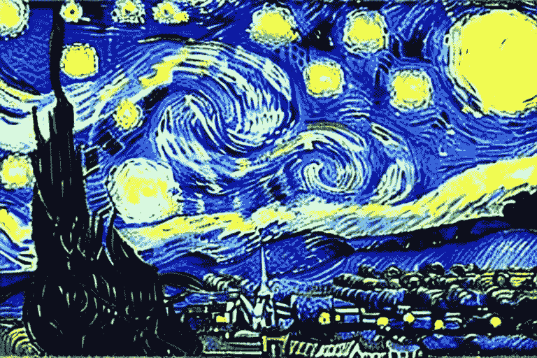
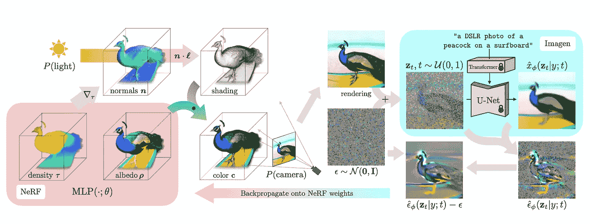
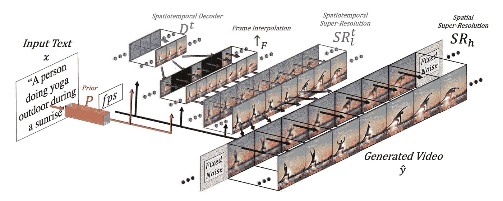
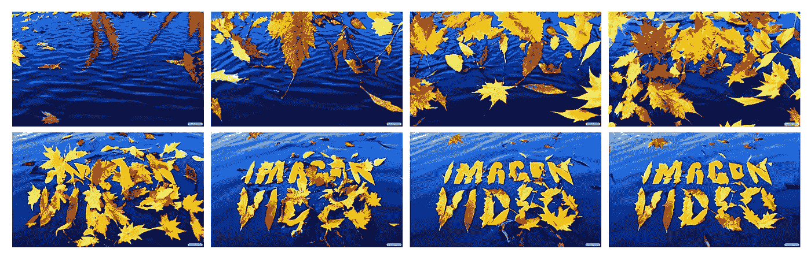
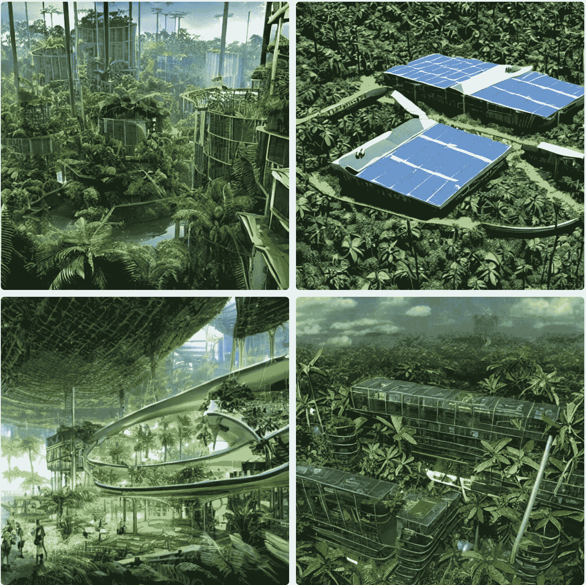
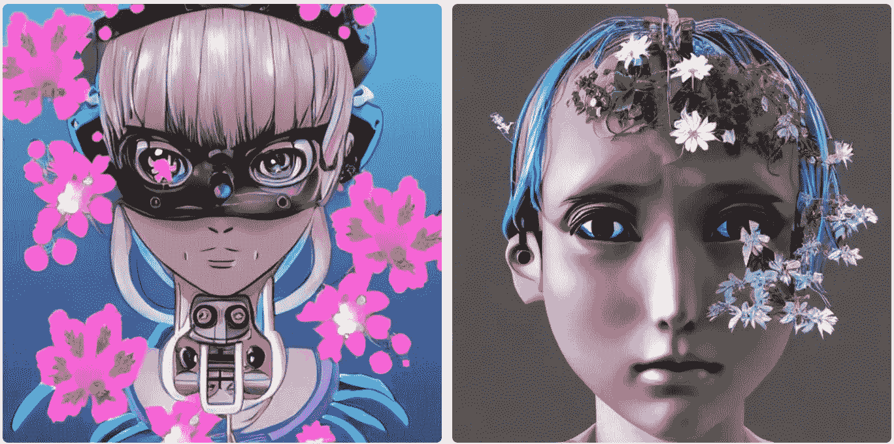
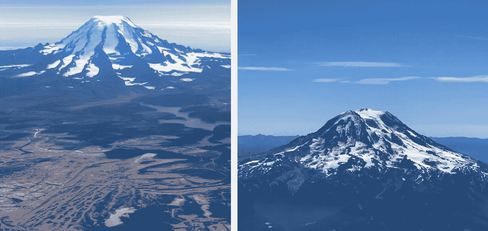

# 稳定扩散，梦想融合，制作视频，图像视频，下一步是什么

> 原文：<https://towardsdatascience.com/generative-ai-878909fb7868>

## 生成式人工智能概述

## 用于文本到图像、文本到 3D 和文本到视频的生成式人工智能

星夜(作者利用[稳定扩散](https://www.mage.space))

新一代人工智能还处于萌芽状态，但正在呈指数级增长。自从 OpenAI 首次亮相 GPT-3 和 DALL E 以来，它一直在人工智能领域抢尽风头

2022 年是文本到内容的时代(又名 AIGC)。2022 年 4 月，OpenAI 发布了 DALL E 2，在[的论文](https://arxiv.org/abs/2204.06125)中描述了关于剪辑和扩散模型。这是第一次从自然语言的文本描述中创造出逼真的图像和艺术。

四个月后，初创公司 StabilityAI [宣布](https://stability.ai/blog/stable-diffusion-public-release)发布 stability Diffusion，这是一款开源的文本到图像生成器，可以在几秒钟内创作出令人惊叹的艺术作品。它可以在消费级 GPU 上运行，速度和质量都有所突破。它如此炙手可热，以至于在 2022 年 10 月 17 日的种子轮中成为了[独角兽。](https://www.bloomberg.com/news/articles/2022-10-17/digital-media-firm-stability-ai-raises-funds-at-1-billion-value)

2022 年 9 月 29 日，谷歌宣布 [DreamFusion](https://arxiv.org/abs/2209.14988) 使用 2D 扩散技术进行文本到 3D 的生成。同一天，Meta 宣布[制作一个视频](https://arxiv.org/abs/2209.14792)用于没有文本视频数据的文本到视频生成。

不到一周，谷歌似乎回应了 Meta 的视频制作，推出了文本转视频的图片视频。

在过去半年的这段激动人心的旅程中， [Midjourney](https://www.midjourney.com/app/) 和 [CogVideo](https://github.com/THUDM/CogVideo) 同样重要。Midjourney 是一个独立的研究实验室，提供 Midjourney Bot 来从文本生成图像。CogVideo 是第一个开源的大规模预训练文本转视频模型，拥有 94 亿个参数。

在这里，我将描述他们是如何工作的稳定扩散，文本到 3D，文本到视频。此外，让我们体验一下无需编码的文本到图像的美妙体验，看看接下来会发生什么。

## 稳定扩散和不稳定扩散

[稳定扩散](https://arxiv.org/abs/2112.10752)引入了条件潜在扩散模型(LDM ),以实现图像修复和类别条件图像合成的最新技术水平，以及在各种任务上极具竞争力的性能，包括文本到图像合成、无条件图像生成和超分辨率，同时与基于像素的 LDM 相比显著降低了计算要求。该方法可以在不降低质量的前提下，显著提高去噪扩散模型的训练和采样效率。

条件潜在扩散模型通过串联或更一般的交叉注意机制来解释(来源:[潜在扩散模型](https://arxiv.org/abs/2112.10752)

在释放稳定扩散的同时，StabilityAI 开发了一个基于 AI 的安全分类器，默认启用。它理解几代人的概念和其他因素，以消除用户不想要的输出。但是对于强大的图像生成模型，可以很容易地调整它的参数。

基于稳定的扩散，[法师](https://www.mage.space)出现在浏览器中生成 [NSFW](https://en.wikipedia.org/wiki/Not_safe_for_work) 内容。这是直接和免费使用，没有 NSFW 滤波。

不要混淆。**不稳定扩散**是一个使用稳定扩散支持 AI 生成 NSFW 内容的社区。毫无疑问，这些模特可以在[帕特伦](https://www.patreon.com)和[拥抱脸](https://huggingface.co)上找到。

## 文本转 3D 的 DreamFusion

谷歌和 UCB 共同推出了使用 2D 扩散的文本到 3D 生成的 DreamFusion。

[DreamFusion](https://arxiv.org/abs/2209.14988) 通过一种新颖的 SDS(分数提取采样)方法和一种新颖的 NeRF(神经辐射场)类渲染引擎，将可扩展的高质量 2D 图像扩散模型转移到 3D 域。DreamFusion 不需要 3D 或多视图训练数据，仅使用预训练的 2D 扩散模型(仅在 2D 图像上训练)来执行 3D 合成。[3]

DreamFusion 演示了从自然语言字幕生成 3D 对象(来源: [DreamFusion](https://arxiv.org/abs/2209.14988) )

如上所示，场景由针对每个字幕随机初始化并从头开始训练的 NeRF 来表示。NeRF 使用 MLP 参数化体积密度和反照率(颜色)。DreamFusion 从随机相机渲染 NeRF，使用从密度梯度计算的法线以随机照明方向对场景进行着色。阴影揭示了从单个视点看不清楚的几何细节。为了计算参数更新，DreamFusion 扩散渲染并使用(冻结的)条件 Imagen 模型重建渲染，以预测注入的噪声。

尽管 DreamFusion 产生了引人注目的结果，但它仍处于文本到 3D 的早期阶段。当应用于图像采样时，SDS 不是完美的损失函数。因此，在 NeRF 环境中，它经常产生过度饱和和过度平滑的结果，并且缺乏多样性。此外，DreamFusion 使用 64 × 64 [Imagen 模型](https://arxiv.org/abs/2205.11487)来平衡质量和速度。

## 为文本到视频制作视频

梅塔(又名脸书)在人工智能进化中从未落后。在 DreamFusion 宣布的同一天，Meta 推出了文本到视频生成的 Make-A-Video。

元制作视频高层架构(来源:[制作视频](https://arxiv.org/abs/2209.14792))

根据上面的高层架构，[制作视频](https://arxiv.org/abs/2209.14792)主要有三层:1)。在文本-图像对上训练的基础 T2I(文本-图像)模型；2).时空卷积和注意力层将网络的构建模块扩展到时间维度；和 3)。时空网络由时空层和 T2V 生成所需的另一个关键元素组成，即用于高帧率生成的帧插值网络。[4]

因此，制作视频是建立在 T2I 模型上的，具有新颖实用的时空模块。它加速了 T2V 模型的训练，而不需要从头开始学习视觉和多模态表示。它不需要成对的文本-视频数据。并且生成的视频继承了广阔性(审美的多样性，奇幻的描绘等。)

## 谷歌的图像视频

Google 的 Imagen Video 是一个基于视频扩散模型级联的文本条件视频生成系统。

给定文本提示， [Imagen Video](https://arxiv.org/abs/2210.02303) 使用基本视频生成模型和一系列交错的空间和时间视频超分辨率模型生成高清视频。

它包括七个子模型来执行文本条件视频生成、空间超分辨率和时间超分辨率。整个级联以每秒 24 帧的速度生成 128 帧(~ 5.3 秒)的高清 1280×768(宽×高)视频，约为 1.26 亿像素。

Imagen 视频示例为"*一束秋叶落在平静的湖面上，形成文字' Imagen 视频'。平稳。*“生成的视频分辨率为 1280×768，时长 5.3 秒，每秒 24 帧(来源:[成像视频](https://arxiv.org/abs/2210.02303))

## 稳定扩散无代码 AI

如上所述，我们可以看到扩散模型是文本到图像、文本到 3D 和文本到视频的基础。我们用稳定扩散来体验一下。

使用建议文本:*亚马逊雨林中的高科技太阳能乌托邦*

(作者使用[稳定扩散](https://huggingface.co/spaces/stabilityai/stable-diffusion))

正文:*动漫女机器人头上长出花朵*

(作者使用[稳定扩散](https://huggingface.co/spaces/stabilityai/stable-diffusion))

正文:*从天空中看到的瑞尼尔山近景*

由 [DreamStudio](https://beta.dreamstudio.ai/dream) 生成(左)与作者拍摄的照片(右)

你可能等不及了。下面是许多不用任何代码就可以尝试的方法。

1.  StabilityAI 的[稳定扩散](https://huggingface.co/spaces/stabilityai/stable-diffusion)主持在拥抱的脸上
2.  稳定扩散[在线](https://stablediffusionweb.com/)
3.  StabilityAI 的[梦工厂](https://beta.dreamstudio.ai/dream)
4.  [法师](https://www.mage.space/)启用了 NSFW
5.  [游乐场](https://playgroundai.com/)艾
6.  在 [Canva](https://www.canva.com/apps/text-to-image-(beta)) 上的文本到图像(Beta)
7.  Wombo 艺术

## 下一步是什么？

生殖人工智能令人惊叹，发展迅速。当我们还沉浸在文本到图像的真实图像和艺术中时，我们现在正在进入下一个前沿领域:文本到视频和文本到 3D。

但是它是新生的，充满了关于相关性、高保真度、广阔性和效率的挑战。

1.  **相关性**:我们注意到在相同的输入文本下，模型产生不同的(甚至显著不同的)结果，以及一些不相关的结果。在生成艺术的时候，如何用自然语言描述输入的内容似乎成了一门艺术。
2.  **高保真**:来自 DALL-E 2 和稳定扩散的许多逼真图像给我们留下了深刻的印象，但它们都仍然有很大的高保真空间。
3.  **广阔**:广阔是关于审美的多样性，荒诞的描绘，等等。它可以为各种输入提供丰富的结果。
4.  **效率**:生成一张图像需要几秒几分钟。3D 和视频需要更长时间。例如，DreamFusion 使用更小的 64 × 64 Imagen 模型，通过牺牲质量来加快速度。

好消息是，它开启了许多令人兴奋的**机会**:人工智能工程、基础模型和生成性人工智能应用。

1.  **人工智能工程**:人工智能工程对于实现 MLOps 自动化、提高数据质量、增强 ML 可观察性和自生成应用内容至关重要。
2.  **基础模型**:独立训练和操作很多大型模型，成本很高，变得不现实。最终，它将统一或集成到几个基础模型中。这些大规模模型运行在云中，为上面的不同领域和应用服务。
3.  **生成式人工智能应用**:有了人工智能工程和基础模型，这是一个巨大的应用机会，包括元宇宙和 NFT 空间的数字内容。例如，初创公司 [Rosebud](https://www.rosebud.ai) 专注于多样化的照片生成。

到 2025 年，生成式人工智能模型将产生 [10%的数据](/newsql-lakehouse-htap-and-the-future-of-data-69d427c533e0)。按照目前人工智能进化的速度，我们可以预计未来几年将会发生显著的变化。

## 参考

1.  具有剪辑潜在性的分层文本条件图像生成:[https://arxiv.org/abs/2204.06125](https://arxiv.org/abs/2204.06125)
2.  用潜在扩散模型合成高分辨率图像:[https://arxiv.org/abs/2112.10752](https://arxiv.org/abs/2112.10752)
3.  DreamFusion:使用 2D 扩散的文本到 3D:[https://arxiv.org/abs/2209.14988](https://arxiv.org/abs/2209.14988)
4.  制作视频:没有文本-视频数据的文本-视频生成:[https://arxiv.org/abs/2209.14792](https://arxiv.org/abs/2209.14792)
5.  Imagen 视频:采用扩散模型的高清视频生成:[https://arxiv.org/abs/2210.02303](https://arxiv.org/abs/2210.02303)