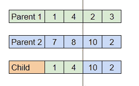
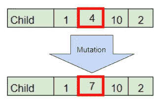
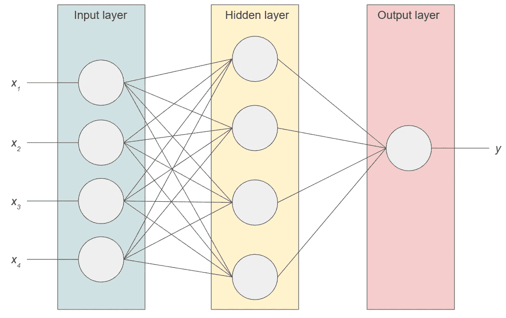
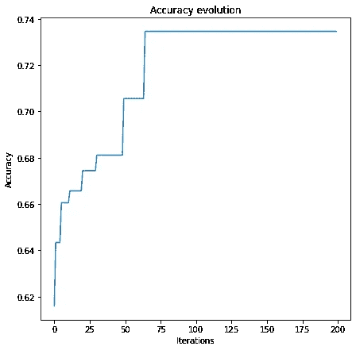
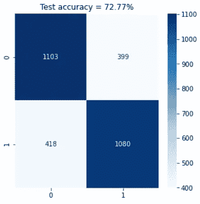

# 遗传算法及其在机器学习中的实用性

> 原文：<https://towardsdatascience.com/genetic-algorithm-6aefd897f1ac>

## *GA 是什么，如何用它来训练机器学习模型？*

在 [Unsplash](https://unsplash.com?utm_source=medium&utm_medium=referral) 上 [Sangharsh Lohakare](https://unsplash.com/@sangharsh_l?utm_source=medium&utm_medium=referral) 拍摄的照片

# 介绍

遗传算法(GA)是一种自然计算算法，是通过复制自然界中存在的现象和行为来尝试解决问题的算法。

文献中有几种自然算法，如粒子群优化算法(PSO)，它试图以数学方式模拟鱼群或鸟群的社会行为，以及蚁群优化算法(ACO)，它试图在模拟蚂蚁移动行为的图中找到最佳路径。

这些类型的算法用于解决优化问题，其中您希望在搜索空间内找到最优值(最大值或最小值，取决于所分析的问题)。研究最多的优化问题之一就是所谓的 [*旅行商问题*](https://en.wikipedia.org/wiki/Travelling_salesman_problem#Natural_computation) 。

在所有的自然计算算法中，最著名的是遗传算法。

## *概述*

[Pankaj Patel](https://unsplash.com/@pankajpatel?utm_source=medium&utm_medium=referral) 在 [Unsplash](https://unsplash.com?utm_source=medium&utm_medium=referral) 上拍摄的照片

遗传算法是基于遗传学的概念，其中变换被应用于旨在试图复制诸如突变、自然选择和交叉等事件的数据。

简而言之，遗传算法迭代执行，并具有以下步骤:

*   初始种群的生成

**对于每次迭代:**

*   子群体(亲本)的选择
*   应用交叉和变异操作产生新的种群(子代)
*   对产生的新群体的评估
*   用新群体替换初始群体

算法将一直运行，直到达到停止条件，通常是最大迭代次数或评估生成的群体时获得的某个值。

重要的是要记住，要正确地执行算法，必须要有一个明确定义的问题要解决，并且要使用评估度量。

## 概念

Joshua Hoehne 在 [Unsplash](https://unsplash.com?utm_source=medium&utm_medium=referral) 上拍摄的照片

为了理解算法，有必要理解它背后的概念。

*   **个体**:代表问题唯一可能解决方案的群体成员。在数学上，它可以表示为一个值数组，其中数组中的每个值都是一个与所分析问题的响应方程相关联的系数。
*   **群体**:作为所分析问题答案候选人的一组个体。
*   **比武**:选择种群中最适个体的方法。它包括比较群体中两个(或更多)个体的结果，并选择获得最佳结果的一个。
*   **交换**:基因重组的操作，父母的遗传密码结合在一起产生孩子。定义一个(或多个)截止点，其中子代从父代 1 接收从遗传密码的开始到截止点的所有基因，并从父代 2 接收从截止点到遗传密码的结束的所有基因。下图(图 1)显示了一个具有一个截止点的交叉运算示例，其中每个单元格代表一个与响应方程相关的系数。

图 1 —交叉操作示例—作者图片

*   **突变:**将基因的值修改为不同于原始值的操作。图 2 显示了一个应用于个体的突变的例子。

图 2——第二个基因的突变操作示例——作者图片

既然已经定义了基本概念，那么让我们来看一个使用遗传算法来解决问题的例子。

## 这个例子

由[万花筒](https://unsplash.com/@kaleidico?utm_source=medium&utm_medium=referral)在 [Unsplash](https://unsplash.com?utm_source=medium&utm_medium=referral) 上拍摄的照片

在机器学习中，一种广泛使用的算法是人工神经网络，它试图模拟人脑的行为进行决策。一种非常简单的网络被称为多层感知器(MLP ),它是由一个输入层、一个或多个中间层和一个输出层组成的网络。

下图(图 3)显示了一个 MLP 前馈神经网络的示例，其中间层包含四个神经元，隐藏层也包含四个神经元，输出层包含一个神经元。

图 3-带有一个隐藏层的前馈神经网络示例-作者图片

网络如何工作的细节不是本文的重点，知道输出 *y* 是通过使用网络各层和输入数据之间的权重的运算来计算的就足够了。

层权重是向量集，其中每个值对应于与不同层中的神经元之间的链接相关联的权重。目的是优化这些权重，以便网络可以解决问题。

让我们从定义图 3 中描述的 MLP 前馈的类开始。

现在，让我们一步一步地了解算法的功能。第一步是创建初始种群。下面的函数接收所需的个体数量(n_indiv ),并使用 MLPFeedforward 类返回随机初始化的个体总数(神经网络的权重)。

下面的函数执行 GA 的锦标赛步骤，从初始群体中随机选择两个父代，并将两个父代中的最佳父代(具有最大准确度的一个)存储在父代列表中。它接收人口和数据作为参数:特征(***)X***)和标签( ***y*** )。

下一步是创建执行交叉和变异操作的函数。该函数的参数是双亲列表、决定是否会发生交叉(cross_thr)和突变(mutation_thr)操作的阈值以及限制操作中基因变化范围的突变限制。

最后，实现了一个包含整个算法的类。它还具有 run 方法，该方法多次执行算法，存储每次运行时获得的精度，并保存生成的最佳 MLP 及其性能。

现在，为了展示该算法，创建了一个具有 4 个特征、10.000 行和 2 个类的通用数据集，将其分为训练和测试数据(70%为训练样本，其余 30%为测试样本)，并使用标准缩放器对其进行标准化。然后，使用 GA_MLPFeedforward 类来展示模型的性能如何随着遗传算法的使用而提高。算法中使用的参数是:

*   人口规模= 50
*   迭代次数= 200
*   交叉阈值= 0.5
*   突变阈值= 0.7
*   突变极限= [-5，5]

重要的是要说，所使用的参数没有优化，参数的优化对算法的结果起着非常重要的作用。

在执行算法之后，绘制了训练数据的精度演变，如下图 4 所示。

图 4——算法准确性的演变——作者提供的图片

最后，评估测试数据时模型的性能如图 5 所示。

测试数据的混淆矩阵和获得的准确度—图片由作者提供

Joshua Hoehne 在 [Unsplash](https://unsplash.com?utm_source=medium&utm_medium=referral) 上拍摄的照片

希望这篇文章能够让你快速理解遗传算法，以及如何在机器学习算法的开发中使用它。学习新的技能和做同样事情的方法总是好的。

欢迎任何意见和建议。

请随时通过我的 Linkedin 联系我，并查看我的 GitHub。

[领英](https://www.linkedin.com/in/alexandre-rosseto-lemos/)

[GitHub](https://github.com/alerlemos)