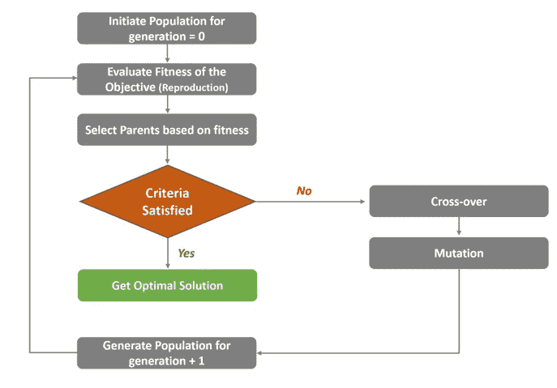
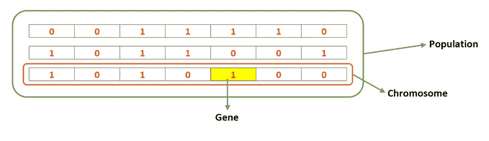
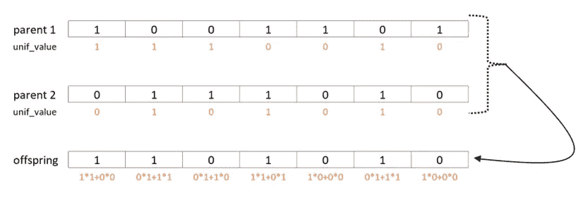
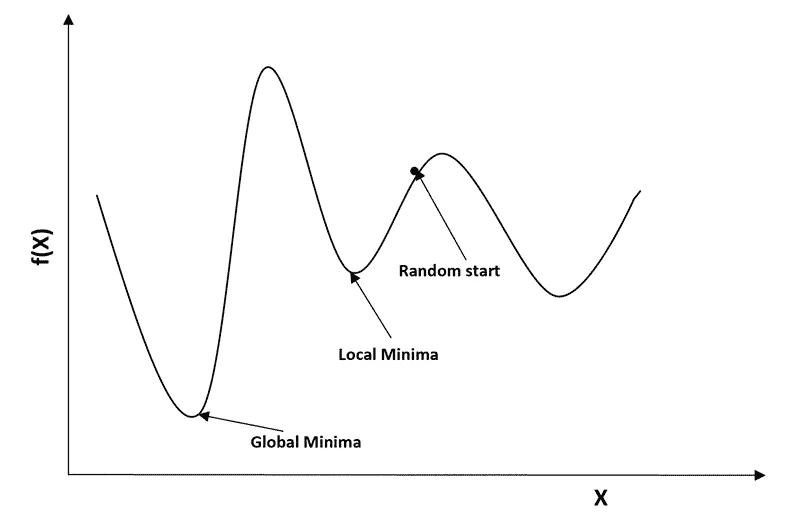

# 遗传算法——一种优化方法

> 原文：<https://towardsdatascience.com/genetic-algorithm-an-optimization-approach-dd60e23261e6>

## 使用遗传算法和 R 语言实现优化的介绍


照片:Unsplash

优化在任何商业领域都是一个非常重要的概念，无论是零售、金融、汽车还是医疗保健。简而言之，优化的目的是通过最小化/最大化损失/成本函数在搜索空间中找到一个点或一组点，这为我们提供了手头问题的最优解决方案。这里，我们试图最小化/最大化目标函数 f(x ),其服从一个/多个约束，例如，

```
Minimize f(x)
Subject to:
     g(x) = 0 (equality constraint)
     h(x) <= 0 (inequality constraint)
     lb <= x <= ub (lb: lower bound, ub: upper bound)
```

本文将帮助您了解我们如何使用遗传算法(GA)优化问题陈述，遗传算法是最简单的进化算法(EAs)之一。

什么是遗传算法，它是如何工作的？

进化算法的基本直觉是从群体中选择最好的个体作为父母，要求他们繁殖以延长世代。在这个繁殖过程中，来自父母双方的基因交叉，在某种程度上，一个非遗传的错误发生了，这就是所谓的突变。然后下一代被要求繁殖他们的后代，这个过程继续下去。进化算法受交叉和变异理论的启发，其中交叉用于从群体的遗传信息中创建新的解决方案，而变异用于带来新的信息或保持群体中的多样性，并防止过早收敛以使解决方案更通用。

遗传算法是一种基于遗传和自然选择的生物进化原理的搜索优化技术。它通常用于从搜索空间中找到问题的最优或接近最优的解决方案，否则将花费大量时间来解决这些问题。现在，让我们来谈谈工作算法的基本原理。



作者图片

**初始化人口**

让我们先了解一下 GA 中人口是什么意思。

*种群(或世代):*它是所有可能解(候选解)的集合，用来发起搜索。遗传算法将迭代多代，直到找到最优解。

*染色体:*它代表群体中存在的一个特定(候选)解。

*基因:*是包含特定染色体的值(等位基因)和位置(基因座)的决策变量的单个元素。



作者图片

第一代随机初始化*(随机初始化)*。该算法通常从随机生成的群体开始。群体的大小取决于问题的性质，并由决策变量的大小决定。在所有世代中，种群的规模保持不变。此外，还有另一种选择，使用已知的启发式算法对问题*(启发式初始化)*初始化群体，但通常不推荐，因为这可能导致群体具有相似的解和非常小的多样性。

**评估体能**

适合度函数评估候选解决方案对目标的适合程度。它给每个个体一个适合度分数(概率值),基于这个分数，该个体将被选择用于繁殖。

通常，适应度函数可以被认为是一个目标函数，但是在存在多个目标和约束的复杂问题的情况下，适应度函数可以被不同地设计。

一个适应度函数应该具有以下特征:

*适应度函数的计算速度应该足够快。*

*它必须定量测量给定解决方案的适合程度，或者从给定解决方案中产生的适合个体的程度。*

**选择父母**

父代选择是从群体中识别最适合的解决方案的过程，它复制下一代解决方案。它有助于下一代自然地继承“好”的特征。在第 0 代中，我们没有任何后代，我们从初始群体中选择父母。

这种选择是非常关键的，因为它驱使个体找到更好和更合适的解决方案，从而导致算法的收敛。此外，亲本的关键特征之一应该是在群体中保持良好的多样性。选择亲本有不同的方法(这里看[这里看](https://www.tutorialspoint.com/genetic_algorithms/genetic_algorithms_parent_selection.htm))。

**交叉**

交叉有助于产生新的后代。由于遗传算法是基于随机的进化算法，从每个亲本携带的基因数量是随机的。来自双亲染色体的某些基因重叠或混合产生新的一代。由于后代是双亲染色体交叉的结果，它继承了双亲的特征。有时后代从父母一方获得一半基因，从另一方获得另一半基因，有时这种百分比会发生变化。

有不同的方法，如单点交叉，双点交叉，均匀交叉。均匀交叉是执行交叉的常用方法。在这里，基因是从亲代染色体中随机选取的。这里，遗传的基因被标记为 1，其他的被标记为 0，这来自于均匀分布(假设这些被称为 unif_value)。现在 unif_value 与每个父染色体的基因值相乘。父代选择和交叉操作重复多次，直到下一代中的解的数量达到 population_size(在所有代中保持相同的群体大小)。



作者图片

**突变**

突变有助于将新的特征包含到基因中，这基本上保持了种群内的多样性，并防止了过程的过早收敛。变异是遗传算法中与搜索空间的“探索”相关的部分。因此，变异对遗传算法的收敛至关重要，而交叉则不然。

**满足标准**

当算法达到其收敛时，即它不会产生与上一代明显不同的后代时，算法终止。通常，如果满足以下任一标准，算法就会终止:

*如果在接下来的 X 次迭代中群体中没有适应度提高*

*如果目标函数已经达到最佳值或预定义值*

*如果已经达到最大代数*

**为什么选择遗传算法**

在传统算法可能无法提供解决方案的大规模问题中，遗传算法(GA)能够“足够快地”提供“足够好”的解决方案。它为解决复杂的优化问题提供了一个通用的框架。以下是使用遗传算法的几个优点:

*a)克服了传统优化算法*的不足

如果我们能计算任意给定点的梯度，那么函数就是可微的。传统的算法如梯度下降法、牛顿法都是用导数的方法来获得最优解。它从一个随机的点开始，沿着梯度的方向移动，直到我们到达顶点。这种技术是有效的，并且对于我们具有单峰目标函数的线性回归类型的问题非常有效。但是，在现实世界中，我们有一个复杂的问题，有多个峰值和许多谷值(非凸目标函数)。在这里，传统的算法有陷入局部最优的固有趋势。



作者图片

然而，遗传算法不需要目标函数的梯度。它可用于目标函数不连续、不可微、随机或高度非线性的各种优化问题。

这可以很容易地并行化。

*c) GA 相当快，在相对较短的计算时间内探索搜索空间。*

*d)可以包含多个复杂的优化目标*

**限制**

a)如果执行不当，GA 可能不会收敛到最优解

b)可能计算量大，因为适应度函数被重复计算。

c)有时 GA 不允许硬约束，所以需要在目标函数中传递它们作为惩罚。惩罚函数降低不可行解的适应度，使得适应度随着违反的约束的数量或与可行域的距离成比例地降低。

**作为用例的几个例子**

a)库存优化:这有助于补货决策，从而避免缺货情况并因此导致销售损失。

b)商店空间优化:这可以通过重新安排空间来帮助增加商店的销售额，同时保留一些约束因素。

c)电源优化

**实现:R 中的代码片段**

```
 # Define the functions:
 pred_eval_fun_P <- function(x) {}: # Defining fuction for calculating predicted demand          
 orig_eval_fun_P <- function(x) {}: # Defining fuction for calculating actual demand 
 eval_g_ineq1 <- function(x) {}:    # Creating 1st constraint 
 eval_g_ineq2 <- function(x) {}:    # Creating 2nd constraint 
 fitness_P <- function(x) {}:       # Creating the objective function and adding penalty as it can't take hard constraint. As example like below:
            {
              f <- pred_eval_fun_P(x)          # maximise f(x)
              p <- sqrt(.Machine$double.xmax)  # penalty term
              pel_int <- abs(eval_g_ineq1(x))
              pel_int1 <- abs(eval_g_ineq2(x))
              penalty1 <-                      # define as needed
              penalty2 <-                      # define as needed
             f-penalty1-penalty2               # fitness function value
            }

 lb: # Defining the lower bound
 ub: # Defining the upper bound
 no_cores <- detectCores() - 1
 # Also define starting, max_gen, hard_gen as needed

# Run the optimization:
library(snow)
library(rgenoud)
cl1 <-  makeCluster(no_cores, type="SOCK") 
clusterExport(cl1, list("fitness_P","lb","ub","pred_eval_fun_P","eval_g_ineq1","eval_g_ineq2","starting","max_gen","hard_gen"))
GA_P1 <- genoud(fitness_P, Domains=cbind(lb,ub), nvars=length(lb), pop.size=100, max=TRUE,wait.generations = 50, max.generations = max_gen, hard.generation.limit=hard_gen, data.type.int=TRUE, cluster = cl1,print.level = 1, solution.tolerance = 0.001)
final_reco <- as.numeric(as.character(GA_P1$par))
stopCluster(cl1)
```

*免责声明:本文中表达的观点是作者以个人身份发表的意见，而非其雇主的意见*