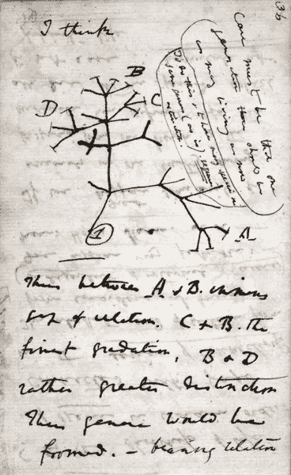
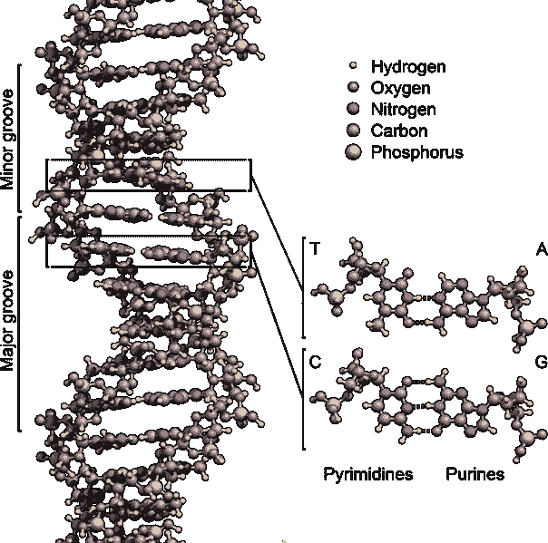
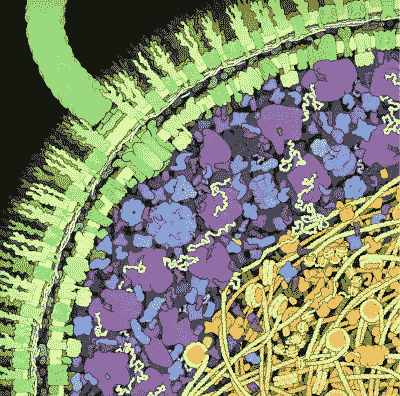
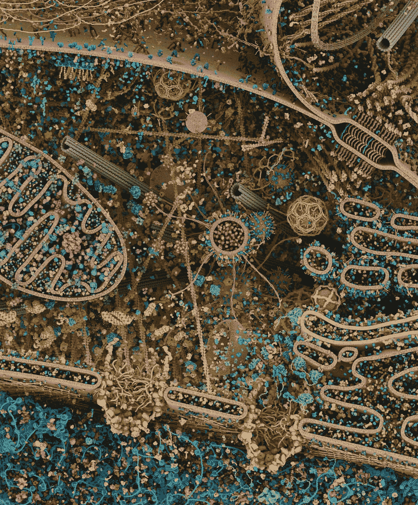
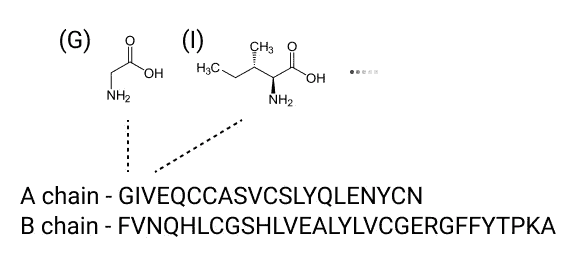
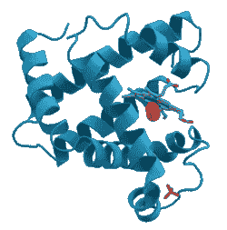
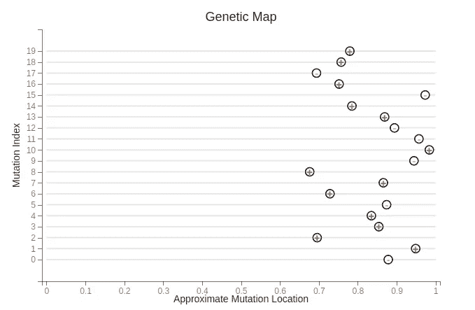
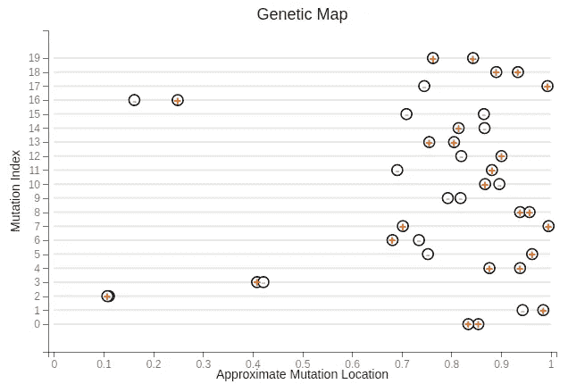
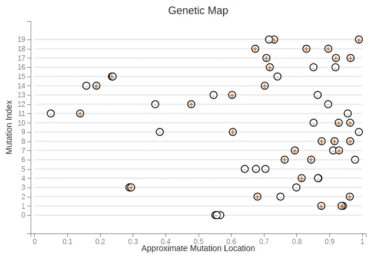
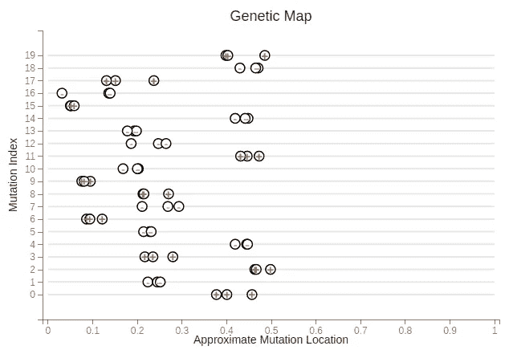

# 基因组学——终极数据科学

> 原文：<https://towardsdatascience.com/genomics-the-ultimate-data-science-part-i-ec91683d1e18>

## [思想和理论](https://towardsdatascience.com/tagged/thoughts-and-theory)

# 基因组学——终极数据科学

## 从数据科学的角度概述基因组学，强调数据和数据解释在理解生物学中的重要作用

首先，让我们解决所有权要求。二十多年前，当我开始上大学并上第一堂生物课时，我第一次翻开坎贝尔的《生物学》(第四版)，生物学就成了我的主要兴趣。显然，我的观点是主观的，所以其他人可能会觉得金融、运筹学或推荐系统是数据科学的终极主题。

然而对我来说，生物学是一个完整的包裹。我对它了解得越多，它就越让我吃惊。它渗透了我对一切的想法和观点，从生孩子意味着什么，到对政治的看法，到理解不同社会如何互动，到理解当前的问题，如新型冠状病毒病毒的传播和气候变化。

这篇文章是介绍数据科学在基因组学中的作用的第一部分。它证明了我的标题声明，并介绍了基因组学中的一些基本概念，使其成为最终的数据科学。随后的帖子将对此进行扩展，每个帖子都讨论了一个特定的主题，并在相关时提供了代码示例。我的总体目标是与他人分享我对生物学和数据科学的热爱，尤其是它们的交集。希望这将帮助生物学家和数据科学家理解这些领域是如何交叉的。

我花了几年时间*才真正*理解，但是为什么基因组学是终极数据科学的关键来自生物学的三个不同特征，每一个都是‘啊哈！’属于我自己的时刻。

首先，我最终意识到的最重要的事情之一是，你必须抛弃所有关于生活会有多复杂的先入为主的观念。生活的复杂程度令人震惊。人们不得不怀疑它是否是无限的。这可以在所有尺度上看到，快速瞥一眼[的生物数量](https://bionumbers.hms.harvard.edu/Search.aspx?task=searchbypop)可能会有助于说服你。



查尔斯·达尔文 1837 年绘制的进化树草图。图片来自[维基共享资源](https://en.wikipedia.org/wiki/File:Darwin_Tree_1837.png)。

第二个关键的洞见是理解*为什么*会这样。生物学中最重要的主题是进化。进化是生命如此复杂的原因。虽然达尔文早期关于进化的思想，包括他著名的草图，是基于合理的推理和一些逻辑跳跃，进化的研究现在是一门定量科学，也是基因组学是终极数据科学的另一个原因。

第三，由于进化是生物复杂性的驱动力，而且这种复杂性似乎是无限的，人们最终必须问自己，人类是否有能力理解它。人类没有任何理由能够理解生命是如何运作的。对我们来说，假设我们能够或者应该能够做到这一点是幼稚的。然而，人类擅长简化论，事实证明——非常幸运——地球上的生命有一个关键特征，它允许我们在生物学上站稳脚跟，形成基因组学领域，并创建最终的数据科学。

# 解开线——线是通往基因组学的大门


[斯蒂夫·约翰森](https://unsplash.com/@steve_j?utm_source=unsplash&utm_medium=referral&utm_content=creditCopyText)在 [Unsplash](https://unsplash.com/s/photos/string?utm_source=unsplash&utm_medium=referral&utm_content=creditCopyText) 上拍照

进化的要素之一是信息存储和复制。生命不是靠魔法运行的，所以生物学家知道这些信息必须在细胞内的某个地方找到。



DNA 的结构，显示了组成其结构的 4 个核苷酸的例子。用户 Zephyris 的图片来自[维基共享](https://en.wikipedia.org/wiki/DNA#/media/File:DNA_Structure+Key+Labelled.pn_NoBB.png)

每个人*现在*都知道生命以某种方式编码在 DNA 中，尽管*如何做到这一点并不广为人知*。*众所周知，DNA 是由一系列被称为核苷酸的化学单体组成的。它们是 4 种相关的小化学物质，每种都用一个字母表示:A(腺嘌呤)、C(胞嘧啶)、G(鸟嘌呤)和 T(胸腺嘧啶)。现在这被认为是理所当然的，但这是 1953 年的一个重大发现，它确实令人惊讶，信息存储机制简单到足以被人类理解。这种存储机制打开了基因组学领域的大门，几乎所有生物学的复杂性都以某种方式植根于这 4 个字母的字符串中。*

尽管 DNA 占据了媒体的大部分版面，并渗透到了流行文化中，但它实际上并不是第一个被认为是由可以用字符串表示的不同化学物质的线性排序组成的生命成分。这个奖项颁给了蛋白质。

细胞的大部分特性是由其组成蛋白决定的。蛋白质是细胞的主力，负责许多细胞活动。许多人可能只在包装背面的营养标签上听说过与饮食有关的蛋白质，但这掩盖了蛋白质是什么以及它们是如何运作的。



*大卫·s·古德塞尔* *对大肠杆菌横切面中蛋白质的艺术再现。* RCSB 蛋白质数据库。doi:10.2210/rcsb _ pdb/good sell-gallery-028。

蛋白质真的是原始的乐高积木，尽管更灵活和迷人。大肠杆菌蛋白质的手绘图像是 T2 的大卫·古德塞尔的许多美丽画作中的一幅，这些画作表现了蛋白质的活动。我推荐看看他的其他画作，他的[月度分子](https://pdb101.rcsb.org/motm/261)系列，当然还有他令人惊叹的书[生命的机器](https://www.amazon.com/Machinery-Life-David-S-Goodsell/dp/0387849246)。这些肯定会改变你对蛋白质是什么以及它们能做什么的印象。该图像代表了大肠杆菌细胞的一部分，并成功地传达了细胞不是无定形的斑点，而是由许多称为蛋白质的精致小机器人组成，每个机器人都有一个特定的三维结构来决定其功能。它们一起工作来协调细胞的活动。一些执行代谢过程并产生能量为细胞提供动力，一些聚集形成驱动细胞运动的复杂马达，一些发挥结构作用以使细胞保持结构完整性，等等。

Digizyme 公司[的 Evan Ingersoll & Gael McGill 创作了一个更近的细胞中蛋白质的艺术渲染图(如下所示)。这比 David S. Goodsell 拍摄的大肠杆菌截面图要复杂得多，但是这两张图片使用的方法是相同的。在这两种情况下，数十年来由无数其他人确定的蛋白质结构的 3D 坐标被获取、渲染并放置在场景中，以近似细胞中这些蛋白质角色的样子。这两个图像之间的差异类似于电影《白雪公主和七个小矮人》(1937)中的早期手绘动画与《玩具总动员》(1995)中的计算机生成动画之间的差异。也就是说，大卫·古德塞尔的艺术是手绘的，而现代计算机技术被用来生成下面的细胞景观。他们都以自己的方式引人注目。](https://www.digizyme.com/)



Digizyme 公司[的 Evan Ingersoll & Gael McGill 对细胞横截面中蛋白质的艺术再现。作者授予的许可。](https://www.digizyme.com/)

对于大多数人来说，很容易在生活中没有真正思考过蛋白质的性质和功能，以及它们如何相互作用来执行细胞的功能，或者仅仅是它们的存在是多么多样和惊人。我希望上面的图片可以帮助说服你，但我必须首先提到上面的一点:你必须放弃所有关于生活可以有多复杂的先入为主的观念。上面的图像是细胞的美丽艺术渲染，但一个细胞中可能有数万种不同的蛋白质，它们不是静态的，它们经常在物理上相互作用以形成更大的功能结构，并且它们根据化学梯度、相邻的蛋白质、温度等不断反应和调整它们的行为。事实上，Digizyme 艺术家必须将场景中的蛋白质数量减少 80%以上，才能真正描绘出供人类消费的景观。



牛胰岛素的氨基酸组成。胰岛素由两条不同的氨基酸链组成，A 链和 B 链。每种氨基酸都有特定的化学结构，并用字母表中的一个字符来表示。图片作者。

当然，这些关于蛋白质的细节在 20 世纪上半叶都不为人知。众所周知，蛋白质执行特定的功能，但是确切地说，它们是如何执行这些功能的，以及它们采用了什么样的结构(如果有的话)却是未知的。正是在 20 世纪 40 年代末到 50 年代，蛋白质的大部分性质才被研究出来。由[弗雷德·桑格](https://en.wikipedia.org/wiki/Frederick_Sanger)领导的工作表明，这些神秘的蛋白质由一系列被称为氨基酸的化学物质组成，每个氨基酸都有一个单字母符号。这些氨基酸各有不同的结构，就像不同的 DNA 核苷酸有不同的结构一样。Sanger 指出牛胰岛素由两条独立的链组成，每条链都有特定的线性氨基酸序列。尽管在 1953 年发现 DNA 的双螺旋性质后*胰岛素的*全序列*被发表，但是 A 链和 B 链的序列分别在 1952 年和 1951 年被确定。因此，在确定 DNA 可以表示为字符串之前不久，就确定了蛋白质可以表示为字符串的事实。当时，氨基酸排序的重要性还不为人知，因为不知道蛋白质是什么样子，也不知道它们是如何运作的。*

在弗雷德·桑格表明蛋白质由线性氨基酸序列组成后不久，第一个蛋白质结构被确定，并于 1958 年发表。约翰·肯德鲁和他的同事确定了肌红蛋白(来自抹香鲸)的三维结构，提供了组成蛋白质的氨基酸线性序列决定其结构和功能的早期证据。



肌红蛋白的带状图，第一个发现的蛋白质结构。图片来自[维基共享资源](https://en.wikipedia.org/wiki/Protein#/media/File:Myoglobin.png)。

# 字符串和哈希——从 DNA 到蛋白质


伊曼纽尔·埃克斯特伦在 [Unsplash](https://unsplash.com?utm_source=medium&utm_medium=referral) 上拍摄的照片

到 20 世纪 50 年代中期，人们知道 DNA 和蛋白质分别是由 4 个不同的核苷酸(字符)和氨基酸(20 个字符)组成的聚合物(字符串)，但它们之间关系的性质实际上在 20 世纪 40 年代就已经确定了。1949 年，奥斯瓦尔德·艾弗里和他的同事们决定性地证明了 DNA——而不是蛋白质——是将一种无害细菌“转化”成一种可能导致疾病的细菌所必需的，并且这是一种可遗传的变化。蛋白质是不够的。这表明 DNA 负责可遗传的变化，并且首次证明细胞中不同的蛋白质集合可能在 DNA 中的某个地方以某种方式编码。当然，细节决定成败。

到了 20 世纪 60 年代，人们意识到 DNA 编码蛋白质，但研究人员还没有真正测序基因组的技术。然而，他们确实有能力生成基因图谱，这使他们能够大致定位基因内的一些突变，即使他们不知道基因的实际序列甚至长度。此外，他们能够突变 DNA，但由于他们实际上不能*读取*产生的基因组来识别突变，他们不得不*通过检测它的影响，或者用生物学的说法，它的表型来推断*发生了突变。因此，当时的策略是突变基因和基因组(当然不是人类的)，并确定基因或基因组中突变的大致位置。我们将在 python 中而不是在实验室中近似这种早期工作，以“重新发现”遗传密码的各个方面。

我们从随机突变一个基因开始，插入或删除一个碱基。这在基因的某处可能是这样的:ATCCG → AT **G** CCG 或 CCGAGT → CCGA **T** GT 用于插入，或 CG **T** CCG → CGCCG 或 ACG **T** AGT → ACGAGT 用于删除。这些只是假设的例子；实际的*插入或*删除*操作(统称为插入)可以在基因的任何地方。在下面的图片中，每条水平线代表一个生物体的 20 个不同个体中长度未知的相同基因，每个圆圈代表随机插入一个碱基(红色带“+”)或随机删除原始基因中的一个碱基(灰色带“-”)。只显示保留基因功能的突变。在这种情况下，“功能性”意味着没有无义突变，即极有可能破坏基因功能的突变。这是一个过于简化的问题，但仍然是这个练习的一个很好的代理。为了节省空间，我省略了生成这些图像的大部分代码，但是大部分工作是由 MutatableSeqRecord 类完成的，该类继承了 biopython 的 [SeqRecord](https://biopython.org/wiki/SeqRecord) 类，增加了向原始序列添加突变的能力:*

这导致了下面的遗传图谱:



在 20 种不同的生物体中，沿着基因长度随机产生的可容忍的插入(+)或缺失(-)的位置，显示了沿着基因长度的突变的大致位置(0-开始，1-结束)。图片作者。

以上大致描述了 20 世纪中期遗传学是如何发展的。也就是说，已知基因由一长串有序的核苷酸组成(例如 ACTCGAGAGCCGATTA…或 ATGACACAGTTAGA)，可以延伸数百或数千个核苷酸(字符)，突变的大致位置可以沿其长度测量。除此之外，没有任何细节是已知的。然而，即使在上面的例子中，我们也可以获得一些启示。特别是，这些功能突变体中的所有突变都是在基因的右侧发现的，但不管是突变*插入了*还是*缺失了*一个碱基。这本身就很能说明问题，但可以有多种解释。让我们注意这一点:

*   靠近基因左侧的单碱基突变比靠近基因右侧的单碱基突变更有可能破坏基因的功能。

一个基因中也可以产生多个单碱基突变。我们将会看到我们可以从保留具有两个独立 indels 的功能基因中学到什么，使用与上面类似的代码，但为了节省空间，将它省去:



在 20 种不同的生物体中，沿着基因长度随机产生的 2 个容许的插入(+)或缺失(-)的位置，显示了沿着基因长度的突变的大致位置(0-开始，1-结束)。图片作者。

这是黄金。一个类似的模式出现在单一的 indels 中，但是有一些非常有趣的新信息。这些双重突变的功能基因中的 indels 通常仍然位于基因的右侧。然而，少数突变体(在这种情况下为 3/20)在基因左侧具有 indel，这些 indel 非常接近并且是相反的类型:一个插入和一个缺失。注意:突变体#2 具有相同的模式，但是 indel 位置如此接近以至于点是重叠的。我们在列表中添加了一个新的总体趋势:

*   如果靠近相反类型的 indel(插入与缺失相反),基因左侧的单碱基插入更可能被容忍

最后，让我们尝试 3 个独立的 indels，看看是否有更多我们可以提取的见解。根据上述趋势，我们已经知道这些可能会是什么样子。大多数功能突变体可能在基因的右侧有三个任何类型的突变位点，但少数在基因的左侧有两个相邻的相对突变位点，第三个突变位点在基因的右侧。让我们检查一下。这里有 20 个三重突变的功能基因:



在 20 种不同的生物体中，沿着基因长度随机产生的 3 个耐受的插入(+)或缺失(-)的位置，显示了沿着基因长度的突变的大致位置(0-开始，1-结束)。图片作者。

我们的假设被证实了。大多数突变是在基因的右侧发现的，但是在基因左侧突变的突变体与附近相反类型的 indel 配对。这并不能提供更多的见解，所以我们将通过生成三个突变体来缩小我们的关注范围，其中所有三个 indels 都位于左侧。我将继续使用蛮力方法来生成这些，因为它不会花很长时间来计算只有 20 个突变体。这将导致以下结果:



在 20 种不同的生物体中，沿着基因长度随机产生的 3 个容许的插入(+)或缺失(-)的位置，将突变体限制在所有 indels 都在基因前半部分的那些。x 轴显示沿着基因长度的突变的大致位置(0-开始，1-结束)。图片作者。

如你所见，功能性三重突变体中的 indel 位置有一个引人注目的模式，这是这个谜题的最后一块。在所有情况下，三个独立体紧密地聚集在一起，并且总是属于同一类型。我们将在列表中添加另一个观察结果:

*   如果在一个功能性三重突变基因的左边发现三个 indels，它们紧密地聚集在一起，属于同一类型

总之，我们有以下观察结果:

1.  靠近基因左侧的单碱基突变比靠近基因右侧的单碱基突变更有可能破坏基因的功能。
2.  如果靠近相反类型的 indel(插入与缺失相反),基因左侧的单碱基插入更可能被容忍
3.  如果在一个功能性三重突变基因的左侧发现三个 indels，它们紧密聚集在一起，属于同一类型。

为了了解这里发生了什么，我们将使用一个类比。假设你的朋友给你发了一条短信，我们会认为这些短信在通信网络上很容易被破坏。消息存储为内存中连续的字节数组，这些数组通常会因内存连续块中某个位置的随机添加或删除而被破坏。在这种情况下，我们不使用前导位，因为在 ASCII 字符编码中它总是零，所以我们使用七位来表示每个字节。考虑到这一点，你看着你的手机阅读来电信息，内容如下:

```
Meet me on!)kKgICrACe_k]HAgKmK\AChAiQJA[CYXA]KCdAiQJAM__HAG_ke
```

这可不好。这句话几乎完全没有意义。你应该在某个时候去见你的朋友，但是你不知道时间和地点。很明显，该消息在靠近消息开头的某处被插入或删除的位所破坏。如果这发生在消息的结尾就好了。那样的话，你也许就能破译它了。照目前的情况来看，这条消息基本上没有什么作用。

假设您真的很不幸，消息被七个不同的位插入或删除破坏了。你现在绝对不走运。信息内容如下:

```
[KPA[JA_9SWOeK?W;OmK\AChAiQJA[CYXA]KAr the food g_ke
```

但是，如果这七种突变都是同一类型，并且发生在很近的地方，会怎么样呢？

```
Meet me on Tuesday a|U.{ seven at the mall near the food court
```

我们现在可以读了。虽然插入了七位，但消息仍然清晰可辨，因为只有插入附近的位受到影响，有效地将所有下游位向下游移动了一个字节的位。你可能还会想，在购物中心见面不再是任何人真正会做的事情，但不管怎样，希望这个例子能达到它的目的。

这与上述基因突变体中发生的现象完全相同，但它们的“字节”在计算机中相当于 3 个碱基，而不是 8 位。通过在附近插入(或删除)3 个碱基的倍数，只有蛋白质的局部受到影响，而蛋白质的其余部分保持完整。让我们停下来惊叹，地球上所有形式的生命都使用与人类数字存储信息完全相同的信息存储方法，这是多么令人惊讶。进化和人类——他们自己也是进化的产物——都发现了同样的储存信息的方法。

因此，概括地说，我们都知道数字信息可以存储为字节，每个字节由 2 字符字母表(位)中的 8 个字符组成，用于存储 ASCII 字符。这些 ASCII 字符被连续解码以拼写单词和组成句子。这些句子的作用是传达意思。类似地，生物信息可以存储为*密码子*而不是字节，每个密码子由 4 字符字母表(而不是 2 字符 0/1 字母表)中的 3 个字符(而不是 8 个)组成，以编码氨基酸。这些氨基酸被连续解码，以确定氨基酸的线性序列，该序列决定蛋白质的结构，从而决定其功能。这些蛋白质可能有许多功能。


地球生命中英文的数字位编码(ASCII)和通过 DNA 的蛋白质化学编码的比较。注意，尽管在 ASCII 编码中存在标点符号和其他非英语字符，但为了简单起见，这里只考虑了英语字母表的 26 个字母。图片作者。

这里唯一缺少的一块拼图是，我们知道将字节映射到字符的 ASCII 字符编码，因为人类开发了编码方案，但科学家在 19 世纪中期不知道遗传编码方案。他们只知道它的存在。不幸的是，他们没有谷歌或我们目前的生物学知识库。他们必须在实验室里解决。

在本文的第二部分，我将讨论遗传密码是如何被破译的，并继续详述由此产生的信息到底是做什么的*。*我会继续将它与英语进行比较，因为这样更直观，而且有许多相似之处。这样做，我将为理解基因组学作为一门数据科学奠定基础，并阐述为什么我相信它是终极数据科学。

请继续关注第二部分…