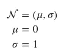
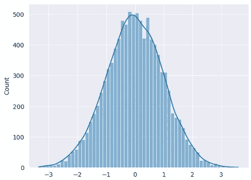
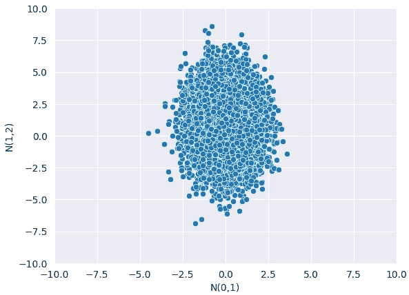
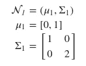
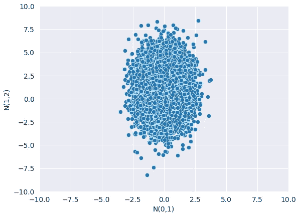
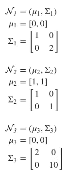
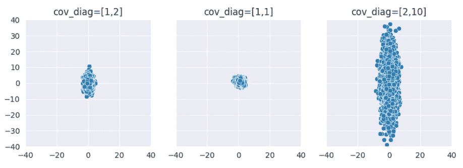

# 张量流概率简介:分布对象

> 原文：<https://towardsdatascience.com/gentle-introduction-to-tensorflow-probability-distribution-objects-1bb6165abee1>

## 概率深度学习

# 介绍

本文属于“概率深度学习”系列。这个每周系列涵盖了深度学习的概率方法。主要目标是扩展深度学习模型，以量化不确定性，即知道他们不知道的东西。

我们使用张量流和张量流概率(TFP)开发我们的模型。TFP 是构建在 TensorFlow 之上的 Python 库。我们将从可以在 TFP 中找到的基本对象开始，并了解如何操作它们。我们将在接下来的几周内逐步增加复杂性，并将我们的概率模型与现代硬件(如 GPU)上的深度学习相结合。

迄今发表的文章:

1.  [张量流概率简介:分布对象](https://medium.com/towards-data-science/gentle-introduction-to-tensorflow-probability-distribution-objects-1bb6165abee1)
2.  [张量流概率简介:可训练参数](https://medium.com/towards-data-science/gentle-introduction-to-tensorflow-probability-trainable-parameters-5098ea4fed15)
3.  [张量流概率中从零开始的最大似然估计](/maximum-likelihood-estimation-from-scratch-in-tensorflow-probability-2fc0eefdbfc2)
4.  [tensor flow 中从头开始的概率线性回归](/probabilistic-linear-regression-from-scratch-in-tensorflow-2eb633fffc00)
5.  [使用 Tensorflow 进行概率回归与确定性回归](https://medium.com/towards-data-science/probabilistic-vs-deterministic-regression-with-tensorflow-85ef791beeef)
6.  [Frequentist 与 Tensorflow 的贝叶斯统计](https://medium.com/towards-data-science/frequentist-vs-bayesian-statistics-with-tensorflow-fbba2c6c9ae5)


图 1:我们在这个系列中结合了两个世界:概率模型和深度学习[(来源)](https://unsplash.com/photos/l5Tzv1alcps)

像往常一样，代码可以在我的 [GitHub](https://github.com/luisroque/probabilistic_deep_learning_with_TFP) 中找到。

# 分发对象

## **单变量分布**

分布对象捕捉概率分布的基本操作。让我们从最简单的形式开始——单变量分布。顾名思义，这些分布只有一个随机变量。高斯分布是完全由其均值和标准差定义的连续概率分布。它的标准型是μ = 0，σ = 1 的特例。



```
normal = tfd.Normal(loc=0, scale=1)
normal

<tfp.distributions.Normal 'Normal' batch_shape=[] event_shape=[] dtype=float32>
```

注意属性`batch_shape`和`event_shape`。`event_shape`属性捕捉随机变量的维度。因为我们定义了一个单变量分布，所以`event_shape`是空的。`batch_shape`表示我们存储在对象中的不同独立分布对象的数量。在这种情况下，我们只存储一个发行版，因此它是空的。

我们可以用这个分布对象做什么？例如，我们可以从中取样。

```
# Draw one sample from the normal distribution
normal.sample()

<tf.Tensor: shape=(), dtype=float32, numpy=1.5117241>

# Draw 3 samples from the normal distribution
normal.sample(3)

<tf.Tensor: shape=(3,), dtype=float32, numpy=array([-1.2282027 , -0.01802123,  0.2748567 ], dtype=float32)>
```

在连续随机变量的情况下，我们还可以评估给定输入的概率密度函数(PDF)。

```
normal.prob(0.2)

<tf.Tensor: shape=(), dtype=float32, numpy=0.3910427>
```

当我们开始实施机器学习和深度学习算法时，我们经常会发现自己面临一个共同的问题:乘以概率并不有趣。整个产品开始迅速接近零，你将用尽精度来存储这么小的数字。

解决这个问题的常见方法是用对数概率代替概率。首先，通过应用对数变换，我们将域从[0，1]更改为(-∞，0)。这是相关的，因为我们可以在对数标度中存储大的负数，而不是必须存储非常小的数字(我们会很快用完精度)。第二，对数函数是一个单调递增的函数，这确保我们可以像比较原始对数概率一样比较两个转换后的对数概率。最后，对数转换将所有乘法运算转换为加法运算。因此，概率不再相乘，而是将对数概率相加。

在 TFP 中，处理对数概率是很简单的，我们只需要调用一个不同的方法。

```
normal.log_prob(0.2)

<tf.Tensor: shape=(), dtype=float32, numpy=-0.9389385>
```

注意，上面只是由`prob`方法返回的值的自然对数。

```
np.log(normal.prob(0.2))

-0.9389385
```

最后，我们可以绘制一个直方图，它近似于分布的密度。

```
sns.histplot(data=normal.sample(10000).numpy(), kde=True);
```



图 2:标准高斯分布的直方图和核密度估计。

现在，让我们探索如何在单个对象中存储一批发行版。让我们创建两个单变量正态分布，一个μ=0，σ=1，另一个μ=1，σ=1。

```
normal_batch = tfd.Normal([0,1],[1,2])
normal_batch

<tfp.distributions.Normal 'Normal' batch_shape=[2] event_shape=[] dtype=float32>
```

请注意，这两个分布需要是相同的类型(在这种情况下，它们都是高斯分布),并且它们被认为是独立的，即这不是创建多元分布的方法。在上面的输出中，您可以看到`batch_shape`现在是预期的 2。

我们可以很容易地从两种分布中抽取样本。

```
normal_batch.sample(3)

<tf.Tensor: shape=(3, 2), dtype=float32, numpy=
array([[-1.5531085 ,  1.4462973 ],
       [-0.5346463 ,  0.63747466],
       [-2.2433918 , -0.4113649 ]], dtype=float32)>
```

我们样品的形状不同。现在是(3，2)，因为我们从每个正态分布中抽取 3 个样本。我们可以绘制这两种分布，只是为了确保它们没有任何关联。

```
samples = normal_batch.sample(10000).numpy()
ax = sns.scatterplot(x = samples[:,0], y = samples[:,1])
ax.set(ylim=(-10, 10), xlim=(-10, 10), xlabel='N(0,1)', ylabel='N(1,2)');
```



图 3:两个独立高斯分布的样本。

同样，我们可以得到两种分布的 pdf 值。

```
normal_batch.prob([1,2])

<tf.Tensor: shape=(2,), dtype=float32, numpy=array([0.24197073, 0.17603266], dtype=float32)>
```

我们得到一个返回的形状为(2)的张量，因为我们得到了两个不同点的分布的 PDF 值。

为了更好地理解形状的行为，让我们增加`batch_shape`的等级。

```
normal_batch_D = tfd.Normal([[[0., 2],
                             [0.5, 1],
                             [5, 2]]], scale=1)
normal_batch_D

<tfp.distributions.Normal 'Normal' batch_shape=[1, 3, 2] event_shape=[] dtype=float32>
```

我们现在有 6 个不同的高斯分布存储在同一个对象中。不运行代码能说出`normal_batch_D[0,2,1]` 的均值和标准差是多少吗？

像往常一样，我们可以从中取样。

```
normal_batch_D.sample(10)

<tf.Tensor: shape=(10, 1, 3, 2), dtype=float32, numpy=
array([[[[-0.94896364,  2.1813042 ],
         [ 0.14763275,  0.22235268],
         [ 4.8377185 , -0.19643283]]],
       [[[ 0.6483533 ,  2.3491006 ],
         [-0.11504221,  0.13614637],
         [ 5.2141023 ,  1.9243499 ]]],
       [[[ 0.14039962,  1.5450974 ],
         [ 1.134828  ,  2.2807612 ],
         [ 5.892858  ,  0.6847892 ]]],
       [[[ 1.3779826 ,  2.0819554 ],
         [ 1.0930698 ,  0.5755873 ],
         [ 4.71762   ,  2.248595  ]]],
       [[[ 0.21968068,  1.2137487 ],
         [ 1.3834007 , -0.17327452],
         [ 5.6132197 ,  2.4669297 ]]],
       [[[-0.7178315 ,  1.1999301 ],
         [-0.19561946,  0.14512819],
         [ 3.7195773 ,  1.3497605 ]]],
       [[[ 0.03890136,  2.9174664 ],
         [ 0.37707615, -1.6925879 ],
         [ 4.0377812 ,  2.6682882 ]]],
       [[[ 1.4869312 ,  2.2919848 ],
         [ 1.1833754 ,  0.78834504],
         [ 4.746928  ,  2.398845  ]]],
       [[[-2.2711177 ,  1.9751831 ],
         [ 2.855303  , -0.51687765],
         [ 5.6308627 ,  0.96069396]]],
       [[[-0.5072157 ,  1.7689023 ],
         [ 0.67927694,  0.30969065],
         [ 3.8056169 ,  3.4717598 ]]]], dtype=float32)>
```

我们得到一个形状为(10，1，3，2)的张量，这意味着我们有 10 个样本(第一维)用于 6 个高斯分布中的每一个。

## 多元分布

现在，是时候探索我们的分配对象的`event_shape`属性了。创建多元分布有多种方法，让我们从最简单的一种开始。我们可以定义一个二维高斯分布，并且不包括两个维度之间的任何相关性，这意味着协方差矩阵的非对角项为 0。



```
mv_normal = tfd.MultivariateNormalDiag(loc=[0, 1], scale_diag=[1., 2])
mv_normal

<tfp.distributions.MultivariateNormalDiag 'MultivariateNormalDiag' batch_shape=[] event_shape=[2] dtype=float32>
```

最后，我们看到填充了一个`event_shape`，在本例中值为 2。正如我们所说的，这是我们上面定义的随机变量的维数。

是时候从中抽取样本，并查看与多个批处理分布相比的差异了。

```
mv_normal.sample(3)

<tf.Tensor: shape=(3, 2), dtype=float32, numpy=
array([[ 1.4743712 , -0.77387524],
       [ 1.7382311 ,  2.747313  ],
       [-1.3609515 ,  4.8874683 ]], dtype=float32)>
```

形状与我们从两个分批分布中采样 3 次的示例相同。由于我们已经定义了一个具有非对角协方差矩阵的多元分布(维度是独立的),我们得到了类似的结果——比较图 4 和图 3。



图 4:具有独立维度的多元高斯分布的样本。

是时候将这两个概念结合起来，定义一批多元分布了。



```
normal_diag_batch = tfd.MultivariateNormalDiag(loc=[[0,0], [1,1], [0,0]],
                                              scale_diag=[[1,2], [1,1], [2,10]])
normal_diag_batch

<tfp.distributions.MultivariateNormalDiag 'MultivariateNormalDiag' batch_shape=[3] event_shape=[2] dtype=float32>
```

我们现在可以看到，`batch_shape`和`event_shape`都被填充了，值分别为 3 和 2。这意味着我们已经创建了 3 个二维高斯分布。

```
samples = normal_diag_batch.sample(10000).numpy()
samples.shape

(10000, 3, 2)
```

当从上面的对象中采样时，我们得到一个具有以下维度的输出:`(number_samples, batch_shape, event_shape)`。

让我们探索计算这个对象的对数概率。您希望看到的输出是什么样的？

```
normal_diag_batch.log_prob(samples)

<tf.Tensor: shape=(10000, 3), dtype=float32, numpy=
array([[-2.5595174, -1.8528149, -5.7963095],
       [-3.219818 , -2.9775417, -9.757326 ],
       [-5.3475537, -1.8487425, -6.300317 ],
       ...,
       [-3.3621025, -3.5017567, -6.5536766],
       [-2.7969153, -2.8572762, -5.0501986],
       [-3.2498784, -2.2819252, -7.9784765]], dtype=float32)>
```

因为我们有 3 个分布(尽管它们是二维的)，所以我们得到一个输出`(number_samples, batch_shape)`。为什么？

我们可以绘制 3 个分布的样本，以比较协方差矩阵中不同对角线值的影响程度。

```
plt_sample_batch = normal_diag_batch.sample(10000).numpy()

fig, axs = (plt.subplots(1, 3, sharex=True, sharey=True, figsize=(10, 3)))
titles = ['cov_diag=[1,2]', 'cov_diag=[1,1]', f'cov_diag=[2,10]']

for i, (ax, title) in enumerate(zip(axs, titles)):
    samples = plt_sample_batch[:,i,:]
    sns.scatterplot(x=samples[:,0], y=samples[:,1], ax=ax)
    ax.set_title(title)
    axs[i].set_ylim(-25, 25)
    axs[i].set_xlim(-25, 25)
plt.show()
```



图 5:具有不同对角协方差矩阵的 3 个多元高斯分布的样本。

请注意，在此图中，任何分布都没有出现相关性。即便如此，第三分布在 y 轴方向上被极度拉长。这是因为对角线上的第二个值比第一个值大，第二个维度的标准偏差比第一个维度的标准偏差大得多，因此我们看到了 y 方向上的分布。

# 结论

本文介绍了理解 TFP 中的核心对象——分布对象的第一步。我们首先定义单变量分布，操作对象的`batch_shape`属性，并测试不同的方法:`sample`、`prob`和`log_prob`。接下来，我们增加了随机变量的维数，并引入了多元分布。在这种情况下，我们探索了处理对象的`batch_shape`和`event_shape`属性的方法，允许我们在单个对象中存储多个多元分布。

下周，我们将探讨如何训练这些分布对象的参数。到时候见！

保持联系: [LinkedIn](https://www.linkedin.com/in/luisbrasroque/)

# 参考资料和材料

[1] — [Coursera:深度学习专业化](https://www.coursera.org/specializations/deep-learning)

[2] — [Coursera:深度学习的 tensor flow 2](https://www.coursera.org/specializations/tensorflow2-deeplearning)专业化

[3] — [张量流概率指南和教程](https://www.tensorflow.org/probability/overview)

[4] — [TensorFlow 博客中的 TensorFlow 概率帖子](https://blog.tensorflow.org/search?label=TensorFlow+Probability&max-results=20)