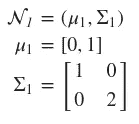
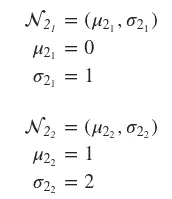
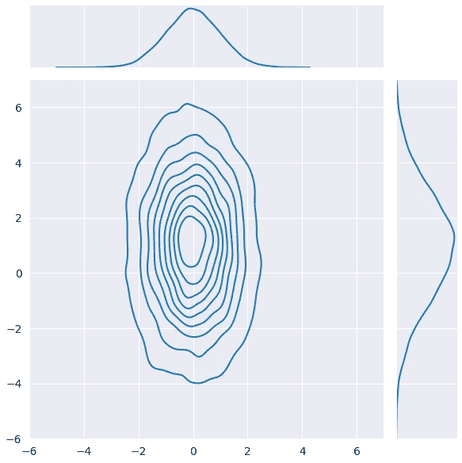
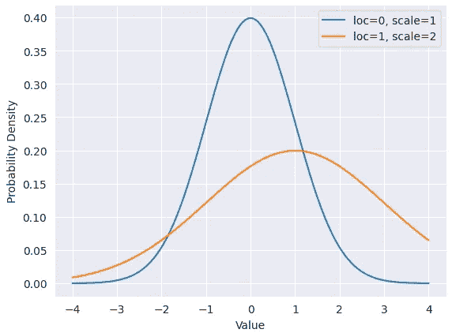
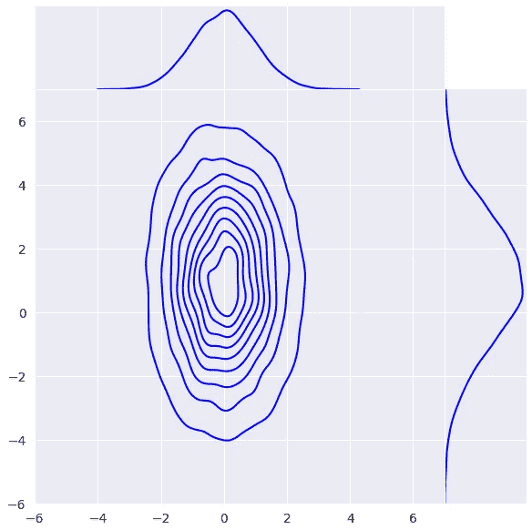
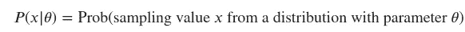
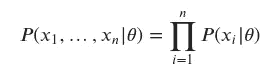

# 张量流概率简介——可训练参数

> 原文：<https://towardsdatascience.com/gentle-introduction-to-tensorflow-probability-trainable-parameters-5098ea4fed15>

## 概率深度学习

# 介绍

本文属于“概率深度学习”系列。这个每周系列涵盖了深度学习的概率方法。主要目标是扩展深度学习模型，以量化不确定性，即知道他们不知道的东西。

我们使用张量流和张量流概率(TFP)开发我们的模型。TFP 是构建在 TensorFlow 之上的 Python 库。我们将从可以在 TFP 中找到的基本对象开始，并了解如何操作它们。我们将在接下来的几周内逐步增加复杂性，并将我们的概率模型与现代硬件(如 GPU)上的深度学习相结合。

迄今发表的文章:

1.  [张量流概率简介:分布对象](https://medium.com/towards-data-science/gentle-introduction-to-tensorflow-probability-distribution-objects-1bb6165abee1)
2.  [张量流概率简介:可训练参数](https://medium.com/towards-data-science/gentle-introduction-to-tensorflow-probability-trainable-parameters-5098ea4fed15)
3.  [张量流概率中从零开始的最大似然估计](/maximum-likelihood-estimation-from-scratch-in-tensorflow-probability-2fc0eefdbfc2)
4.  [tensor flow 中从头开始的概率线性回归](/probabilistic-linear-regression-from-scratch-in-tensorflow-2eb633fffc00)
5.  [使用 Tensorflow 进行概率回归与确定性回归](https://medium.com/towards-data-science/probabilistic-vs-deterministic-regression-with-tensorflow-85ef791beeef)
6.  [Frequentist 与 Tensorflow 的贝叶斯统计](https://medium.com/towards-data-science/frequentist-vs-bayesian-statistics-with-tensorflow-fbba2c6c9ae5)


图 1:我们在这个系列中结合了两个世界:概率模型和深度学习([来源](https://unsplash.com/photos/yG9pCqSOrAg))

像往常一样，代码可以在我的 [GitHub](https://github.com/luisroque/probabilistic_deep_learning_with_TFP) 上找到。

# 分发对象

在上一篇文章中，我们看到了如何操作 TFP 分布对象。记住分布对象捕捉概率分布的基本操作。我们从单变量分布开始，即只有一个随机变量的分布。然后，我们将我们的理解扩展到如何用分布对象属性来表示多元分布。我们保持简单，因为我们定义了一个 2 维高斯分布，并且没有包括两个维度之间的任何相关性。要回忆的最重要的属性是`batch_shape`和`event_shape`。如果您对它们还不满意，请查看我以前的文章。我们将在本系列中广泛使用它们。

在介绍可训练的分布参数之前，我们将再介绍一个关于分布对象的概念。

## 独立分布

有些情况下，我们希望将事件空间上的一批独立分布解释为事件空间乘积上的单个联合分布。这影响了我们处理`batch_shape`和`event_shape`属性的方式。当我们开始构建一些众所周知的算法(如朴素贝叶斯分类器)时，独立分布将非常有用。原因是在朴素贝叶斯的情况下，给定一个类标签，特征是独立的。

为了说明，让我们定义两个正态分布。



第一个是以下形式的多元常态:



为了定义第一个，我们将像以前一样使用`MultivariateNormalDiag`，因为，再一次，它们之间的维度是不相关的。

```
mv_normal = tfd.MultivariateNormalDiag(loc=[0, 1], scale_diag=[1,2])

<tfp.distributions.MultivariateNormalDiag 'MultivariateNormalDiag' batch_shape=[] event_shape=[2] dtype=float32>
```

我们对形状属性越来越满意，因此毫不奇怪我们的`event_shape`为 2。

像往常一样，我们可以计算对数概率:

```
mv_normal.log_prob([0.2, 1.5])

<tf.Tensor: shape=(), dtype=float32, numpy=-2.5822742>
```

我们得到一个单一的值，因为我们有一个单一的分布，即使它是多维的。

让我们从独立的多元高斯分布中取样，并绘制联合分布图。我们以前做过类似的事情。

```
samples = mv_normal.sample(10000).numpy()
x1 = samples[:,0]
x2 = samples[:,1]
sns.jointplot(x = x1, y = x2, kind='kde', xlim=[-6, 7], ylim=[-6, 7]);
```



图 2:上面定义的多元高斯分布的近似联合分布图。还显示了单个维度的单变量图。

正如所料，多元高斯分布的维数之间没有相关性。

表示批量高斯分布对象的时间。

```
locs = [0,1]
scales = [1, 2]

batched_normal = tfd.Normal(loc=locs, scale=scales)
batched_normal

<tfp.distributions.Normal 'Normal' batch_shape=[2] event_shape=[] dtype=float32>
```

注意`batch_shape`等于 2。

```
batched_normal.log_prob([0.2, 1.5])

<tf.Tensor: shape=(2,), dtype=float32, numpy=array([-0.9389385, -1.6433357], dtype=float32)>
```

由于我们在同一个对象中存储了两个独立的分布，因此计算对数概率会产生两个值。

我们可以绘制两个单变量分布的概率密度函数(PDF)。

```
x = np.linspace(-4, 4, 10000)
densities = batched_normal.prob(np.repeat(x[:, np.newaxis], 2, axis=1))

sns.lineplot(x=x, y=densities[:, 0], label=f'loc={locs[0]}, scale={scales[0]}')
sns.lineplot(x=x, y=densities[:, 1], label=f'loc={locs[1]}, scale={scales[1]}')
plt.ylabel('Probability Density')
plt.xlabel('Value')
plt.legend()
plt.show()
```



图 3:作为单个分布对象批处理的两个单变量高斯分布的 PDF。

让我们总结一下上面的内容，这样我们就可以介绍独立分布对象了。很明显，当第一个分布对象返回一个对数概率时，第二个返回 2。不同之处在于，我们传递给第一个的数组被解释为一个二维随机变量的单一实现。在第二种情况下，数组被解释为每个随机变量(批次)的不同输入。

为了帮助我们理解什么是独立分布以及它是如何有帮助的，我们来玩一些概率术语:

*   独立分布是我们从单变量分布转移到单个多变量分布的一种简化方法；
*   独立分布允许我们从单个随机变量的几个分布转移到一组随机变量的联合分布；
*   独立分布提供了从几个批量分布转移到一个多维分布的能力；
*   独立分布是一个接口，将我们想要吸收的任何维度吸收到事件维度；
*   最后，更实用和 TFP 的描述方式——独立分布是一种将分布的`batch_shape` 维度移动到新分布对象的`event_shape`的方式。

希望用这么多不同的方式来描述它能使所有这些概率概念以及它们被转化为 TFP 抽象的方式更加清晰。

是时候应用理论概念并查看实际实现了。

```
independent_normal = tfd.Independent(batched_normal, reinterpreted_batch_ndims=1)
independent_normal

<tfp.distributions.Independent 'IndependentNormal' batch_shape=[] event_shape=[2] dtype=float32>
```

批量高斯分布现在是一个`IndependentNormal`分布对象，它是一个独立的多元高斯分布，如我们上面定义的。我们可以通过 2 的`event_shape`看出来。类似地，对数概率现在应该产生一个值。

```
<tf.Tensor: shape=(), dtype=float32, numpy=-2.5822742>
```

最后，让我们将独立高斯分布图与上面显示的图进行比较。

```
samples = independent_normal.sample(10000).numpy()
x1 = samples[:,0]
x2 = samples[:,1]
sns.jointplot(x = x1, y = x2, kind='kde', space=0, color='b', xlim=[-6, 7], ylim=[-6, 7]);
```



图 4:独立高斯分布对象的近似联合分布图。还显示了单个维度的单变量图。

# 可训练参数

## 变量

现在我们知道了什么是张量流概率对象，是时候了解如何为这些分布训练参数了。这是我们开始应用我们所学的知识和构建算法时所缺少的联系。

在 TensorFlow 中，`Variable`对象是我们用来捕捉深度学习模型的参数值的东西。这些对象在训练期间通过例如应用从损失函数和数据获得的梯度来更新。

我们来定义一个。注意，要创建一个新变量，我们必须提供一个初始值。

```
init_vals = tf.constant([[1.0, 2.0], [3.0, 4.0]])
new_variable = tf.Variable(init_vals)
new_variable

<tf.Variable 'Variable:0' shape=(2, 2) dtype=float32, numpy=
array([[1., 2.],
       [3., 4.]], dtype=float32)>
```

A `Variable`非常类似于张量。它们具有相似的属性，例如形状和数据类型，以及方法/操作，例如导出到 NumPy。虽然他们有一些不同，例如，他们不能被重塑。

```
print("shape: ", new_variable.shape)
print("dType: ", new_variable.dtype)
print("as NumPy: ", new_variable.numpy())
print("Index of highest value:", tf.math.argmax(new_variable))

shape:  (2, 2)
dType:  <dtype: 'float32'>
as NumPy:  [[1\. 2.]
 [3\. 4.]]
Index of highest value: tf.Tensor([1 1], shape=(2,), dtype=int64)
```

请注意，如果出于某种原因，您不希望在训练过程中对某个变量进行微分，您可以使用参数`trainable`来定义它。

```
variable_not_diff = tf.Variable(1, trainable=False)

<tf.Variable 'Variable:0' shape=() dtype=int32, numpy=1>
```

总之，通常，我们希望我们的变量是可微的。张量流允许自动微分，这是用于训练神经网络的反向传播算法的基础。

我们将使用一个 API 来完成自动微分— `tf.GradientTape`。连接回`Variable`对象，这个 API 让我们能够计算操作相对于输入的梯度，即一个或多个`Variable`对象。

让我们用`tf.GradientTape` API 和`Variable`对象做一个简单的例子。

```
x = tf.Variable(3.0)

with tf.GradientTape() as tape:
    y = x**2
```

一旦我们在`tf.GradientTape`上下文中定义了一个操作，我们就可以调用`gradient`方法并传递损失和输入变量。

```
dy_dx = tape.gradient(y, x)
dy_dx.numpy()

6.0
```

是时候把这些概念应用到我们的问题上了。回想一下，我们对学习分布的参数感兴趣。

```
normal = tfd.Normal(loc=tf.Variable(0., name='loc'), scale=5)
normal.trainable_variables

(<tf.Variable 'loc:0' shape=() dtype=float32, numpy=0.0>,)
```

在这种情况下，上面定义的高斯分布的均值不再是一个简单的值，而是一个可以学习的`Variable`对象。

对于训练过程，最大似然是深度学习模型中通常的疑点。简而言之，我们正在寻找使数据概率最大化的模型参数。

连续随机变量的概率密度函数粗略地表示样本取特定值的概率。我们将把这个函数表示为*𝑃*(*𝑥*|*𝜃*)，其中 *𝑥* 是样本值， *𝜃* 是描述概率分布的参数:



```
tfd.Normal(0, 1).prob(0)

<tf.Tensor: shape=(), dtype=float32, numpy=0.3989423>
```

这可能看起来很奇怪，但事实上，我们已经计算高斯分布的 PDF 有一段时间了，所以这里没有什么特别新的东西。

为了完成对训练参数的介绍，让我们将这个概念与我们在上面分享的独立分布对象联系起来。当从同一个分布中独立地*抽取多个样本时(我们通常假设)，样本值 *𝑥* 1、…、 *𝑥𝑛* 的 PDF 是每个个体 *𝑥𝑖* 的 pdf 的乘积。我们可以把它写成:*



希望您能在上面的定义中看到这两个概念是如何重叠的。

# 结论

本文继续探讨 TFP 中的分布对象，但这次我们更进一步，将它们与 TensforFlow 中的`Variable`对象联系起来。我们从定义什么是独立分布以及它如何帮助我们定义独立联合概率开始。它允许我们从单变量分布转移到独立的多变量分布，从而将我们想要的任何维度吸收到事件维度中。接下来，我们介绍了`Variable`对象，以及如何利用自动微分来区分它们。有了这些知识，我们将它们与 TFP 中的一个分发对象结合使用。最后，我们讨论了最大似然法，以及当我们从同一个分布中独立抽样时，它与独立联合分布的关系。

下周，我们将更详细地探讨发行版的培训过程。到时候见！

保持联系: [LinkedIn](https://www.linkedin.com/in/luisbrasroque/)

# 参考资料和材料

[1] — [Coursera:深度学习专业化](https://www.coursera.org/specializations/deep-learning)

[2] — [Coursera:深度学习的 tensor flow 2](https://www.coursera.org/specializations/tensorflow2-deeplearning)专业化

[3] — [张量流概率指南和教程](https://www.tensorflow.org/probability/overview)

[4] — [TensorFlow 博客中的 TensorFlow 概率帖子](https://blog.tensorflow.org/search?label=TensorFlow+Probability&max-results=20)