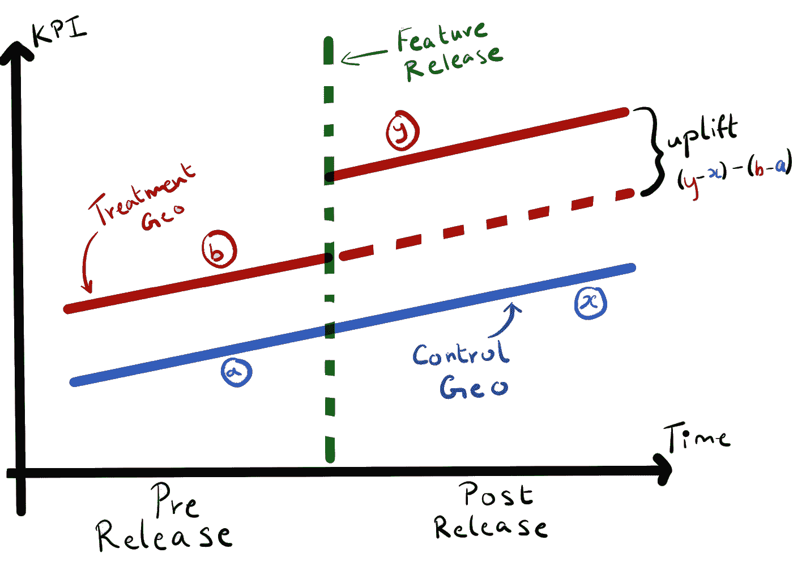

# 地球同步轨道提升试验 I:理解差异中的差异

> 原文：<https://towardsdatascience.com/geo-lift-experiments-i-understanding-difference-in-differences-5f35e41a2fdb>

## 这是 2 部分系列的第 1 部分，着眼于产品环境中的 geo lift 实验:

1.  理解差异中的差异
2.  [Spotify Blend 案例研究](/geo-lift-experiments-ii-spotify-blend-case-study-476a81099744)

在这一部分，我们将探讨为什么以及何时进行 geo lift 实验。我们还将探索差异中的潜在差异因果推断方法。


由[凯尔·格伦](https://unsplash.com/@kylejglenn?utm_source=medium&utm_medium=referral)在 [Unsplash](https://unsplash.com?utm_source=medium&utm_medium=referral) 上拍摄

最近 [AB 测试](/bayesian-experimentation-methods-for-products-636514951e43)已经成为产品开发团队的黄金标准。在产品上运行实验有助于团队理解每个变化对他们的关键度量的增量效应，并逐渐改进他们的产品。然而，有时随机地向一些用户推出一个特性，而不向另一些用户推出，会导致不准确的结果。这可能是由于[网络效应](https://medium.com/towards-data-science/ab-testing-challenges-in-social-networks-e67611c92916)、库存溢出，或者更普遍的情况，即**稳定单位处理值假设** (SUTVA)不成立。这是假设一个**随机单元**参与产品变更的方式独立于任何其他单元参与相同产品变更的方式。随机化单元是我们对每个变量进行随机分配的层次。在大多数情况下，这是个人用户，但也可以是设备、会话或社交群等。让我们看一些例子来更好地理解这个概念。

特别是对于社交产品，许多功能需要双向参与才能发挥作用。随机地向用户显示一个特征变化可能导致那些用户中的一些没有适当的机会参与其中，因为不是他们所有的朋友都可以访问相同的特征变化。因此，测试中衡量的成功标准可能无法真正代表将变更推广到所有用户的效果。

同样，违反 SUTVA 是电子商务和旅游产品在试验决定向用户显示哪些项目的算法时面临的问题之一，如个性化和搜索算法。例如，在 Airbnb 上，当一种算法向用户显示他们继续预订的房间时，该房间不再向任何被分配了不同算法的用户显示。因此，这两个算法的参与度指标是不一致的，因为其中一个算法的参与度并不独立于另一个算法。

通过改变实验的设计，我们有多种方法可以控制这些。例如，在社交网络的情况下，我们可以将网络分成彼此交互频繁的用户群，并在群集级别执行随机分配。然而，实现更复杂的实验设计会有很大的开发成本。因此，有时我们可能没有资源来进行实验。

这个问题的一个潜在解决方案是以 geo lift 实验的形式运行一个准实验。这个想法是向特定地区的所有用户发布特性更改。然后，将该地区的关键成功指标与未发布功能变更的控制地区的成功指标进行比较。然后，我们使用这种比较来理解该特性对我们的关键成功指标的因果影响。值得注意的是，这只能作为一种解决方案，前提是假设将实验限制在特定的地理区域代表了向您的整个用户群发布该功能。以社交产品为例，这只能作为一种解决方案，前提是假设对于大多数用户来说，他们在产品上与之交互的所有其他用户都来自相同的地理位置。

这种方法是基于**差异**的因果推断方法。使用这种方法测量的关键成功指标的提升不像运行一个设计良好的实验那样是因果影响的有力指标，但它更足智多谋，并且(在大多数情况下)设置和推出更快。

这种方法也是控制基于时间的混杂因素的好方法。例如，在进行实验的同时开展普遍获得活动或销售。或者，对于样本量较小的公司，基于时间的混杂因素可能只是自然变异。然而，该方法的进一步假设是，任何基于时间的混杂因素都适用于两个地理区域。例如，新的普遍获得营销活动必须在控制和测试地区同时进行。为了理解为什么需要这样，让我们更深入地研究一下这种方法背后的因果推理技术。

## 差异中的差异

差异中的差异方法使用两个相似的用户群，并在功能变更发布前后对关键成功指标进行建模。我们的一个用户群被作为对照，在准实验期间没有接收到特征变化。另一个用户部分进行处理，并接收特征变化。对于每项成功指标，我们建立了以下模型:

*   控制预发布(`a`)
*   控制后释放(`x`)
*   治疗前释放(`b`
*   治疗后释放(`y`

两个地区之间的发布前差异由`b — a`给出，两个地区之间的发布后差异由`y — x`给出。然后，我们可以将由于特征变化导致的整体抬升建模为这些差异之间的差异，因此该方法得名。

```
uplift = post_release_diff - pre_release_diff
       = (y - x) - (b - a)
```



此图显示了不同方法的不同之处。geo 之间的发布后差异等于发布前差异+由于特征变化而产生的隆起。(图片由作者提供)

现在我们对 geo lift 实验的工作原理有了更好的了解，让我们来看看在[第 2 部分](/geo-lift-experiments-ii-spotify-blend-case-study-476a81099744)中使用这种方法的真实产品示例。我们将使用一个名为 [PyMC](https://docs.pymc.io/en/v3/index.html) 的 python 包，使用我们观察到的数据对我们的成功指标进行建模。它使用[贝叶斯统计](/bayesian-ab-testing-part-i-conversions-ac2635f878ec)和[蒙特卡罗马尔可夫链](https://en.wikipedia.org/wiki/Markov_chain_Monte_Carlo) (MCMC)方法来建模指标。我们将把这个应用到 Spotify [Blend](https://newsroom.spotify.com/2021-08-31/how-spotifys-newest-personalized-experience-blend-creates-a-playlist-for-you-and-your-bestie/) 功能中。

感谢阅读这篇文章！我希望它能帮助你更好地理解什么时候使用这种因果推理方法是有用的。

如果你喜欢阅读我的文章，愿意支持我的写作，并且正在考虑订阅一个媒体，请随时使用我下面的推荐链接。我会从你的订阅费中提成。

<https://medium.com/@kaushsk12/membership> 