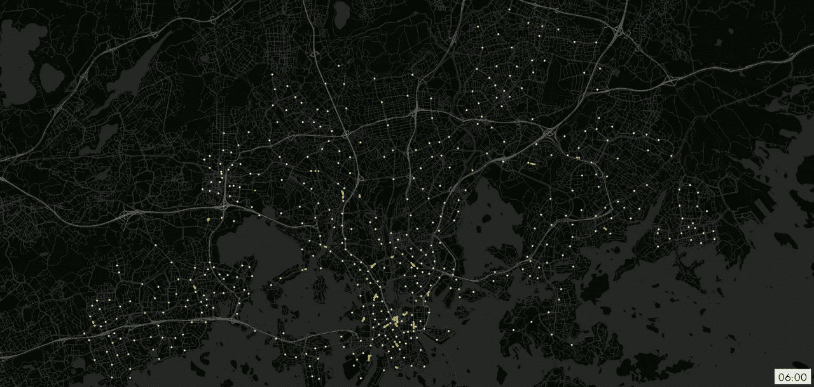
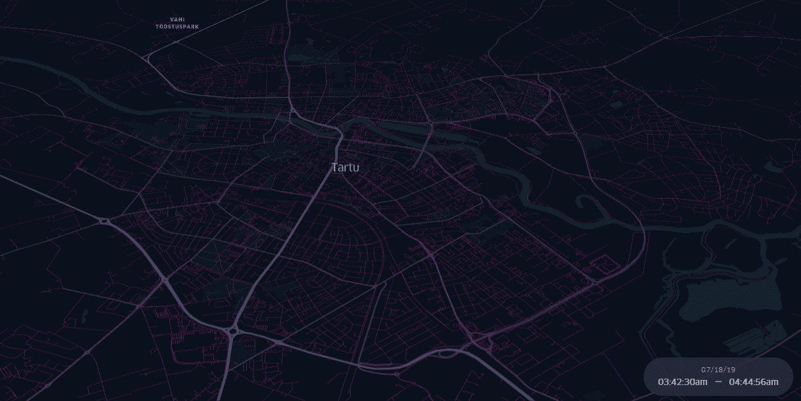
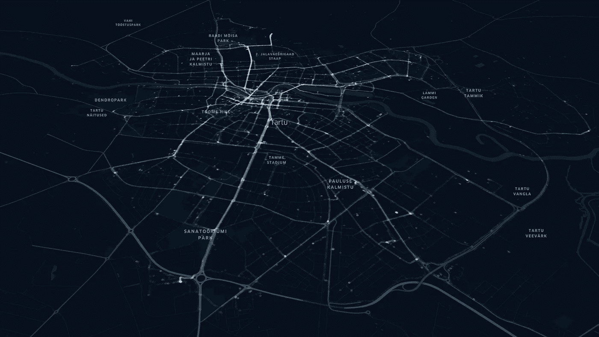

# 自行车共享系统日常运行的地理可视化:赫尔辛基和塔尔图

> 原文：<https://towardsdatascience.com/geo-visualization-of-daily-movements-of-bike-sharing-system-helsinki-and-tartu-c38b4aed6b06>

与伊莱亚斯·威尔伯格合作



图片由 Elias Wilberg 提供。从 2021 年的一个夏季工作日开始，赫尔辛基和埃斯波的自行车共享自行车

最近，我在 [GIS4 Wildlife](https://www.gis4-wildlife.com/) 开始了与大规模运动数据集地理可视化相关的项目。我刚刚想起，在 30 日地图挑战赛期间，我的一位同事 [Elias Wilberg](https://www.researchgate.net/profile/Elias-Willberg) 创作了一幅[精彩的可视化作品](https://twitter.com/EliasW_/status/1461994337756233730)，展示了赫尔辛基自行车共享系统的日常活动。可视化渲染的环境是 PostgreSQL/PostGIS+Qgis+time manager 之间的连接。因此，我决定向 Ellias 询问渲染过程的体验，并将他的回答包含在这篇文章中。

Elias 专注于研究城市和主动移动性，尤其是自行车共享系统数据的使用。我在一篇关于赫尔辛基地区自行车共享运动聚合的旧文章中提到过他的研究。

[](/visualization-of-bike-sharing-system-movements-in-helsinki-with-an-interactive-flow-map-451d897104fe) [## 赫尔辛基自行车共享系统运动的可视化与交互式流程图

### 基于赫尔辛基自行车运动 OD 矩阵的传单互动流程图

towardsdatascience.com](/visualization-of-bike-sharing-system-movements-in-helsinki-with-an-interactive-flow-map-451d897104fe) 

但是我发现 Elias 在 30DayMapChallenge 中的可视化很吸引人，它代表了自行车共享系统用户在他们的轨迹中从起点到终点的移动。我记得当他在处理它的时候，由于数据集的大小，他在晚上离开了计算机渲染。运行脚本 12 个小时，希望在处理过程中没有错误，这种体验对于大型数据集来说是常见的。因此，在开始我未来与大规模运动数据集可视化相关的项目之前，Elias 的经历对我来说非常有价值，很高兴与地理空间社区分享它。

总的来说，我询问了地理可视化产品的使用体验，Elias 回答道:

> “我对自行车共享数据产生了兴趣，因为这是为数不多的关于自行车的详尽且开放可用的数据源之一。通过帮助揭示城市地区人们的时空骑行模式，自行车共享数据可以帮助理解如何让更多的人骑自行车；尤其是由于气候危机，这是城市迫切需要的东西。赫尔辛基地区的当地自行车共享系统已经存在多年，在市民中非常受欢迎，每年约有 350 万人次。这意味着该系统每年都提供易于获取和使用的有趣数据
> 
> 在我看来，成功分析和可视化数据的关键是使用正确的工具。当你有合适的工具时，即使使用非常简单的硬件，也有可能从大型数据集进行动态可视化和高级分析，就我而言，使用的是一台 5 年前的笔记本电脑。
> 
> 以自行车共享可视化为例，我使用 Python 进行路由，使用 PostGIS 进行几何运算，使用 QGIS 进行可视化，使用 GIMP 将地图框组合成视频格式。从路线开始，路线规划工具的可用性和效率在最近几年有了很大的提高。有了 Pandana 图书馆，赫尔辛基所有自行车共享站(大约有 450 个)之间的最短路线搜索只需不到 5 分钟。虽然通常是空间操作需要最大的处理能力，但 PostGIS 是一个很好的工具。我能够将最短的路线分成超过 1000 万个节点，并使用 PostGIS 为每个节点插入时间戳，同样在不到 5 分钟的处理时间内。虽然 QGIS 本身可能会塞满那么多点，但根据时间戳将点以更小的块从 PostGIS 输入到时态控制器使可视化成为可能。在这一阶段，QGIS 在 24 小时内每秒生成一个地图框，但正如 Bryan 所提到的，这需要更多的时间。最后，使用 GIMP，可以将帧组合成动态可视化，并优化视频文件的大小。最棒的是所有的事情都是用开源工具完成的。开放万岁！
> 
> 最后，非常感谢布莱恩。如果没有你的兴趣和热情，我就不会花时间制作这个可视化的东西。很高兴您能和我们一起来到数字地理实验室！"

灵感和伟大的想法不仅仅来自埃利亚斯。由[蒂格兰**T2【Khachatryan**](https://www.linkedin.com/in/geometrein/?originalSubdomain=fi)撰写的关于赫尔辛基地区自行车网络的网络分析非常有价值。中型简介包含非常有趣的文章，有许多见解。如果你在 Medium 上，查看他的个人资料，然后关注[蒂格兰·哈恰特良](https://medium.com/u/782bd18bc46d?source=post_page-----c38b4aed6b06--------------------------------)。尤其是他的上一篇文章。

[](https://geometrein.medium.com/wolt-delivery-network-analysis-cccdc4cb50e3) [## Wolt 交付网络分析

### 疫情冠状病毒对全世界的城市交通产生了重大影响。受影响的电信…

geometrein.medium.com](https://geometrein.medium.com/wolt-delivery-network-analysis-cccdc4cb50e3) 

关于自行车共享系统的许多灵感及其数据集分析的许多可能性。所以，我决定加入我自己的。我可以更像 Elias 那样描述我的可视化，因为我想创建一个地图动画，重点关注自行车共享系统用户在他们的轨迹中的运动。查看我这篇关于爱沙尼亚塔尔图自行车数据地理可视化的文章。

# 地理可视化



图片由作者提供。自行车街道网络上的自行车运动

塔尔图智能自行车系统由 750 辆自行车和 80 多个站点组成。该网站包含有关自行车使用情况的更新指标，例如当年行驶的距离等。此外，考虑到三分之二的自行车都配备了电动辅助马达，以在踩踏板时提供额外的动力，它为自行车的使用提供了可接受的价格。

我将从 OSM 数据中提取的自行车街道网络添加到地理可视化中。获取数据集的代码可以在本文的知识库中找到:

[](/shortest-path-algorithm-used-in-osm-street-network-33e0f864f34b) [## 最短路径算法在 OSM 街道网中的应用

### 针对汽车、自行车和行人的最短路径分析的 GIS 自动化提示

towardsdatascience.com](/shortest-path-algorithm-used-in-osm-street-network-33e0f864f34b) 

## 关于数据集和许可

爱沙尼亚提供了一个[开放数据门户](https://avaandmed.eesti.ee/datasets)，在那里你可以找到自行车共享系统的数据。对于这个地理可视化，我使用了 2019 年 7 月 18 日的每日数据集。

*   **自行车共享系统数据**:知识共享署名许可-共享 3.0 未发布。
*   **OSM 自行车网络**:获得[开放数据共享开放数据库许可(ODbl)](https://opendatacommons.org/licenses/odbl/) 或归属许可。用户可以自由地复制、分发、传输和改编这些数据，只要这些数据是像 [OpenStreetMap](https://www.openstreetmap.org/copyright) 贡献者这样的作者所拥有的。

## 代码和 Web 地图

按下播放并检查移动。建议在“火箭”按钮上减速。

> 在这里找到代码:[储存库](https://github.com/bryanvallejo16/tartu-smart-bikes-geo)
> 可视化在这里: [Tartu 智能自行车](https://bryanvallejo16.github.io/tartu-smart-bikes-geo/root/Tartu_smart_bike.html)



图片由作者提供。塔尔图智能自行车路线

一旦运行了代码并保存了文件。
将它们拖至 [KeplerGl 演示](https://kepler.gl/demo)。

一条重要的建议是，您可能需要准备时间戳:

```
data['route_code'] **=** [f'B-{code}' **for** code **in** data['route_code']]
data['timestamp'] **=** data['coord_date'] **+** ' ' **+** data['coord_time']
```

检查整个笔记本，它有完整的工作流程和添加 OSM 的自行车路线层的过程。

## 结论

本文旨在强调大规模运动数据集需要支持可视化的环境。目前最好的组合是 PostgreSQL/PostGIS+Qgis+time manager。自行车共享系统数据集是运动数据集的很好的例子，Elias 的经历对未来的工作是有价值的建议。如果你知道更好的环境或集成(当然有)，请让我知道或联系我合作。祝愿你未来的可视化。