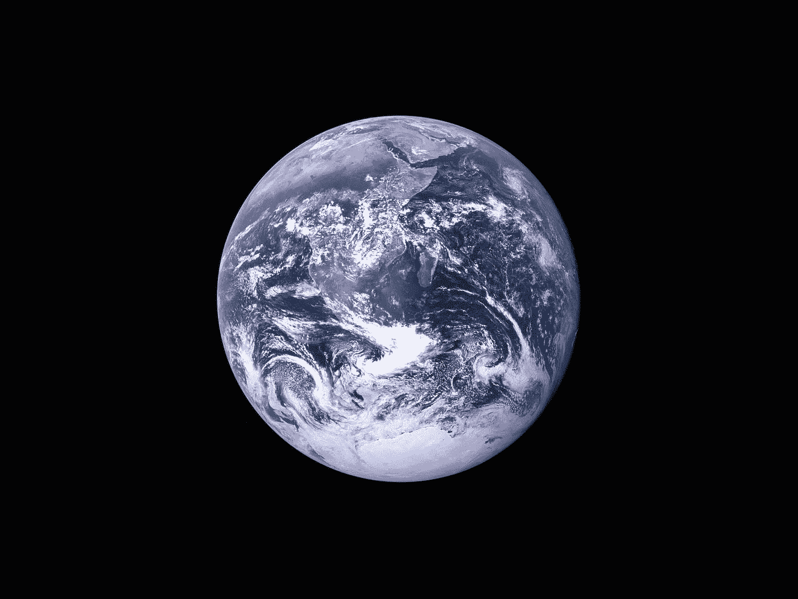
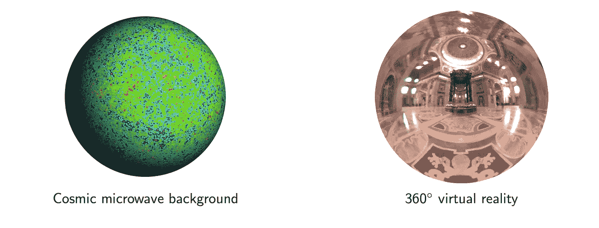
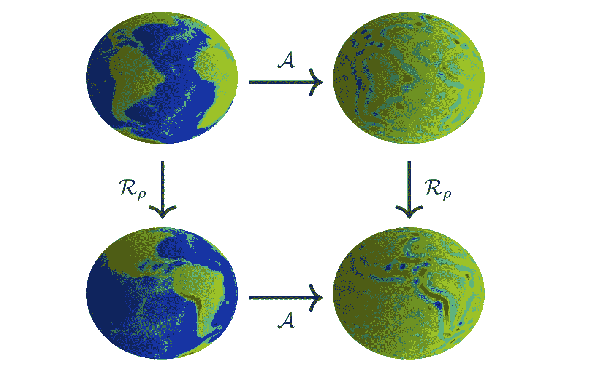
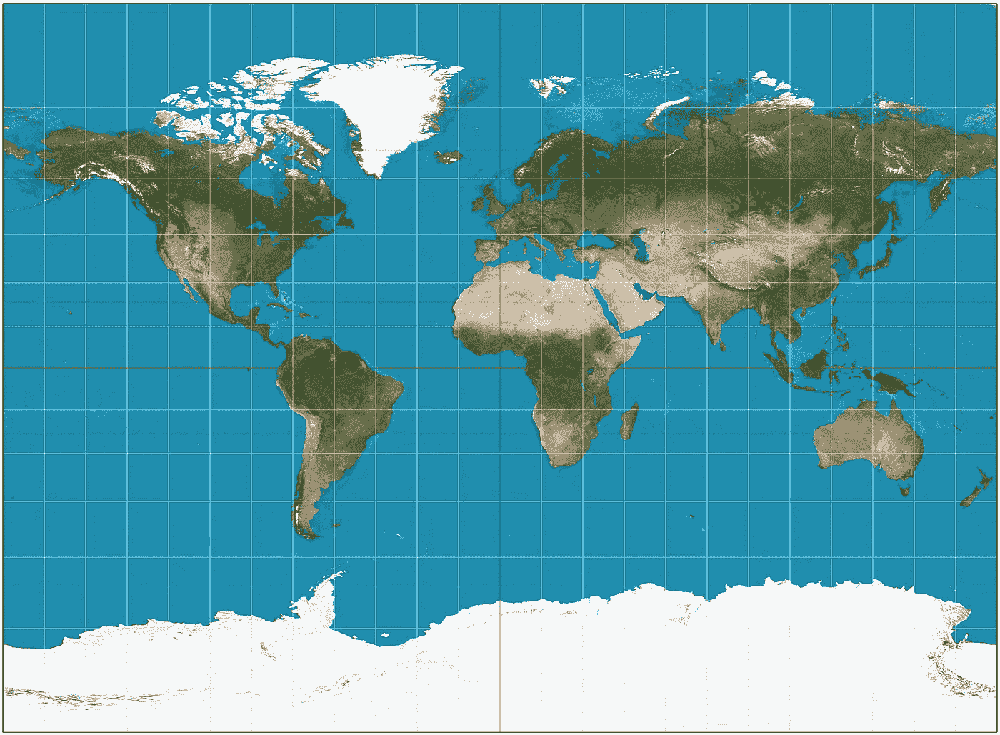
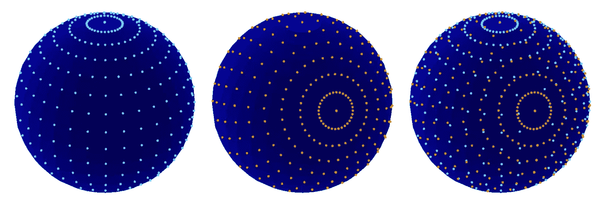
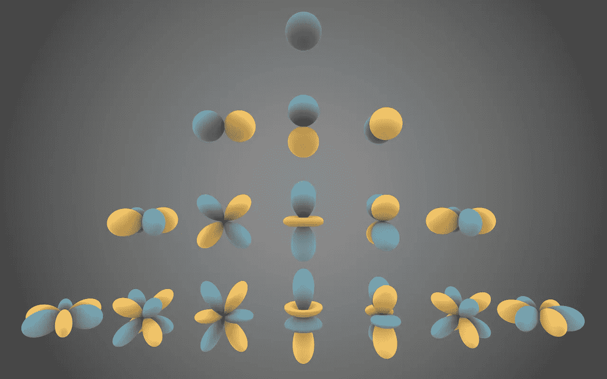
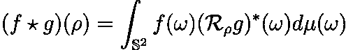
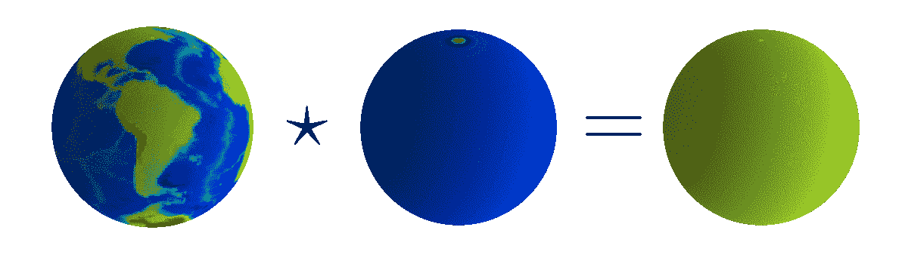

# 球形数据的几何深度学习

> 原文：<https://towardsdatascience.com/geometric-deep-learning-for-spherical-data-55612742d05f>

球形 CNN

通过对物理世界平移对称性的理解进行编码，卷积神经网络(CNN)彻底改变了计算机视觉。在这篇博文中，我们研究了 CNN 成功背后的原理是如何转移到一系列问题上的，这些问题的数据表现出复杂的几何形状，例如球体。

这篇博文由来自 [Kagenova](https://www.kagenova.com/) 的 Oliver Cobb 和 Augustine Mavor-Parker 共同撰写。

球形数据的一个例子。[图片由 [NASA](https://unsplash.com/@nasa?utm_source=medium&utm_medium=referral) 在 [Unsplash](https://unsplash.com?utm_source=medium&utm_medium=referral) 拍摄]

在过去的十年中，CNN 从传统(平面)图像和视频中提取语义的能力已经得到了快速的提高。如果有足够的数据，通常可以达到人的水平。然而，对具有空间结构的数据进行分析远不是一个已解决的问题。有许多问题的数据表现出空间的但非平面的结构。示例包括虚拟现实中的 360°图像、大爆炸的宇宙微波背景(CMB)辐射、医学成像中的 3D 扫描以及计算机图形中的网格表面，仅举几例。

对于这些问题中的每一个，我们都希望利用我们对数据结构的了解，特别是它们所涉及的对称变换。正如在 [**之前的一篇博文**](/what-einstein-can-teach-us-about-machine-learning-1661e26bef2c) 中所讨论的，将对对称性的理解编码到机器学习模型中可以是一种限制所考虑的模型空间的强大方法，允许更有效地学习模型。

对于平面上的图像，平移对称可以通过应用在图像上平移的一堆卷积滤波器来容易且有效地编码。因为相同的卷积滤波器被应用于所有位置，所以结果操作在平移上是等变的，即它尊重平移对称性。这意味着无论特征位于图像中的哪个位置，它都会以相同的方式刺激相应位置的激活神经元。

不幸的是，对于非平面结构的问题，通常不存在这种简单的程序来编码对对称性的理解。然而，对于这些问题，几何深度学习新兴领域的研究人员正在制定新的方法，这些方法利用数据的几何形式的属性，并尊重对称性。最近取得重大进展的一组问题是那些在球面上定义数据的问题。

## 球形数据的对称性

> 许多字段涉及到固有地存在于球体上的数据。

当在球面上的每个点进行观测时，会产生球面数据，例如地球的地形图。然而，当在多个方向上进行观测时，也会出现这种情况，例如宇宙学中的宇宙微波背景(CMB)或虚拟现实和计算机视觉中的 360°图像(见下图)。在 Kagenova，我们正在努力为这些问题和其他涉及复杂几何数据的问题(如球体)解锁深度学习的非凡成功。

*球形数据的例子。【原创人物由作者创作。]*

对于平面图像，CNN 规定，定义特定特征如何变换的规则不应取决于该特征恰好位于平面中的*位置*。对于在球体上定义的数据，我们希望规定规则不应该依赖于特征如何以及在哪里碰巧在球体上*定向*。变换特征然后旋转其变换后的形式应该等同于旋转特征并变换其旋转后的形式。关于此属性的操作称为*旋转等变*(见下图)。

旋转等方差图。给定球形数据(左上)，应用变换(𝒜)以获得特征图(右上)，然后旋转(ℛᵨ)特征图(右下)，相当于首先旋转数据(左下)，然后应用变换(右下)。【*原创人物由作者创作。* ]

在物理学中，规定控制系统行为的物理定律不应该取决于系统的取向，这就产生了角动量守恒定律。因此，毫不奇怪，在量子物理*中用于研究角动量的一些相同的机器对于在深度学习中定义旋转等变层是有用的(正如我们将在后面看到的)。*

## 标准(平面)CNN 的局限性

在深入球形深度学习的想法之前，也许很自然地会想为什么平面 CNN 的有效性不能被直接利用。我们能不能不把我们的球形数据投射到某个平面表示上，然后简单地用通常的方式应用 CNN？毕竟，我们对球形世界的平面投影(地图)很熟悉。

> 投影的问题是不存在从球面到平面的既保持形状又保持面积的投影。换句话说，扭曲是不可避免的。

这就是为什么格陵兰岛在地球地图上看起来和非洲差不多大，而实际上还不到非洲的十分之一(见下图)。

球体到平面的投影引入了不可避免的扭曲，这与所用的投影方法是不可避免的。因此，在地球地图上，格陵兰岛看起来和非洲差不多大，但实际上还不到非洲的十分之一。[图片来源于[维基共享资源](https://en.wikipedia.org/wiki/Miller_cylindrical_projection#/media/File:Miller_projection_SW.jpg)。]

这些失真意味着，当将传统的 CNN 应用于球形图像的平面投影时，特征根据它们所处的位置而出现不同。当应用于球面图像的平面投影时，平面 CNN 的平移等方差*不*编码旋转等方差。对旋转等变进行编码需要卷积的概念，这是专门为球体的几何形状设计的。

## 卷积复杂性

> 不幸的是，由平面 CNN 实现的简单卷积过程不能应用于球形设置。

要了解为什么会出现这种情况，首先考虑平面数据的形式。平面数据被表示为像素值的 2D 阵列。对于定义在平面上的数据，我们可以在水平和垂直方向上均匀地间隔像素位置。平面的这种均匀采样意味着每个像素具有相关的邻居，并且所有像素在相同的相对位置(北、东北、东等)具有邻居。这意味着在相同样本位置定义的任何过滤器都可以通过平移以输入中的任何像素为中心，从而使样本精确对齐。

不幸的是，没有办法对球体进行采样，使得所有像素在相同的相对位置具有邻居。球体上的位置通常使用[球面坐标](https://en.wikipedia.org/wiki/Spherical_coordinate_system)来描述，θ测量极角，ϕ测量方位角。相对于θ和ϕ均匀间隔采样会产生下图左侧所示的球体采样。如果我们使用这些样本位置来定义过滤器，然后旋转过滤器，我们会发现样本位置并不对齐(见下图)。不管我们选择如何对球体进行采样，这都是正确的。

*假设我们使用与球形数据相同的样本位置定义一个过滤器。由于样本不对齐，因此无法评估滤波器在各种旋转下与数据的匹配程度。这适用于球体的所有样本。【原创人物由作者创作。]*

> 众所周知，不可能以旋转不变的方式离散化球体。因此，不可能构造出严格旋转等变的纯离散球面卷积。

为了构造一个能捕捉旋转等变性质的卷积的球面概念，我们必须考虑一个连续的表示。值得庆幸的是，存在这样一种表示，对于这种表示，可以执行卷积的自然概念。

考虑球面上连续信号的表示。这些是函数 f: 𝕊 → ℝ将一个值与球面𝕊上的每一点(θ，ϕ)相关联，而不仅仅是在选择的样本位置。正如圆上的连续信号(即周期函数)可以分解为正弦和余弦函数的加权和，球体上的连续信号同样可以分解为[谐波基信号](https://en.wikipedia.org/wiki/Spherical_harmonics)的加权和(见下图)。在这两种情况下，权重(系数)可用于表示信号，产生圆上信号的傅立叶级数表示和球上信号的[球谐表示](https://en.wikipedia.org/wiki/Spherical_harmonics#Spherical_harmonics_expansion)。

球面调和函数。[图片来源于[维基共享资源](https://en.wikipedia.org/wiki/Spherical_harmonics#/media/File:Spherical_Harmonics.png)。]

虽然这种表示是无限的，但是通过适当地截断系数向量，可以非常精确地近似真实世界的信号。从上图可以看出，低次球谐函数只能捕捉低频变化，而高次球谐函数可以捕捉较高频率的变化。我们截断的点决定了我们的数据表示的分辨率。

## 球形卷积

回想一下，我们想要执行满足旋转等方差属性的球形数据的转换。

> 有一个非常自然的球形卷积的概念，在连续设置中类似于在平面情况下执行。

这是取球面信号 *f* : 𝕊 → ℝ，定义一个球面滤波器 *g* : 𝕊 → ℝ，计算卷积信号 *f* * *g* 定义为

这里我们使用了旋转算子ℛᵨ *，*定义为*(ℛ*ᵨ*g*)(ω)=*g*(ρ⁻ω)。换句话说，它具有将相应的反向旋转应用于函数的定义域的效果，类似于我们如何考虑平移定义在 1D 线或 2D 平面上的函数。

对上述等式的解释是，卷积信号 *f* * *g* 捕捉到信号 *f* 在任何给定旋转ρ下与滤波器 *g* 的匹配程度(见下图)。这类似于平面情况，我们考虑滤波器在各种平移下与输入的匹配程度。

数据(左)与过滤器(中)的球形卷积的可视化，以产生特征图(右)。【原创人物由作者创作。]

这里的主要区别在于，定义卷积信号的空间，即旋转空间(3D 空间)，不同于定义被卷积的信号和滤波器的空间(2D 球)。在上面所示的说明性例子中，滤波器对于方位角旋转是不变的，因此输出保持在球体上。

然而，将输入信号从球体提升到 3D 旋转空间并不是特别有问题。随后可以在信号和定义在旋转空间上的滤波器之间执行卷积的类似概念。因此，给定球形输入，为了分层学习特征，我们可以执行一次球形卷积，从而在 3D 旋转组上产生激活图，然后执行我们想要的任意多的旋转组卷积。

要了解为什么上述卷积概念是旋转等变的，请注意，将输入旋转ρ相当于对积分内的滤波器应用额外的ρ⁻旋转。反过来，这具有旋转由ρ⁻定义的卷积信号的域的效果。换句话说，在执行卷积之前旋转输入相当于先执行卷积，然后旋转输出。

两个球形信号的卷积似乎需要对三维空间中的每个值计算二维积分。不过好在 *f* * *g* 和 *f* 和 *g* 的调和表示之间的关系很简单。通过在 *f* 和 *g* 的调和系数之间执行矩阵乘法，可以在调和空间中计算球形卷积。鉴于深度学习实践者非常习惯于利用 GPU 来高效地执行矩阵乘法，这尤其方便。

## 球形回旋是不够的

配备了可以有效实现的旋转等变线性运算，看起来我们已经拥有了重复应用该运算和分级学习特征所需的一切。

> 然而，有一个重要的组成部分，我们迄今为止忽略了提到——非线性的引入。

在平面网络中，非线性是由逐点激活函数引入的，即通过将选择的非线性函数分别应用于每个样本位置的值。由于平面采样方案的均匀性，这实际上是平移等变操作。然而，我们已经过渡到使用没有相关样本位置或值的谐波表示。虽然可以获得基于样本的表示，但是我们不能对球体进行均匀采样(如上所述),这意味着对每个样本应用相同的非线性函数不是严格的旋转等变操作。

然而，以这种方式引入非线性是可能的，并且如科恩等人(2018 年)和埃斯特韦斯等人(2018 年)所示，通常相当有效。然而，为了执行卷积和非线性运算，在谐波和基于样本的表示之间重复转换是麻烦的。此外，人们很自然会怀疑损失的等方差在多大程度上阻碍了性能。

在我们的下一篇文章中，我们将看到如何利用量子物理学的思想在调和空间中直接引入非线性，而不损害我们对旋转对称的尊重程度。

## 参考

[1]科恩，盖革，克勒，韦林，*球形 CNN*，ICLR (2018)， [arxiv:1801.10130](https://arxiv.org/abs/1801.10130) 。

[2]埃斯特韦斯，艾伦-布兰切特，马卡迪亚，达尼利迪斯，*学习 SO(3)用球面 CNN 的等变表示*，ECCV (2018)， [arXiv:1711.06721](https://arxiv.org/abs/1711.06721) 。