# 几何先验 I

> 原文：<https://towardsdatascience.com/geometric-priors-i-cc9dc748f08>

## [几何深度学习](https://towardsdatascience.com/tagged/geometric-deep-learning)

## 群、表示、不变性和等方差

*一系列博文，总结了 AMMI 计划的* [*几何深度学习(GDL)课程*](https://geometricdeeplearning.com/lectures/)*；* [*非洲机器智能硕士*](https://aimsammi.org/) *，授课老师* [*迈克尔·布朗斯坦*](https://scholar.google.com/citations?user=UU3N6-UAAAAJ&hl=en) *，* [*琼·布鲁纳*](https://cims.nyu.edu/~bruna/) *，* [*塔科·科恩*](https://tacocohen.wordpress.com/) *，以及*[佩塔尔·韦利奇科维奇](https://petar-v.com/)

维数灾难是高维学习中的一个重大挑战。这篇帖子讨论了几何深度学习(GDL)中的一个主要概念，叫做*几何先验* ( *对称性和尺度分离*)。几何先验让我们能够解决维数灾难。我们将看到*域*和*信号*在这些域上的概念。我们将讨论*对称*以及它们是如何出现在 ML 和 GDL 中的。我们还将看看一些潜在的数学概念，如*群表示、不变量和等价变量*。最后，我们将看到如何在深度学习中使用*不变&等变网络*的概念。

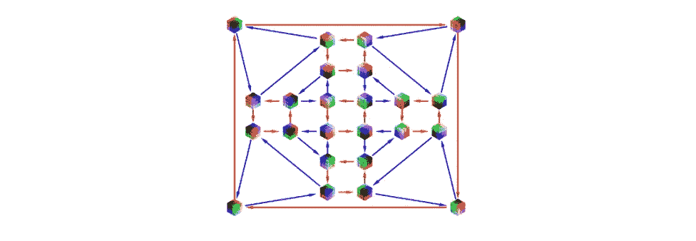

立方体的旋转对称性(Oₕ).群图片来自 GDL 课程第三讲。

*参见我上一篇文章* s *上一篇* [*Erlangen 程序的 ML*](/geometric-deep-learning-da09e7c17aa3) *和* [*高维学习*](/high-dimensional-learning-ea6131785802) *。这些博文是根据四位导师的* [*GDL 原书*](https://arxiv.org/abs/2104.13478) *和* [*GDL 课程*](https://geometricdeeplearning.com/lectures/)*at*[*AMMI*](https://aimsammi.org/)*改编的。*

在[*上一篇关于高维度学习的文章*](/high-dimensional-learning-ea6131785802) 中，我们看到，由于维数灾难，在没有假设的情况下，高维度的学习是不可能的，也就是说，我们的学习问题所需的样本数量随着维数呈指数增长。我们还介绍了主要的几何函数空间，其中我们在高维空间中的点可以认为是低维几何域上的*信号*。从这个假设出发，并且为了使*学习*易于理解，我将呈现*对称性*(在这篇文章中)和*标度分离*(在下一篇文章中)。

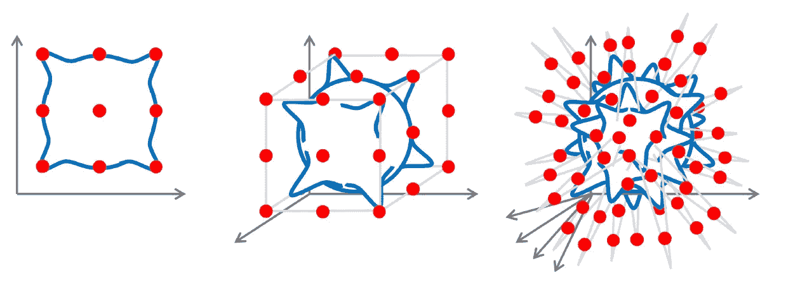

维度的诅咒。图片来自 GDL 课程第三讲。

此外，我们还讨论了我们需要注意的三种误差，即*近似误差、统计误差和优化误差。*如果我们的函数类减少(我们试图估计的真实函数远在这个类之外)，近似误差会增加，这表明有一个大的函数类。相比之下，统计误差意味着我们不可能基于有限数量的数据点找到真正的函数。随着函数类的增长，这种错误会增加。最后，我们有优化误差，它与我们在假设类中找到最优假设的程度有关(当经验风险最小化可以有效地解决时，误差很小)。

我们将会看到，通过使用*几何先验*和*等变网络*:尊重我们问题的*对称性*的网络，我们可以减少我们假设类的大小或复杂性。通过这样做，我们可以在不放弃有用假设的情况下减少统计误差，这意味着近似误差不会更差。(普适性结果:如果我们的函数类是等变函数的普适逼近器)。

# 几何域

在几何深度学习(GDL)中，数据存在于由ω表示的*域*中。域包括网格、组、图和流形(量规&测地线)。定义域也是一个集合(在典型的数学中)，但是它可能有一种不同的*结构*。我们可以有一个*邻域结构*(在网格和图形中)。我们也可以有一个出现在流形中的*度量结构*(点之间的距离),因为我们可以测量表面上点之间的距离。

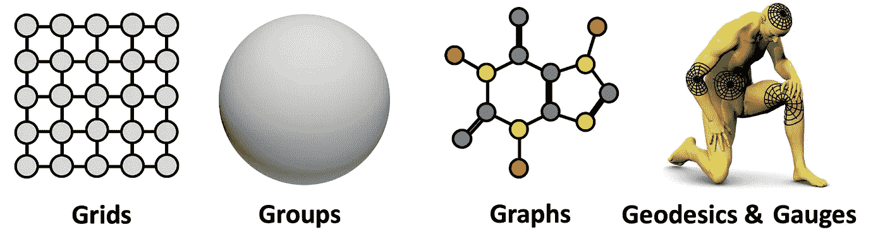

几何领域:5 Gs。图片来自 GDL 课程第三讲。

> GDL 的关键信息是，我们希望设计处理几何数据的神经网络，这些网络应该尊重域结构，无论它可能有许多选择。

## **几何域上的信号空间**

在大多数情况下数据不是域本身，而是域上的*信号*。ω域上的信号是一个函数𝓍，它输入ω域上的一个元素，并将其作为向量空间𝒞中的一个向量输出，即𝓍∶ω→𝒞(𝒞的维数称为*通道*)。我们也可以把ω上的𝒞-valued 信号空间定义为所有函数(该空间上的各种信号)的集合，即𝒳(ω，𝒞)={𝓍∶ω→𝒞}.

例如，如果我们的域是一个网格，数学上ω=ℤₙ×ℤₙ，其中ℤₙ是从 0 到 n-1 的整数集合。该信号是采用诸如(0，1)的网格点并将其映射到 rgb 值的空间，即信号𝓍∶ω→ℝ)的函数。类似地，在图中，我们的域是从 1 到 n 的节点集。对于分子图，信号将是从该图到𝑚维度的向量空间的函数，其中𝑚是我们关心的原子的数量(对于每个节点，我们分配一个热向量，该向量告诉该节点的原子类型)。

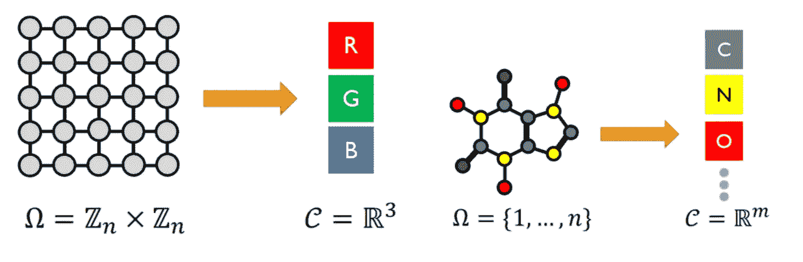

网格和图形域中的信号。图片来自 GDL 课程第三讲。

## **希尔伯特空间结构**

正如所见，域可以是一个向量空间 *n* ，比如用于建模图像的连续平面ℝ。所以我们可以在这个域里加点。但是在某些领域，我们没有这个向量空间(例如，在图中，我们没有任何节点添加的概念)。尽管如此，信号空间*总是*有一个向量空间结构，在这个结构中，我们可以将两个信号相加并乘以标量。从数学上讲，这由以下等式定义:

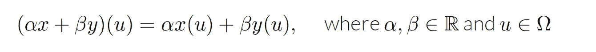

信号的加法和标量乘法。来自 GDL 原型书第三章的方程式。

换句话说，如果我们有两个信号𝓍和𝓎(两个图像)，并且我们有两个标量 *α* & *β* ，我们可以形成信号 *α* 𝓍 + *β* 𝓎，并在点𝑢.对其求值这种加法是逐点定义的(在𝑢评估第一个函数，在𝑢评估第二个函数，将这些数与 *α* 和 *β* 线性组合，并将它们相加)。

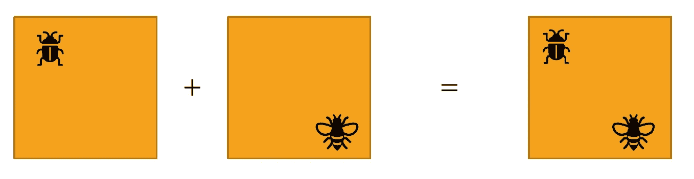

两个信号的相加。图片来自 GDL 课程第三讲。

如果信号空间有无穷多个点，那么它就是一个向量空间。那么，这将是一个无限维的向量空间(就计算而言，我们必须处理有限的东西)。而且，在这个向量空间中定义一个内积会给我们*希尔伯特*空间。

给定一个内积〈 𝓋，𝓌〉on 𝒞 (𝓋，𝓌 ∈ 𝒞)和ω上的一个测度𝜇(关于它我们将定义积分)，我们通过下式得到𝒞𝒳(ω上的一个内积:

𝒞𝒳(ω上的内积定义)(关于测度𝜇).的积分)来自 GDL 原型书第三章的方程式。

测量𝜇允许测量ω的集合和子集的大小。在大多数情况下，这种数学设置归结起来相当简单。具体来说，如果ω是一个有限集，那么 [*计数度量*](https://en.wikipedia.org/wiki/Counting_measure#:~:text=In%20mathematics%2C%20specifically%20measure%20theory,if%20the%20subset%20is%20infinite.) 可以用来计算积分，这意味着我们对ω上的点求和，所以当我们做内积时，我们只对向量空间的维数求和。

> 我们需要内积的原因是我们想做*模式匹配*当我们使用线性/conv 层时，我们需要以某种方式比较我们的信号𝓍和滤波器𝓎.

## **几何特征领域**

到目前为止，我们已经看到信号𝓍是𝒞).域ω上的函数(取ω的一个元素𝑢并将其映射到向量𝑥(𝑢)稍微一般一点的东西，在物理学上叫做*场*，在数学上叫做(“*丛*”)。*字段*是一个函数的略微一般化，其中不是将ω中的𝑢映射到固定空间𝒞中的向量𝓍(𝑢，而是将其映射到向量空间𝒞的元素，该元素由𝑢进行子索引，即𝓍(𝑢) ∈ 𝒞 *ᵤ* 。例如，网格上的向量场为流形中的每个点分配一个向量，该向量位于该点的切平面上。所以流形上的每个点都有一个切面。

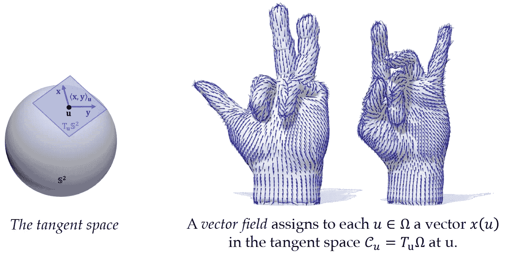

流形的向量场和切空间。图片来自 GDL 课程第三讲。

> 为了简单起见，我们现在只讨论𝒞𝒳(ω的函数空间。

## **域为数据**

我们有时候域上没有信号，但是*域本身*就是数据。这出现在网格、没有节点或边特征的图形以及点云中。有一些方法可以处理这个问题，比如我们可以用*图邻接矩阵*作为ω×ω上的信号。在流形或网格的情况下，我们可以使用*度量张量，*网格固有的量，它可以被视为信号。

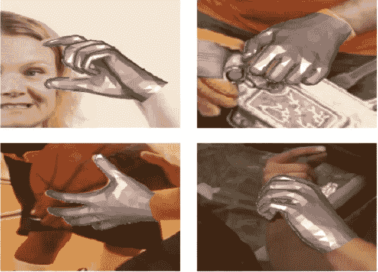

域本身就是数据。图片来自 GDL 课程第三讲。

# 对称性

这里是我们岗位的核心。为了解释物体的对称性，让我们以三角形为例。我们可以对三角形做几个*不改变它*的变换。我们可以将它旋转 120 度，这将只是用另一个点替换三角形中的每个点，而不会改变整体形状。我们也可以在垂直线翻转它，它不改变三角形。这些变换叫做*对称*。

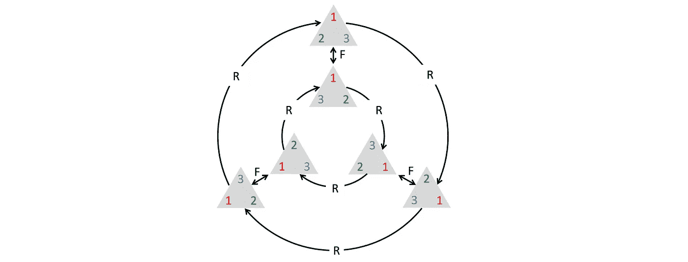

三角形的对称性(由 120 度旋转 R 和翻转 F 产生)。图片来自 GDL 课程第三讲。

> 一个对象的对称性是该对象保持不变的变换。

我们将看看 ML 中出现的两种对称，*参数化的对称和标签函数的对称*。在参数化的*对称性中，设输入空间为𝒳，输出空间为𝒴(一个标签空间)，权重空间为𝒲(一个参数空间)，模型为𝑓，一个从输入空间𝒳和权重空间𝒲到标签空间𝒴的映射，即*f*:𝒳×𝒲→1。我们可以说，将权重𝓌映射到其自身的变换𝔤，即𝔤: 𝒲 → 𝒲，是参数化的对称，如果:*

参数化的对称性。来自 GDL 课程的方程式，第三讲。

比如交换神经网络同一层的两个神经元的进出连接，并不会改变输入输出映射 *f* (。, 𝑤).

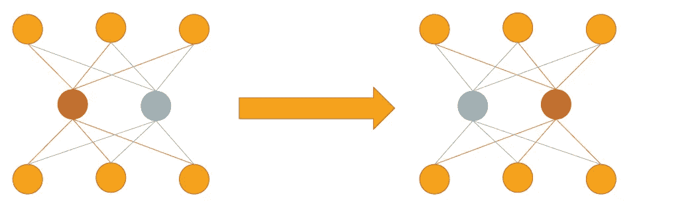

参数化的 S *对称性示例(s* 交换两个神经元的输入和输出连接)。图片来自 GDL 课程第三讲。

ML 中出现的第二种对称，也是最会讲的，是标签函数的*对称。再次假设输入空间𝒳、输出空间𝒴和标签函数 *L* 是地面实况标签函数，即从输入空间𝒳到输出空间𝒴.的映射变换𝔤是对称的，如果:*

标签函数的对称性。来自 GDL 课程第三讲的方程。

换句话说，如果我们进行转换，然后计算标签，这与只计算标签是一样的。例如，在图像分类任务中，𝔤可以是图像的旋转、平移或缩放。

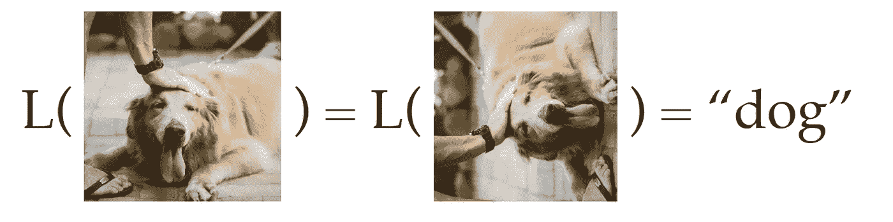

标签函数的 S *对称性示例(如果我们旋转图像*，该类不会改变)。GDL 课程，第三讲。

## **学习类≅学习对称性**

我们可以把所有的学习问题，或者至少是所有的监督学习，看作是关于对称性的学习。假设我们有两个类的输入空间𝒳。我们可以看到，𝒳中任何尊重类边界的可逆映射(它将某类中的一个点映射到该类中的另一个点)都是标号函数 *L* 的对称。这意味着如果我们知道了所有的对称，我们只需要为每一个类标注一个标签！因为我们可以从一个点开始，应用一个对称很多次，到达这个类中的每一个点。

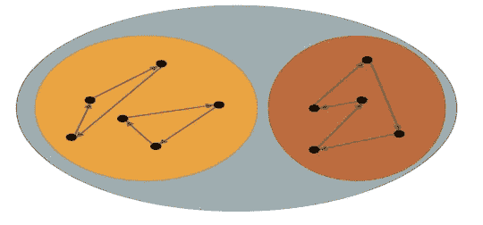

具有两个类的输入空间𝒳(如果我们知道*所有*l 的对称性，从某个类中的一点，我们到达该类中的每一个其他点)。图片来自 GDL 课程第三讲。

> 如果学习问题是非平凡的(如果我们相信我们需要学习来解决我们的问题)，我们不应该期望能够先验地找到完全对称群。

## **结构域的对称性**

在一大类问题中，我们称之为几何深度学习问题，对称性的来源来自于数据赖以生存的*域*。设ω表示一个几何域。变换𝔤∶ω→ω是对称的，如果它*保持*ω的结构。这些对称性的一些例子可能是:

*   集合元素的排列保持了集合的成员关系。如果我们的定义域是一个集合，那么这个集合的结构就是一个集合成员关系(无论元素是不是集合的一部分，都不考虑集合中元素之间的顺序或关系)。然后，这个集合的元素的排列保持了这里的结构。
*   *欧氏等距(旋转、平移、反射)保持了欧氏空间中的距离和角度*ω*=ℝᵈ*。如果我们有欧几里得空间，比方说一个平面， *ℝᵈ是*一个度量空间(点与点之间的距离是空间结构的一部分)。然后，对称可以是欧几里得等距，即，诸如旋转、平移和反射的距离保持映射。
*   *一般微分同胚保持流形ω的光滑结构。*如果我们把 *ℝ* 或者任何流形仅仅看作一个光滑流形，我们不会以一个度量结束，所以域的任何微分同胚或者光滑翘曲都可以认为是一个对称性。

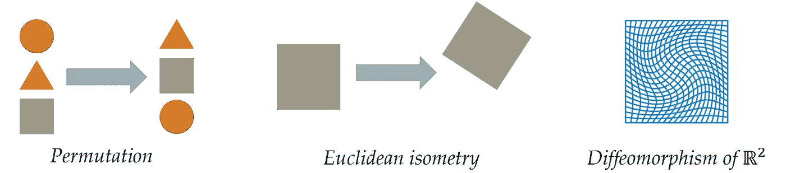

几何深度学习中对称性的例子。GDL 课程，第三讲。

## **对称群**

> 给定物体的所有对称的集合称为对称群。

现在我们可以观察到一些关于对称性的东西:

*   *恒等变换永远是对称的。*
*   *给定两个对称变换，它们的合成(一前一后做)也是对称的。*
*   *给定任何对称，它的逆也是对称。*

## **抽象群体**

> *群是一个集合* 𝔊 *连同一个二元运算* ⚬:𝔊×𝔊→𝔊 *称为*组成，*表示为* 𝔤⚬𝔥 = 𝔤𝔥(为简单起见)，*并满足以下公理:*

*   *关联性* : (𝔤𝔥) 𝔨 = 𝔤 (𝔥𝔨)适用于所有𝔤、𝔥、𝔨 ∈ 𝔊.
*   *恒等式*:存在唯一的𝔢 ∈ 𝔊满足𝔤𝔢 = 𝔢𝔤 = 𝔤.
*   *逆*:对于每个𝔤 ∈ 𝔊都有一个唯一的逆𝔤⁻ ∈ 𝔊，这样。𝔤𝔤⁻ = 𝔤⁻ 𝔤 = 𝔢.
*   结束:对于每一个𝔤，𝔥 ∈ 𝔊，我们有𝔤𝔥 ∈ 𝔊.

为了简单起见，通常使用𝔊来指代组，而不仅仅是其元素的集合。注意，一个群是*而不是*必然可换的，即𝔤𝔥≠𝔥𝔤一般。具有交换运算的群称为*阿贝尔群。*

立方体的旋转对称性(Oₕ).群图片来自 GDL 课程第三讲。

## **对称组，抽象组&组动作**

在这一节，我们定义群论中的几个概念:

*   *对称群*是其元素为变换𝔤∶*ω*→*ω的群。*
*   *分组运算*是贴图(函数)的合成。
*   *抽象组*是一组元素以及复合规则，满足组公理(如上定义)。
*   *组动作*是一个映射或函数，它获取组元素和域*ω*的元素，并将其映射到域*ω中的新元素。，即*𝔊×ω→ω(表示为(𝔤，𝑢) ↦ 𝔤𝑢).群作用应满足:𝔤(𝔥𝑢) = (𝔤𝔥) 𝑢 *和* 𝔢𝑢 = 𝑢，对于所有𝔤，𝔥 ∈ 𝔊和∈ω。

群体作用的例子:*作用于ℝ的欧几里得平面运动*。 *ℝ* 中的欧几里得群具有带角度𝜃的旋转分量以及 x 和 y 方向的平移分量(tₓ，tᵧ)，可应用于二维点(𝓍，𝓎).

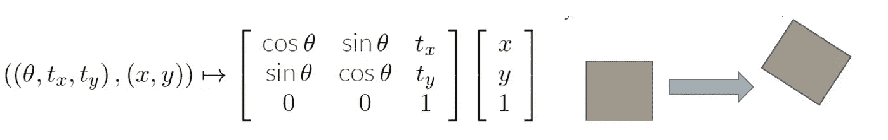

*作用于ℝ的欧几里得平面运动。* GDL 课程第三讲。

## **凯莱图表&表格**

如果我们的群是有限且离散的，我们有两种方式来表示这个群的结构:*凯莱图&表*。让我们以我们以前讨论过的三角形的对称群为例。在 *Cayley Diagrams* 中，每个节点都是对象(三角形)的一个配置，但是我们也可以用一个组元素来标识它。我们可以对任何节点应用旋转或翻转，并移动到其他节点。相比之下，我们可以把群结构表示成一个*乘法表*。组中的每个元素都列在一行和一列中，表中的条目将是组元素的乘积。

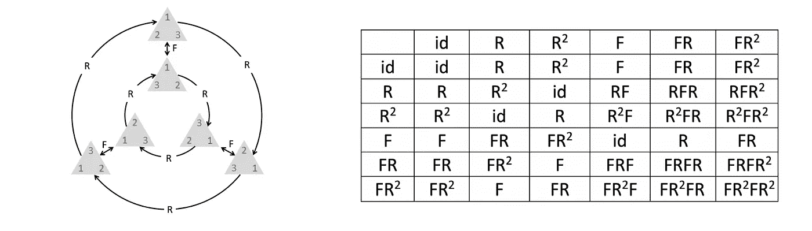

凯莱图和乘法表(三角形的对称群)。GDL 课程，第三讲。

## 组的种类

这里有一些不是有限的也不是离散的群。大体上，我们可以将群定义为两种类型，*离散群*和*连续群。* *离散组*可以是:

*   *有限的*，如旋转对称的三角形。
*   *无限*，或*可数无限*，如整数集合的平移和无限扩展网格。

另一方面，我们有*连续组*，它们可以是:

*   *紧凑组*，如二维旋转。
*   *局部紧群，*如连续平移和旋转平移。
*   *非局部紧群，*如微分同胚的无限维群(作为数学句柄最难得到)。

所有这些类型的群都可以是*可交换的*，例如顺序无关紧要的二维旋转群，或者是*不可交换的*，例如顺序有关的三维旋转群。

各种团体。GDL 课程，第三讲。

## **ω作用于信号𝒳(ω的对称性，𝒞)**

作用在域ω上的对称性也作用在ω上的信号上。对于群元素𝔤和信号𝓍，我们将𝔤对𝓍的新群作用定义为:

𝔊对𝒞).𝒳(ω信号的行动 GDL 原型书，第 3.1 节。

简而言之，在域中的点𝑢评估的变换信号等于在𝔤⁻ 𝑢.评估的原始信号𝓍

这方面的一个例子可以是翻译图像。𝔊是一个翻译小组，由𝑥和 y 两部分组成。在下图中，我们看到 bug(在右边的原图中)从左边移到了右边( *t* 是一个正数，沿 x 方向平移)。𝔤.翻译形象的价值在点𝑢的𝓍将是在点𝑢 - *t，即* 𝔤.的原始图像中的相同值𝓍(𝑢) = 𝓍(𝑢 - *t* 。注意，如果没有*逆(减)，*我们*就无法满足群体行动*的公理。

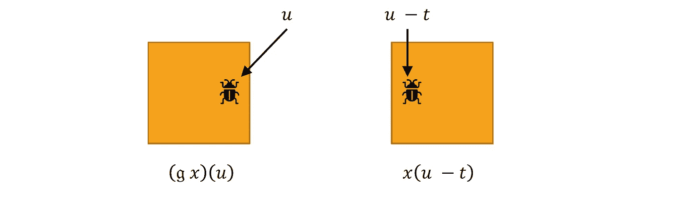

翻译图像(右边:原始图像，左边:翻译图像)。GDL 课程，第三讲。

如前所述，域可能缺少向量空间结构，但信号的空间总是具有向量空间结构。此外，我们刚刚在信号上定义的组动作是*线性*(如果我们有信号的线性组合，那么我们应用变换𝔤，这与对单个信号应用𝔤并线性组合它们是一样的)。

信号群作用的线性。GDL 原型书，第 3.1 节。

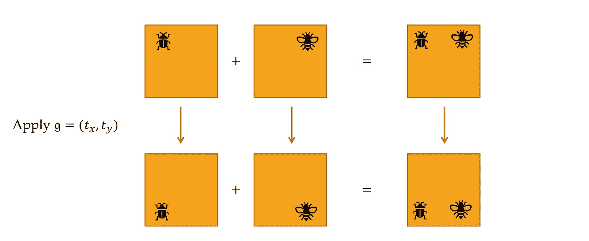

信号上的群组动作的线性示例(两个图像)。GDL 课程，第三讲。

## **小组陈述**

> 群𝔊的 n 维实表示是一个映射𝜌 ∶ 𝔊 → ℝⁿ*ⁿ，给每个𝔤 ∈ 𝔊指定一个可逆矩阵𝜌(𝔤，并且满足𝜌

例如，设群𝔊是 1 维中整数平移的集合，即𝔊 = (ℤ,+)，定义域ω=ℤ₅= { 0，1，2，3，4}(如短音频信号)，𝔤 = 𝑛对 u∈ω的作用定义为:𝑛，𝑢↦𝑛+5(mod 5)。那么，在𝒳(ω(5 维空间)上的表示就是移位算子:

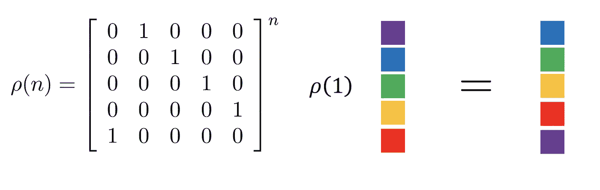

团体代表的例子。GDL 课程，第三讲。

要验证这是群表示，我们得证明矩阵𝜌( *n* 可逆，𝜌 *(n+m) =* 𝜌 *(n)P(m)(群表示的条件)。*很明显，𝜌(n 的行列式)，即 det(𝜌( *n* )，不等于 0；(det(𝜌(*n*)=det(𝜌(1))ⁿ，det(𝜌(1))不能为零，因为单位矩阵是𝜌(1)).的子矩阵因此，𝜌( *n* 是可逆的。𝜌(*n+m*)= 𝜌(*n*)𝜌(*m*)直截了当。

> 重要的是要注意，如果一个组满足条件，我们可以对它有多个表示。例如，如果我们有旋转群 SO(2)，我们可以有一个作用于 *ℝ* 中的点、位于圆上的点、平面上的函数/信号等的表示。在 GDL 蓝图中，每个特征空间都有一个组表示，每个组表示都可能不同。

在下面几节中，我们将讨论不同域中对称群的一些例子。

## **对称性:集合&图形**

S 从集合和图开始，对称群的一个例子是置换 s 的*群，即𝔊 = 𝕊ₙ(“对称群”)，定义域是*顶点*的集合，即ω=𝑉，(可能还有边)。图形的特征可以是标量、矢量或张量(𝕊ₙ).的三组表示*

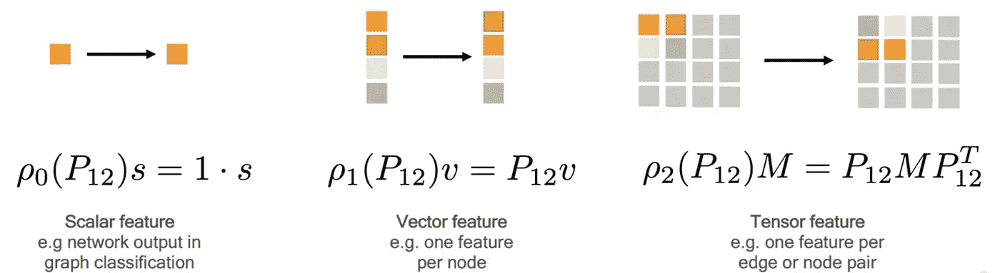

三种图形特征(𝕊ₙ).的表示 GDL 课程，第三讲。

此外，我们有两种作用于图和集合的对称；*描述*的对称性和*对象*本身的对称性。首先，请注意:

*   一个图(甚至一个集合)是一个*抽象对象*(之前定义过)。
*   实际上，我们所能访问的只是计算机内存中的图/集合的*描述*(它有一些无关的属性，比如图/集合元素的节点顺序)。
*   描述具有属性(例如顺序),这些属性不是对象的固有属性。

通常，我们感兴趣的是描述的对称性，而不是物体本身的对称性。为了解释这一点，让我们讨论下图。对于中间的图，如果我们为每个节点选择一个标签，我们可以将图写成邻接矩阵。如果我们应用一个置换，我们可以得到一个不同的邻接矩阵(右边的那个)。这里是描述的对称性；我们对同一个图有不同的描述(我们希望我们的网络是不变的或等变的)。我们也可以看到这个图形本身有一种对称性。如果我们做另一个置换，例如交换节点 3 和 4，邻接矩阵将是相同的(左边的那个)。

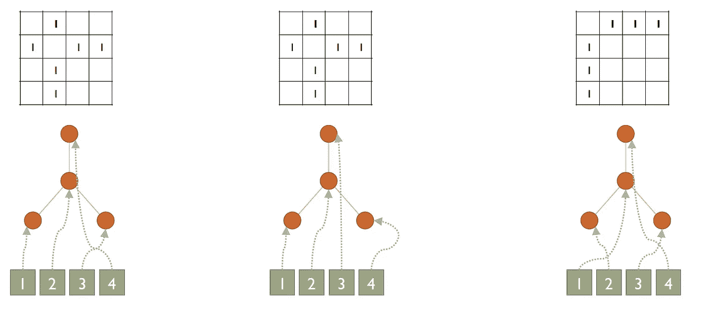

D *描述*的对称性和 O *对象的对称性的例子。GDL 课程，第三讲。*

## **对称性:网格**

在网格中，定义域是*网格点的集合，*和对称群𝔊可以是*离散* *平移*、*旋转*、*翻转*。底层的连续空间可能有更多的对称性(例如缩放)。群体表征是有规律的；我们可以移动和旋转图像。

常规组代表。GDL 课程，第三讲。

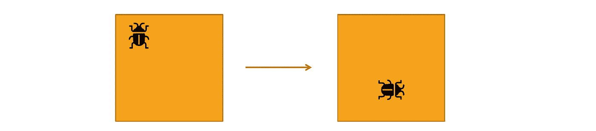

图像的旋转和平移。GDL 课程，第三讲。

## **对称性:群&齐次空间**

我们可以将对称性推广到一般群和齐次空间的集合，其中域ω≅𝔊/ℌ，对于空间中的每两个点，至少有一个对称将一个点映射到另一个点(将在后面的帖子中涉及)。群𝔊是一个*局部紧群*。这个群的作用是传递的:对于任何𝓍，𝓎∈ω，存在𝔤 ∈ 𝔊使得𝔤.𝓍 = 𝓎.小组代表是正规的(𝜌(𝔤) 𝑥(𝑢) = 𝑥(𝔤⁻ 𝑢)).

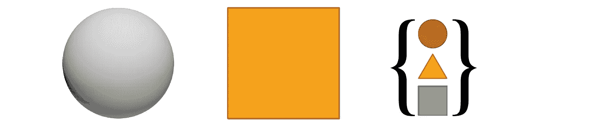

一般群和齐次空间。GDL 课程，第三讲。

## **对称性:流形(测地线&量规)**

最后，我们有流形(测地线&量规)，这也将在后面的帖子中详细介绍。群𝔊是群*规范变换*，它指的是特征空间的参考系中的变化。为了解释这一点，让我们看看下图。我们有一个向量场，它给流形上的每一个点分配一个切平面上的向量。如果我们想用数字表示矢量，我们必须在切平面上选择一个坐标系。改变这个框架将改变矢量的数值表示(这被称为规范变换)。制图表达𝜌取决于要素类型。

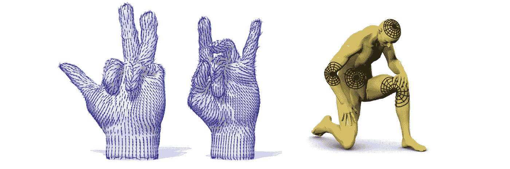

流形和网格。GDL 课程，第三讲。

## **到目前为止的总结**

到目前为止，我们已经讨论了各种几何域上的信号空间及其希尔伯特空间结构。我们还看了几何先验中的几个概念，如对称性、对称群和群表示。*有趣的问题将是我们如何在深度学习中应用这些概念，以及我们如何建立包含它们的模型？*

# **不变表示法**

A 假设我们想对字母“A”、“B”和“C”进行分类，它们可能以不同的字体和不同的方向出现(见下图)。然后，如果我们知道标签函数的对称性(在这种情况下，数字的旋转)，我们可以形成一个*不变表示*，其中同一字母的每个旋转版本由一种特征向量表示。因此，我们的学习问题变得更容易。

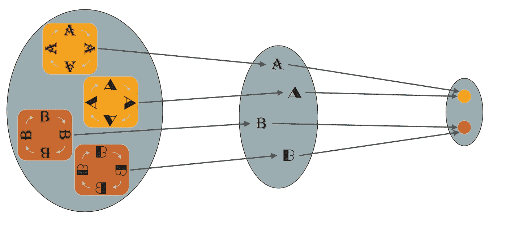

*数字分类问题中的不变表示。GDL 课程，第三讲。*

然而，在深度学习中，过早地构建不变表示是不明智的。原因是:为了识别整个对象，我们需要首先识别这个对象的部分(这就是为什么神经网络应该是深度的)。但是如果我们让*的中间表示不变*，我们将*丢失关键信息*(看下图)。

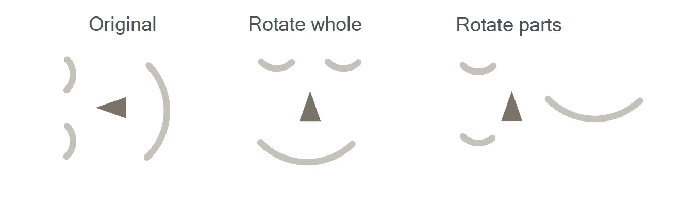

*零件的不变表示将丢失关键信息(见右图)。GDL 课程，第三讲。*

## **等变网络**

T 上述问题的解决方案是使用*等变网络*，其具有以下成分:

*   特征向量空间𝒳ᵢ。
*   网络图层(地图)𝑓ᵢ。
*   对称群𝔊。
*   𝔊的𝜌ᵢ代表每个𝒳ᵢ。

最简单的例子可能是平面图像、RGB 输入( *n × n* 像素和 3 个通道)。特征空间𝒳₀将是 *n × n × 3* 。所以我们有一个 *n × n × 3* 维的𝔊群表示，它可以是平移。𝒳₁可能是具有 64 个通道的卷积层𝑓₁的输出(我们的特征空间将是 *n × n × 64* )。这将是同一组𝔊的不同表现(翻译)。直到层数为止。如果满足下面的等式，我们说网络是等变的

等方差方程。GDL 课程，第三讲。

我们可以从下图了解一下。如果我们从𝒳₀开始，使用𝜌₀进行变换(例如，移动图像)，然后应用第一层。如果我们首先应用图层，然后应用相同的变换𝜌₀，我们应该会得到相同的结果，但是现在通过特征空间中的表示来产生𝒳₁.如果所有的网络层都满足这个性质，我们说这个网络是*等变*。我们还可以证明，如果每一层都满足等方差，那么它们的合成也满足等方差。

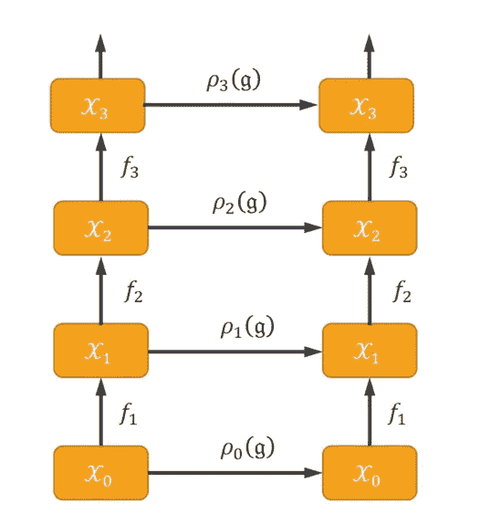

*等变网络图。GDL 课程，第三讲。*

## **等方差作为对称一致的推广**

L et 重复一下我们之前讨论过的分类问题(对数字“A”、“B”、“C”进行分类)。输入空间𝓍和𝓎(在下图中)是位于*轨道*上的两个信号(如果我们考虑字母“a”的所有旋转副本，这将形成称为“a”的*轨道的流形)。网络将该输入映射到由通用字母“A”符号化的特征向量。在非等变网络中，旋转版本可以被发送到特征空间中的不同点(这不可能发生，等变网络必须在整个轨道上一致地概括)。此外，等变网络已经以一种方式被一般化，即*符合对称性*。换句话说，如果𝓍和𝓎应该被映射到同一点，那么它们的变换版本也应该被映射到同一点。*

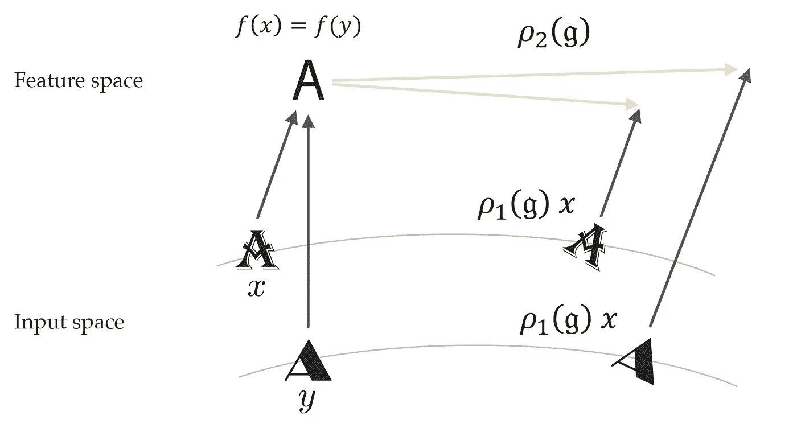

非等变网络(这不可能发生，等变网络必须在整个轨道上一致地推广)。GDL 课程，第三讲。

> 当我们深入研究对称和等变网络时，你可能想知道为什么不使用数据增强，它可以取代对称？

当然，数据增强在 ML 中应用广泛，简单易行，非常流行，但也有各种优缺点。支持等方差的最突出的论点，在某类问题中，我们有对称性，比如医学图像，真的有平移和旋转。在这些情况下，我们看到等变网有更好的性能。另一个相关的例子是，如果我们有一个大的对称群(如置换群)，实际上不可能使用数据扩充。

T 他的帖子讨论了*几何域*、*信号*，以及几何先验的第一要素(*对称性*)。我们还看到了对称背后的几个数学思想，以及几何领域的例子，以及它们如何用于深度学习。下一篇文章将介绍几何先验的第二个要素(*尺度分离*)。然后，我们将看到完整的*几何深度学习* ( *GDL)蓝图。*

# 参考

*   [GDL 球场](https://geometricdeeplearning.com/lectures/)，( [AMMI](https://aimsammi.org/) ，2021 年夏季)。
*   T. Cohen 的第 3 讲[ [视频](https://youtu.be/fWBrupgU4X8) | [幻灯片](https://bit.ly/3s1PACv)。
*   米（meter 的缩写））m .布朗斯坦、j .布鲁纳、t .科恩和 p .韦利奇科维奇，[几何深度学习:网格、组、图形、测地线和量规](https://arxiv.org/abs/2104.13478) (2021)。

*我很感谢拉米·阿迈德、汉尼斯·斯特尔克和 M·埃尔法提赫·萨拉赫审阅了这篇文章并提供了有益的评论。*