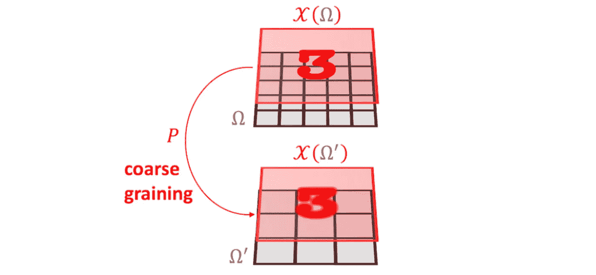
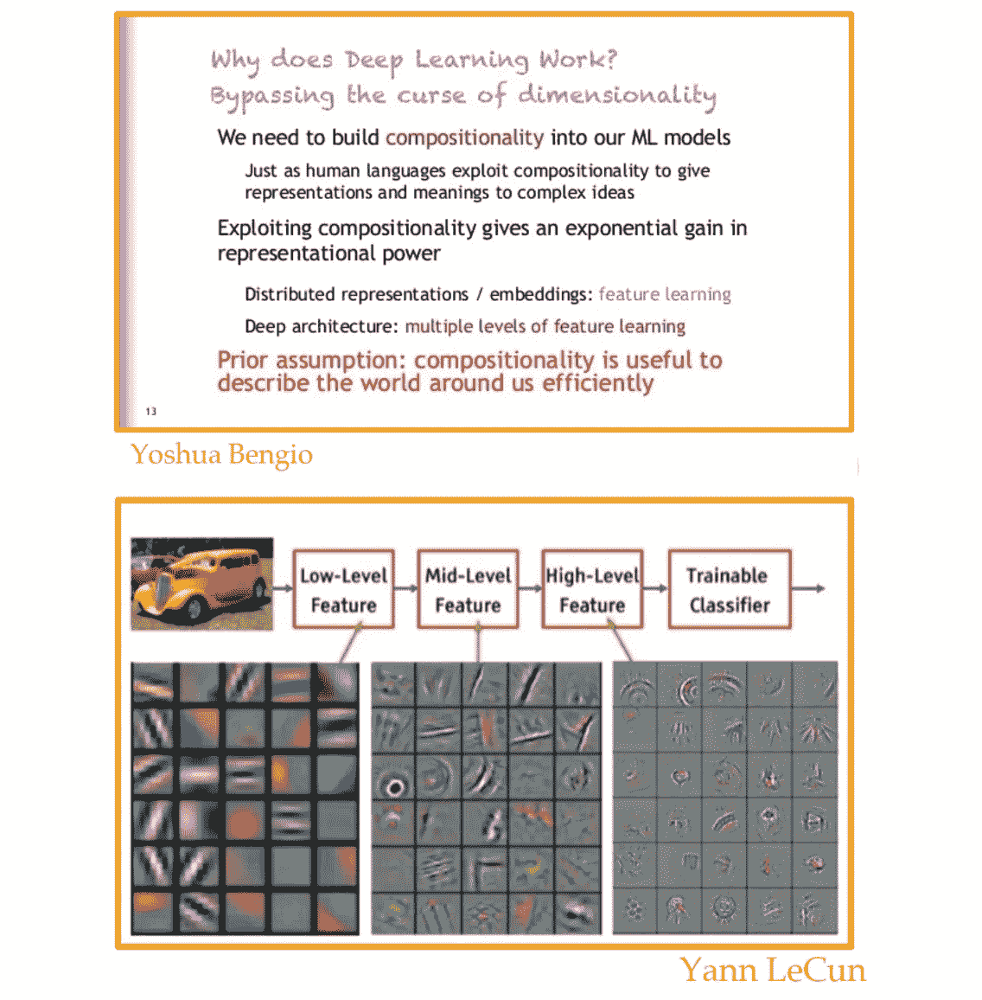
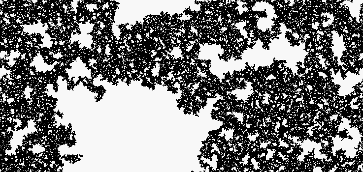
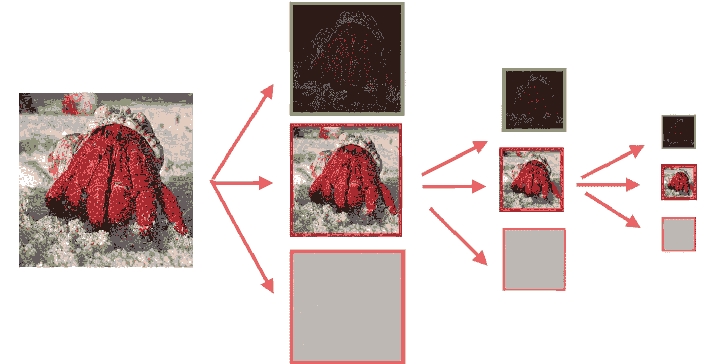
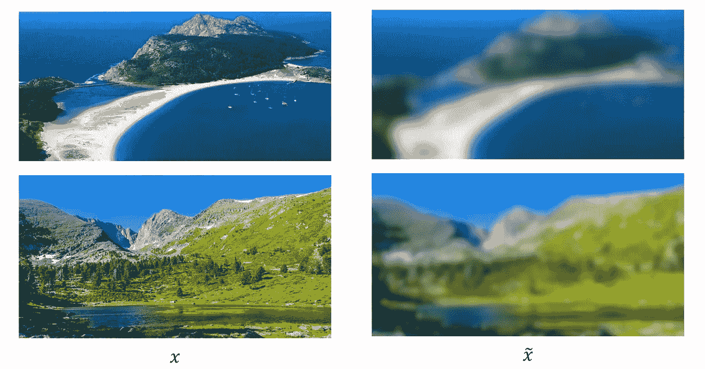
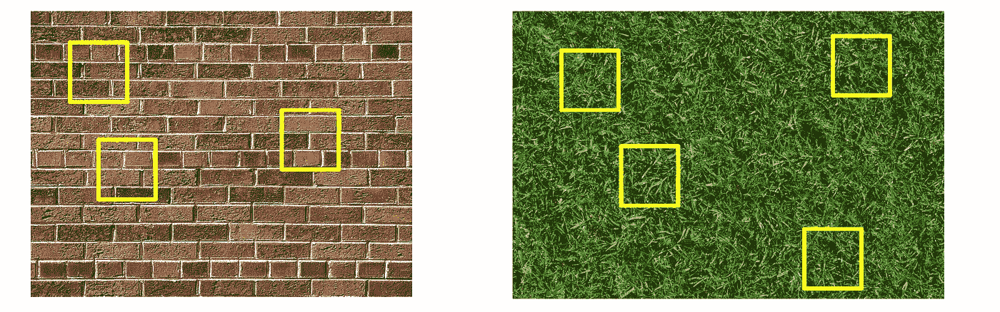
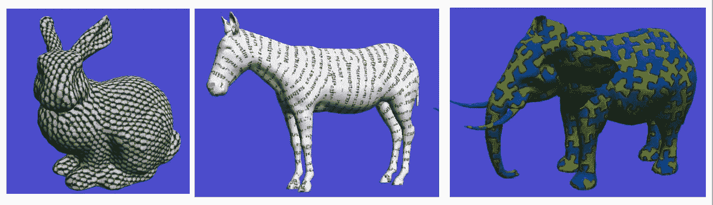
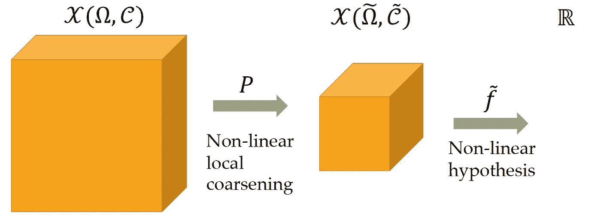
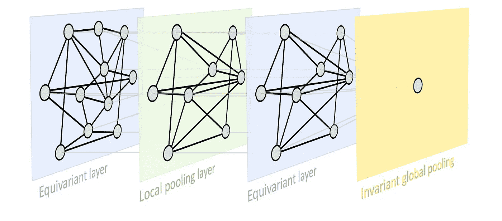

# 几何先验 II

> 原文：<https://towardsdatascience.com/geometric-priors-ii-6cd359dfbcf4>

## [几何深度学习](https://towardsdatascience.com/tagged/geometric-deep-learning)

## GDL 蓝图

*一系列博文，总结了 AMMI 计划的* [*几何深度学习(GDL)课程*](https://geometricdeeplearning.com/lectures/)*；* [*非洲机器智能硕士*](https://aimsammi.org/) *，授课老师* [*迈克尔·布朗斯坦*](https://www.cs.ox.ac.uk/people/michael.bronstein/) *，* [*琼·布鲁纳*](https://cims.nyu.edu/~bruna/) *，* [*塔科·科恩*](https://tacocohen.wordpress.com/) *，以及*[佩塔尔·韦利奇科维奇](https://petar-v.com/)

维数灾难是高维学习中最具挑战性的问题之一。在之前的一篇帖子 *(* [*几何先验 I*](/geometric-priors-i-cc9dc748f08) *)* 中，我们讨论了机器学习和几何深度学习中的各种概念，包括对称、不变和等变网络。在这篇文章中，我们将这些数学概念与维数灾难联系起来。然后，我们引入第二个几何先验；*尺度分离*，代表了战胜维数灾难的有效工具。最后，我们将看到如何将这两个几何先验(对称性和尺度分离)结合起来，构建*几何深度学习(GDL)蓝图*，它可以作为不同几何域的通用架构。

尺度分离先验(图像分类)。图片来自 GDL 原型书，第 3.4 节。

*本帖与*[*M . Elfatih Salah*](https://medium.com/@mmohamedkhair)*合著。另见上一篇* s *关于* [*Erlangen 程序的 ML*](/geometric-deep-learning-da09e7c17aa3) ， [*高维学习*](/high-dimensional-learning-ea6131785802) ， [*几何先验 I*](/geometric-priors-i-cc9dc748f08) *。这些博文是根据四位导师的* [*GDL 原书*](https://arxiv.org/abs/2104.13478) *和* [*GDL 课程*](https://geometricdeeplearning.com/lectures/)*at*[*AMMI*](https://aimsammi.org/)*改编的。*

R 调用以前帖子中的学习设置，在统计学习中，我们有一个目标函数 *f* *，一个从输入空间𝒳到输出空间 *ℝ* 的映射； *f* * *:* 𝒳 *→ ℝ.*我们也把输入空间𝒳写成一组信号𝒳(ω，𝒞)={𝓍∶ω→𝒞}，其中ω是几何域，𝒞是定义在ω上的向量空间。在 [*几何先验 I*](/geometric-priors-i-cc9dc748f08) 中，我们已经看到了几何域的各种例子，以及如何使用域ω来捕捉与该域中信号的性质密切相关的各种变换。(本帖与 [*几何先验 I*](/geometric-priors-i-cc9dc748f08) *)* 。

这样，从前面介绍的内容来看，目标函数 *f* *定义为*f***:*𝒳(ω，𝒞) *→ ℝ* 。我们的目标是在假设类𝓕中学习这个函数，我们可以按照我们想要的方式参数化它，例如使用神经网络。我们现在的承诺是目标 *f* *是𝔊-invariant ( *f* *保持不变，如果考虑变换群𝔊的任何元素和任何信号‘输入’的话)。数学上，

𝔊-Invariant 函数。GDL 课程，第四讲。

> 因此，自然的问题是:我们如何在假设课上利用这个承诺？这足以打破维度的诅咒吗？

为了回答第一个问题，让我们定义一个*组平滑算子*，它是一个采用任何假设 *f* 并用组𝔊.中所有变换的平均值替换它的算子在一个数学设置中，如果𝔊是一个离散的有限群并且 *f* 是我们的假设，我们将𝑓的𝔊-smoothing 算子定义为，

函数𝑓.的𝔊-Smoothing 算子来自 GDL 课程的方程式，第四讲。

如果我们仔细观察，可以发现函数 *f* 的这个平滑算子有一个有趣的性质；它也是𝔊-invariant(如果𝑓已经是𝔊-invariant，那么应用平滑运算符不会改变它)。因此，给定假设类𝓕，我们可以通过应用平滑算子使其成为𝔊-invariant，并且更正式地如下:

假设类𝓕.的𝔊-Smoothing 算子来自 GDL 课程的方程式，第四讲。

(同样，如果我们扩展不变性群𝔊，不变性类将变得更小，这似乎是直观的)。

## 不变性下的学习

通过将平滑算子应用于我们的假设类，我们可以证明近似误差不受该平滑操作的影响，并且我们可以这样正式表述:

近似误差不受平滑操作的影响。GDL 课程，第四讲。

为了证明，我们可以注意到平滑算子是在 *L* (𝒳).)中的正交投影算子所以预测中产生的 *L* 误差可以分解为该算子图像中的误差加上正交补中的误差，如下所示，

近似误差不受平滑操作的影响(证明)。GDL 课程，第四讲。

然后，用 *f* *替换𝔤，知道 *f* *不受平滑操作影响，我们得到，

近似误差不受平滑操作的影响(证明)。GDL 课程，第四讲。

> 另一方面，由于平滑后假设类更小，统计误差减少，但问题是:*多少？*

看一看假设类之一，我们假设它是 Lipschitz 类，我们知道它具有以下属性:

李普希茨函数类。GDL 课程，第四讲。

然后，其平滑版本具有以下属性:

应用𝔊-Smoothing 算子时的李普希茨函数类。GDL 课程，第四讲。

平滑版本使得 Lipschitz 假设更强，因为距离更弱，并且主要结果:

> 定理[ [Bietti，Venturi，B.'21](https://arxiv.org/pdf/2106.07148.pdf) ]:利用一个𝔊-invariant 核岭回归，学习一个李普希兹，𝔊-invariant 函数 *f* *的泛化误差满足𝔼𝓡*(f̂)≲*θ(|𝔊|n)⁻/ᵈ，其中 n 是样本数，d 是维数。

该定理导致样本复杂度的量化增益，该增益与组的大小成比例，因为泛化误差由样本的数量乘以组的大小来限定，都是 *-1/d.* 的幂

此外，组大小|𝔊|在维度上可以是指数的，例如，如果我们考虑局部转换(可能的局部转换的数量在域的大小上是指数的)。然而，正如我们所看到的，速率仍然受到维数的诅咒，这表明*引入群不变性不太可能打破维数的诅咒。*

## 到目前为止的结论:

到目前为止，我们已经看到使用*全局对称性*或*不变性先验*减少了统计误差并保持近似误差不变，但是仍然不足以打破维数灾难。所以问题来了:*打破维度诅咒所必须的对称性之外的假设有哪些，我们遗漏了什么？*

还有，我们一直在讨论理论问题，没有讨论如何高效地构建不变类。我们所描述的平滑操作符并不是我们想要在计算机中直接实现的东西(因为计算所有转换组的平均值是非常不切实际的)。从基本原则出发，我们如何高效地做到这一点？

## 深度学习“归纳偏差”:组合性

深度学习研究领域有影响力的人可能会在不同的演讲中提到，比如 [Yann LeCun](http://yann.lecun.com/) 和 Y [oshua Bengio](https://yoshuabengio.org/profile/) ，深度学习之所以有效，是因为 [*组合性*](https://en.wikipedia.org/wiki/Principle_of_compositionality) *原理。*此外，有来自大脑的证据表明，大脑也是分层组织的，这种想法并不是深度学习研究人员开发的，但它已经存在很长时间了。

深度学习为什么有效？Y [奥舒亚·本吉奥](https://yoshuabengio.org/profile/)(上)和[扬·勒村](http://yann.lecun.com/)(下)。GDL 课程，第四讲。

> 既然我们似乎都同意组合性对深度学习的成功至关重要，我们应该问我们如何才能形式化这种直觉？

## 多尺度结构

形式化这种直觉的一个方法是观察物理学和计算科学的不同领域。在不同的领域，我们可以看到*多尺度结构*是一个基本原则和许多学科的基础。

在计算生物学中，为了知道生物学是如何工作的，我们必须理解不同尺度下的过程。有些事情我们可以用分子动力学或者功能图来理解。 [*比如湍流*](https://en.wikipedia.org/wiki/Turbulence) ，展现了数学物理中不同尺度之间的交流。 [*逾渗*](https://en.wikipedia.org/wiki/Percolation#:~:text=Percolation%20(from%20Latin%20percolare%2C%20%22,is%20described%20by%20Darcy's%20law.) 另一种模型，描述流体通过多孔材料的运动。因此，我们必须考虑不同的尺度。你可能也有自己的例子，在不同的尺度下，系统有不同的行为。

逾渗模型。来自[维基百科](https://en.wikipedia.org/wiki/Percolation#:~:text=Percolation%20(from%20Latin%20percolare,%20%22,is%20described%20by%20Darcy's%20law.)的动画。

## 多分辨率分析基础

在我们的上下文中，我们希望*将*多尺度结构的概念与几何域(网格、组、图形和流形)联系起来。另一个非常相关的概念是*多分辨率分析(MRA)。*(为了简单起见，我们将假设一个网格域，即ω是一个 2D 网格，但大多数东西可以更一般地描述，然后应用于所有的几何域)。

多分辨率分析是一种方案，该方案试图根据存在于*较小域* ( *较粗域* *域*)中的信号来分解存在于该域中的信号。例如，在网格域的情况下，我们想要更少的像素。在多分辨率分析中，我们试图理解如何从一个分辨率(特定数量的像素)到下一个分辨率(*减去*数量的像素)，以允许我们保留信息。一般来说，我们可以将一幅图像分解成不同分辨率(分辨率更低)的同一幅图像，加上我们需要返回到第一幅图像的细节(见下图)。

图像分解。GDL 课程，第四讲。

> 在这里，我们必须声明，通过降低网格的分辨率，我们正在攻击维度的诅咒。这是由于在这种情况下像素数量的指数依赖性。我们可以保证，在某一分辨率下，由于样本数量与新分辨率成正比，因此将避免维数灾难。因此，我们的问题将是如何将多尺度结构的想法与学习中的先验结合起来？

# **秤分离之前**

L 让我们讨论一些如何在学习中结合多尺度结构和先验知识的例子。想象一下，目标函数 *f* *可以在图像的粗糙版本上定义。在下图所示的分类问题中，我们只想知道图像是“*海滩*还是“*山*”而不是它的分辨率。

两幅图像的原始版本(左)和粗糙版本(右)(分类问题)。GDL 课程，第四讲。

在这个问题中，我们可以将图像的分辨率降低到能够给出正确分类的某个水平。如前所述，这将减少网格的大小(像素数)。因此，通过*粗化，我们可以避免维数灾难。然而，这通常是不正确的，因为我们需要非常小心粗化的程度。如下图所示，太粗化会丢失太多信息，我们无法分辨图像中到底有什么。*

过度粗化会丢失图像信息的示例。GDL 课程，第四讲。

让我们看看多尺度结构也能有所帮助的另一个例子。假设目标函数 *f** 可以通过局部项的和来近似，

用局部项的和来逼近函数 *f** 。GDL 课程，第四讲。

局部术语 *x(u)* 是指提取以像素 *u* 为中心的*补丁图像*。比如在识别一个纹理(下图所示的分类问题)时，如果我们在一堵砖墙或者一堆草里。我们当地的一个术语*就属于这一类。因此，如果我们想要一个好的分类，我们可以只取局部描述符的平均值，因为在粗尺度上没有很多可变性(因为纹理是一个具有空间同质性的结构)。*

本地术语的示例:黄色块显示的补丁图像。GDL 课程，第四讲。

我们可以看到，维数灾难也被避免了，因为这个问题中的相关维数减少到了*面片维数*。

我们还必须声明，这是一个强有力的假设，通常是不充分的，如下图所示；所有的本地术语都可能给出错误的分类。

当本地术语可能给出错误分类时的例子。GDL 课程，第四讲。

重要的是要说明这样一个事实，我们可能有原始尺度和粗略尺度的信息，但不知何故它们以一种不太极端的方式相互作用。因此，在某种意义上，我们必须将这两种尺度结合起来。

让我们考虑一个通用的组合模型，

具有两个算子(非线性局部粗化和非线性假设)的一般成分模型。GDL 课程，第四讲。

函数 *f* *由两个运算符组成；*非线性局部粗化*结合*非线性假设*在粗尺度上提取一些信息(比单独平均小块强得多)，两者都是可以学习的。你可能会问*为什么这个组合*和*什么时候可以论证这个组合模型更有效率*。当我们考虑一些具体的例子时，比如动态编程和分治算法，我们是从更小的问题的角度来看待这个问题的。在这些情况下，我们可以认为这种组合模型更有效。然而，这仍然是一个*未解决的问题*，并且从理论的角度来看，这个组成模型还没有被完全理解。

接下来，我们结合尺度分离和群不变量这两个先验，从第一性原理给出一个强有力的模型。然后，我们介绍完整的*几何深度学习(GDL)蓝图。*

## 不变性与尺度分离的结合

S 由于我们有一个函数类是*对群体行为不变的*(𝔊-invariant 函数)，我们想把它和上面描述的*多尺度结构*(尺度分离之前)合并成一个*架构*。因为我们讨论过的这些几何先验给了我们模型中应该有的必要条件，而不是一个特定架构的所有要素。

如果我们从一个对群作用不变的线性算符(*线性𝔊-invariant 函数*)开始，使用前面介绍的𝔊-smoothing 算符，我们可以写成，

带有𝔊-Smoothing 算子的线性𝔊-Invariant 函数。GDL 课程，第四讲。

其中 *x̅* 是群轨道上的平均值(我们将 *x* 的群平均值称为 *A x* )。(第一个不等式是因为 *f* 是𝔊-invariant，我们在应用𝔊-smoothing 算子，第二个不等式是因为 *f)* 的线性。

然而，如果我们仅仅依靠这个假设，我们会丢失很多信息。因为如果我们有一个平移组，例如，一个图像的轨道将由该图像所有可能的平移组成，然后我们只需将所有这些图像平均为一个。

作为补充，我们可以使用*线性𝔊-equivariant 函数*，我们在 [*几何先验 I*](/geometric-priors-i-cc9dc748f08) 中讨论过。(如果𝔊同时作用于𝒳和𝒴，那么映射𝐵 : 𝒳 → 𝒴就是𝔊-equivariant。𝑥) = 𝔤.𝐵(𝑥)).为了实现一个更强大的模型，我们可以用一个*元素式非线性函数* 𝜎合成这个等变函数𝐵；𝜎 : 𝒳 → 𝒳，𝑤𝑖𝑡ℎ𝜎𝑥(*u*)= 𝜎(𝑥(*u*)，以给出一个*非线性𝔊-equivariant 函数 u，即 U :=* 𝜎 ⚬ 𝐵(由于非线性是逐元素应用的， *U* 将保持𝔊-equivariant).

然后，我们可以通过组合组平均值 *A* 和非线性𝔊-equivariant 函数*u*来提供强大的𝔊-invariant 函数

> 一个迫切的问题是，这种组合是否会产生一个富裕的阶层？换句话说，我们能很好地逼近任何一个目标函数，𝔊-invariant，并且有足够的 b 和𝜎选择吗？

参考 [*通用逼近定理*](https://en.wikipedia.org/wiki/Universal_approximation_theorem) ，这种组平均与非线性等变映射的组合产生了通用逼近器。然而，为了更稳定的表示，我们需要使用一个*局部*等变图。另外，如果我们有一个具有长程相互作用的函数，我们不能用单层的局部𝔊-equivariant 映射来近似它；相反，我们必须组合几个局部等变函数，使区域变粗。*(为证明，* [*GDL 原典*](https://arxiv.org/abs/2104.13478) *，第 3.5 节)。*

最后，为了构建一个丰富的𝔊-invariant 函数类，我们需要一个局部等变映射、一个全局不变映射和一个粗化操作符。

# 几何深度学习(GDL)蓝图

L 很快，我们可以在所谓的 *GDL 蓝图*中，为学习目标函数 *f* *所需的模型勾勒出上面讨论的所有成分。GDL 蓝图是一个建设性的方法，我们可以用它来定义一个*通用架构*，它可以应用于各种几何领域(网格、组、图形和流形)。

设ω是一个定义域，𝔊是ω上的对称群，ω′是ω的一个更粗的定义域，即ω′⊆ω。几何深度学习(GDL)蓝图的构建模块是:

*   *线性𝔊-equivariant 层*𝐵∶𝒞𝒳(ω)→𝒞′𝒳(ω′)，满足𝐵(𝔤. *x* ) = 𝔤.𝐵(𝑥)适用于所有𝔤 ∈ 𝔊和𝑥∈𝒳(ω、𝒞).
*   *非线性*𝜎∶𝒞→𝒞′按元素应用 as(𝝈(*x*)(*u*)= 𝜎(*𝑥*(*u*))。
*   *局部汇集(粗化)*𝑃∶𝒳(ω，𝒞)→𝒳(ω′，𝒞)，使得ω′⊆ω。
*   *𝔊-invariant 层(全球统筹)*𝐴∶𝒳(ω，𝒞) → 𝒴，满足𝐴(𝔤.𝑥) = 𝐴(𝑥)适用于所有𝔤 ∈ 𝔊和𝑥∈𝒳(ω、𝒞).

几何深度学习(GDL)蓝图(图形输入)。图片来自 GDL 原型书，第 3.5 节。

把这些块拼在一起，我们就能创造出一个*丰富的* *𝔊-invariant 函数 f:*𝒳(ω，𝒞) → 𝒴这种采取形式的

丰富的 *𝔊-Invariant 函数类。* GDL 原型书，第 3.5 节。

其中选择每个块，使得其输出尺寸与下一个块的输入尺寸相匹配。另外，每个块可能具有不同的对称群𝔊.

我们在这篇文章中已经看到，仅仅对称可能不足以打破维度的诅咒。然后我们提出了第二个几何先验，称为尺度分离。基于多尺度结构的假设，我们讨论了尺度分离如何抵消维数灾难。我们以 GDL 蓝图作为几何领域的**框架*来结束，它是由两个几何先验构建的。我们将在随后的文章中详细讨论这个 GDL 蓝图，以及它如何应用于各种几何领域。我们将在这个框架中看到我们最喜欢的架构，如 CNN、transformers 和 GNNs。*

# *参考*

*   *[GDL 球场](https://geometricdeeplearning.com/lectures/)，( [AMMI](https://aimsammi.org/) ，2021 年夏季)。*
*   *j .布鲁纳第四讲[ [视频](https://youtu.be/ERL17gbbSwo) | [幻灯片](https://www.dropbox.com/s/trmwssg0iqqgefs/AIMS%20Lecture%204%20-%20Geometric%20Priors%20II.pdf?dl=0)。*
*   *米（meter 的缩写））m .布朗斯坦、j .布鲁纳、t .科恩和 p .韦利奇科维奇，[几何深度学习:网格、组、图形、测地线和量规](https://arxiv.org/abs/2104.13478) (2021)。*

*我们感谢汉尼斯·斯特尔克对草案提出的有益意见。*