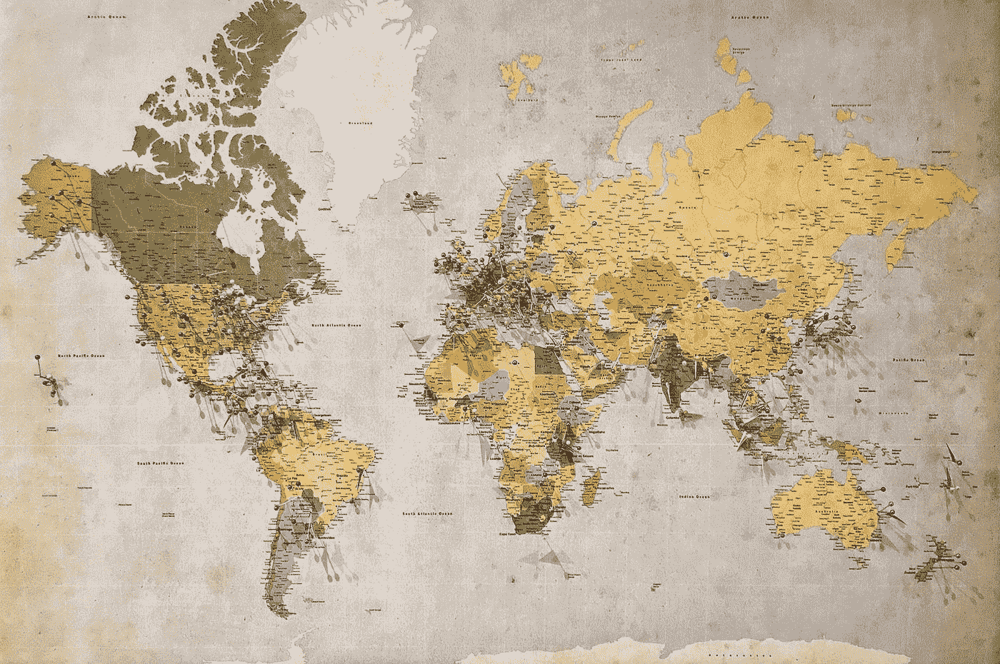
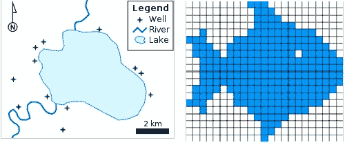
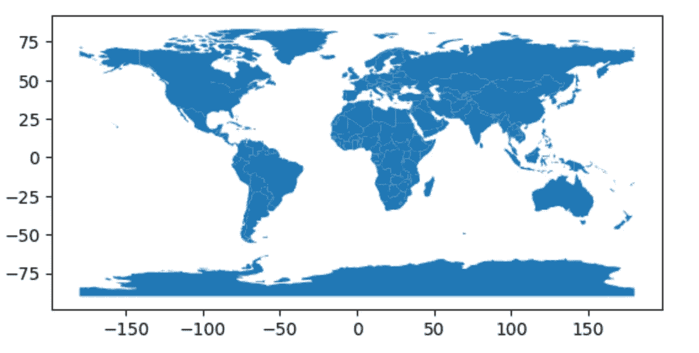
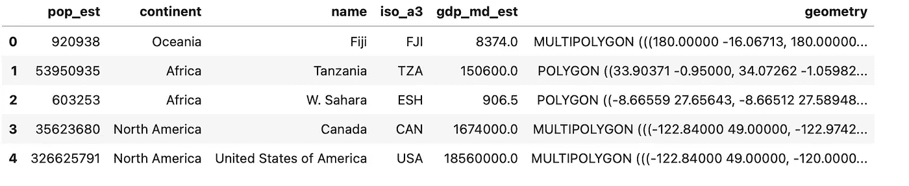
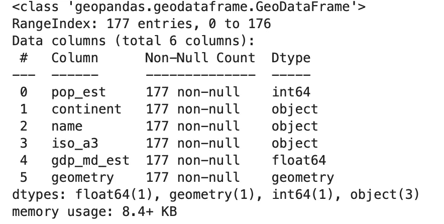
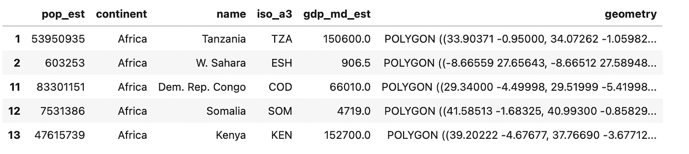
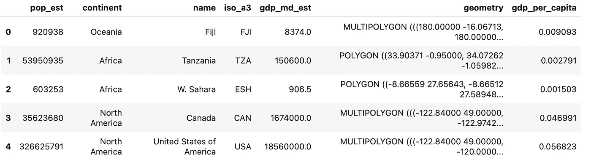
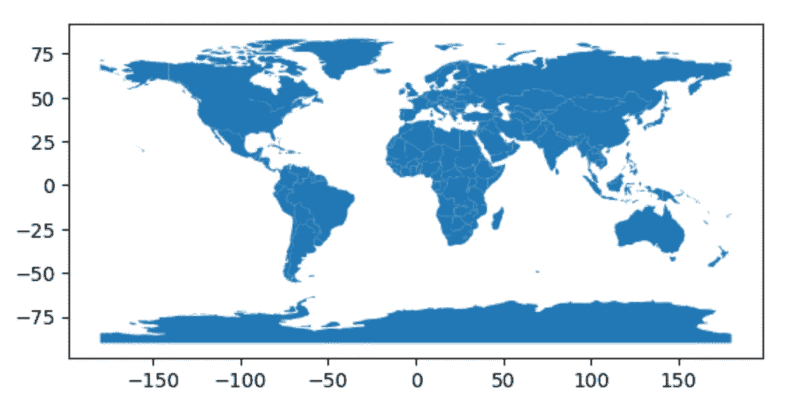
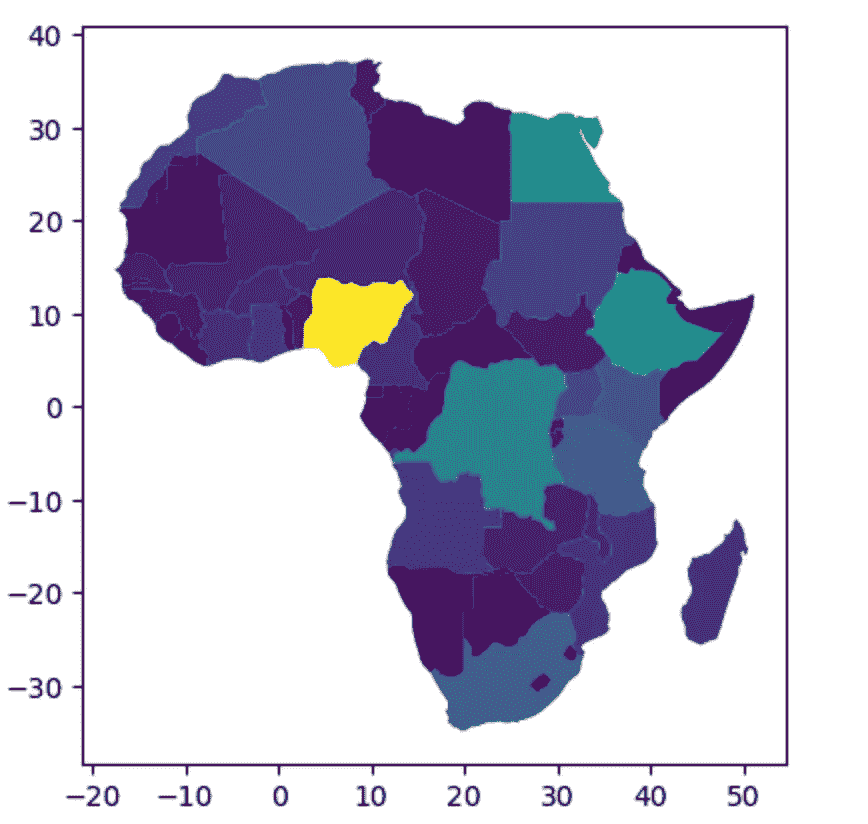
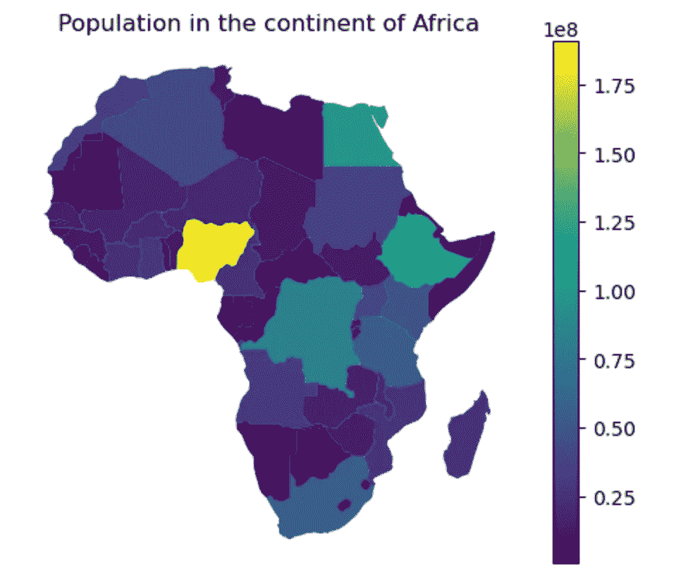

# 熊猫专家的地理空间数据争论

> 原文：<https://towardsdatascience.com/geospatial-data-wrangling-for-pandas-experts-96c130c78bd8>

## 熟悉 Python 知识的地理空间数据分析



安德鲁·斯图特斯曼在 [Unsplash](https://unsplash.com?utm_source=medium&utm_medium=referral) 上的照片

这个笑话在我高中时代(很多年前)就流传了。一个男孩只记住了一篇考试作文，题目是“牛”。然而，在考试中，他失望地发现作文题目变成了“河流”。不知道该做什么，他想出了一个绝妙的主意。他写了这样一篇文章——从前有一条河。。然后迅速切换到 *…..有一头奶牛坐在河边。那是一头中年的黑白条纹奶牛，长着长长的尾巴。男孩继续写文章，就像他熟悉的领域“牛”那样，最后又回到“河”上。*

我们很快就会谈到这个故事的寓意。

地理空间数据产品同时具有丰富的信息和华丽的外观。如果你只是给某人看一张地图，什么都不说也不写，它仍然传递了一个故事。然而，对于数据科学家来说，学习地理空间数据分析的前景可能是可怕的。至少发生在我身上。我没有受过这方面的训练，我做过的最令人兴奋的“地理空间”工作是一张我学习地点的地图——用 Microsoft Paint 创建的。我总是被其他人的地理空间工作所吸引，尽管从来没有想过我自己会尝试这样做。我没有时间投入大量精力从头开始学习另一种工具。第二个障碍是我必须购买专有的 GIS 软件许可证(我还不知道 QGIS，它是免费的)。

当我了解到地理空间数据可以表示为 dataframe 对象时，事情很快发生了变化。当我了解到这一点时，我知道我不必从头开始，我可以在 Python 基础上构建我的地理空间能力。

想法很简单:1)使用合适的 Python 库如`geopandas`、`GDAL`将地理空间数据导入到您的笔记本环境中；2)然后将其转换成一个`pandas` dataframe 对象；3)继续分析和操作`pandas`中的数据；4)最后，使用`matplotlib`可视化地图。

地理空间数据有多种形式，如多边形、线、点和栅格，这种方法适用于所有这些形式。今天我将讨论多边形，这样你就可以知道如何使用其他的了。作为参考，下面是不同形式的空间数据的可视化表示:



左图表示多边形(湖)、线段(河)和点(井位)。右图代表光栅图像(图像来源:[维基百科](https://en.wikipedia.org/wiki/GIS_file_formats#Raster))

您可以将*多边形*视为一个州的县/区边界。同样，河流可以表示为*线段；*和所有的杂货店一样*分*。另一方面，在栅格数据集中，区域被划分为正方形而不是多边形，每个正方形包含与特定位置相关联的值/变量/要素(例如，气温、人口密度)。

好了，让我们深入研究 dataframe 对象中的地理空间数据(多边形)。

# 载入库和数据

您只需要两个库就可以开始了。`geopandas`用于数据争论，而`matplotlib`用于数据可视化。顾名思义，`geopandas`将`pandas`功能的能力用于地理空间数据。

您可以使用您喜欢的软件包管理器(pip、conda、conda-forge)安装 geopandas:

```
pip install geopandas
```

安装完成后，让我们导入这个库。

```
import geopandas as gpd
```

该库带有内置数据集，因此您可以立即开始使用。稍后您可以随意试验自己的数据，但是现在，让我们使用内置数据集。我们现在将加载数据集，它包含世界上每个国家的多边形。

```
# load in dataset
dataSource = gpd.datasets.get_path('naturalearth_lowres')
gdf = gpd.read_file(dataSource)
```

我们现在将检查刚刚创建的对象的数据类型:

```
type(gdf)

>> geopandas.geodataframe.GeoDataFrame
```

这是一个地理数据框架，我们很快会看到它只是一个常规的数据框架，但有一个额外的“几何”列。

你可以用`matplotlib`的本地命令`.plot()`快速可视化多边形

```
gdf.plot()
```



可视化地理数据框架-世界各国的多边形。x 轴和 Y 轴值分别代表经度和纬度(图片由作者生成)

# 使用 pandas 功能进行数据操作

在上面，我们已经可视化了地理空间数据，其中每个多边形都是一个国家。

每个面(国家)都带有一些以地理数据框架格式存储的属性。这意味着您可以立即开始使用`pandas` 功能。让我们来看看数据框的前几行:

```
gdf.head()
```



(图片由作者生成)

这就是地理数据框架的样子。它就像一个常规的数据帧，但有一个特殊的“几何”列存储地理空间信息(这个几何列有助于绘制多边形)。

通过像对待数据帧一样对待这个表，您现在可以应用许多`pandas`功能。让我们尝试一些我们通常在数据科学项目中作为探索性数据分析的一部分使用的熟悉方法:

```
# getting information about the data
gdf.info()
```



的输出。应用于地理数据框(由作者生成的图像)的 info()方法

使用上面的`.info()`方法，我们得到了看起来熟悉的输出。它显示有 177 行(每一行代表一个国家)和 6 列(即每个国家的属性)。我们可以用熊猫`.shape`进一步证实这一点。

```
# number of rows and columns
gdf.shape

>> (177, 6)
```

现在让我们再次使用`pandas`方法，通过调用`unique()`方法来检查数据集中有多少个洲。

```
# unique values of a columns 
gdf['continent'].unique()

>>array(['Oceania', 'Africa', 'North America', 'Asia', 'South America',
'Europe', 'Seven seas (open ocean)', 'Antarctica'], dtype=object)
```

您也可以对行进行条件过滤。让我们只选择位于非洲大陆的国家。

```
# filtering rows
gdf[gdf['continent']=='Africa'].head()
```



(图片由作者生成)

不出所料，您还可以操作列，比如创建新的计算字段。让我们基于两个现有的列创建一个名为*GDP _ per _ head*的新列: *gdp_md_est* 和 *pop_est。*

```
# create calculated column
gdf['gdp_per_capita'] = gdf['gdp_md_est']/gdf['pop_est']

gdf.head()
```



(图片由作者生成)

我们现在为数据集中的每个国家增加了一个属性列。

这些只是数据操作的几个例子，您可以尝试一些您感兴趣的其他例子。除了这些数据操作技术之外，您还可以生成汇总统计数据，进行高级统计分析等等。让我们生成一些汇总统计数据:

```
# generate summary statistics
gdf.describe().T
```


(图片由作者生成)

总结这一部分，首先，我们使用`geopandas`库导入地理空间数据(多边形，或者用更专业的术语来说是“shapefile”)，然后使用`pandas`功能来操作和分析地理数据框架。在下一节中，我们将使用另一个熟悉的 Python 库— `matplotlib`来研究可视化数据。

# 形象化

地理空间数据的真正威力在于它能够可视化地理数据框架中包含的不同属性。与数据操作的`pandas`类似，我们将使用`matplotlib`来可视化地图中的属性。让我们从一个基本的开始——仅仅可视化形状。

```
# visualizing the polygons
gdf.plot()
```



用 Python 绘制多边形。plot()方法。它使用几何列来可视化多边形(由作者生成的图像)

上面的地图显示了多边形。在引擎盖下，这些多边形是从数据框的*几何尺寸*栏创建的。然而，它还没有显示任何数据，但是我们可以通过指定我们感兴趣的数据列来实现:

```
# visualize a data column
gdf.plot(column = 'pop_est')
```


显示每个国家估计人口的世界地图(图片由作者生成)

这张地图现在变得有趣且信息丰富，它用颜色渐变显示了世界上每个国家的估计人口。

但是如果你只想放大非洲呢？这很简单，只需在数据框中过滤非洲大陆，然后以类似的方式创建绘图。

```
# filter Africa data from the dataframe
africa = gdf[gdf['continent']=='Africa']

# plot
africa.plot(column = 'pop_est')
```



显示非洲国家估计人口的地图(图片由作者生成)

您还可以访问额外的`matplotlib`功能来定制地图——例如，删除 *x* 和 *y* 轴，在右侧添加图形标题和颜色条。让我们做所有这些。

```
import matplotlib.pyplot as plot
```

```
# use matplotlib functionalities to customize maps
africa.plot(column='pop_est', legend=True)
plt.axis('off')
plt.title("Population in the continent of Africa");
```



使用 pandas(用于过滤)和 matplotlib(用于绘图)的组合来可视化地理空间数据。(图片由作者生成)

这就是了。您刚刚使用两个库:`pandas`和`matplotlib`从地理空间数据中创建了一幅漂亮的地图，这完全符合您的 Python 知识。

这只是起点，从这里开始，天空才是极限！

# 前进

从这里去哪里？您可以尝试我们刚刚使用的库的一些其他功能，创建更多的地图并进一步定制它们。然后尝试使用外部数据集，网上有很多可用的(如果你需要指点，请在评论中告诉我)。接下来，运用你的想象力和创造性思维，提出一个问题，试着回答。举个例子，你可以问——人口密度排名前 10 的国家是哪些？你应该能够使用`pandas`方法过滤这些信息，然后使用`matplotlib`在地图上显示它们。

我在 Python 环境中实现了这个练习，但是如果您对其他编程语言感兴趣，它将以类似的方式工作。如果你喜欢 R 编程，试着用`tidyverse`和`ggplot`重现我们在这里所做的。

感谢阅读。请随意[订阅](https://mab-datasc.medium.com/subscribe)以获得我即将在媒体上发表的文章的通知，或者通过 [LinkedIn](https://www.linkedin.com/in/mab-alam/) 或 [Twitter](https://twitter.com/DataEnthus) 与我联系。下次见！