# 地理空间索引 101

> 原文：<https://towardsdatascience.com/geospatial-index-101-df2c011da04b>

## 如何有效管理地理空间数据

# 介绍

由于移动设备、物联网和地球观测技术的进步，如今位置数据变得更加可用。大量的数据对开发定位系统和应用程序的人提出了挑战。本文将简要介绍管理地理空间数据最常用的技术*地理空间索引*。

# 什么是索引？

索引是一种优化数据检索和搜索的数据管理方法。使用索引的好处是可以在不扫描所有现有数据的情况下定位特定的数据。每个人都熟悉的索引的真实例子是图书馆。

在图书馆里，书是按照一些标准如书名来分组和排序的。所有以 A 开头的书都在第一书架上，而以 B 开头的书在第二书架上，依此类推。当人们去图书馆时，他们只是去与他们找到的书名相对应的书架，而不是浏览所有可用的书籍，这将花费大量的时间。


照片由[龙之介菊野](https://unsplash.com/@ryunosuke_kikuno?utm_source=medium&utm_medium=referral)在 [Unsplash](https://unsplash.com?utm_source=medium&utm_medium=referral) 上拍摄

索引对于当今所有可用的数据库技术都是至关重要的。有了索引，数据库可以加快查询速度，因为要处理的数据量大大减少了，这类似于图书馆帮助用户找到他们想要的书。

# 地理空间数据

地理空间数据是记录其地理位置的数据。可以把它想象成一个普通的数据库记录，它有一个附加的列来指定这个数据关联到地球上的什么地方。以下是地理空间数据的一个示例:

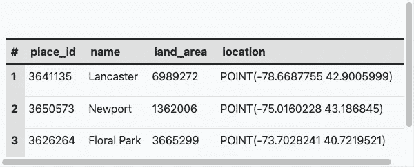

地理空间数据示例(图片由作者提供)。

除了看起来像数学函数的*位置*之外，表上的所有记录看起来都像正常的结构化数据。这种数据类型称为*几何*，其中用于存储地理数据。下面是 4 个最常见的几何对象:

*   ***点*** :地球上单个位置
*   ***线*** :连接的一组点
*   ***多边形*** :表示特定区域边界的一组点
*   ***多多边形*** :具有相同属性的多边形的集合

***(注:T*** *这里有两种地理空间数据:矢量和栅格。点、线和面是表示位置或区域的矢量数据，而栅格数据是特定场景的图像，其中还包含其位置信息，如卫星和无人机图像。本文只关注矢量数据。)*

# 地理空间索引

与可以应用传统索引算法 的原始数据类型(例如整数)不同，索引地理空间数据要复杂得多，因为它有两个维度: *x* 和 *y，*更不用说来自一组*点*的复杂性，例如*线*和*多边形*。因此，它需要不同的索引方法。

一种可能的方法是将整个空间分成一组子空间，如下所示。每个子空间都有一个指定的名称，以便我们以后可以正确地引用它。

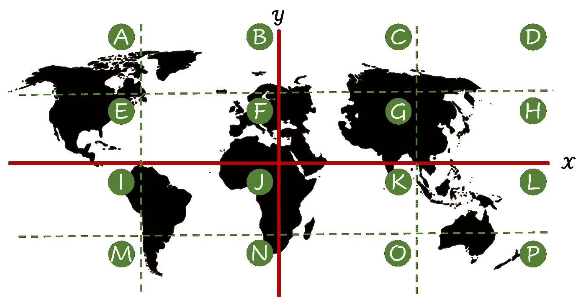

图片由作者提供。

假设您有 12 条数据记录，在地理上看起来如下:

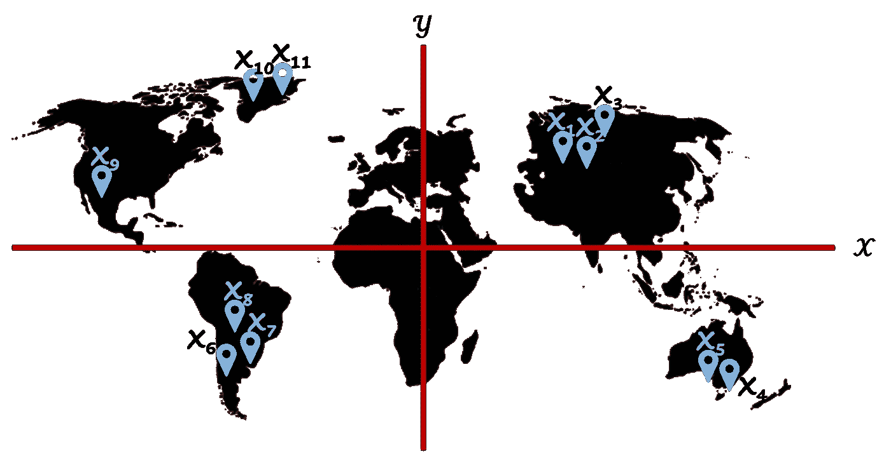

图片由作者提供。

通过将数据与预定义的区域相结合，这就是您所得到的结果。

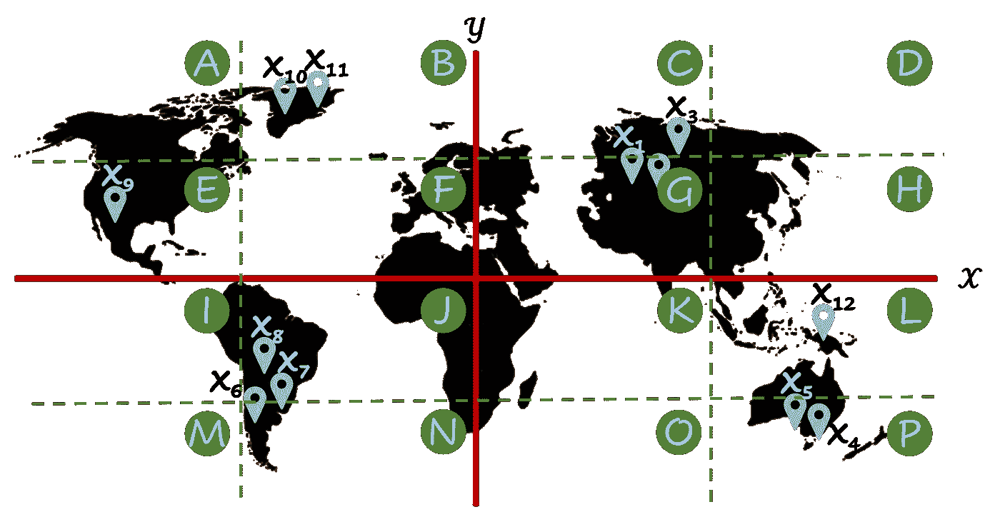

图片由作者提供。

现在，如果您按记录所属的区域对记录进行分组，结果如下表所示:

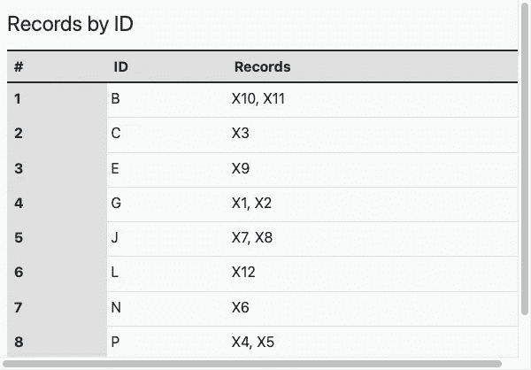

图片作者。

假设您想要检索所有记录，例如，与澳大利亚相关联的记录。第一种方法是查找与国家边界重叠的所有像元。在这种情况下， *L* 和 *P* 。

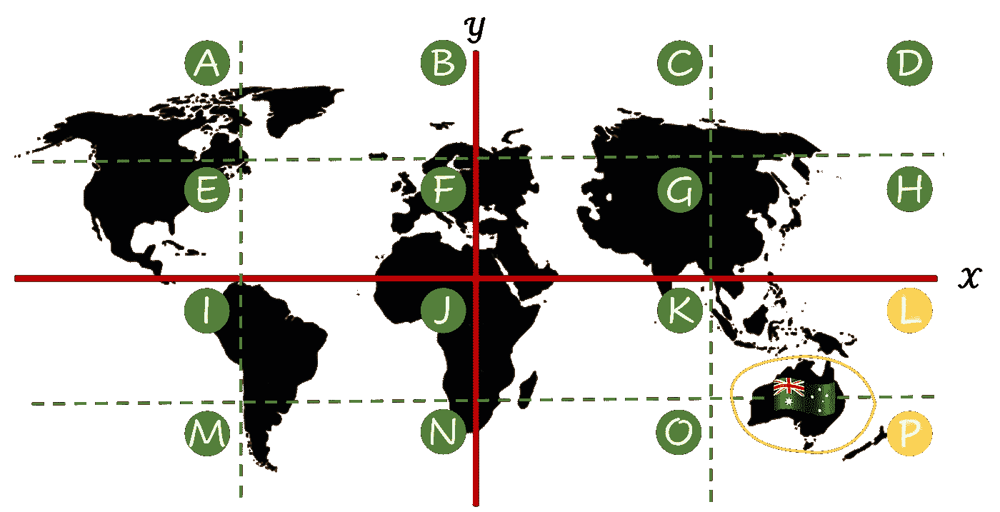

图片由作者提供。

然后，查找位于两个单元格中的所有记录，得到 *X* ₄、 *X* ₅和 *X* ₁₂.

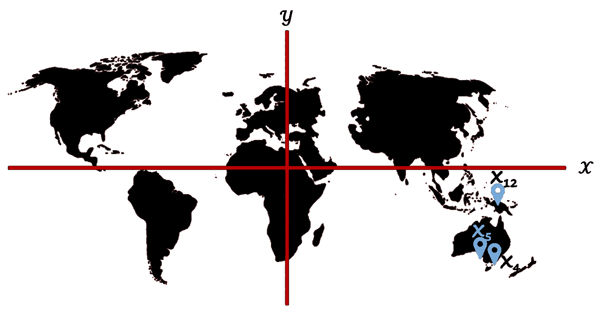

图片由作者提供。

最后，浏览剩余的记录，我们发现只有 *X* ₄和 *X* ₅符合搜索条件。

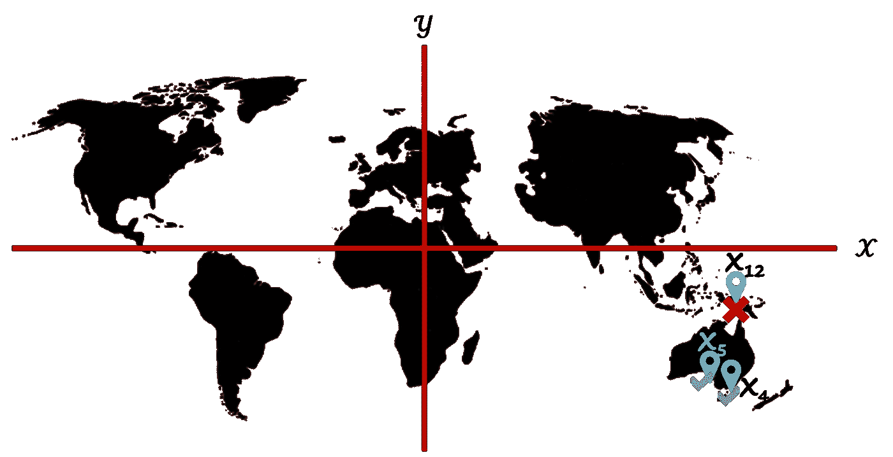

图片由作者提供。

请注意，尽管总共有 12 条记录，但我们只扫描了其中的 3 条。这个例子中减少的运算数量听起来可能很小，但实际上，对于大量的数据，它可以产生巨大的影响。

# 地理哈希

上面的例子是对 *Geohash* 的简化解释。Geohash 是一种算法，它将任何地理位置编码为文本，方法是将世界分成大小相等的单元，称为*单元*(或*网格* ) ，其中每个单元都分配有特定的*哈希*(但是，它使用的不是字母，而是以 32 为基数的数字)。上一个关于 geohash 的例子中没有提到的是它的*层次结构*。

假设我们像前面的例子一样将整个空间分成网格。


图片由作者提供。

我们不再停留在这里，而是进一步将每个细胞分割成更小的子空间。例如，在下图中，单元格 *A* 被分割成 16 个更小的单元格。

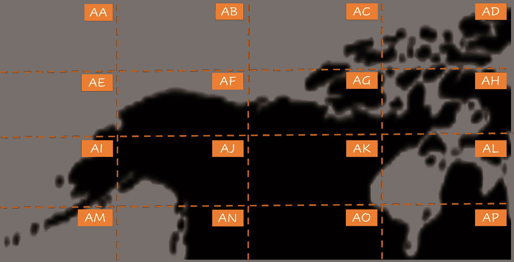

图片由作者提供。

然后，我们通过在 *A* 的一个子节点上重复它，比如说 *AF* ，更深入一层。

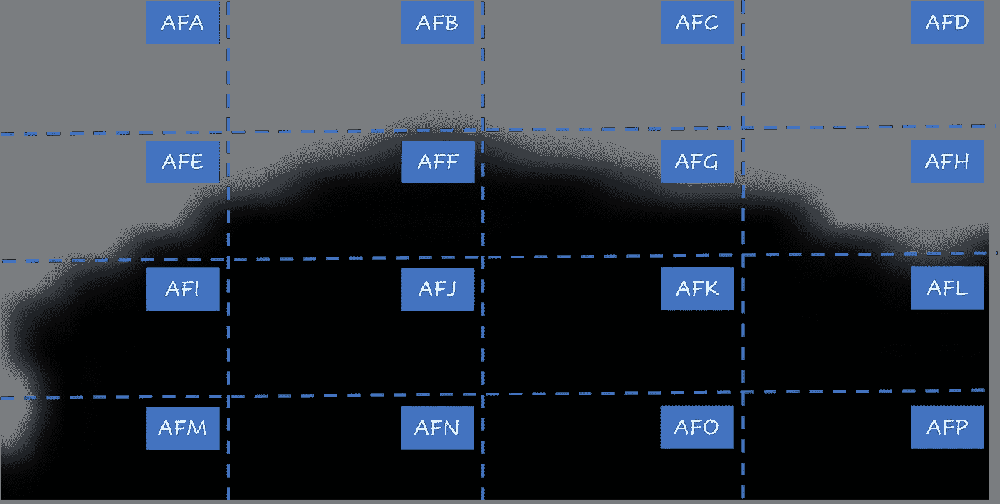

图片由作者提供。

应用此过程越多，每个单元格代表的区域就越小，哈希字符串就越长。名称的长度表示哈希的*精度级别*。

geohash 的一个有趣特性是，分配给每个像元的名称都有其父名称作为前缀。例如，细胞 *AFA* 到 *AFP* 都是 *AF 的子细胞。*

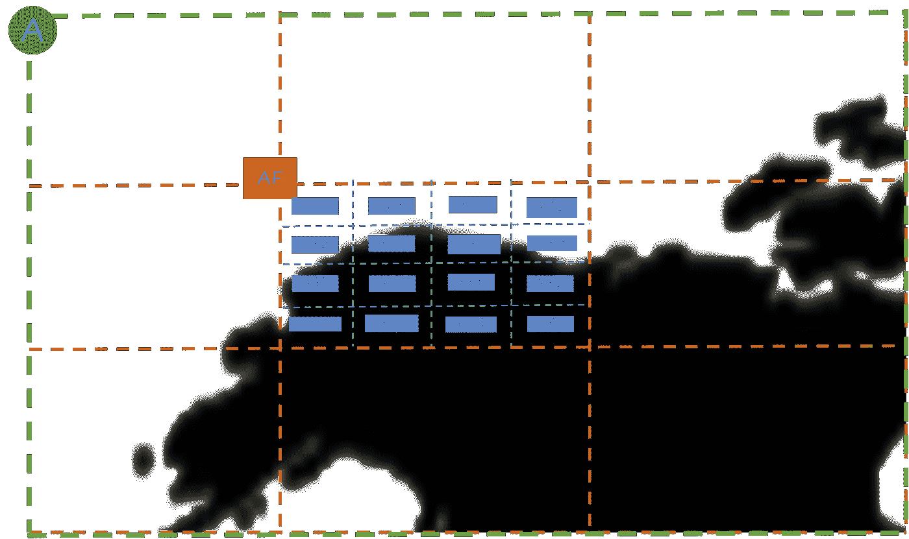

Geohash 的层次结构(图片由作者提供)。

当您想要验证一个区域是否是另一个区域的子区域时，prefix 属性非常方便。它可以被视为关系数据库中的`ST_Contains` ( *spatial contain* )函数的近似版本，具有更低的计算成本，因为它只处理文本，而不处理点、线或多边形。

您可能还会注意到，每个单元格的名称从左到右按字母顺序排序。这种机制允许我们使用小区名称来估计它们之间的地理距离。例如，假设有 3 个哈希: *AA* 、 *AB* 、 *AK* 。由于按字母顺序 *AA* 比 *AK* 更靠近 *AB* (字母‘A’比‘K’更靠近‘B’)，所以 *AA* 在地理上也比 *AK* 更靠近 *AB* 。尽管该属性在新行开始的地方有一个例外(例如 *AE* 比 *AC* 更接近于 *AA* ，但是所有单元格的间距相等的事实使得这种边缘情况易于管理。

注意 G *eohash* 只是可用的地理空间索引之一。其他的索引系统，如 [*四叉树*](https://en.wikipedia.org/wiki/Quadtree#:~:text=A%20quadtree%20is%20a%20tree,into%20four%20quadrants%20or%20regions.) 和 [*H3*](https://www.uber.com/en-TH/blog/h3/) ，即使基于相同的基础，应用不同的划分策略，所以也有不同的优缺点。

# 地理空间索引使用

除了作为索引，地理空间索引还可以应用于各种用例。

## 数据整理

Geospatial data is very different from primitive data like *Integer* , *Float* , and *String* therefore relational databases need a special data type for them: *Geography* . The geography data type, however, is only a string in the format of [*Well-Known Text*](https://en.wikipedia.org/wiki/Well-known_text_representation_of_geometry) (WKT) that looks like the following:

```
POINT(103.14411713327522 15.553626958655387)
LINESTRING(103.14261509622688 15.5550326423843,103.14400984491462 15.552738065460904,103.14585520471687 15.552944785150965,103.14594103540534 15.554040396042701)
POLYGON((103.1434304877674 15.553296208147678,103.14435316766853 15.5547639094724,103.14585520471687 15.553482255373645,103.1448896094715 15.552138577185888,103.1434304877674 15.553296208147678))
```

Notice that the text is very long due to the decimal precision of the coordinate reference system. On numerous occasions, nevertheless, this precision is unnecessary. For instance, in a ride-sharing application where millions of drivers pick up and drop off millions of passengers a day, it would be impossible(and absurd) to analyze all the points these activities occur. Aggregating the data per *zone* is much more sensible.

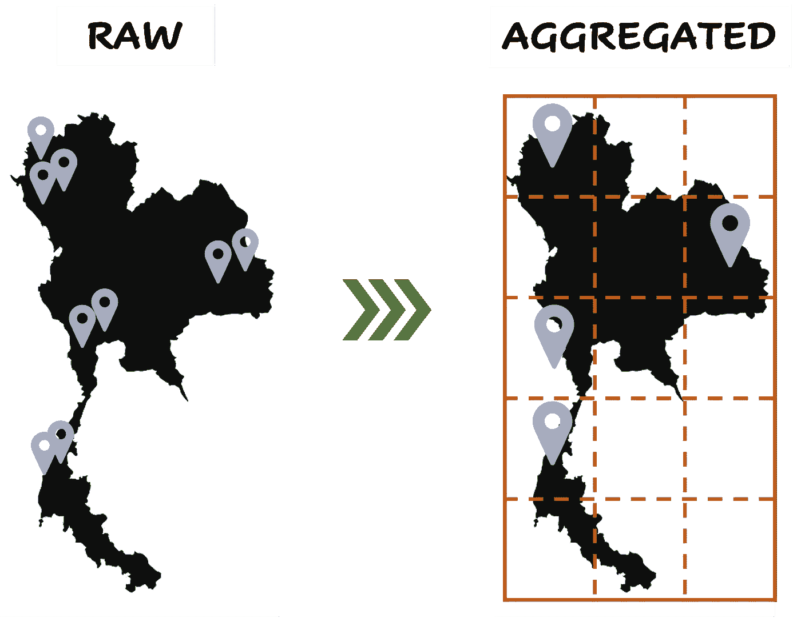

Using an index to aggregate geospatial data(Image by author).

A geohash can be an identifier of each zone that can be used to not only reference the area but also infer its spatial properties. Moreover, since there are finite numbers of cells, using geohash can keep the amount of data in the system constant and more manageable.

## Data Partitioning

The vast amount of data available nowadays makes the trend of using distributed data stores grows rapidly. Unlike traditional databases, distributed databases split data into chunks and spread them across nodes in the cluster. Designing a data partitioning strategy is necessary (or at l east recommended) for the system owners to utilize distributed data stores effectively.

In developing geographic-oriented systems and applications, partitioning data by its geographical location is very sensible. The data associated with a similar neighborhood should also be in the same chunk and, therefore, stay in the same node in the database cluster. This way, when users retrieve the data, it will come from a minimal number of nodes and files which saves the computational cost significantly.

Geospatial indexes provide a convenient way to split your data geographically. As you can see from the above examples, the closer the coordinates are, the higher chance they will be in the same geohash(or any other index system) cell. Therefore, you can use geohash as a partition key for the distributed database of your choice.

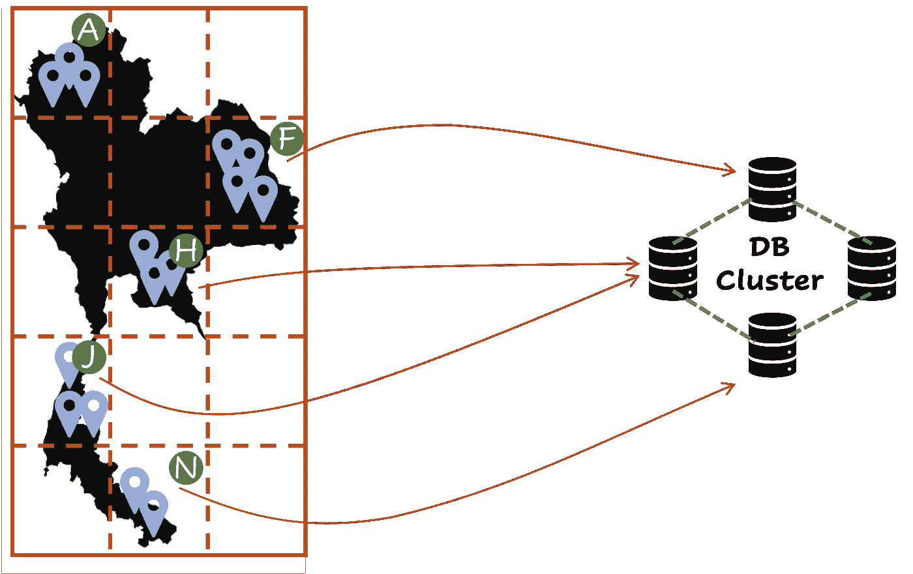

Using geospatial index for data partitioning(Image by author).

# Conclusion

Managing geolocation data is critical for developing location-based applications. A geospatial index provides a systematic and elegant approach to inde x geospatial data. Therefore, it’s a key component that any robust geographic software system must have.