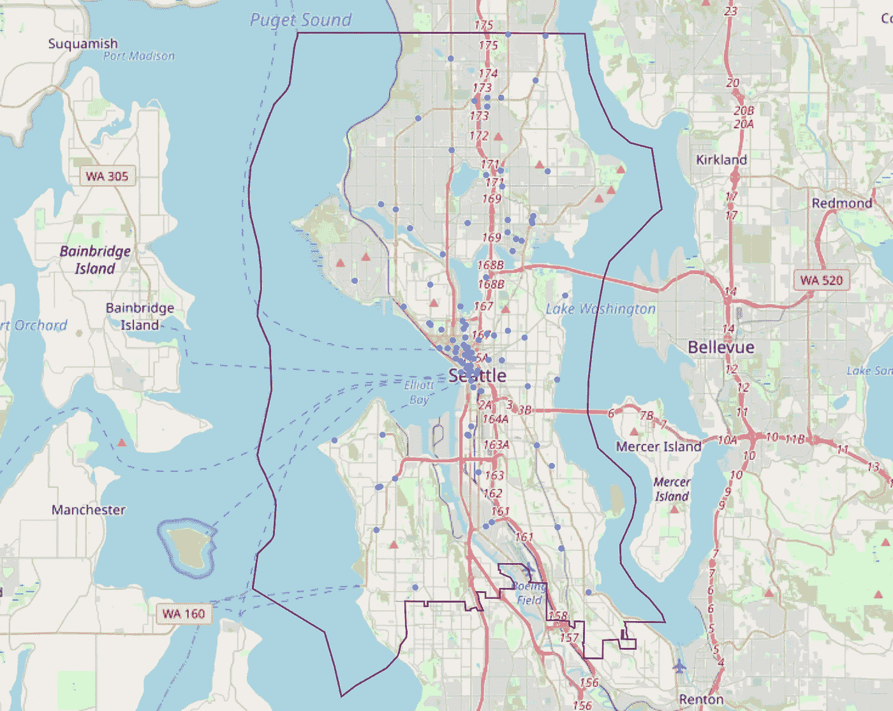
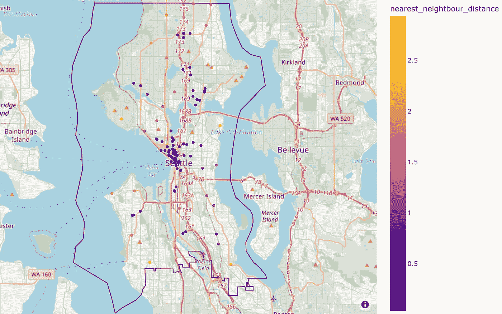
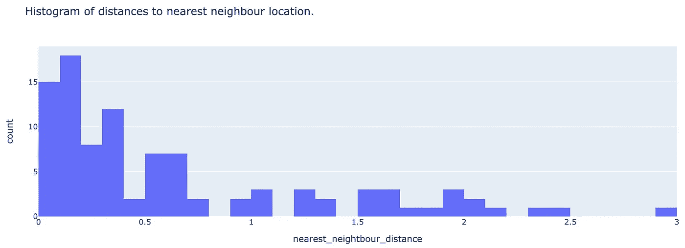
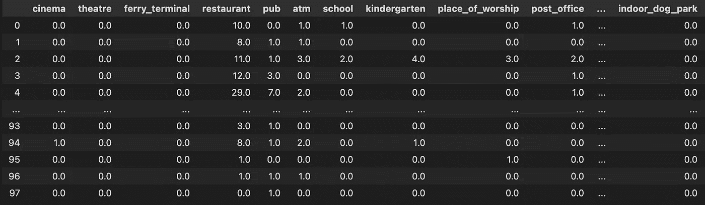
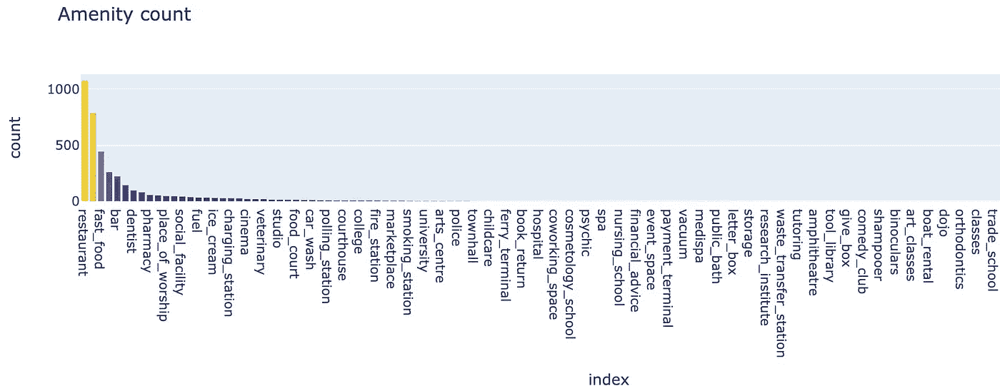
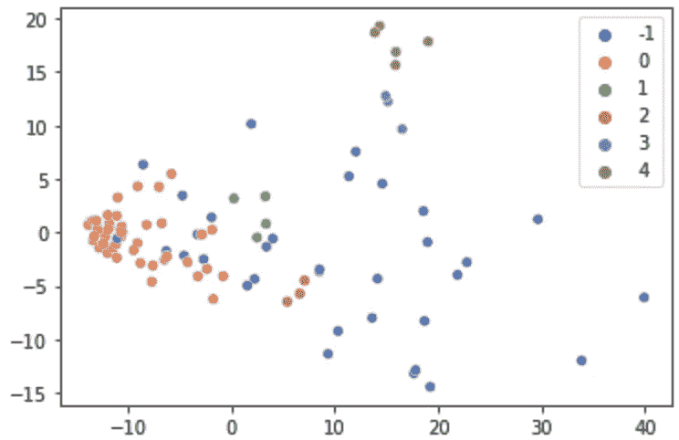
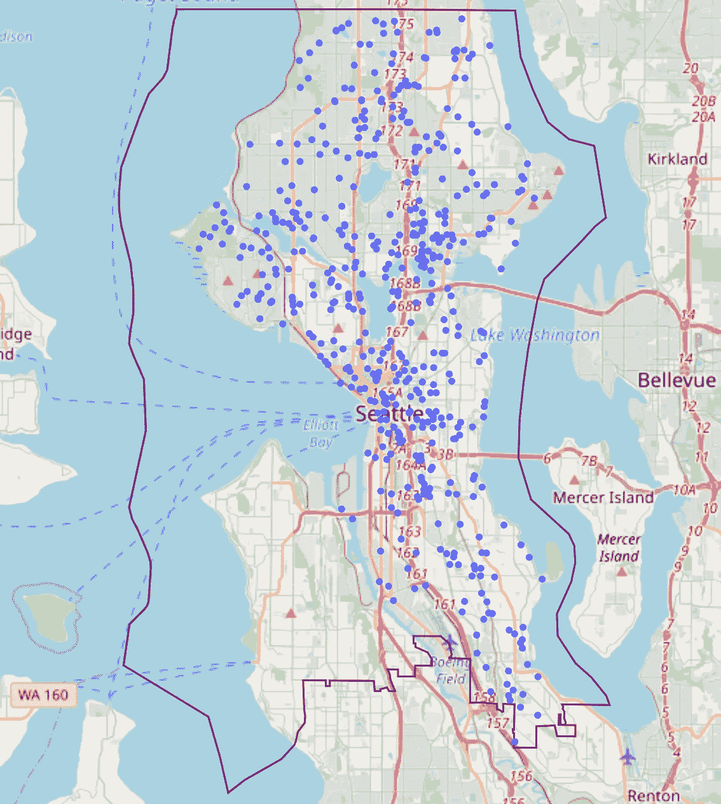
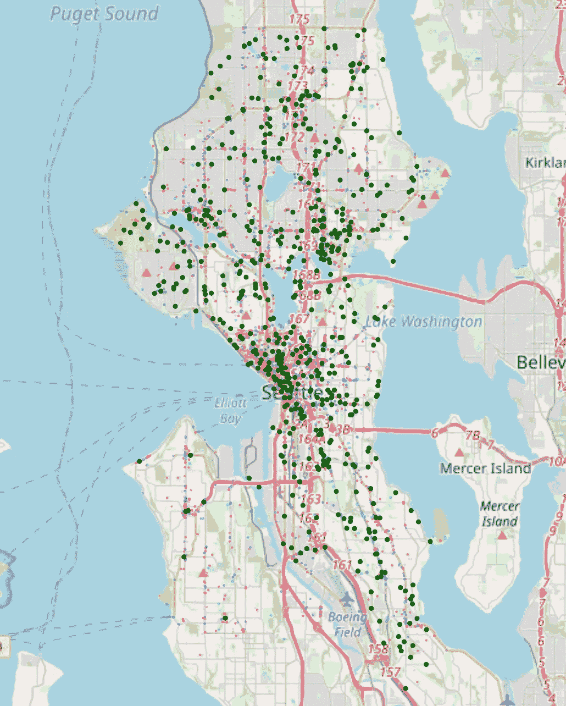
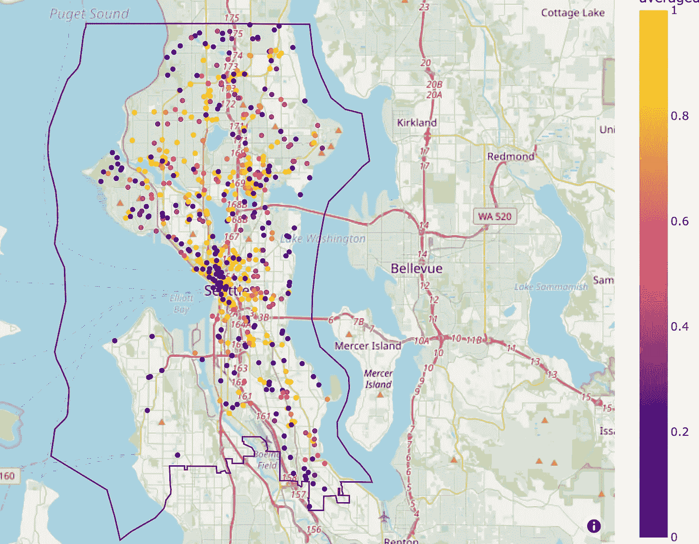

# 基于余弦相似度的地理空间选址分析

> 原文：<https://towardsdatascience.com/geospatial-site-selection-analysis-using-cosine-similarity-dcde4be458e7>

## 根据邻里关系识别地理区域之间的相似性


照片由[威龙 A](https://unsplash.com/@wyron?utm_source=medium&utm_medium=referral) 在 [Unsplash](https://unsplash.com?utm_source=medium&utm_medium=referral) 上拍摄

# **简介**

L 对于经营**物理位置**的企业来说，位置至关重要，靠近目标市场至关重要。

对于正在向新领域扩张的特许经营来说，这种挑战是常有的，在新领域中理解业务的*是很重要的。本文的目的是更详细地探讨这一想法，**根据现有特许经营所在地区的特点，评估新特许经营地点的适宜性**。*

*为了实现这一点，我们将从西雅图一家受欢迎的咖啡店特许经营店的 **OpenStreetMap** 中获取数据，使用关于周围社区的信息来识别类似的新的潜在位置。*

# ***框定问题***

*要完成这项任务，需要考虑几个步骤:*

1.  **寻找现有的特许经营点**
2.  **确定这些地点周围的便利设施(我们假设这能让我们了解附近的情况)**
3.  **寻找新的潜在地点及其附近的便利设施(重复步骤 1 & 2)**
4.  **评估潜在位置和现有位置之间的相似性**

*由于这个任务是地理空间的，使用 OpenStreetMap 和类似 ***OSMNX*** 和 ***Geopandas*** 这样的包会很有用。*

# ***收集数据***

****寻找现有加盟店****

*如上所述，我们将使用一个受欢迎的咖啡店来定义现有的感兴趣的位置。使用 OSMNX 收集这些信息非常简单，我们可以定义感兴趣的地理位置。我已经将**名胜设置为西雅图(美国)**，并使用 OpenStreetMap 中的 name/brand 标签定义了特许店的名称。*

```
*import osmnx
place = 'Seattle, USA'
gdf = osmnx.geocode_to_gdf(place)#Getting the bounding box of the gdf
bounding = gdf.bounds
north, south, east, west = bounding.iloc[0,3], bounding.iloc[0,1], bounding.iloc[0,2], bounding.iloc[0,0]
location = gdf.geometry.unary_union#Finding the points within the area polygon
point = osmnx.geometries_from_bbox(north, south, east, west, tags={brand_name : 'coffee shop'})
point.set_crs(crs=4326)
point = point[point.geometry.within(location)]#Making sure we are dealing with points
point['geometry'] = point['geometry'].apply(lambda x : x.centroid if type(x) == Polygon else x)
point = point[point.geom_type != 'MultiPolygon']
point = point[point.geom_type != 'Polygon']*
```

*这为我们提供了本地区现有特许经营点的位置:*

**

*已定义的西雅图区域(紫色多边形)内现有特许经营点(蓝点)的地图。图片作者。*

*查看现有位置会让我们对以下问题产生疑问:*

1.  **这个地区的特许经营密度如何？**
2.  *这些位置的空间分布是怎样的(密集分布还是均匀分布)？*

*要回答这些问题，我们可以使用定义的区域多边形和现有特许经营的数量来计算特许经营密度，这样我们可以得到每平方公里 0.262。*注意:多边形中的大部分区域是水，因此这里的密度看起来比实际要低很多……**

*为了测量这些位置相对于彼此的分散程度，我们可以使用 *Sklearn 的* ***球*树**来计算到最近邻居的距离*

**

*在规定的西雅图区域内(紫色多边形)，现有特许经营位置的地图，以到最近邻居的距离(以公里为单位)进行着色。图片作者。*

*最近邻也可以显示为直方图:*

**

*最近邻直方图。图片作者。*

*看起来大多数位置彼此相距 800 米，当查看地图并看到市中心现有位置的高密度时，这一点很明显。*

****这些地点周边的生活设施怎么样？****

*我们首先需要获得感兴趣区域内的所有便利设施，并定义每个现有位置周围的半径，该半径可用于识别附近的便利设施。这可以通过使用另一个循圆测试仪来实现，但是基于指定的半径(我设置为 250 米)来查询点:*

```
*from sklearn.neighbors import BallTree#Defining the tree based on lat/lon values converted to radians
ball = BallTree(amenities_points[["lat_rad", "lon_rad"]].values, metric='haversine')#Querying the tree of amenities using a radius around existing locations
radius = k / 6371000
indices = ball.query_radius(target_points[["lat_rad", "lon_rad"]], r = radius)
indices = pd.DataFrame(indices, columns={'indices'})*
```

*当我们查询 OSM 并使用 BallTree 查找附近的便利设施时，我们只剩下现有特许经营店半径范围内的每个便利设施的指数。因此，我们需要提取设施类型(例如，餐馆)并对每次出现进行计数，以获得如下所示的已处理数据帧:*

**

*总结现有位置周围半径范围内的便利设施的示例数据框架。每行代表一个现有的特许经营点。图片作者。*

*现在，我们可以在分类条形图中看到现有特许经营店附近最受欢迎的设施:*

**

*现有特许经营店半径范围内的便利设施条形图。图片作者。*

*我们的咖啡店特许经营店似乎主要位于其他提供食品/饮料的位置附近，还有一些其他的少数便利设施，如“充电站”。这给了我们所有现有位置的总数， ***但是设施的分布是一样的吗？****

*我们可以应用快速 **PCA** 和 **DBSCAN** 聚类来查看现有特许经营点如何相互聚类(使用 min_sample 值 3):*

**

*DBSCAN 集群加盟店，由集群标签着色。图片作者。*

*向左有一个主要的星团，然而也有其他较小的星团存在。这一点很重要，因为它告诉我们，现有的特许经营地点**根据其周围的便利设施而变化**，并且**不符合** **单一“类型”的街区**。*

# ***寻找新地点***

*现在，我们已经为现有的特许经营场所创建了一个数据集，我们现在可以为新的潜在场所生成一个类似的数据集。我们可以使用 OSMNX 提取的图随机选择感兴趣区域中的节点，因为点将被限制在可步行的现有路径上:*

```
*G = osmnx.graph_from_place(place, network_type='walk', simplify=True)
nodes = pd.DataFrame(osmnx.graph_to_gdfs(G, edges=False)).sample(n = 500, replace = False)*
```

**

*随机抽样的地点(蓝色)，我们将与现有的特许经营地点进行比较。图片作者。*

*重复前面的步骤，就可以找到这些潜在地点附近的便利设施…*

**

*一张略显凌乱的位置图，突出显示了现有的特许经营区(黑色)、新的预期位置(深绿色)和该区域的所有设施(按设施类型着色)。*

***测量现有和潜在位置之间的相似性***

*这是我们一直在等待的部分；衡量现有地点和潜在地点的相似性。我们将使用**成对余弦相似度**来实现这一点，其中每个位置都由一个基于附近设施的多样性和数量的向量组成。在这种地理空间环境中，使用余弦相似度有两个好处:*

1.  ***矢量长度不需要匹配** =我们仍然可以测量具有不同类型设施的位置之间的相似性。*
2.  ***相似性不仅仅基于娱乐设施的频率** =因为我们也关心娱乐设施的多样性，而不仅仅是数量。*

*我们计算潜在新位置相对于所有其他现有位置的余弦相似性，这意味着我们有多个相似性得分。*

```
*max_similarities = []
for j in range(len(new_locations)):
similarity = []
for i in range(len(existing_locations)):
cos_similarity = cosine_similarity(new_locations.iloc[[j]].values, existing_locations.iloc[[i]].values).tolist()
similarity.extend(cos_similarity)
similarity = [np.max(list(chain(*similarity)))]
average_similarities.extend(similarity)
node_amenities['averaged similarity score'] = max_similarities*
```

***那么我们如何定义什么是相似呢？***

*对于这一点，我们可以**记住现有的位置并没有形成一个单一的集群，**意味着存在**异质性**。一个很好的类比可以是在评价一个人能否加入一个友谊团体时:*

1.  *一个友谊群通常包含不同的人，他们有不同的特点，而不是一群有相同特点的人。*
2.  *在一个群体中，人们会与群体中的不同成员或多或少地分享一些特征。*
3.  *一个新的潜在成员不一定需要与团队中的每个人都相似才能被认为是合适的。*

*因此，在与现有位置比较时，我们选择了**最大**相似性分数，因为这告诉我们潜在位置**与至少一个其他现有特许经营位置**相似。取平均值会导致较低的分数，因为特许经营位置之间附近的便利设施存在差异。我们现在可以绘制结果，**用相似性分数**着色，看看哪些区域可能成为新的特许经营点:*

**

*潜在位置按相似性得分着色(黄色代表高相似性百分比，紫色代表无相似性)，旁边是现有特许经营位置(黑色)。图片作者。*

*我们在市中心的位置的相似性得分都显示出与现有位置有很强的相似性，这是有道理的，因此我们真正感兴趣的是具有**高相似性得分**的位置，这些位置位于**远离现有特许经营位置**(地图上的黑点)。*

# ***最终想法***

*我们已经使用**地理空间**技术来评估咖啡店特许经营扩展到新位置的潜在位置，使用基于**附近便利设施**的**余弦相似度**分数。这只是一幅大图的一小部分，人口密度、可达性等因素。也应该被考虑在内。*

*请关注下一篇文章**中的**，在那里，我们将通过一些建模来进一步完善这个想法。**感谢阅读！***