# 如何使用数据分析来理解数据

> 原文：<https://towardsdatascience.com/german-credit-data-part-1-exploratory-data-analysis-8f5f266b2426>

## 使用德国信用数据集对贷款申请人进行探索性分析

由 [Ibrahim Boran](https://unsplash.com/@ibrahimboran?utm_source=medium&utm_medium=referral) 在 [Unsplash](https://unsplash.com?utm_source=medium&utm_medium=referral) 上拍摄的照片

# 介绍

数据分析是分析原始数据以获取信息并对数据做出结论的过程。数据分析是数据科学中的一个重要领域，因为它可以帮助企业优化绩效。数据分析帮助企业降低成本，提高企业的整体效率。

当银行收到贷款申请时，它必须决定是否批准贷款。银行根据申请人的资料做出贷款决定。两种类型的风险与银行的决策相关联

*   如果申请人的信用风险为**良好**，即有可能偿还贷款，那么不批准此人的贷款会导致银行的业务损失
*   如果申请人有**不良**信用风险，即不太可能偿还贷款，那么批准此人的贷款会给银行带来财务损失

## 目标

德国信贷数据的目的是最大限度地减少向申请人发放高风险贷款的机会，同时最大限度地增加从优质贷款中获利的机会。在对申请人的贷款申请做出决定之前，贷款经理会考虑申请人的人口和社会经济概况。

德国信用数据集是从 [UCI 机器学习库](https://archive.ics.uci.edu/ml/datasets/Statlog+%28German+Credit+Data%29)下载的公开可用数据集。德国信贷数据包含 20 个变量的数据，以及对 1000 名贷款申请人的申请人是否被视为良好或不良信贷风险的分类。该任务需要研究数据并建立预测模型，以便为银行经理提供指导，从而根据潜在申请人的个人资料决定是否批准向其提供贷款。

# 探索性数据分析

探索性数据分析(EDA)用于对数据集进行彻底的检查。EDA 揭示了数据集中可能不明显的趋势、模式和关系。在这个案例研究中，我使用了原始数据集的简化版本，它只有 10 个变量:

1.  年龄(数字)
2.  性别(字符串:男性，女性)
3.  工作(数字:0 —非熟练和非居民，1 —非熟练和居民，2 —熟练，3 —高技能)
4.  住房(字符串:自有、租赁或免费)
5.  储蓄账户(字符串—少量、中等、相当丰富、丰富)
6.  支票账户(字符串—小额、中等、大额)
7.  信贷金额(数字，单位为德国马克)
8.  持续时间(数字，以月为单位)
9.  用途(正文:汽车、家具/设备、收音机/电视、家用电器、维修、教育、商务、度假/其他)
10.  风险(字符串—好的，坏的)

## 导入库并读取数据集

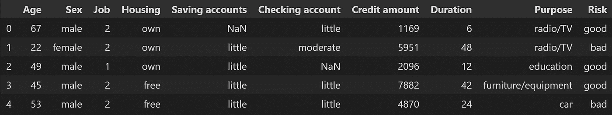

作者图片

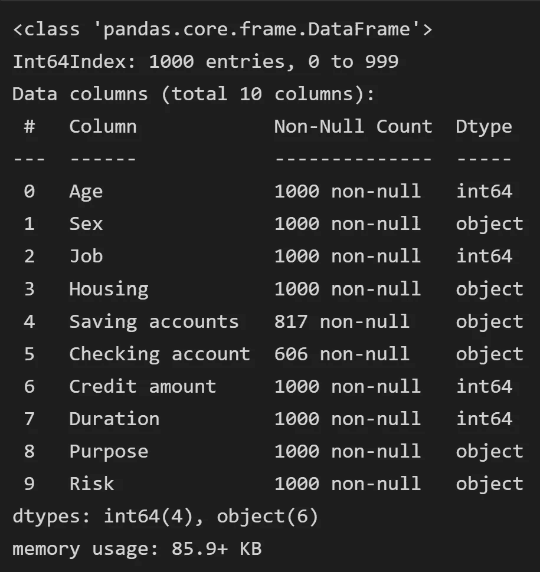

作者图片

*   数据集包含 10 列和 1000 行(4 个要素为 int64，6 个要素为对象数据类型)
*   支票和储蓄账户是仅有的两个缺少值的列

## 数据的统计摘要

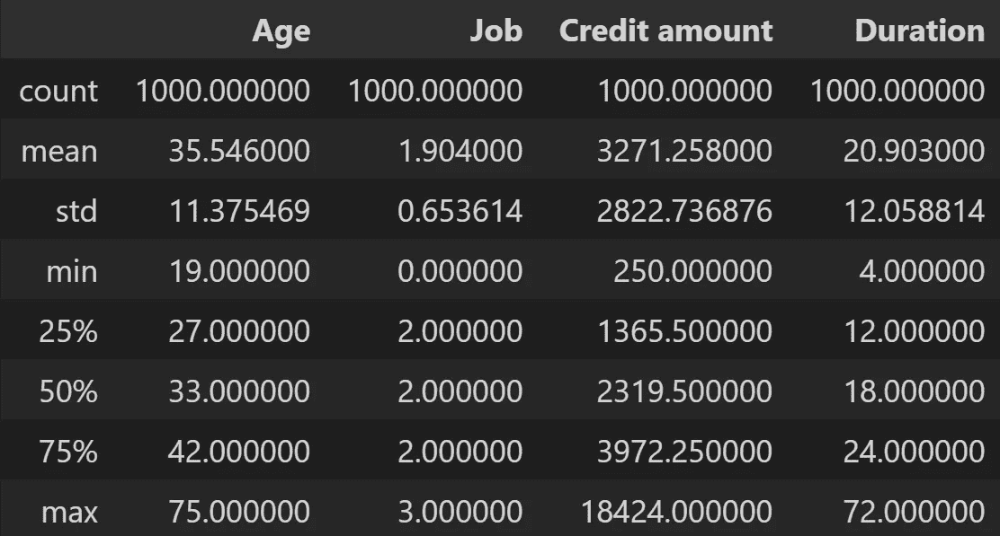

作者图片

*   平均年龄是 36 岁
*   取整后的平均持续时间是 21
*   年龄范围从 19 岁到 75 岁
*   德国马克的信用范围是从 250 到 18424

## 清除丢失的值

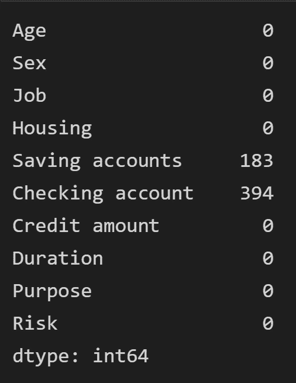

作者图片

*   “储蓄帐户”列中有 183 个缺失值
*   支票帐户栏中有 394 个缺失值

Checking 和 Saving accounts 列中的值是分类的，所以我决定仔细看看这些值是什么。

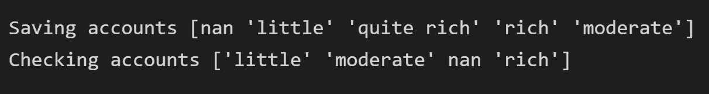

作者图片

通过删除没有值的行，数据集将丢失 577 个实例，超过一半。这是一个重大的数据损失。为了避免这种情况，我用 **none 替换了空值。**空值的申请人可能在申请时没有储蓄或支票账户。

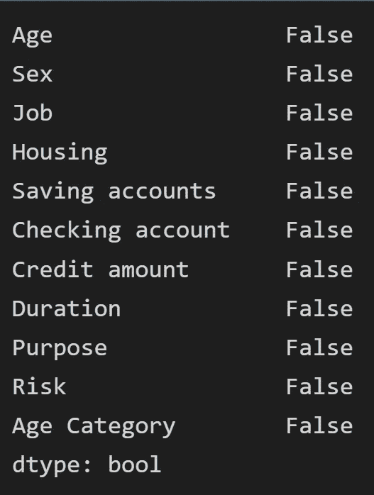

作者图片

# 可视化数据

## 目标变量分布

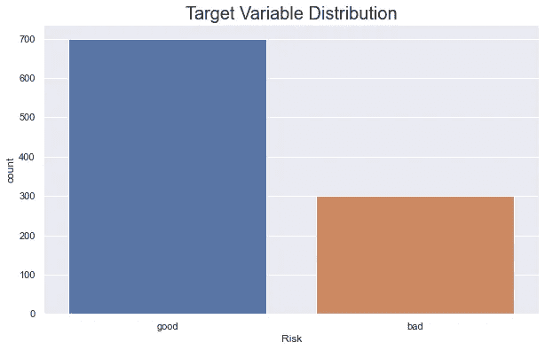

作者图片

*   有 700 例申请人被归类为**良好**
*   有 300 例申请人被归类为**不良**

## 数值变量的配对图

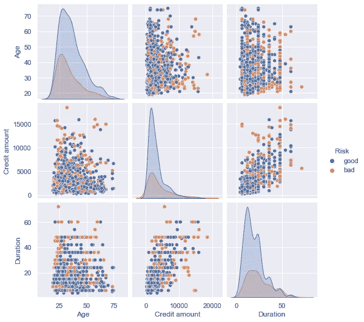

作者图片

*   年龄、信用额度和持续时间的分布图具有正的偏斜

## 年龄分布

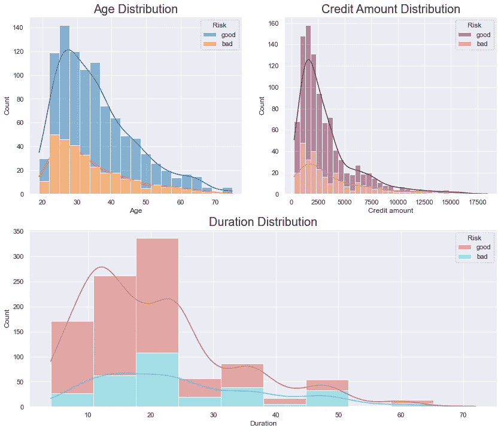

作者图片

*   所有的图形都有一个正偏差，表示平均值大于中值
*   20 至 30 岁的申请人更有可能申请贷款
*   申请人不太可能申请高信用贷款
*   更多的贷款在发放后 20 个月左右就已经还清了
*   该银行更有可能接受 20 至 30 岁的申请人，并要求 250 至 2500 德国马克的贷款

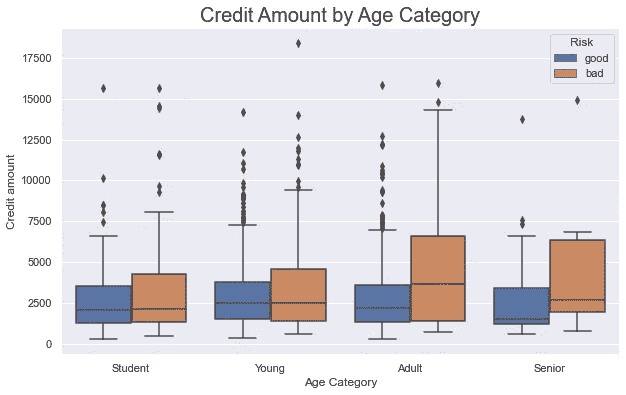

作者图片

*   信贷额低于 5000 德国马克的申请人中有 50%以上被列为**良好**
*   贷款信用超过 5000 马克的成年人更有可能被归类为不良贷款
*   **学生**和**青年**申请人最有可能申请信贷额低于 5000 马克的贷款

## 住房分配

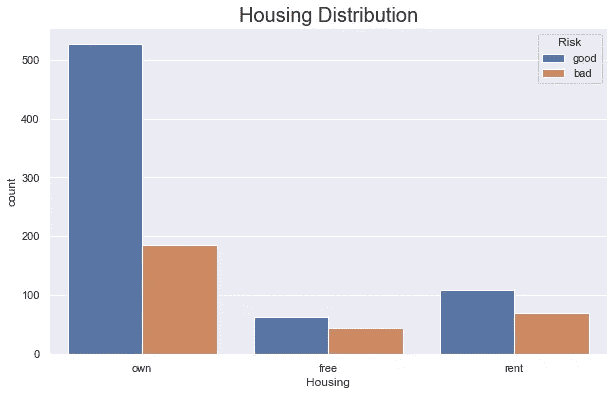

作者图片

*   大多数申请人拥有一套房子
*   一半以上拥有被归类为**好**的房子的申请人

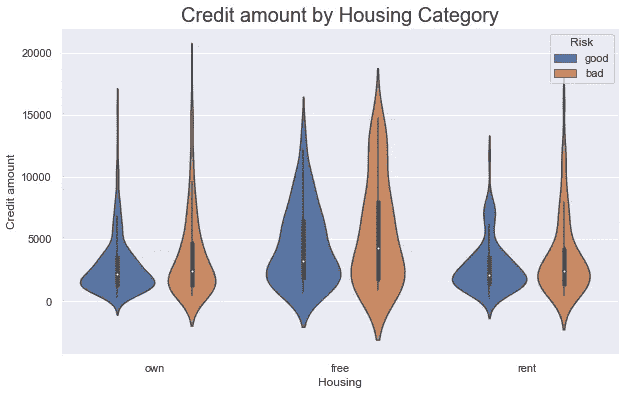

作者图片

*   小提琴图的密度曲线表明，申请人的信贷额低于 5000 德国马克的频率较高

## 按性别分布

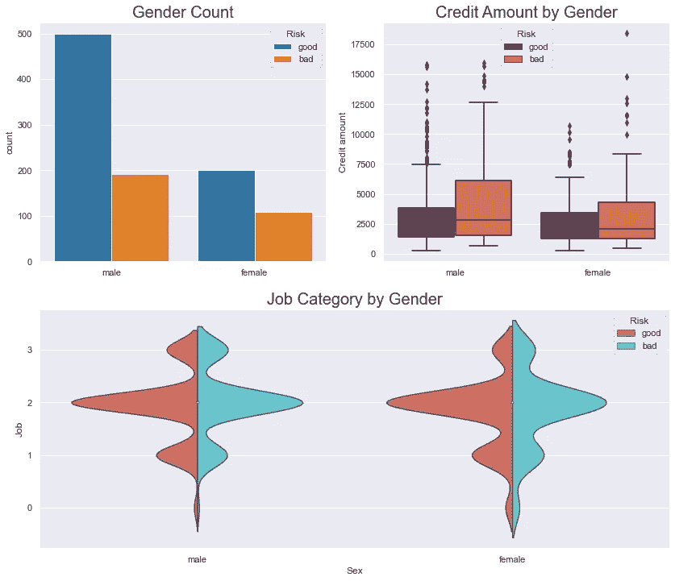

作者图片

*   数据中男性申请者比女性多两倍
*   大多数申请人都属于技术工种
*   大约 2/5 的男性申请人和 1/3 的女性申请人被归类为**不良**
*   小提琴图的密度分布遵循相同的趋势，表明大多数男性和女性申请人被归类为**熟练**工人

## 按工作类别分布

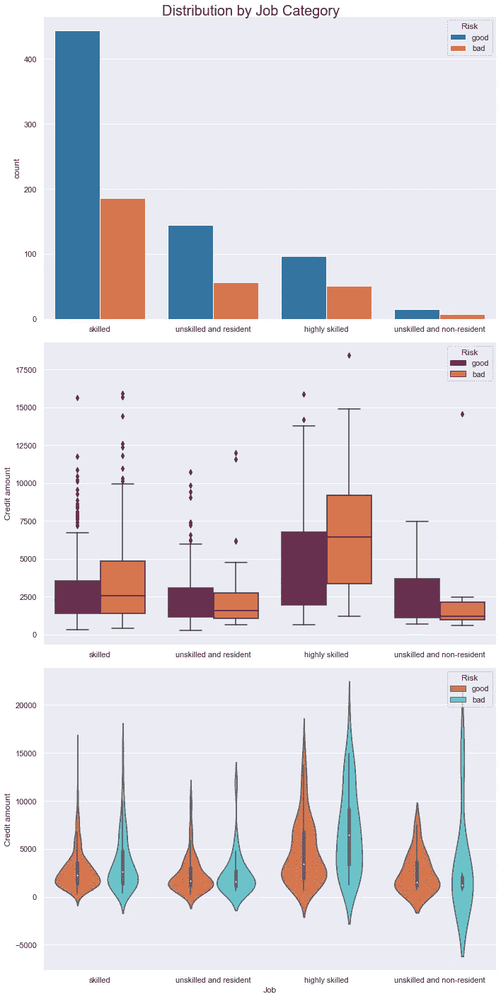

作者图片

*   拥有**技能**工作的申请者有两倍多被归类为**好**
*   超过 50%的申请人属于**熟练**和**非熟练和常驻**工作类别
*   高技能的申请者更有可能获得更大的贷款

## 检查和保存帐户分配

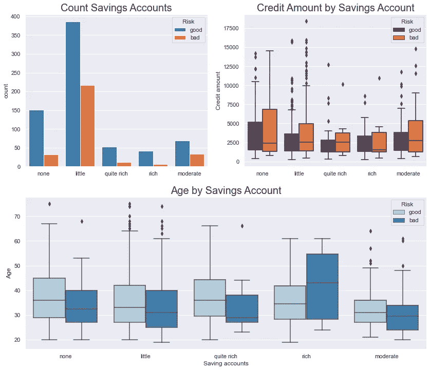

作者图片

*   储蓄账户很少或没有储蓄账户的申请人更有可能申请贷款
*   大多数申请者都属于“小人物”一类
*   在“小 T21”类别中，50%的申请者年龄在 25 至 45 岁之间
*   拥有中等储蓄账户、相当富有储蓄账户和富有储蓄账户的申请者更有可能被归类为优秀
*   拥有**很少**和**没有**储蓄账户且贷款信用额超过 5000 德国马克的申请人更有可能被归类为**不良**

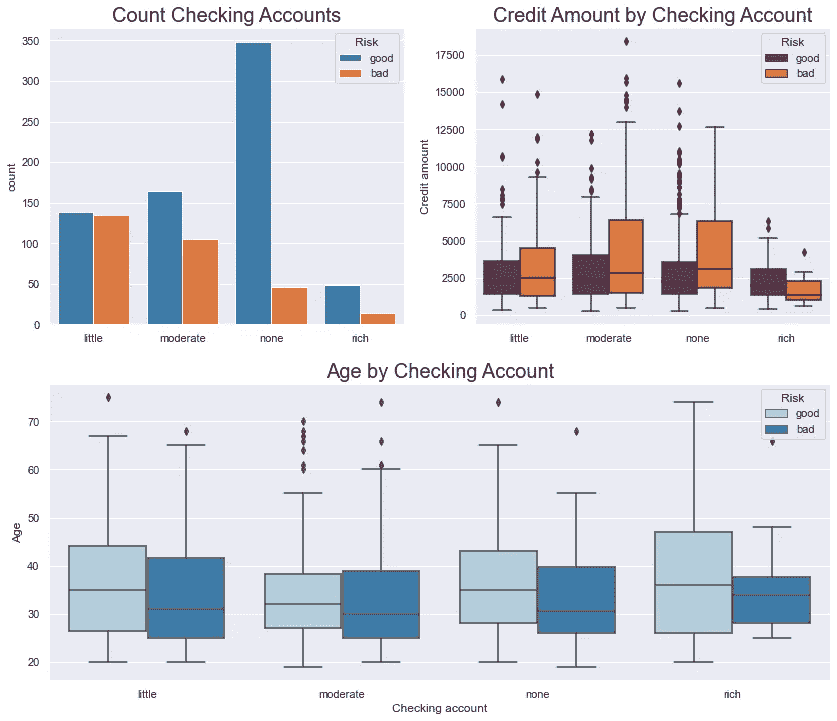

作者图片

*   300 多名申请者没有支票账户
*   超过 3 倍没有支票账户的申请人被归类为**好**
*   拥有适度支票账户的申请人中，50%的人年龄在 25 岁到 40 岁之间
*   拥有丰富支票账户的申请人分布更广，他们被归类为好账户，年龄在 25 到 45 岁之间
*   信用额度高且支票账户中的 T42 很少的申请人更有可能被归类为不良

## 按目的分配

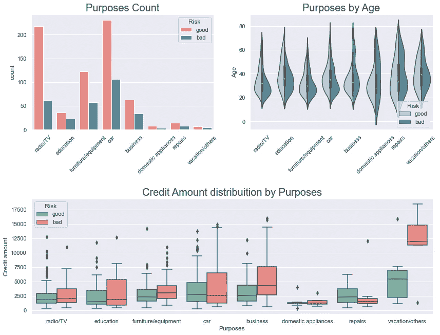

作者图片

*   很大一部分申请人要求贷款购买汽车、收音机/电视机
*   一半以上的申请人申请的贷款少于 5000 德国马克
*   高信用贷款的申请人更有可能被归类为不良贷款

## 按持续时间分布

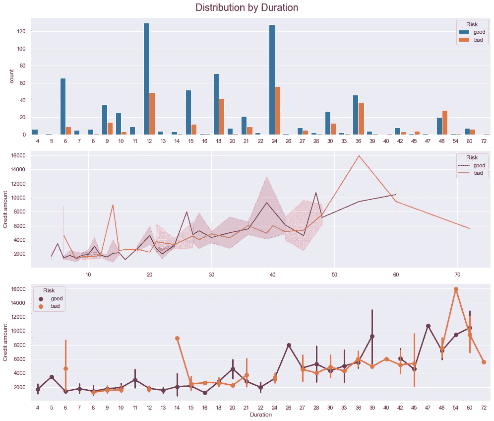

作者图片

*   发放的大多数贷款期限为 12 至 24 个月
*   大多数在 24 个月内偿还贷款的申请人被归类为**良好**
*   大多数贷款期限超过 24 个月的申请人被归类为**不良**

# 分析得出的结论

*   期限少于 24 个月的贷款更有可能被偿还
*   发放信贷额少于 5，000 德国马克、期限少于 24 个月的贷款比较保险
*   拥有房产的申请人表明他们经济独立，是更好的贷款候选人
*   拥有**高技能**和**高技能**工作的申请人是发放贷款的更安全的候选人
*   汽车贷款是银行发放的最常见的贷款，损益比率很高(最赚钱的贷款)
*   发放 2，500 马克以下的贷款比不太可能偿还的高信用贷款更有利可图

银行经理可以利用上面的信息做出是否继续贷款申请的明智决定。使用数据集建立一个预测模型将有助于增加发放**好**贷款(财务收益)的机会，同时最小化**坏**贷款(财务损失)。本文的第二部分将介绍预测建模和交叉验证，以便根据数据选择最佳模型。

# 项目可访问性

*   [**GitHub**](https://github.com/jpzambranoleon/german-credit-data-project/blob/main/german-credit-risk.ipynb)
*   [**笔记本**](https://github.com/jpzambranoleon/german-credit-data-project/blob/main/german-credit-risk.ipynb)
*   [**Kaggle 数据集**](https://www.kaggle.com/datasets/kabure/german-credit-data-with-risk)

## 数据集引用

汉斯霍夫曼。(1994).Statlog(德国信用数据)。UCI 机器学习知识库

这个数据集是在[知识共享署名 4.0 国际](https://creativecommons.org/licenses/by/4.0/legalcode) (CC BY 4.0)许可下许可的。