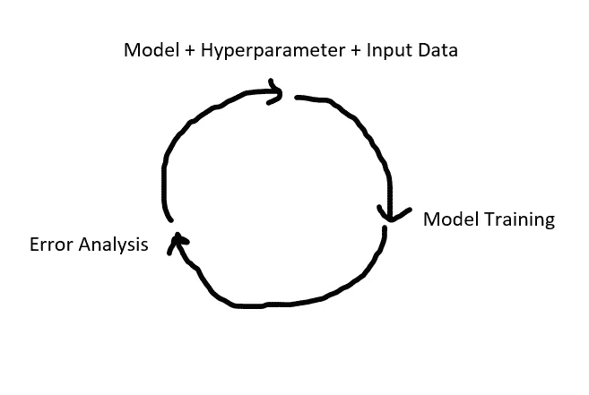
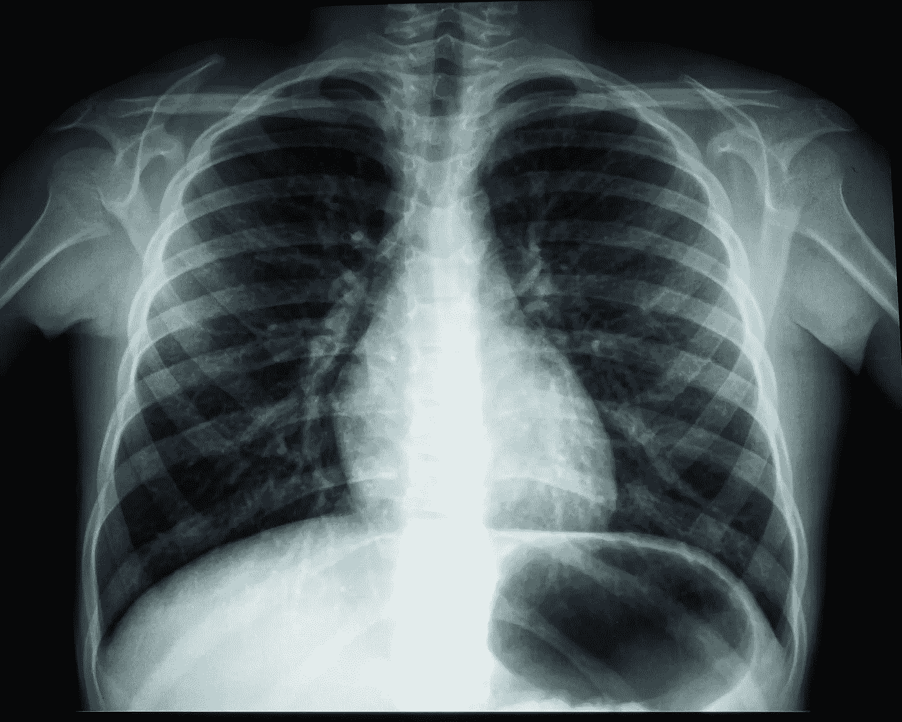
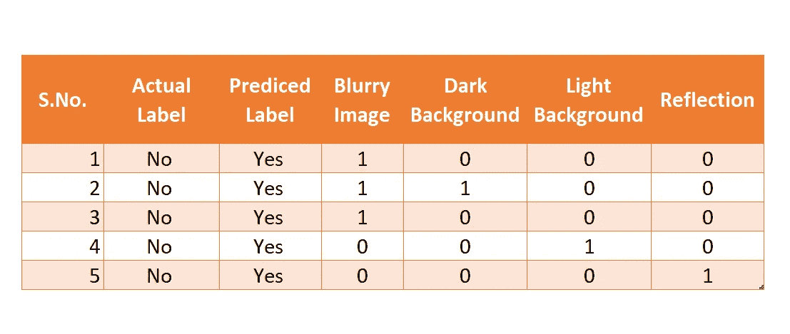
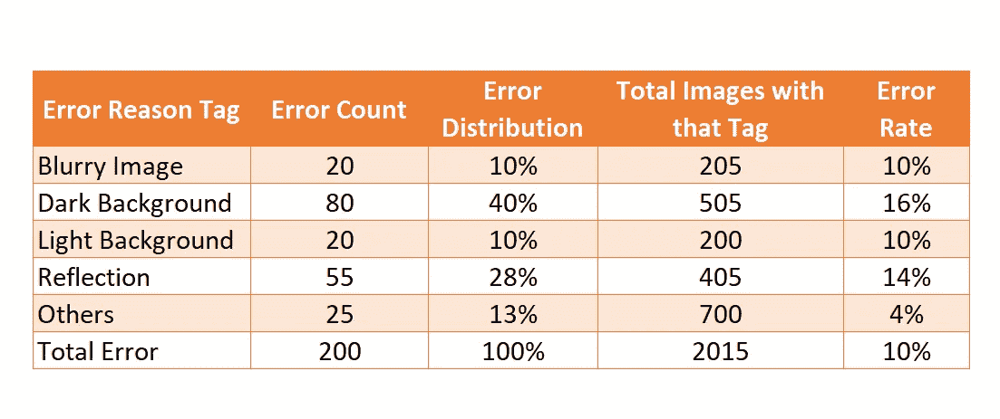
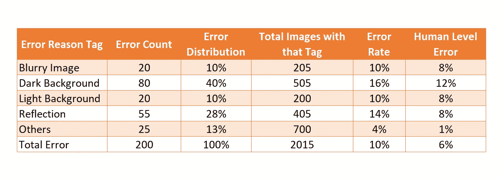
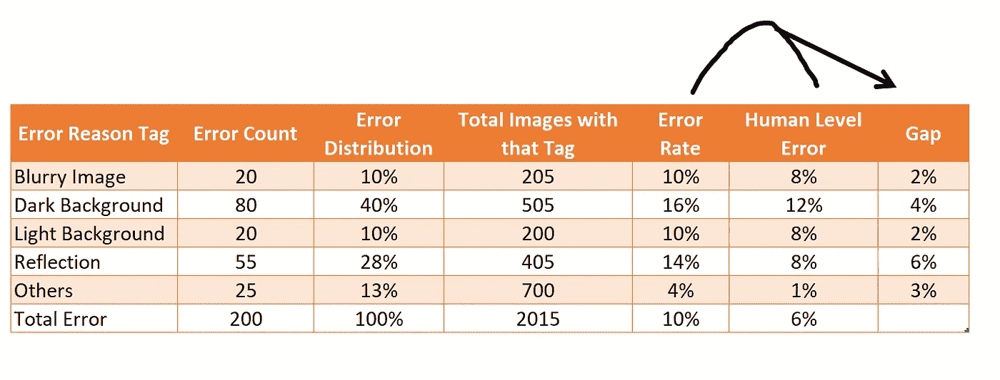
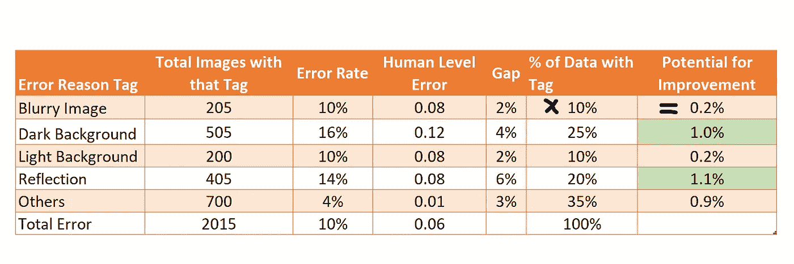

# 让你的机器学习模型性能提升 10%

> 原文：<https://towardsdatascience.com/get-10-jump-in-your-machine-learning-model-performance-fa8bddf590d1>

## 超越超参数调整提高模型性能的逐步指南

假设您已经确定了一个机器学习模型和相应的超参数，这些模型和超参数为您提供了最佳性能，但模型的精度仍然低于基线/预期精度。对你来说是穷途末路还是可以进一步改善？

在这篇博客中，我将带你经历一个超越超参数调整的提高模型性能的 3 步过程。我们开始吧！

模型改进生命周期(图片由作者提供)

# 第一步:错误分析

错误分析的目的是使用以下方法确定改进的空间:

1.  **确定模型哪里出了问题**

总体准确性数字就像一个总结，它并不指向模型出错的具体区域。因此，找出模型出错的地方非常重要，这样我们就可以设计一些改进策略。

*示例:使用 X 射线图像检测肺炎。*

图片来源:Unsplash

假设我们正在构建一个使用胸部 X 射线检测肺炎的模型，我们希望提高模型的准确性。

*分析样品*

我们可以从模型预测出错的地方挑选 200 个样本，并试图理解错误预测的原因。当我们分析这些案例时，我们发现一些图像是模糊的，一些有暗/亮背景，反射，等等。我们可以使用这些类别来创建一个汇总表(如下所示)来捕捉错误预测的原因。

捕捉预测错误的原因(图片由作者提供)

*总结分析*

现在，我们可以创建一个汇总表来查找标签之间的错误分布(错误计数/总错误)以及这些标签的错误率(该标签的错误计数/总图像)。

错误标签的分布(图片由作者提供)

> 为了找到“带有该标签的全部图像”，你可以训练一些模型来识别标签，或者你可以选取一个样本，找到标签的分布，并将其扩展到人群。

查看上表，我们可以发现大多数错误都集中在“暗背景”标签中(40%)，并且错误率在该标签中也是最大的(16%)。这是否意味着我们应该关注这个标签来提高我们的模型性能？

不尽然，我们需要将这些错误率与基线性能进行比较。

**2。离基线多远**

为了找到我们应该集中精力提高我们的准确性的地方，我们需要比较模型错误率和基线错误率。

现在，您的基线可能是以下之一:

1.  该任务的人类水平的性能。
2.  为您的用例提供最先进的/开源的性能。
3.  您计划替换的以前部署的模型。

在下表中，我们添加了人因水平的绩效(或错误率)作为基线。

将模型错误率与基线错误率进行比较(图片由作者提供)

我们将发现我们的模型的错误率和原因标签的人类水平错误之间的差距/差异。

模型误差和人为误差之间的差距(图片由作者提供)

**3。确定工作的优先顺序**

为了区分工作的优先顺序，我们需要增加一个角度:找到带有标签的数据的百分比。

现在结合(乘以)“间隙”和“该标签的数据百分比”，如果我们对不同的标签达到人类水平的准确性，我们可以获得潜在的准确性提升。

使用差距和数据分布来寻找改进的潜力(图片由作者提供)

“暗背景”和“反射”具有提高整体准确度的最大潜力。因此，我们可以根据实现的难易程度来确定其中一个的优先级。

# **第二步:完善输入数据**

假设我们正致力于提高“暗背景”标签/数据的准确性。

现在，我们将尝试生成更多的数据点，以捕捉我们的算法表现不佳但人类(或其他基线)表现良好的现实例子。

我们可以遵循以下策略之一来生成更多数据点:

1.  收集更多具有暗背景的 X 射线图像。
2.  创建合成数据点:我们可以选择没有暗背景的 X 射线图像，并为这些图像合成添加暗背景。

# 第三步:模特训练

第 3 步是在这个更新的输入数据集(预先存在的数据点+新创建的数据点)上训练您的模型。

重复所有 3 个步骤，以达到人类水平(或基线)的表现。

> 我们(我和我的团队)目前正在一个文本分类用例中遵循这种 3 步方法，我们已经能够将分类准确率从 64%提高到 75%。

## **结论**

为了提高超参数调整之外的模型性能，我们可以使用误差分析技术来识别与基线相比模型表现不佳的类别/标签。一旦我们确定了要关注的标签，我们就可以改进与这些标签相对应的输入数据，并重新训练我们的模型。我们可以重复这个循环，以达到预期的准确性(或性能指标)。

*如果你觉得我的博客有用，那么你可以* [***关注我***](https://anmol3015.medium.com/subscribe) *每当我发布一个故事时，你都可以直接得到通知。*

*如果你自己喜欢体验媒介，可以考虑通过* [***注册会员***](https://anmol3015.medium.com/membership) *来支持我和其他成千上万的作家。它每个月只需要 5 美元，它极大地支持了我们，作家，而且你也有机会通过你的写作赚钱。*