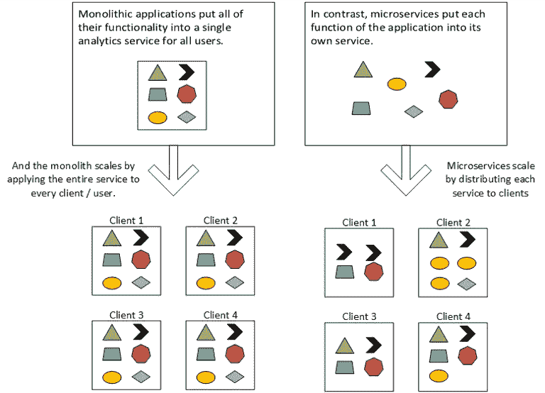

# 借助分析微服务从您的数据中获得更多价值

> 原文：<https://towardsdatascience.com/get-more-out-of-your-data-with-analytics-microservices-9a5a34a3ad2f>

# 借助分析微服务从您的数据中获得更多价值

凯尔·辛克森在 [Unsplash](https://unsplash.com?utm_source=medium&utm_medium=referral) 上的照片

数据的速度、种类和数量都在快速增长。根据 IDC 最近的研究，到 2025 年，全球创建的数据将激增至 [181 吉字节，而企业将](https://www.idc.com/getdoc.jsp?containerId=US46410421)[捕获约 16 吉字节](https://www.idc.com/getdoc.jsp?containerId=US475096)(全球创建的数据中约 9%由企业捕获。)而且这个差距预计还会扩大。使用当前的实践，一些公司可能能力较弱，无法利用数据的增长。

消费者体验的数字化是数据泛滥的一个驱动因素。

一些公司正在寻求使用敏捷开发方法来缩小差距，这种方法允许他们尝试新想法，快速转向，并通过挖掘消费者行为数据来响应消费者需求。

成功弥合这一差距的公司将为自己创造竞争优势。他们能够收集数据，并以某种方式利用这些数据，从而获得独特的消费者洞察力。这些见解可以为他们的客户带来新的创新和体验，最终为他们自己带来新的商机。

就像他们服务的客户一样，商业服务公司需要缩小数据创建和使用的差距。像营销机构和咨询公司这样的服务公司将从采用新的设计模式中受益，这些设计模式代表客户促进了数据实践的创新。这些公司应该考虑分析微服务。

# 什么是微服务？

Sam Newman 是“[构建微服务](#viewer-aif5n)”和“[整体到微服务](#viewer-aif5n)”一书的作者，他将微服务描述为一种开发模式，这种开发模式“致力于为您提供许多选项来解决您可能面临的问题。”这是一个非常宽泛的定义，但对于处理模式不断演变的分析问题来说，这非常有吸引力。让我们潜入更深的地方…

他进一步将微服务描述为围绕特定业务领域构建的可独立部署的、与技术无关的应用服务的集合。

那很有帮助；并呼吁分析应用程序…

《微服务模式》的作者 Chris Richardson 将这些服务描述为一组松散耦合的协作服务。他也同意它们是可独立部署的，并且他通过描述为它们工作的团队来扩展这个想法。他解释说，微服务团队是较小的团队，他们独立工作，独立于下游服务/用户/需求设计和构建服务，但在开发服务时要记住那些最终用户。

当我们考虑分析服务时，在快速发展的大数据环境中，微服务开发架构非常诱人。让我们探索它们的优缺点，以了解它们是否真正适合分析用例。

# 微服务的利弊。

当考虑在您的组织内部署微服务开发模式时，您将希望确定这些问题是否值得为保持微服务平稳运行而进行额外的工作。让我们首先看看这种架构模式的好处，并将其与支持它所需的额外工作进行比较。

# 分析微服务的优势

## 上市速度

微服务方法具有灵活性，因为您可以围绕新功能/服务进行设计，以满足该服务消费者的需求，而不是考虑它将如何影响其他应用程序。

由[保罗·坎德洛](https://unsplash.com/@paolocandelo?utm_source=medium&utm_medium=referral)在 [Unsplash](https://unsplash.com?utm_source=medium&utm_medium=referral) 拍摄的照片

敏捷性带来了满足快速发展的数据存储/分析领域中引入的新技术要求的能力。此外，当新数据上线时，我们可以开始使用新数据挖掘洞察力，从而使公司能够创新并利用额外数据可用性带来的商机。

## 组件的独立性

在使用单个数据库的典型分析方法中，一行新代码可能需要整个应用程序的完全重新部署，以促进更改。下游流程需要考虑对模式的任何更改；而上游流程将需要促进总体分析应用程序的新引入部分。

在微服务架构中，我们分离组件并独立构建它们。当他们一起工作时，我们不会让他们依赖其他服务或技术。这使得微服务成为探索新想法和开发与现有服务协同工作的新服务的有用方式。

## 面向 B2B 的复制/扩展服务

由于它们的独立性，微服务可以被复制以促进客户/代理关系。当新客户需要微服务时，服务提供商可以在客户环境中启动微服务，与其他客户的服务分开。这使得计费和会计更容易管理。额外的安全性也是这一变化的一个有益的副作用。

定价有利于客户，因为他们只需要为他们使用的东西付费，这在客户/代理关系中可能是一种有吸引力的模式。

此外，DevOps 和数据工程团队可以开发微服务的新功能和增强功能，并向所有现有用户推出更新，从而加快最新更新在客户群中的采用，而无需重新构建整个整体解决方案的平台。更新、补丁和功能变得可用并可在整个分析客户端范围内部署。

## 技术灵活性

微服务架构模式的另一个重要特征是快速探索和采用新技术的能力。因为每个微服务都是独立的，所以我们可以选择最好的工具来交付服务。

例如，我们可以通过集成一个合作伙伴服务来设计一个 ETL 服务，这个服务很好地为我们提供了对数据的访问。也许我们可以在这个服务的基础上使用 Go 作为我们的面向对象编程语言来转换和加载数据到我们的数据库。

Johannes Plenio 在 [Unsplash](https://unsplash.com?utm_source=medium&utm_medium=referral) 上拍摄的照片

另一个服务可以用 Python 编写，以利用其强大的数据科学功能和现成的机器学习库。也许这种微服务为利用它的客户建立了预测重要业务结果的预测模型，并为他们的可用分析服务增加了另一层。

第三种服务可能需要分布式计算环境来处理极其大量的数据(可能是以每天有数十亿行数据的 web 日志的形式。)该服务可以利用 Scala 和 Apache Spark 来处理非常大的数据，并将其转换成更易于管理的报告，供下游流程使用。

**微服务让您能够灵活地为特定的业务应用选择合适的软件、硬件、容器和云服务，并将其与您的堆栈中的其他服务分开，以便进行维护、增强和扩展。**

# 分析微服务的缺点

## 连接服务的复杂性

微服务是独立的，连接它们是这种设计模式面临的一个挑战。从总体价值和最终用户的角度来看，微服务通常不是独立的。它被集成到一个产品中，并最终将其结果交付给下游流程中的另一个微服务，或者是更广泛的交付或体验的一部分。

[杰森·古德曼](https://unsplash.com/@jasongoodman_youxventures?utm_source=medium&utm_medium=referral)在 [Unsplash](https://unsplash.com?utm_source=medium&utm_medium=referral) 上的照片

构建微服务的团队必须考虑移交，并确保它经过测试、高效，并交付服务用户所期望的价值。他们还必须考虑新特性的发布，以及这会如何影响没有为新特性做好准备的下游流程。解决这个问题越来越常见的方法是使用特性标志，这是一种打开和关闭特性的方法。

让我们用一个分析示例来演示这种复杂性。考虑一个对数据进行地理编码并向报告和其他分析服务提供纬度和经度的流程。如果在未来，开发团队决定转移到点坐标(将纬度和经度合并成一个数据点)，他们可能需要在一段时间内支持点坐标和纬度/经度，直到下游微服务(或客户)可以切换到使用点坐标。只有在那时，他们才能拒绝纬度/经度数据点。这需要强有力的沟通——这让我想到了微服务的下一个话题。

## 协调

沟通和协调是微服务设计模式的关键。每项服务都需要向服务的内部和外部用户提供详细的文档。他们需要交流变化；并促进关于如何利用变化的培训。采用微服务设计模式的团队会花时间在服务之间的通信层。

> 在微服务之间的通信接口上的投资是微服务设计模式的一个不小的成本。

一个有沟通挑战的团队会和微服务斗争。**因此，我不建议在客户可能与不止一家机构合作的跨机构或控股公司环境中使用微服务。**微服务最好由处理大部分(如果不是全部)客户工作的完全集成的机构采用。事实上，微服务可能会使完全集成的代理模式更强大，对客户更具粘性，因为协调被强调为成功的关键。

## 人员配备和开发运维支持

由于开发运维团队可以利用的技术种类繁多，以及对敏捷性的强调，微服务设计模式将在开发运维文化中发挥最大作用。团队成员和人员配备应达到支持有效开发运维所需的水平。每个微服务都应该包含构建服务所需的所有人员。每个微服务都绑定到一个特定的业务运营，这些组织需要部署一个围绕该运营工作的团队，了解其流程、集成点和技术。

例如，分析微服务可能有一名设计数据集成的工程师，一名负责业务逻辑的解决方案顾问，以及一名负责底层硬件/技术的基础架构团队成员。该团队将在整个产品生命周期内负责微服务，管理新功能的开发、维护和部署。

采用微服务设计模式的分析团队也应该能够访问支持自动化所需的工具。微服务设计强调持续集成和交付，因此这些服务器需要启动并运行。像 AWS、Azure 和 GCP 这样的云提供商可以促进这些工具的采用。

# 与整体分析应用程序的比较。

与微服务相比，单片分析应用程序将所有功能放在一个流程中，并为每个部署复制整个流程。对于代理关系，考虑一个为所有客户服务的完整应用程序。每个客户端都以相同的方式部署，并利用所有的整体功能，因为它们被迫承担整个应用程序。

作者图片

独石确实有一席之地，但在寻找构建新功能时，它们可能会变得令人沮丧。对应用程序的一小部分进行更改需要为所有客户端重新构建和部署整个整体。

此外，如果不对整个服务进行重新设计和重新部署，分析团队就无法在其分析产品中探索新技术，因此“独石”可能会扼杀创新。

# 微服务采用建议。

对于考虑在其分析功能中采用微服务的组织来说，重要的是要记住分析产品不是项目。产品没有开始和结束日期。它们将继续存在，直到被新产品取代或因缺乏需求而被淘汰。他们必须投资。他们必须发展以解决用户的需求。微服务方法也是一种产品方法，每个服务为最终用户/客户解决一个分析问题。

组织可以考虑 MonolithFirst(参见 [Martin Fowler 的推荐](https://martinfowler.com/bliki/MonolithFirst.html))。)对于分析团队来说，这可以从一个单一的应用程序开始，为企业数据仓库提供动力，供所有客户使用。也许该解决方案解决了组织及其客户最常见的一些问题。随着分析服务的发展，对分析用户提出了更多的问题——测试整体应用程序的能力。

我认为下一个合乎逻辑的步骤——在这种情况下——是开发微服务来扩展 monolith。也许一项新的分析服务会作为微服务分离出来，满足特定的业务需求。该产品会自行发展。它从上游的其他服务(或单片本身)获取输入，并与下游的其他服务和/或单片应用程序进行通信。

# 总之，微服务使企业能够缩小数据使用/数据创建的差距。

数据洪流为企业创造了新的机会，让他们找到创新的新方法来创建数据驱动的应用程序，为他们的客户带来新的体验。这些新的机会将从有足够能力部署新的数据工程和开发来支持新的分析服务的团队中体现出来。

微服务设计模式使团队能够探索新技术，快速失败，并交付新服务，而无需重新构建他们的整个分析基础架构。企业应将微服务视为一个帮助数据和分析创新的流程。

# 关于此主题的进一步探索资源:

*   纽曼，S. (2021)。*构建微服务:设计细粒度系统*。奥莱利媒体。
*   纽曼，S. (2020)。*整体到微服务:改变你的整体的进化模式*。奥赖利媒体公司。
*   c .理查森(2018)。*微服务模式:以 Java 为例*。曼宁。
*   克莱普曼博士(2021)。设计数据密集型应用程序:可靠、可伸缩和可维护系统背后的重要思想。奥赖利。
*   亨布尔，j .，，法利，D. (2015)。*持续交付:通过构建、测试和部署自动化实现可靠的软件发布*。艾迪森-韦斯利。