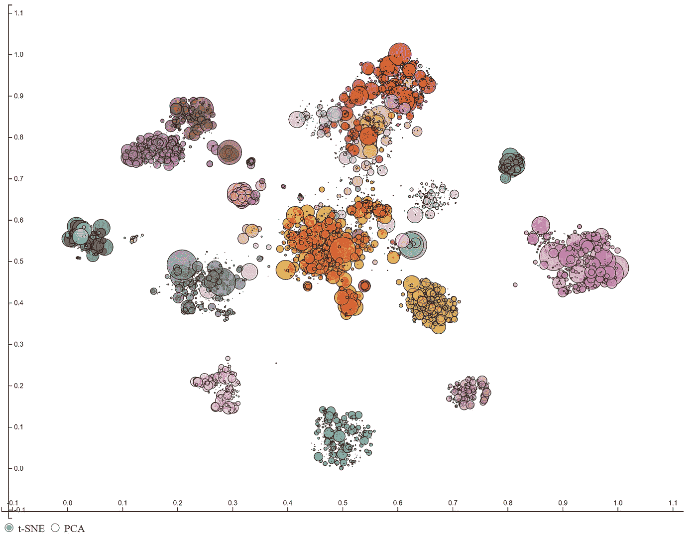
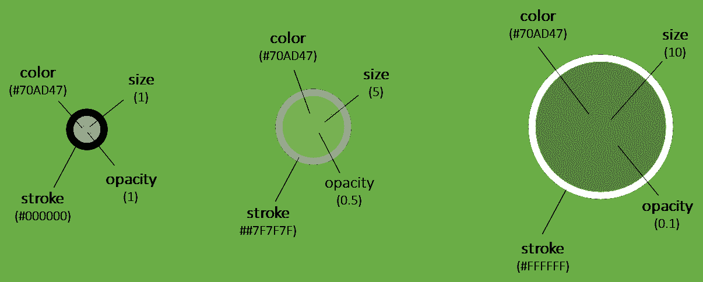
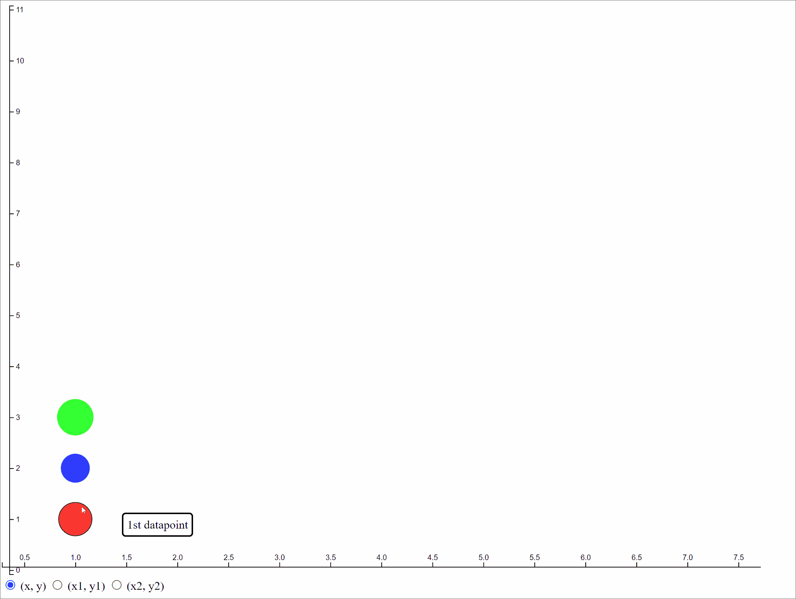
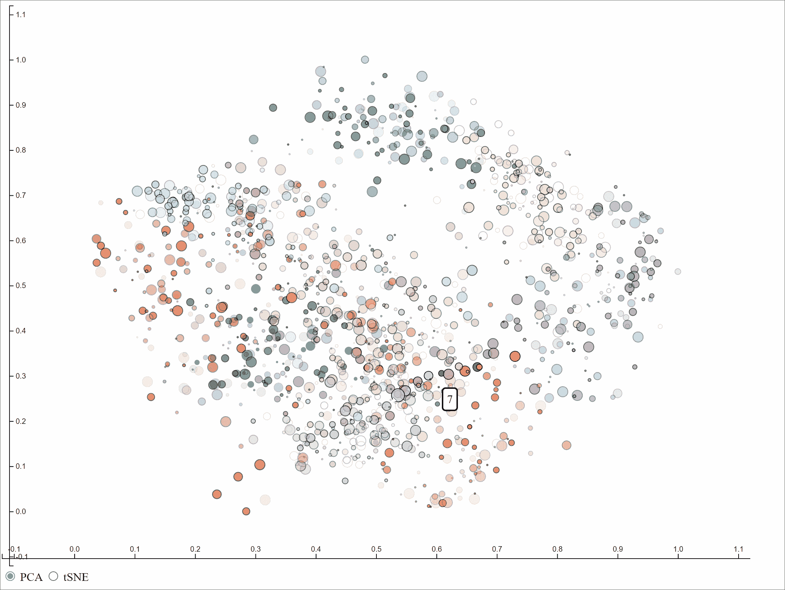

# 使用 D3js 和 Python 使散点图具有交互性，从而充分利用散点图。

> 原文：<https://towardsdatascience.com/get-the-most-out-of-your-scatterplot-by-making-it-interactive-using-d3js-19939e3b046>

## 散点图对于可视化两组数值变量之间的关系非常有用。当它与缩放和刷功能交互时，它甚至更有洞察力。



使用 D3Blocks 的*散点图*示例(图片由作者提供)。

散点图可能是最著名的可视化数字变量的图表。这样的基本图表有时非常有用，尤其是当它们与刷和缩放功能交互时。 ***在这篇博文中，我将演示如何创建交互式散点图，使用不同的颜色、大小、工具提示以及在两组或三组坐标之间滑动数据点。****散点图*是 [*D3Blocks 库*](/d3blocks-the-python-library-to-create-interactive-and-standalone-d3js-charts-3dda98ce97d4) 的一部分，可以使用 Python 创建。后端用 D3js 开发，输出封装成一个 HTML。这使您可以轻松地将图表嵌入到一个更大的框架中，或者您可以直接共享/发布它，只需要一个互联网浏览器。

*如果你觉得这篇文章很有帮助，可以使用我的* [*推荐链接*](https://medium.com/@erdogant/membership) *继续无限制学习，并注册成为中级会员。另外，* [*关注我*](http://erdogant.medium.com) *关注我的最新内容！*

# 散点图是 D3Blocks 的一部分。

[*D3Blocks*](/d3blocks-the-python-library-to-create-interactive-and-standalone-d3js-charts-3dda98ce97d4) 是一个包含各种图表的库，其可视化后端构建在(d3) javascript 上，但可使用 Python 进行配置。通过这种方式， *D3Blocks 库*将 d3-javascript 的优势(如速度、可伸缩性、灵活性和无限创造力)与 Python 结合在一起，以便快速轻松地访问广泛的社区，如数据科学领域。在 *D3Blocks* 中的每个图表的输出，比如散点图，被封装到一个 HTML 文件中。这使得在网站上分享或发布或将其嵌入仪表板变得非常容易。此外，除了浏览器之外，它不需要任何其他技术来发布或共享图表。更多关于[*D3 blocks*](/d3blocks-the-python-library-to-create-interactive-and-standalone-d3js-charts-3dda98ce97d4)*的信息可以在本博客 [1](/d3blocks-the-python-library-to-create-interactive-and-standalone-d3js-charts-3dda98ce97d4) 中找到。*

# *创建散点图的原因。*

**散点图*是可视化数字变量和观察这种关系的本质的理想选择。例如，散点图可以帮助*显示两个变量之间的线性关系*的强度(例如相关性),但也可以用作*质量控制，用于勘探目的*,或获得*对底层分布的更好理解*。*

# *数据点的标签属性和移动。*

*尽管*散点图*可能很有见地，但由于数据点的重叠，防止过度绘制并不总是直截了当的。这使得正确识别变量之间的关系具有挑战性。为了克服一些挑战， *D3Blocks* 的*散点图*包含各种 ***标签属性*** ，具有 ***刷*** 和**缩放**功能。标签属性有*****颜色*******工具提示信息******不透明度*** *，以及* ***描边颜色*** (图 1) ***。*** *另外，* a ***渐变*** 可以应用在数据点高度重叠的情况下。****

****

**图一。可以为每个点设置多个属性，例如颜色、笔画颜色、不透明度、大小和工具提示(图片由作者提供)**

**另一个挑战是两组或三组变量之间的比较。这通常会导致创建多个散点图，然后将它们并排可视化。虽然可以用这种方式观察全球结构，但描述局部差异并不容易。为了克服这个挑战， *D3Blocks* 中的*散点图*可以让数据点在不同坐标之间移动。此[博客](/the-similarity-between-t-sne-umap-pca-and-other-mappings-c6453b80f303)中显示了一个用例，但为了演示，我将创建一个小示例:**

**首先，安装 [*D3Blocks 库*](/d3blocks-the-python-library-to-create-interactive-and-standalone-d3js-charts-3dda98ce97d4) *:***

```
**pip install d3blocks**
```

**在下面的*代码部分*，我们将创建 3 个数据点，并让它们在三组坐标之间移动。此外，我们将为数据点添加一些标签属性，如*颜色、大小和不透明度。*第一个数据点的坐标为: *(x，y) = (1，1)，(x1，y1) = (1，10)，(x2，y2) = (5，5)。*其他坐标见下面的代码部分。**

```
**from d3blocks import D3Blocks

# Initialize
d3 = D3Blocks()

# Import example
x=[1, 1, 1]
y=[1, 2, 3]
x1=[1,  1, 1]
y1=[10, 9, 5]
x2=[5, 6, 7]
y2=[5, 5, 5]**
```

**为三个数据点中的每一个指定标签属性:**

```
**size    = [15, 20, 25]
color   = ['#FF0000', '#0000FF', '#00FF00']
stroke  = ['#FFFFFF', '#FFFFFF', '#FFFFFF']
opacity = [0.7, 0.8, 0.8]
tooltip = ['1st datapoint', '2nd datapoint', '3th datapoint']**
```

**现在只需向散布函数提供输入参数:**

```
**# Set all propreties
d3.scatter(x,               # x-coordinates
           y,               # y-coordinates
           x1=x1,           # x1-coordinates
           y1=y1,           # y1-coordinates
           x2=x2,           # x2-coordinates
           y2=y2,           # y2-coordinates
           size=size,       # Size
           color=color,     # Hex-colors
           stroke=stroke,   # Edge color
           opacity=opacity, # Opacity
           tooltip=tooltip, # Tooltip
           scale=False,     # Scale the datapoints
           label_radio=['(x, y)', '(x1, y1)', '(x2, y2)'],
           figsize=[1024, 768],
           filepath='scatter_demo.html',
           )**
```

**最终的*散点图*如*图 2* 所示:**

****

**图二。散点图中的运动演示。通过单击单选按钮(左下角)，数据点开始向预定义的坐标集移动(图片由作者提供)。**

# **构建您自己的交互式散点图。**

**让我们加载[*【MNIST】*数据集【4】](https://keras.io/api/datasets/mnist/)，这是一个众所周知的手写数字数据集，免费使用，非常适合检查和展示*散布*功能。使用 [*clustimage 库*](/a-step-by-step-guide-for-clustering-images-4b45f9906128) *很容易执行原始数据集向低维空间的映射。*这里，我们将加载预先计算的主成分和 t-SNE 坐标，它们代表了数位到数位的相似性(参见下面的*代码部分)。*使用散点图，我们现在可以通过让数据点在两个映射之间移动，轻松地可视化和比较两个映射之间的关系。*比例*选项设置为*真*以确保两组坐标在同一范围内。此外，标签属性如*工具提示、大小、不透明度和(笔画)颜色也被设置*。*颜色*的输入可用十六进制颜色手动指定，但也可以是字符串标签。在这个例子中，我使用了*数字标签*，它通过使用输入色图 *(cmap)* 自动转换成十六进制颜色。*缩放和刷图*功能始终可用，如图*图 3* 所示。这里的显示了一些交互示例[。](https://d3blocks.github.io/d3blocks/pages/html/Scatter.html)**

```
**# Load libraries
from d3blocks import D3Blocks
import numpy as np

# Initialize
d3 = D3Blocks()

# Load PC and tSNE coordinates
df = d3.import_example('mnist')

# Set random sizes, and opacity
size=np.random.randint(0, 8, df.shape[0])
opacity=np.random.randint(0, 8, df.shape[0])/10
# Tooltip are the digit labels
tooltip = df['y'].values.astype(str)

# Set all propreties
d3.scatter(df['PC1'].values,                   # PC1 x-coordinates
           df['PC2'].values,                   # PC2 y-coordinates
           x1=df['tsne_1'].values,             # tSNE x-coordinates
           y1=df['tsne_2'].values,             # tSNE y-coordinates
           color=df['y'].values.astype(str),   # Hex-colors or classlabels
           tooltip=tooltip,                    # Tooltip
           size=size,                          # Node size
           opacity=opacity,                    # Opacity
           stroke='#000000',                   # Edge color
           cmap='tab20',                       # Colormap
           scale=True,                         # Scale the datapoints
           label_radio=['PCA', 'tSNE'],
           figsize=[1024, 768], 
           filepath='scatter_demo.html',
           )**
```

****

**图 3。散点图。缩放是通过选择一个区域。双击将返回主屏幕。(图片由作者提供)**

**如果您想对任何标签属性进行更改，您可以更改数据框中的值，如*代码段 2* 所示。编辑完成后，*散点图*可以通过 *show()* 功能再次可视化。**

```
**# Make dits in the dataframe
d3.edge_properties

#      label         x         y        x1  ..  size   stroke  opacity tooltip
# 0        0  0.472107  0.871347  0.294228  ..     0  #000000      0.1       0
# 1        1  0.624696  0.116735  0.497958  ..     0  #000000      0.5       1
# 2        2  0.608419  0.305549  0.428529  ..     4  #000000      0.6       2
# 3        3  0.226929  0.532931  0.555316  ..     4  #000000      0.0       3
# 4        4  0.866292  0.553489  0.589746  ..     1  #000000      0.6       4
#    ...       ...       ...       ...  ... ..      ...      ...     ...
# 1792     9  0.262069  0.709428  0.693593  ..     5  #000000      0.5       9
# 1793     0  0.595571  0.837987  0.352114  ..     6  #000000      0.5       0
# 1794     8  0.668742  0.359209  0.520301  ..     6  #000000      0.4       8
# 1795     9  0.416983  0.694063  0.683949  ..     6  #000000      0.4       9
# 1796     8  0.489814  0.588109  0.529971  ..     1  #000000      0.4       8

# [1797 rows x 12 columns]

# Show the updated chart
d3.show(filepath='scatter_demo.html', label_radio=['PCA', 'tSNE'])**
```

# **最后的话**

**我演示了如何使用 Python 创建自己的交互式独立散点图。*散点图*对于可视化数字变量非常有用，当它是交互式的时，变得更加有洞察力。*散点图*是[*D3 图块*](/d3blocks-the-python-library-to-create-interactive-and-standalone-d3js-charts-3dda98ce97d4) 中的一个图块，D3js 的使用显示了它的力量和优势，例如速度和灵活性。喜欢这个的话，还有更多好用的互动 D3js 块，比如[*D3 graph*](/creating-beautiful-stand-alone-interactive-d3-charts-with-python-804117cb95a7)*[*Sankey chart*](/hands-on-guide-to-create-beautiful-sankey-charts-in-d3js-with-python-8ddab43edb43)*【5】*[*moving bubbles*](/how-to-create-storytelling-moving-bubbles-charts-in-d3js-with-python-b31cec7b8226)*【6】*等等。你可以随意使用这个库！***

***注意安全。保持冷静。***

*****欢呼，E.*****

***如果你觉得这篇文章很有帮助，可以使用我的* [*推荐链接*](https://medium.com/@erdogant/membership) *继续无限制学习，并注册成为中级会员。另外，* [*关注我*](http://erdogant.medium.com) *关注我的最新内容！***

# **软件**

*   **[D3Blocks Github](https://d3blocks.github.io/d3blocks/)**

# **我们连线吧！**

*   **[我们在 LinkedIn 上连线](https://www.linkedin.com/in/erdogant/)**
*   **[在 Github 上关注我](https://github.com/erdogant)**
*   **在媒体上跟随我**

# **参考**

1.  **[*D3Blocks:创建交互式和独立 D3js 图表的 Python 库。*](/d3blocks-the-python-library-to-create-interactive-and-standalone-d3js-charts-3dda98ce97d4) 中等，2022 年 9 月**
2.  **[*t-SNE、UMAP、PCA 等映射之间的定量比较。*](https://erdogant.medium.com/the-similarity-between-t-sne-umap-pca-and-other-mappings-c6453b80f303) 中等，2022 年 5 月**
3.  **[*用 Python 创作精美单机互动 D3 图表，*](/creating-beautiful-stand-alone-interactive-d3-charts-with-python-804117cb95a7) 2022**
4.  ***E，* [*用 Python 在 d3js 中创建漂亮的 Sankey 图表的动手指南。中*](/hands-on-guide-to-create-beautiful-sankey-charts-in-d3js-with-python-8ddab43edb43) ，2022 年 10 月**
5.  **[*如何用 Python 在 d3js 中创建讲故事的移动气泡图*](/how-to-create-storytelling-moving-bubbles-charts-in-d3js-with-python-b31cec7b8226) ，2022 年 9 月**
6.  **https://keras.io/api/datasets/mnist/ MNIST 数据集(CC BY-SA 3.0)**