# 使用 Azure 机器学习控制数据和模型漂移

> 原文：<https://towardsdatascience.com/getting-a-grip-on-data-and-model-drift-with-azure-machine-learning-ebd240176b8b>

## 以自动化的方式检测、分析和减轻数据和模型漂移

*由* [*娜塔莎*](https://www.linkedin.com/in/natasha-savic/) *和* [*亚斯科普*](https://www.linkedin.com/in/andreas-kopp-1947183/)

变化是生活中唯一不变的。在机器学习中，如果不小心管理，它会表现为数据漂移、模型预测和性能下降。

照片由 [serjan midili](https://unsplash.com/es/@s_midili?utm_source=unsplash&utm_medium=referral&utm_content=creditCopyText) 在 [Unsplash](https://unsplash.com/s/photos/drift?utm_source=unsplash&utm_medium=referral&utm_content=creditCopyText) 上拍摄

在本文中，我们将讨论数据和模型漂移，以及它如何影响生产模型的性能。您将学习识别和减轻漂移的方法，以及使用 Azure 机器学习从静态模型过渡到常青人工智能服务的最佳实践。

如果您想在实际例子中尝试这些概念，我们还提供了一个样本笔记本[。](https://github.com/Azure/data-model-drift/blob/main/tabular-data/DATA_MODEL_DRIFT_INTERACTIVE.ipynb)

# 了解数据和模型漂移

许多机器学习项目在广泛的数据和特征工程、建模、训练和评估阶段之后，以部署到生产的令人满意的模型结束。然而，一个模型运行的时间越长，就有越多的问题可能在很长一段时间内未被发现。

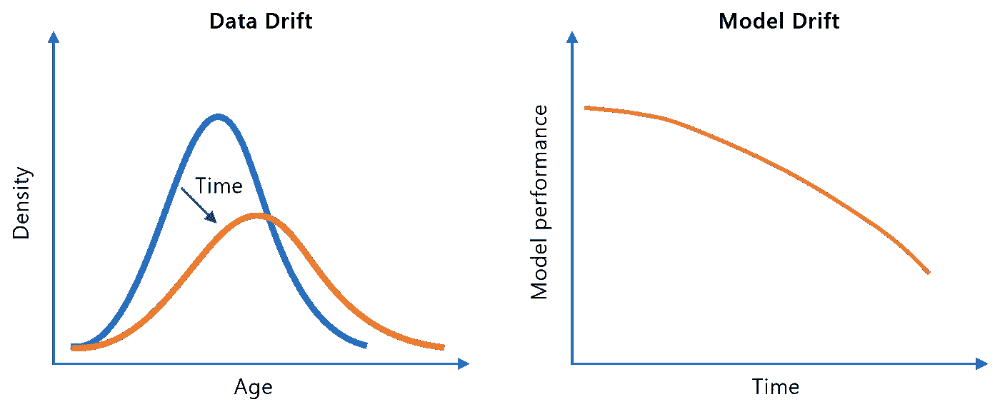

模型漂移导致的数据漂移和性能下降

**数据漂移**是指输入数据的分布随时间变化。漂移会导致模型最初从训练数据中学习到的内容与生产过程中的推理观察结果之间存在差距。让我们看几个数据漂移的例子:

*   *现实世界的变化*:一个原本很小的人口群体越来越多地出现在劳动力市场上(例如战争难民)；新的监管框架开始影响用户的同意(如 GDPR)
*   *数据采集问题*:物联网传感器损坏导致测量错误；出于隐私原因，web 表单的初始强制输入字段变成了可选字段
*   *数据工程问题*:意外的编码或缩放变化或变量交换

**模型漂移**伴随着模型性能随时间的下降(例如，监督分类用例中的精度下降)。模型漂移有两个主要来源:

*   *现实世界的变化*也被称为**概念漂移**:特征和目标变量之间的关系在现实世界中发生了变化。例子:在疫情期间旅游活动的崩溃；通货膨胀的上升影响购买行为。
*   *数据漂移*:上述输入数据的漂移也可能影响模型质量。然而，并不是每次出现数据漂移都一定是问题。当漂移发生在不太重要的特征上时，模型可能会做出稳健的响应，并且性能不受影响。让我们假设人口群组(年龄、性别和收入的特定组合)在推理过程中比在训练过程中更经常出现。如果模型仍能正确预测这一群体的结果，这不会引起头痛。如果漂移导致模型进入特征空间的更少填充和/或更易出错的区域，则问题更大。

模型漂移通常保持不被发现，直到新的地面真相标签可用。原始测试数据不再是可靠的基准，因为真实世界的函数已经发生了变化。

下图总结了各种漂移:

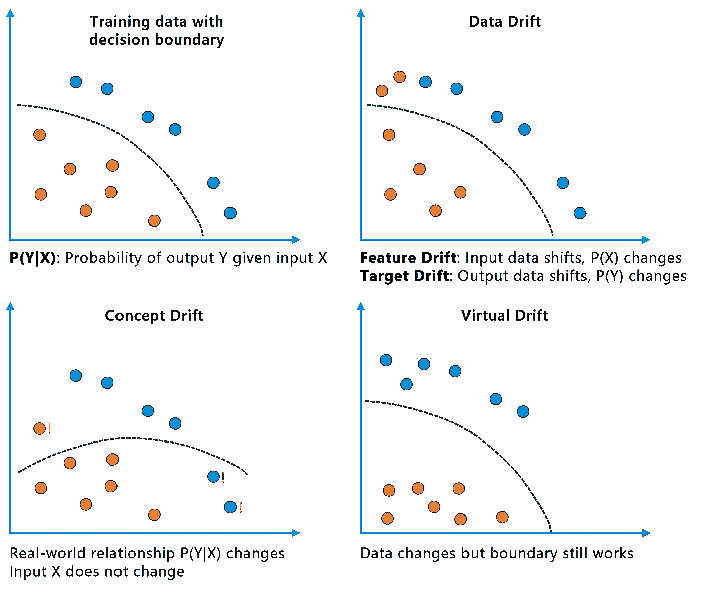

漂移的类型。摘自[机器学习中的数据和概念漂移|走向数据科学](/dont-let-your-model-s-quality-drift-away-53d2f7899c09)

从正常行为到随波逐流的转变可能大不相同。现实世界中的人口统计变化通常会导致数据或模型的逐渐漂移。然而，传感器损坏可能会导致突然偏离正常范围。购买行为的季节性波动(如圣诞节)表现为周期性漂移。

如果我们的观察有时间戳(或者数据点至少是按时间顺序排列的)，则可以采取以下措施来检测、分析和减轻漂移。

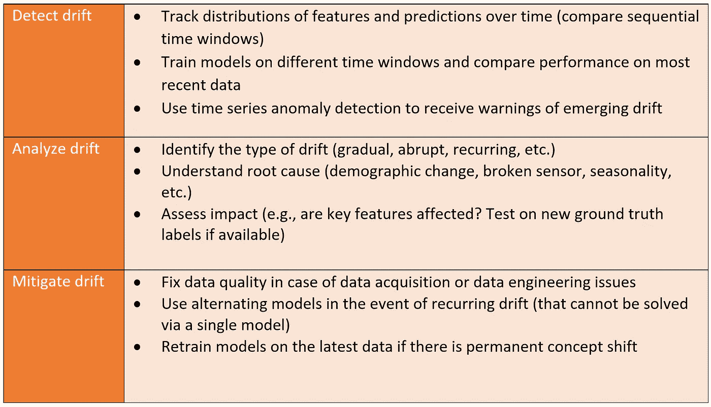

我们将在下面更详细地描述这些方法，并通过预测性维护案例研究对它们进行试验。

# 从静态到常青模式

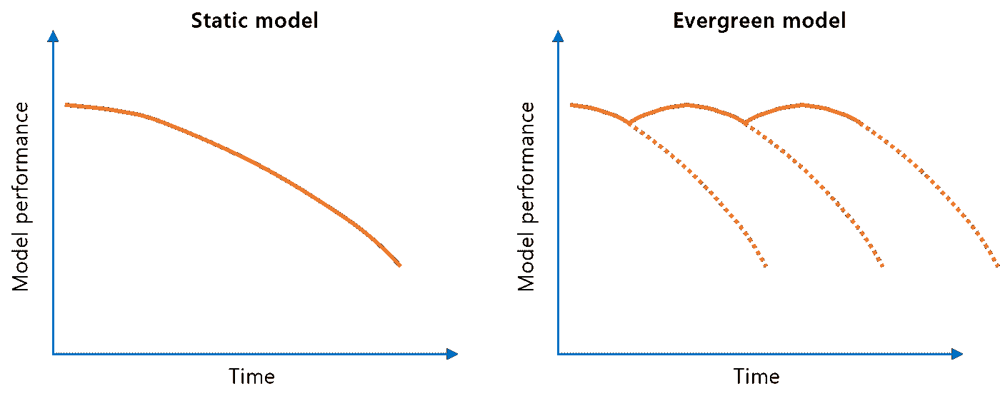

从静态到常青模式

分析和减轻数据和模型漂移的选项取决于机器学习模型生命周期中当前数据的可用性。

让我们假设一家银行收集历史数据来训练一个模型，以支持信贷决策。目标是预测贷款申请应该被批准还是拒绝。标记的训练数据是在 2020 年 1 月至 12 月期间收集的。

该银行的数据科学家在 2021 年第一季度对该模型进行了培训和评估，并决定在 2021 年 4 月将其投入生产。让我们看一下团队可以用来收集生产数据的三个选项:

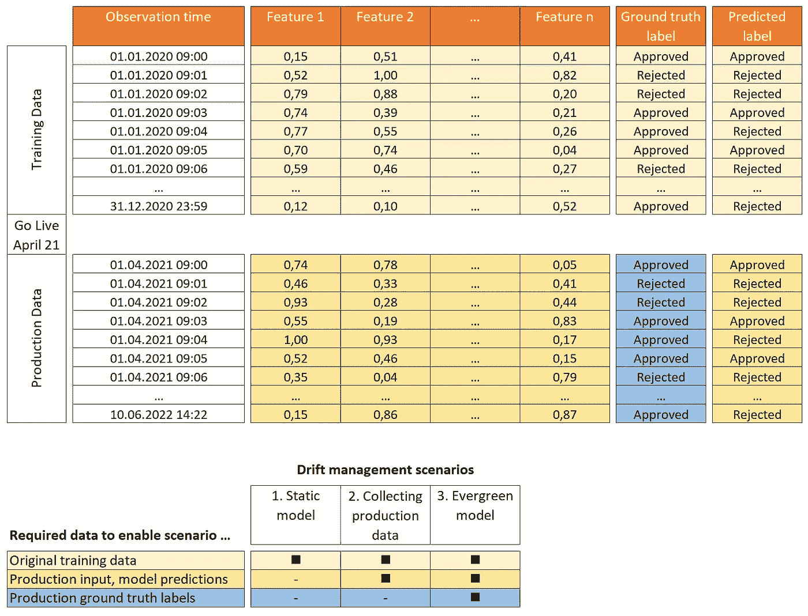

良好的漂移管理取决于数据的可用性

**场景 1:静态模型**

在这里，团队不收集任何生产数据。也许他们根本没有考虑到这一点，因为他们的项目范围仅仅包括交付初始模型。另一个原因可能是公开数据隐私问题(存储受监管的个人数据)。

显然，除了分析历史训练数据之外，对于检测数据或模型漂移没有太多可做的。只有当模型用户开始抱怨模型预测越来越不适合商业决策时，漂移才可能被发现。然而，由于没有系统地收集反馈，逐渐漂移可能会在很长一段时间内不被发现。

有趣的是，今天许多高效的机器学习模型都是以这种模式运行的。然而，像 MLOps 这样的机器学习生命周期管理程序在实践中正在获得更多的牵引力来解决这样的问题。

如果模型是根据代表性数据训练的，并且特征/目标关系是随时间稳定的(例如，以进化速度变化的生物现象)，则静态模型方法可能是可接受的。

**场景 2:收集生产数据**

团队决定从生产阶段收集观察到的输入数据(特征)以及相应的模型预测。

如果没有数据保护问题或其他组织障碍，这种方法很容易实施。通过将最近的生产数据与原始训练观察值进行比较，可以发现特征和预测标签的漂移。关键特征的显著变化(就特征重要性而言)可用作进一步调查的触发因素。

然而，如果模型有问题，关键的信息丢失了:我们没有新的地面真实标签来评估产量预测。这可能会导致以下情况:

*   虚拟漂移(假阳性):我们观察到数据漂移，但是模型仍然按照预期工作。这可以让团队获取新的标记数据用于再训练，尽管这是不必要的(从模型漂移的角度来看)。
*   概念漂移(假阴性):虽然输入数据没有漂移，但真实世界的函数已经偏离了模型所学的内容。因此，日益过时的模型会导致不准确的业务决策。

**场景三:常青树模式**

在这种情况下，银行不仅分析生产输入和潜在漂移预测，还收集标记数据。根据业务环境，这可以通过以下方式之一实现:

*   业务单位贡献新标记的数据点(如初始培训所做的那样)
*   人在回路中的反馈:来自生产阶段的模型预测被系统地回顾。特别是由领域专家发现的错误批准和错误拒绝，并且收集具有正确标签的相应特征用于再训练。

纳入人在回路中的反馈需要调整流程和系统(例如，业务用户可以在他们的应用程序中覆盖或标记不正确的预测)。

主要优点是概念漂移可以以高可靠性被识别，并且模型可以通过再训练被定期刷新。

整合业务反馈和定期再培训是成熟的 MLOps 实践的重要组成部分(参见下面 Azure 机器学习的参考架构示例)。

# 实践中的数据和模型漂移管理

必须有一个检测机制来系统地测量漂移。理想地，这样的机制是集成的 MLOps 工作流的一部分，该工作流在连续的基础上比较训练和推理分布。我们已经编译了几个支持数据和模型漂移管理的机制。

我们在[样本笔记本](https://github.com/Azure/data-model-drift/blob/main/tabular-data/DATA_MODEL_DRIFT.ipynb)中使用基于合成数据集的预测性维护用例。目标是根据速度或热量偏差、操作员、装配线、自上次服务以来的天数等特征预测设备故障。

为了识别漂移，我们结合了统计技术和分布重叠(数据漂移)以及预测技术(模型/概念漂移)。对于这两种漂移类型，我们将简要介绍所用的方法。

漂移检测始于将按时间顺序排序的观察数据集划分为参考和当前窗口。参考(或基线)窗口表示较旧的观察，并且通常与初始训练数据相同。当前窗口通常反映生产阶段看到的更近的数据点。这不是严格的 1:1 映射，因为可能需要调整窗口以更好地定位何时发生漂移。

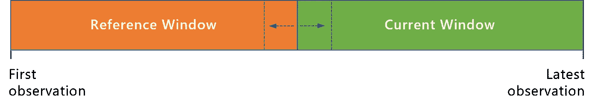

将时序数据集划分为参考和当前窗口

我们首先需要区分数字数据和分类/离散数据。对于统计检验，这两种类型的数据将经历不同的[非参数检验](https://en.wikipedia.org/wiki/Nonparametric_statistics)，以提供 p 值。我们处理不同的样本大小，并且不对我们数据的实际分布做出假设。因此，非参数方法是检验两个样本相似性的一种简便方法，不需要知道实际的概率分布。

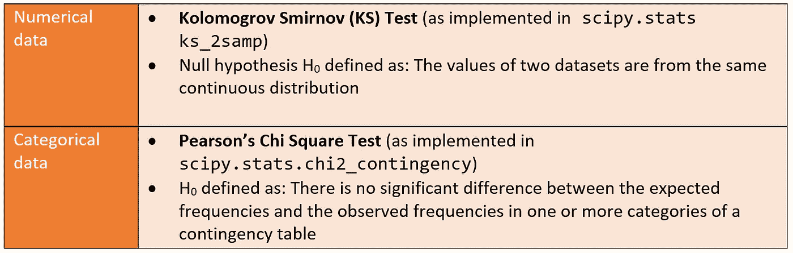

这些检验允许我们以一定的置信度接受或拒绝零假设，如 p 值所定义的。因此，您可以通过调整 p 值的阈值来控制测试的灵敏度。默认情况下，我们建议使用更保守的 p 值，如 0.01。样本越大，就越容易拾取噪声。其他常用的计算分布之间漂移的方法是连续分布的 Wasserstein 距离和概率分布的 JS 散度。

以下是限制漂移检测中误报警数量的一些最佳实践:

1.  如果数据集中有许多变量，则将漂移分析的范围限定为关键要素的候选列表
2.  如果数据集很大，请使用子样本而不是所有数据点
3.  进一步降低 p 值阈值，或者为更大的数据量选择替代测试

虽然统计测试有助于识别漂移，但是很难解释漂移的大小以及漂移发生的方向。给定一个像年龄这样的变量，样本是变老了还是变年轻了，年龄是如何分布的？要回答这些问题，可视化分布是很有用的。为此，我们增加了另一种非参数方法:[**【KDE】**](https://mathisonian.github.io/kde/)。由于我们有两种不同的数据类型，我们将对分类数据执行预处理步骤，通过对变量进行编码将其转换为伪数字符号。相同的序号编码器对象用于参考和当前分布，以确保一致性:

现在我们已经对数据进行了编码，我们可以直观地检查整个数据集或感兴趣的选定变量。我们使用参考样本和当前样本的核密度估计函数来计算它们的百分比交集。以下步骤改编自[该样本](https://stackoverflow.com/questions/68927580/finding-areas-of-non-overlapping-edges-of-two-distributions):

1.  用带宽方法“scott”将数据传递给 KDE 函数，如[scipy . stats . Gaussian _ kde()](https://docs.scipy.org/doc/scipy/reference/generated/scipy.stats.gaussian_kde.html)所示。该参数决定了分布的平滑程度。
2.  取范围(两个分布的最小值和最大值),并通过使用两个函数的微分计算两个 KDE 函数在此范围内的交点。
3.  对具有常数值的变量执行预处理，以避免错误并调整两种分布的比例。
4.  根据 [numpy.trapz()](https://numpy.org/doc/stable/reference/generated/numpy.trapz.html) 用[合成梯形法则](https://en.wikipedia.org/wiki/Trapezoidal_rule)近似求交点下的面积。
5.  绘制参考和当前分布、交叉点以及交叉面积和重叠百分比。
6.  将相应的统计检验(KS 或卡方检验)添加到标题中，并提供漂移指示(漂移与无漂移)

通过查看代码示例，可以更深入地理解这些步骤。KDE 交集的结果如下所示:

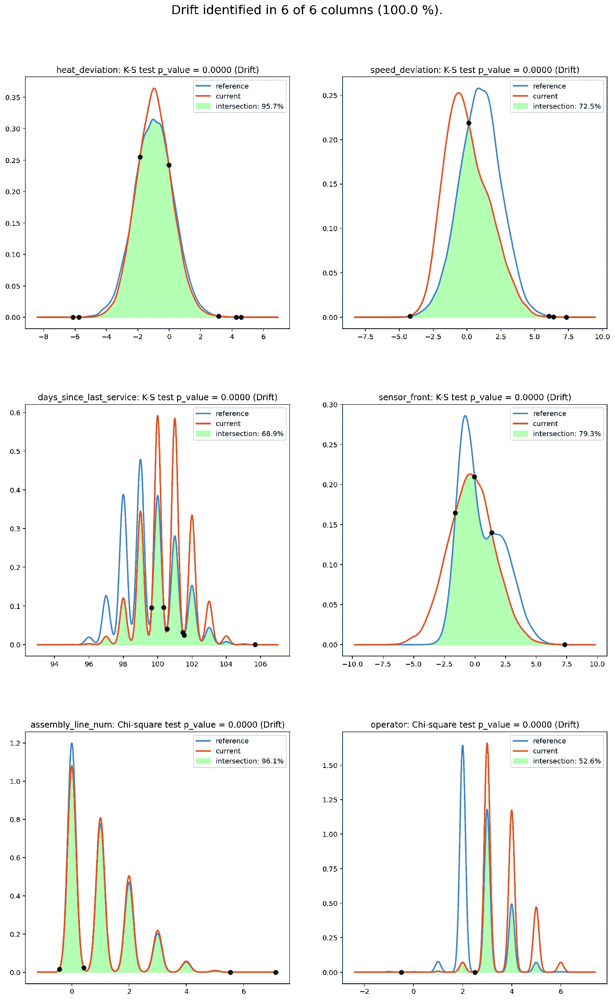

比较 KDE 交点以识别数据漂移

对这些地块的简要考察告诉我们:

1.  哪些变量在参考样本和当前样本之间具有显著不同的分布？
2.  漂移的幅度和方向是什么？

如果我们看一下“操作员”这个变量，我们可以看到，在安装模型时与今天相比，哪个员工在操作机器方面发生了很大的变化。例如，可能发生的情况是，一名操作员已经退休，因此不再操作任何机器(操作员 2)。相反，我们看到之前不存在的新操作者已经加入(例如，操作者 6)。

既然我们已经看到了如何发现特征和标签的漂移，那么让我们看看模型是否受到数据或概念漂移的影响。

与之前类似，我们将历史(训练)观察值和最近*标记的*数据点一起堆叠在一个时序数据集中。然后，我们根据最近的观察比较模型的性能，如下图所示。

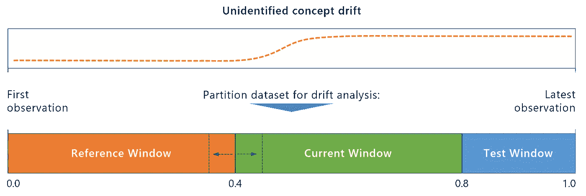

预测模型漂移检测

核心问题是，我们想回答这样一个问题:一个新的模型在预测最新数据时，是否比一个根据旧的观察数据训练的模型表现得更好？

我们很可能事先不知道漂移是否以及在哪里发生了。

因此，在我们的第一次尝试中，我们可以使用原始训练数据作为参考，使用推断观察作为当前窗口。如果我们由此发现漂移的存在，我们很可能会尝试不同的参考和当前窗口，以精确定位漂移的确切位置。

预测模型漂移检测有两个选项:

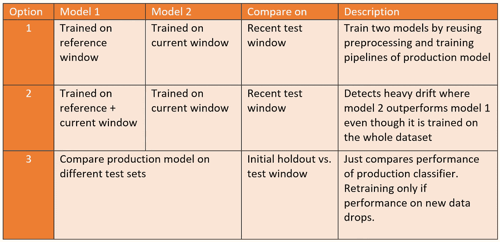

每个选项都有特定的优势。作为第一种选择的结果，如果模型 2 优于模型 1，您已经有一个训练有素的候选人准备部署。第二种选择可能会减少误报，代价是对漂移不太敏感。在没有确定漂移的情况下，备选方案 3 减少了不必要的训练周期。

让我们看看如何使用选项 1 在我们的预测性维护用例中查找漂移。聚合数据集由 45，000 个带时间戳的观察值组成，我们将其分为 20，000 个引用、20，000 个当前观察值和 5，000 个最近观察值，用于测试。

我们定义了一个 scikit-learn 管道来预处理数字和分类特征，并训练两个 LightGBM 分类器进行比较:

对当前分类器重复最后一步后，我们比较性能指标，以确定模型之间是否存在明显差距:

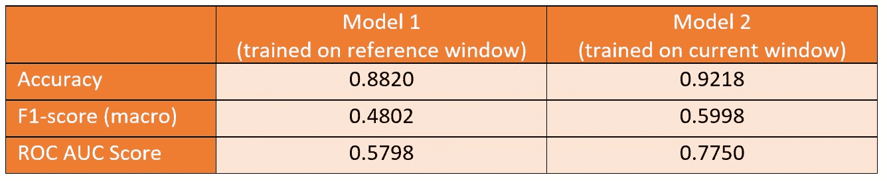

目前的模式比参考模式好得多。因此，我们可以得出结论，我们确实已经确定了模型漂移，当前模型是替代生产模型的有希望的候选模型。一种直观的检查方式是比较两个分类器的置信度得分的分布:

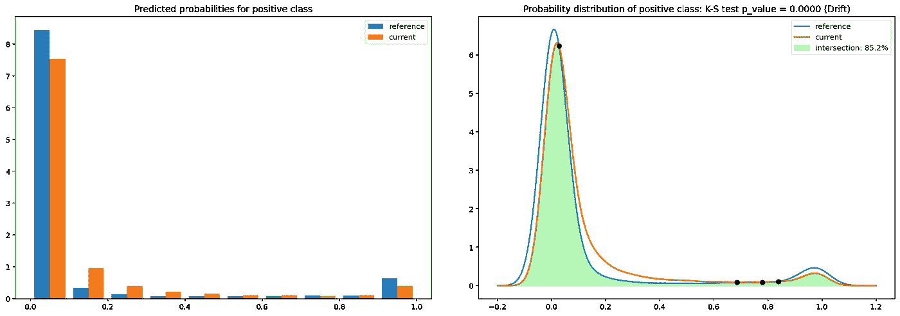

模型漂移对预测类别概率的影响(左)与 KDE 交集(右)

左边的直方图显示了参考模型和当前模型的预测类别概率之间的明显差异，因此也证实了模型漂移的存在。

最后，我们再次使用数据漂移部分的 KDE 图和统计测试来测量漂移的程度。两个分类器的 KDE 图之间的交点仅占 85%。此外，KS 检验的结果表明分布并不相同。

在本例中，结果在意料之中，因为我们有意将漂移纳入我们的综合预测维护数据集中。对于真实世界的数据集，结果不会总是那么明显。此外，可能有必要尝试不同的参考和当前窗口分割，以可靠地找到模型漂移。

# 常青树模型的 MLOps 参考架构

我们现在将重点关注在具有 Azure 机器学习的 MLOps 架构中嵌入漂移检测和缓解。以下部分利用了 Azure ML 数据集、模型和管道等概念。[演示库](https://github.com/Azure/data-model-drift)提供了一个用于生成数据漂移检测图的 Azure ML 管道的例子。为了自动化模型的重新训练，我们建议使用最新的 Azure MLOPs 代码示例和文档。下图提供了一个示例体系结构，包括我们到目前为止了解到的关于数据和模型漂移的所有内容。

常青树模型的 MLOps 架构

通过将漂移缓解视为自动化 [Azure MLOps](https://docs.microsoft.com/en-us/azure/machine-learning/concept-model-management-and-deployment) 工作流的一部分，我们可以用可管理的努力维护 evergreen ML 服务。为此，我们执行以下步骤:

1.  **在 Azure 机器学习** 中摄取和版本化数据这一步对于维护训练数据、机器学习实验和结果模型之间的血统至关重要。对于自动化，我们使用 Azure 机器学习管道，它使用托管数据集。通过指定版本参数(version="latest ")，可以确保获得最新的数据。
2.  **训练模型
    在这一步中，对源数据进行模型训练。这个活动也可以是自动化 Azure 机器学习管道的一部分。我们建议添加一些参数，如数据集名称和版本，以便在多个数据集版本中重用同一个管道对象。通过这样做，在出现模型漂移的情况下，可以触发相同的流水线。一旦训练完成，模型就会在 Azure 机器学习模型注册中心注册。**
3.  **评估模型**
    模型评估是培训/再培训流程的一部分。除了查看性能指标以了解模型有多好之外，彻底的评估还包括审查解释、检查偏见和公平性问题、查看模型在哪里出错等。它通常包括人工验证。
4.  **部署模型**
    这是您部署模型的特定版本的地方。在 evergreen 模型的情况下，我们将部署适合最新数据集的模型。
5.  **监控模型**
    收集关于部署模型的遥测信息。例如， [Azure AppInsights 工作簿](https://docs.microsoft.com/en-us/azure/azure-monitor/app/api-custom-events-metrics)可用于收集对模型实例的请求数量以及服务可用性和其他用户定义的指标。
6.  **收集推理数据和标签**
    作为服务持续改进的一部分，模型做出的所有推理都应与基础事实(如果可用)一起保存到存储库中(例如 Azure Data Lake)。这是至关重要的一步，因为它允许我们计算出推论和参考数据之间的偏差量。如果地面实况标签不可用，我们可以监测数据漂移，但不能监测模型漂移。
7.  **测量数据漂移**
    基于上一步，我们可以通过使用参考数据并使用以上章节中介绍的方法将其与当前数据进行对比来开始数据漂移检测。
8.  **测量模型漂移**
    在这一步，我们确定模型是否受到数据或概念漂移的影响。这是使用上面介绍的方法之一完成的。
9.  **触发重新训练**
    在模型或概念漂移的情况下，我们可以利用我们用于初始训练的相同 Azure ML 管道来触发完整的重新训练和部署管道。这是静态模型和常青树模型之间闭环的最后一步。重新训练触发器可以是:
    **【自动】T5——比较参考模型和当前模型的性能，如果当前模型性能优于参考模型，则自动部署。
    **人在回路** —检查数据漂移可视化以及参考模型和当前模型之间的性能指标，并在回路中部署数据科学家/模型所有者。这种情况适合高度管制的行业。这可以使用 PowerApps、Azure DevOps 管道或 GitHub 操作来完成。**

# 后续步骤

在本文中，我们研究了一些实用的概念，以发现和减轻表格用例的数据和机器学习模型的漂移。我们已经使用我们的演示笔记本和预测性维护示例看到了这些概念的实际应用。我们鼓励您将这些方法应用到您自己的用例中，并感谢任何反馈。

能够系统地识别和管理生产模型的漂移是迈向成熟的 MLOps 实践的一大步。因此，我们建议将这些概念集成到端到端的生产解决方案中，如上面介绍的 MLOps 参考架构。我们的笔记本的最后一部分包括如何使用自动化 Azure 机器学习管道实现漂移检测的例子。

数据和模型漂移管理只是整体 MLOps 愿景和架构的一个组成部分。请随意查看[文档](https://docs.microsoft.com/en-us/azure/machine-learning/concept-model-management-and-deployment)，了解关于 MLOps 以及如何使用 Azure Machine Learning 实现它的一般信息。

在我们的例子中，我们已经查看了表格形式的机器学习用例。针对图像和自然语言等非结构化数据的漂移缓解方法也正在出现。医学成像 AI 存储库中的[漂移检测](https://github.com/microsoft/MedImaging-ModelDriftMonitoring)提供了一种结合元数据分析医学图像以检测模型漂移的有前途的方法。

*除非另有说明，所有图片均由作者所有*。