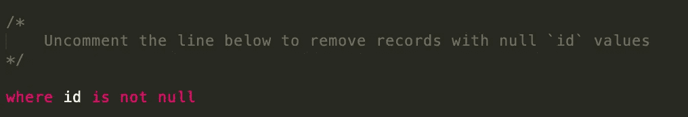
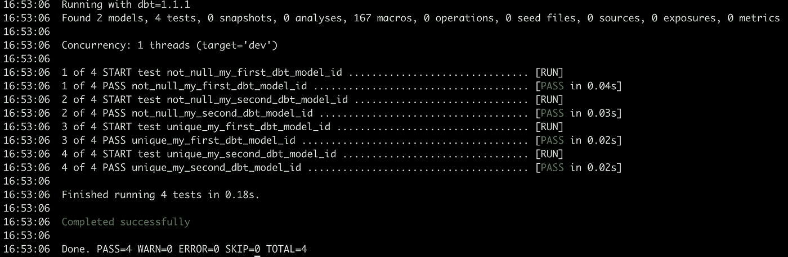

# 动手使用 DBT —数据构建工具

> 原文：<https://towardsdatascience.com/getting-hands-on-with-dbt-data-build-tool-a157d4151bbc>

## 与 DBT 一起运行您的第一个项目的分步指南


Volodymyr Hryshchenko 在 [Unsplash](https://unsplash.com/s/photos/build?utm_source=unsplash&utm_medium=referral&utm_content=creditCopyText) 上的照片

DBT 现在风靡一时！当我第一次[读到](https://medium.com/fishtown-analytics/what-exactly-is-dbt-47ba57309068)关于它的时候，我想好吧，这是一个*配置驱动的 ETL* ，还有什么新的吗？

后来我读了更多，我就像嗯..多适配器支持这很好，我们不必再编写通用库并与他人共享。

阅读越来越多，我喜欢哇！这是一个与云捆绑在一起的完整平台，测试基本上使我们的生活更加轻松。

好了，赞够了！让我们用`dbt`来运行我们的第一个项目

# 安装指南

## 步骤 1:设置 Postgres

DBT 支持[多适配器](https://docs.getdbt.com/docs/available-adapters)如红移、雪花、BigQuery、Spark、Postgres 等。因为这是我们的项目，让我们从简单的`postgres`开始，但是如果你有任何其他列出的适配器的连接器，请随意对特定的适配器进行适当的修改。

回到`postgres`，如果你已经有了`postgres`设置，你可以跳过这一步，否则你可以按照[这个](https://www.codecademy.com/article/installing-and-using-postgresql-locally)指南来设置。设置完成后，验证它是否已设置。

```
~ % postgres -V
postgres (PostgreSQL) 13.3
```

## 步骤 2:创建一个新的虚拟 env 并激活它

DBT 运行在一个 python 生态系统上，如果你没有本地的`python`设置，先这样做(python 设置指南)！(*拜托，没有 Python，真的？*)

为`dbt`创建一个新的虚拟环境

```
~ % virtualenv dbt~ % source dbt/bin/activate
(dbt) ~ %
```

## 步骤 3:设置 Postgres dbt 适配器

这将为使用`postgres`作为适配器安装必要的包+为`dbt`安装核心包。

```
pip install dbt-postgres
```

这将只安装`dbt-core`和`dbt-postgres`和*:*

```
*$ dbt --version
installed version: 1.0.0
   latest version: 1.0.0
Up to date!
Plugins:
  - postgres: 1.0.0*
```

*出于某种原因，如果你没有使用`postgres`作为适配器，例如为`dbt-<youradaptor>`安装软件包，你想为 spark 安装`dbt`适配器，你可以*

```
*pip install dbt-spark*
```

# *运行您的第一个项目*

## *步骤 1:初始化您的第一个 dbt 项目*

*好了，所有东西都装好了。选择你最喜欢的文件夹并运行`dbt init`，它会要求你输入项目名称，添加相同的项目并选择你的适配器。既然我们用的是`postgres`，我们可以选择【1】*

```
*(dbt) % dbt init
16:43:39  Running with dbt=1.1.1
Enter a name for your project (letters, digits, underscore): dbt_for_medium
Which database would you like to use?
[1] postgres
[2] sparkEnter a number: 1
16:43:46
Your new dbt project "dbt_for_medium" was created!Happy modeling!*
```

## *步骤 2:为 dbt 配置概要文件*

*很好，看看这个！DBT 维护环境的细节，如`this`项目，`this`环境与此相关。*

*这些配置文件需要在`/Users/jyotidhiman/.dbt/profiles.yml`更新，请在此配置您的适配器详情:*

```
*dbt_for_medium:
  outputs:dev:
      type: postgres
      threads: 1
      host: localhost
      port: 5432
      user: dbt
      pass: dbtpass
      dbname: postgres
      schema: postgres
    prod:
      type: postgres
      threads: 1
      host: localhost
      port: 5432
      user: dbt
      pass: dbtpass
      dbname: postgres
      schema: postgrestarget: dev*
```

## *步骤 3:验证配置文件设置是否正确*

*配置文件配置完成后，转到您的`dbt`文件夹并运行以下命令来验证设置是否已正确完成。如果出现任何适配器问题，此处会突出显示一个错误。*

```
*(dbt) dbt_for_medium % dbt debug
16:50:06  Running with dbt=1.1.1All checks passed!*
```

## *第四步:运行你的 DBT 项目！！*

*DBT init 附带了一些虚拟模型和 SQL，可用于验证和运行设置，可以使用以下命令调用它:*

```
*(dbt) dbt_for_medium % dbt run
16:51:02  Completed successfully
16:51:02
16:51:02  Done. PASS=2 WARN=0 ERROR=0 SKIP=0 TOTAL=2*
```

## *步骤 5:验证 Postgres 中是否创建了数据*

*由于我们在仓库中使用了`postgres`，虚拟模型(我们的转换)创建的数据可以在`postgres`中得到验证。要了解它是如何创建的，请查看项目中的`my_first_dbt_model.sql`。*

```
*postgres=# select * from my_first_dbt_model;
 id
 — — 
 1
(1 row)*
```

## *步骤 5:运行测试*

*DBT 提供了开箱即用的测试集成，并附带了一些可以使用命令`dbt test`调用的虚拟测试*

```
*(dbt) dbt_for_medium % dbt test
16:52:00  Running with dbt=1.1.1
16:52:00  Found 2 models, 4 tests, 0 snapshots, 0 analyses, 167 macros, 0 operations, 0 seed files, 0 sources, 0 exposures, 0 metrics
16:52:00
16:52:00  Concurrency: 1 threads (target='dev')
16:52:00  Finished running 4 tests in 0.16s.
16:52:00
16:52:00  Completed with 1 error and 0 warnings:
16:52:00
16:52:00  Failure in test not_null_my_first_dbt_model_id (models/example/schema.yml)
16:52:00    Got 1 result, configured to fail if != 0
16:52:00
16:52:00    compiled SQL at target/compiled/dbt_for_medium/models/example/schema.yml/not_null_my_first_dbt_model_id.sql
16:52:00*
```

*现在你看到一个测试失败了，这是 DBT 故意弄脏你的手。要修复测试，取消`my_first_dbt_model.sql`中该行的注释*

**

*作者图片*

*再次运行`dbt run`和`dbt test`*

**

*作者图片*

*嗯，就这样吧！！全部成功完成:)*

*您的基本 DBT 设置已经准备就绪，可以工作了！耶！！*

*现在您可以开始在它的基础上构建您的 DBT 项目了。关于 DBT 的更多细节，请查看这篇令人惊叹的[文章](https://medium.com/fishtown-analytics/what-exactly-is-dbt-47ba57309068)。*

*如果你在设置上遇到任何问题或者有任何疑问，请告诉我。*

*希望这有所帮助！
JD*