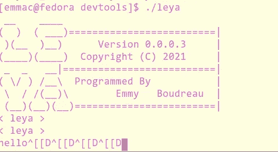

# SML 入门:一种起源于 1983 年的怪异多态语言

> 原文：<https://towardsdatascience.com/getting-introduced-to-sml-a-weird-polymorphic-language-originated-in-1983-797ff9d6622e>

## 尝试用 SML 语言编写和编译一些基本代码


(图片由 [geralt](https://pixabay.com/images/id-3914806/) 在 [Pixabay](http://pixabay.com) 上提供)

# 前言

在我作为一名计算机程序员的经历中，我爱上了计算机编程中的许多概念，这些概念现在已经成为通用编程概念。在我的生命中，有一段时间我爱上了面向对象编程，以及类的子类化，比如 C++中的子类化。在河的另一边，我也喜欢许多函数式编程语言，有些语言有独特的类型系统，比如标准的 ML，或者我今天第一次尝试的 SML 编程语言。需要说明的是，我一生中从未写过这种语言，我也不打算继续写下去——尽管，如果它激发了我的兴趣，你永远不会知道像我这样的大脑会发生什么。

无论如何，我有过许多不同编程概念的美好经历，但仍然有一个是我最喜欢的:

> 多态性。

多态只是一个书呆子气的词，意思是我们正在基于类型改变事物。在大多数例子中，这是函数调用。更简单地说，我们的方法附加在我们的类型上。我遇到的第一种利用这种编程概念的语言是 Julia 编程语言。如果你今天看一下我的博客，你可能会发现上面有很多关于朱莉娅的内容，而且很多时候我都在写朱莉娅。虽然 Julia 不仅仅有多态和多重分派，但这是 Julia 的一个重要部分，而且该语言的范例围绕着多重分派的使用。如果您想了解更多，我将在下面的文章中详细介绍 Julia 中多重分派的伟大之处:

</how-julia-perfected-multiple-dispatch-16675db772c2>  

也就是说，我爱上了朱莉娅，因为她身上所有的优点。在许多方面，朱莉娅在精神上有点像曼梯·里的继承者。ML 最初是通过多分派概念实现参数多态性的，在认识到它对计算世界的贡献后，我想拜访一下这种我最喜欢的语言的精神继承者。这正是我今天要做的，同时将结果与 Julia 进行比较，也许是我所经历过的其他种类的语言。最后一件事，我为向自己介绍这种令人敬畏的语言而写的所有代码都可以在我在 Github 上的 Random_Code 库中找到，这里有一个链接:

<https://github.com/emmettgb/Random_Code/blob/main/tryingsml/src/trying.sml>  

# 第一部分:建立 SML

```
[emmac@fedora ~]$ sudo dnf install sml
[sudo] password for emmac: 
Fedora 34 - x86_64 - Updates                     29 kB/s | 7.9 kB     00:00    
Fedora 34 - x86_64 - Updates                    444 kB/s | 444 kB     00:00    
Fedora Modular 34 - x86_64 - Updates             58 kB/s |  12 kB     00:00    
No match for argument: sml
Error: Unable to find a match: sml
```

> 好吧，看起来不会那么容易。

```
[emmac@fedora ~]$ sudo dnf search sml
Last metadata expiration check: 0:01:20 ago on Tue 18 Jan 2022 06:48:04 AM EST.
================================================ Name & Summary Matched: sml =================================================
perl-Net-LDAP-DSML.noarch : DSML Writer for Net::LDAP
```

原来这个包实际上叫做 smlnj，但是它只在一些不知名的个人包存档中可用，而且鉴于我使用 Fedora——这对我来说是不可行的。相反，我找到了[这些指令](https://www.smlnj.org/dist/working/110.98.1/install.html)，它们详细描述了如何使用 Bash 脚本运行某种安装程序

> 手指交叉。

好了，原来 Bash 脚本是对一堆 make 文件的调用，所以显然在 Fedora 上安装 SML 的唯一方法是从源代码构建并安装它。我能够做到这一切，现在我面临的唯一问题是，现在它已经安装了，我的路径中没有它，也不知道这个安装中的任何文件到哪里去了。真的，没有任何关于这方面的文档，除了我刚刚提到的那些细节，http://smlnj.org[网站在资源方面完全没有用。](http://smlnj.org)

好了，过了一会儿，我回到了我的~/下载目录，在我的下载文件夹里看到了像“bin”这样的目录和类似的东西，我感到非常困惑。我通常不会注意到这一点，但是我按照 last modified 进行了排序，并且正在寻找上面我最初使用 wget 下载的 tarball。请记住，由于这些文件是在之后修改的，它们一定是在之后被放在那里的。足够充分的是，这并不构成一个“安装”，至少不是在 Unix 类系统上，这是我们在 Unix 中使用语言的更典型的方式。考虑到这一点，我将这些目录移到了~/。sml，然后我像这样导出我的 SML bin 的路径:

```
nano ~/.bashrcexport PATH="$PATH:~/.sml/bin"
```

获取新信息。bashrc 文件，

```
source ~/.bashrc
```

现在我们可以从我们的终端调用 sml:

```
[emmac@fedora config]$ sml
Standard ML of New Jersey (64-bit) v110.98.1 [built: Tue Jan 18 06:53:10 2022]
-
```

> 耶！

此外，对于那些对该软件的许可感到好奇的人:

```
================================================================================
The new code is covered under the following license:
====================
STANDARD ML OF NEW JERSEY COPYRIGHT NOTICE, LICENSE AND DISCLAIMER.Copyright (c) 2016 by The Fellowship of SML/NJPermission is hereby granted, free of charge, to any person
obtaining a copy of this software and associated documentation
files (the "Software"), to deal in the Software without restriction,
including without limitation the rights to use, copy, modify, merge,
publish, distribute, sublicense, and/or sell copies of the Software,
and to permit persons to whom the Software is furnished to do so,
subject to the following conditions:
```

# 第二部分:尝试 SML

虽然 SML 语言的安装可能不完全正常，但代码看起来相对容易理解。在实际编写和尝试设计一个包之前，我想在 REPL 中尝试一些基本操作，

```
[emmac@fedora src]$ sml
Standard ML of New Jersey (64-bit) v110.98.1 [built: Tue Jan 18 06:53:10 2022]
-
```

不确定这是否只在类 Unix 系统上，因为我相信这种语言很可能是为 Windows 系统设计的，所以也许这就是这个 REPL 如此糟糕的原因…相反，REPL 并不可怕，除非你想说，以任何方式移动光标。

```
Standard ML of New Jersey (64-bit) v110.98.1 [built: Tue Jan 18 06:53:10 2022]
- hello^[[D^[[D^[[D^[[D
```

> 同样是的，我确实在早上 6:53 构建了这个编译器。

也许这是有益的怀疑，但我认为这很可能是 REPL 的设计与 Windows 铭记，和一些关于移动光标的系统调用方式是不同的，并没有组装适合我的系统。当然，这只是推测——我也使用过其他有这个问题的 REPLs 最著名的是我的编程语言的 REPL。

> 罪名成立。



(图片由作者提供)

让我们试着添加一些数字！

```
- val x = 5 + 5;
val x = 10 : int
```

好了，现在我有了一个值，只需要弄清楚如何打印它，以及函数调用是如何构造的…耐心等待…

```
- print(x);
stdIn:2.1-2.9 Error: operator and operand do not agree [tycon mismatch]
  operator domain: string
  operand:         int
  in expression:
    print x
```

> 我的天啊。

我相信这里发生的事情是我向操作员提供了错误的类型。我相信“域”代表了这个方法应该应用于哪种类型。记住这一点，因为现在我只是想做 hello world，让我们切换到一个字符串——然后我们可以弄清楚我们到底如何打印一个整数。

```
- y = "hello"
= ;
Yes, I forgot the semi-colon- print y;
helloval it = () : unit
```

这里一个有趣的方面是我们使用的语言类型。ML 是一种静态类型语言。我也必须承认，我从来没有像这样使用过 REPL 的静态类型语言，我不这么认为。整个事情感觉非常奇怪，但同时真的很酷，我很高兴能了解更多。顺便说一句，对于那些像我一样有兴趣实际学习这种语言，或窥视其范式思想以获得一些赞赏的人，我会推荐[维基百科页面](https://en.wikipedia.org/wiki/Standard_ML#Type_inference)，因为它确实是唯一好的信息来源，因为 sml 网站似乎是一堆 403、404 和 HTML，没有任何 CSS。在看了这些例子之后，我想向你们展示这种语言实际上有多酷。

我真正喜欢这门语言的是，它有一种处理函数和类型的方式，我们可以在 Julia 的更高层次上看到这种方式。编写这种语言实际上围绕着两个领域。人们可以主要在函数式编程范式中工作，使用声明性方法调用，或者可以使用命令式等效方法工作，后者更多地基于使用结构和事物，而不是纯粹的高级操作符调用。下面是维基百科页面上列出的两者的例子:

```
**fun** factorial 0 = 1
  | factorial n = n * factorial (n - 1)
```

以上是该函数的声明版本。我必须承认，我不确定 0 在这个上下文中是什么意思，这有点粗略。另一个重要的注意事项，正如我所检查的，在 SML 语中,|绝对是一个基本操作符，因为它被用来表示这些额外的调用——但是我想在我看这个的同时，我发现了什么

```
factorial 0 = 1
```

是。

阶乘 0 = 1 仅仅意味着如果提供的值是 0，那么我们得到 1——我想..也许我们应该尝试使用运算符来查看:

```
- val x = factorial 0
= ;
val x = 1 : int
```

现在让我写这个函数的另一个版本，如果它是-1，就返回 3，只是为了确保这绝对是这个意思:

```
- fun factorial 0 = 1
= | factorial -1 = 3
= | factorial n = n * factorial (n - 1)
= ;
stdIn:23.5-25.38 Error: clauses do not all have same function namestdIn:23.5-25.38 Error: parameter or result constraints of clauses do not agree [overload - bad instantiation]
  this clause:      'Z * 'Y[INT] -> 'X
  previous clauses:      'W[INT] -> 'X
  in declaration:
    factorial =
      (fn 0 => 1  | (factorial,1) => 3  | n => n * factorial (n - 1))
```

我将来可能会理解，但现在不会，因为负值-1，我们不再使用与其他类型相同的类型…记住，我将尝试用 1 来代替…

```
fun factorial 0 = 1
| factorial 1 = 3
| factorial n = n * factorial (n - 1);val factorial = fn : int -> int - factorial 1;
val it = 3 : int
```

这与更迫切的召唤相反，鉴于我迄今为止的新知识，我认为现在对我来说更容易理解。

```
**fun** factorial n = **let** **val** i = ref n **and** acc = ref 1 **in**
    **while** !i > 0 **do** (acc := !acc * !i; i := !i - 1); !acc
**end**
```

这里有一个很酷的小函数，这绝对是一个更好的实现，因为它不使用递归。我们在结尾语法上也达到了一个高峰，这确实让这门语言更接近 Julia。看一下这两种语言之间的比较:

```
**function** factorial(n) 
**let** **val** i = ref n && acc = ref 1 **in**
    **while** !i > 0 
        (acc := !acc * !i; i := !i - 1) !acc **end**!acc
**end**
```

非常相似，Julia 甚至看起来更像 ML，带有更多的声明性内联函数声明:

```
factorial(n) = let...
```

在我开始用 ML 做一个小项目之前，我还想了解三件事情:

*   类型
*   索引
*   环

这些都将是我决定创建的包的基本要素，这是一个有趣的包，但同时在一种新的语言中执行将是具有挑战性的。此外，在寻找关于这个概念的信息时，我偶然发现了一个很酷的可以用 ML 完成的小东西，我想分享一下。这是一个 I[n 保持不变的尾递归紧循环](https://www.cs.cornell.edu/courses/cs2112/2021fa/lectures/lecture.html?id=loopinv#:~:text=Loop%20invariants%20and%20tail%2Drecursive%20functions)的封装，在一个不变的外部函数中有一个或多个累加器参数。这是什么意思？我们把这个被递归调用的函数变成了一个常规的循环。不变量只是“在程序状态下返回真值的东西”的一个花哨的说法这就是为什么我们需要在定义这个函数之前限制它的范围。

```
**local**
    **fun** loop (0, acc) = acc
      | loop (m, acc) = loop (m - 1, m * acc)
**in**
    **fun** factorial n = loop (n, 1)
**end**
```

显然，虽然尾部递归不是我想在这里学习的，但是我们在这里有一个关于如何使用累加器循环的突出例子。这里最重要的事情是，我们实际上需要从传统的循环语法中构造迭代循环。换句话说，在这种语言中，我们需要编写自己的 break。我最初想为我的第一个 SML 项目做一些疯狂的事情，但是考虑到现在我将不得不编写比最初预期的更多的函数，我可能会做一些更简单的事情。

# 第 3 部分:构建我的第一个 ML 包

对于我的第一个 SML 套餐，我决定做一些简单的事情。最大的原因是，使用列表的每个依赖项都需要被编程。我不希望整天坐在这里编写基本列表操作的循环，所以我决定只列出几个要加载的文件，然后我们将在 REPL 中使用它们。第一个是总结，我们肯定需要。我要用求和来计算一个数组的平均值。这听起来可能很简单，但实际上并不简单，因为我同时通过尝试、错误和研究来学习这种语言的语法——老实说，对我来说，语法的某些部分可能需要花很多时间来适应。也就是说，我用过的最接近的语言是 Lisp。然而，这种断言主要是在类型中，这种语言也有多态性扳手扔在，所以它真的仍然是不一样的。考虑到这一点，在花了大约 20 分钟的时间试图写出一些有用的东西之后，

```
fun sum (x::y::xs) = x :: sum (x+y::xs)
  | sum xs = xs
```

> 奇怪的旁注:用这种语言和 REPL 人一起工作会非常令人恼火。在不能移动光标和这些奇怪的事情之间，无效语法只是等待更多的分号，这是一个相当大的斗争。

也没有我需要的标准长度函数。

```
fun len(xs) =
 case xs of
  [] => 0
  | (_::xs') => 1 + len(xs')
```

在这里，我还学习了 case 语法，这是一种非常命令式的语法，我很高兴在这种语言中看到它。length 函数没有问题，但是 sum 函数最终给我带来了一些问题。主要问题是，每当我对列表求和时，它都是分布在每个值上的累积和。换句话说，累加器将每个循环值加在一起，但只有最后一个索引才是我们想要的实际整数。我尝试编写一个新的函数来返回一个整数——但是使用空列表构造函数，无论何时我们返回一个整数，这个函数都会变得非常混乱。我必须承认，我不知道这到底是为什么，但不管怎样，我写了一个快速的最大值函数，试图减轻这一点，所以我可以解决它，并得到我的平均值。

```
fun maximum(xs)=
   case xs of
   [] => NONE
   | (head::[]) => SOME head
   | (head::neck::rest) => if head > neck
      then maximum (head::rest)
      else maximum (neck::rest)
```

现在我有了这三个函数，我将继续定义两个新值:

```
(*An interesting way to leave comments*)
val x = [4, 7, 12, 18, 22];
```

> 另外，看看 SML 的评论。

现在让我们试着运行这个应用程序。

```
[emmac@fedora src]$ sml trying.sml
Standard ML of New Jersey (64-bit) v110.98.1 [built: Tue Jan 18 06:53:10 2022]
[opening trying.sml]
val len = fn : 'a list -> int
val maximum = fn : int list -> int option
val sum = fn : int list -> int list
val x = [4,7,12,18,22] : int list-
```

嘿，成功了！我们需要做的最后一件事是将所有这些函数的使用结合到 x 上。我将在 REPL 中完成剩余的工作。我已经找到了关于这种语言的更多资源，我想今后我可能会在某个时候再尝试这种语言，也许会在其中开发一些东西，因为迭代的水平在这里实际上是非常棒的。我们实际上可以使用堆栈，从堆栈中弹出和推送数据——尽管我们也不一定要这样做。我认为能够选择你的方法真的很棒；每个特定场景的声明性或命令性。然而，我确实觉得语法有点限制，函数以一种奇怪的方式工作，并以一种奇怪的方式成为参数属性。实际上，这归结为多重分派的实现与 Julia 的完全不同。例如，abs 函数是实类型下的一个调用:

```
Real.abs(-1)
= ;
[autoloading]unexpected exception (bug?) in SML/NJ: Io [Io: openIn failed on "/home/emmac/Downloads/sml.boot.amd64-unix/smlnj/basis/.cm/amd64-unix/basis.cm", No such file or directory]
  raised at: Basis/Implementation/IO/bin-io-fn.sml:626.25-626.71
             ../cm/util/safeio.sml:30.11
             ../compiler/TopLevel/interact/evalloop.sml:45.54
```

好吧，也许我在这里的另一个问题是，我没有任何 SML 基地..？但是我不确定…不管怎样，我真的不在乎，我可以写我自己的绝对函数…

```
**fun** abs(r: real):real =
  **if** r < 0.0 **then** ~r **else** r
```

让我们最终用我的小包裹开始这个 REPL，并尝试得到平均…

```
[emmac@fedora src]$ sml trying.sml
Standard ML of New Jersey (64-bit) v110.98.1 [built: Tue Jan 18 06:53:10 2022]
[opening trying.sml]
val len = fn : 'a list -> int
val maximum = fn : int list -> int option
val sum = fn : int list -> int list
val x = [4,7,12,18,22] : int list
```

我要做的第一件事是得到数组的和，

```
- val cumsum = sum x;
val cumsum = [4,11,23,41,63] : int list
```

现在要得到实际的总和，我要得到新的累计列表的最大值。

```
- val summation = maximum cumsum;
val summation = SOME 63 : int option
```

最后，我会得到 x 的长度:

```
- val n = len x;
val n = 5 : int
```

还有…分…

```
- val mu = summation / n
= ;
stdIn:4.5-4.23 Error: operator and operand do not agree [tycon mismatch]
  operator domain: real * real
  operand:         int option * int
  in expression:
    summation / n
```

> 美味的肉汁。

我相信 real 可能只是一个整数的抽象，所以我认为我们在这里面临的问题是在我们的最大函数中，因为它返回“int option”，不管那是什么意思。我找到了关于此选项类型的以下信息，以便找出它被退回的原因:

  

在里面，我发现了这个函数:

```
**val** [getOpt](https://smlfamily.github.io/Basis/option.html#SIG:OPTION.getOpt:VAL) **:** *'a* option ***** *'a* **->** *'a*
```

我想那可能会有用。

```
- val realsum = getOpt summation;
stdIn:1.6-7.19 Error: operator and operand do not agree [tycon mismatch]
  operator domain: 'Z option * 'Z
  operand:         int option
  in expression:
    getOpt summation
```

> 号码

你知道，我甚至没有真正读过那个函数的描述符…读完之后，我意识到我们真正需要的是 valOf 函数:

```
- val realsum = valOf summation;
val realsum = 63 : int
```

> 耶！

```
- val mu = realsum / n;
stdIn:8.5-8.21 Error: operator and operand do not agree [tycon mismatch]
  operator domain: real * real
  operand:         int * int
  in expression:
    realsum / n
```

> 什么？！

好吧，那就更奇怪了。我期望能够分割整数(多么罪恶！)但很明显，这不是 SML 的做事方式…

事实证明，所有这些都很简单，但也很复杂。运算符/不是 SML 的除法运算符。除法运算符是 div。还有，我还是不知道/本身是干什么用的。这里有一个我找到的数学运算符表的链接，它不在上面。

  

虽然/肯定做了一些事情，有两个实际值，我现在的任务只是这个意思——当我不写文章时，有一个完整的兔子洞可以钻进去。考虑到这一点，我们只需要稍微修改一下代码。

```
- val mu = realsum div n;
val mu = 12 : int
```

# 结束语

所以这些第一步可能有些基础，但与我使用过的其他语言相比，这种语言肯定有很大的不同。这是 20 世纪 60 年代和 80 年代之间开发的语言的伟大之处——我们通常在计算领域期望的许多标准完全空缺。我个人持保留意见，认为这是一件很棒的事情，因为我们可以学到更多关于语言、语言结构和范式的知识。

在这个特定的应用程序中，我在一些函数式编程语言(比如 Lisp)方面的经验很有帮助。尽管这种语言和 Lisp 一点也不像。不管怎样，不管出于什么原因，它真的让我回到了那种语言。这种语言真的是独一无二的，我认为任何人开始接触这种语言都会有一些困难。如果你是一名 SML 程序员，我很抱歉还不知道如何写这种语言。也就是说，我绝对认为这种对概念和编程语言的探索是一个好主意。此外，C++编程语言的创始人 Bjourne Stroustup 也是如此，他引用了下面这段话:

> 自然，每个专业程序员都应该知道几种语言，并且应该意识到不同语言之间的编程和设计技术有很大的不同。stroustrup.com，比约恩·斯特劳斯特鲁普

  

走出你的舒适区，体验代码中不同的语法和范例，这当然是一个好主意——因为我认为这可以让你成为一名更好的程序员，无论是在一般情况下，还是回家后使用你通常使用的语言。非常感谢你阅读我的 SML 之旅。虽然有一些小问题，和一些奇怪的/学习的经历，但是看着这种建立了现代形式的多重调度的语言是很有趣的。我会说，我肯定认为朱莉娅做得更好，当然，但这总是主观的——当然，朱莉娅只是在某些方面做得更好，而不是其他方面。所有这些设计都有优点和缺点，我认为是应用程序真正让两种语言之间的选择有效。话虽如此，我真的不知道 SML 技能可能有多大用处，或者它们可能有多受欢迎，但我的猜测是，它可能不是最好的学习语言之一，除非你和我出于同样的目的学习它；教育。我确信这种语言是古老的、经过测试的，并且肯定可以在许多环境中使用，我只是不太确定是否有更好的选择。祝你有美好的一天，保持好奇，快乐编程！