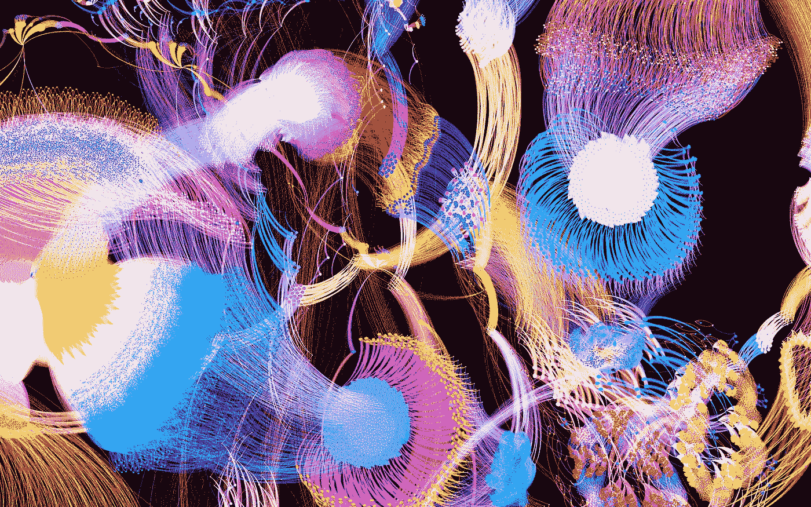
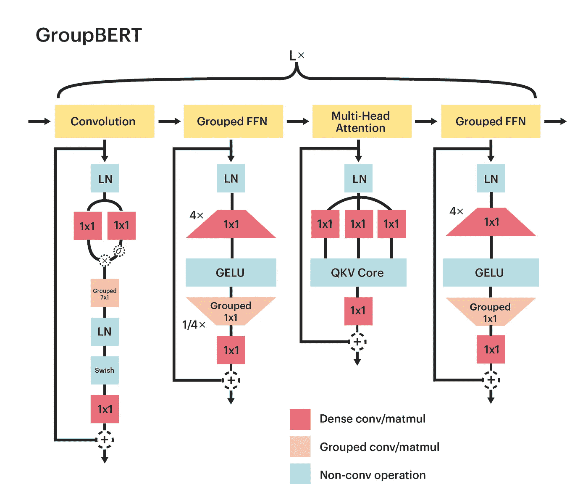
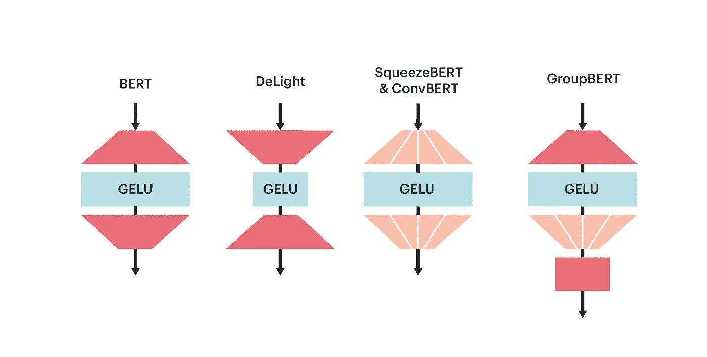
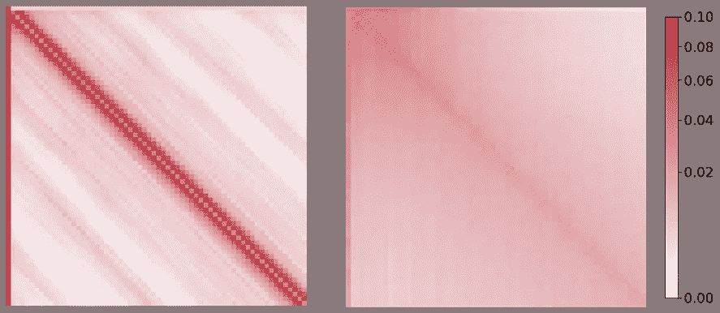
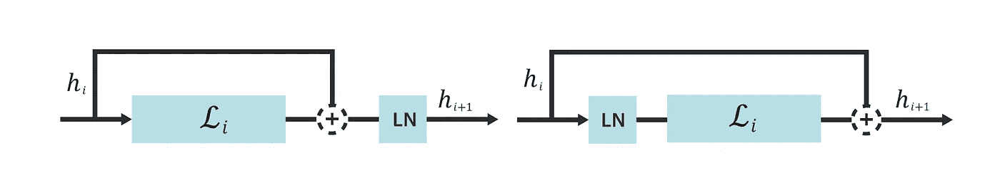
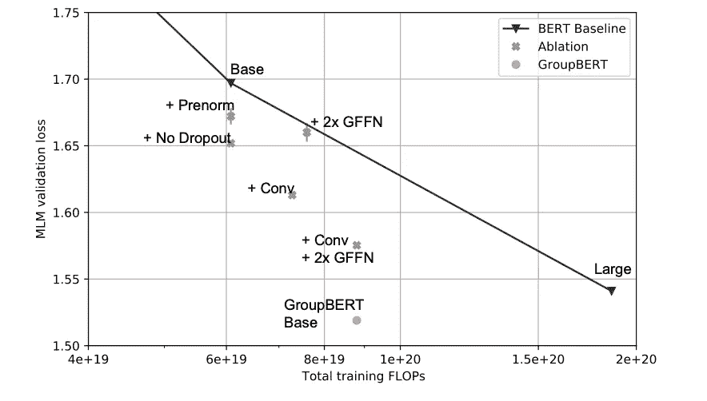
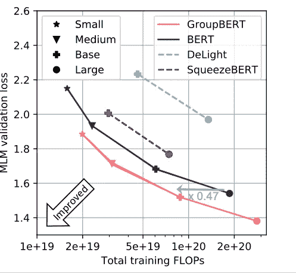
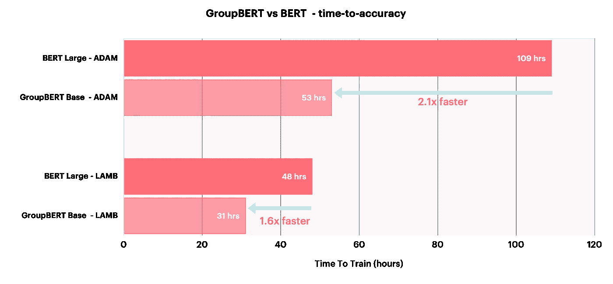

# 使用 GroupBERT 从预先训练的语言模型中获得更多回报

> 原文：<https://towardsdatascience.com/getting-more-bang-for-your-buck-out-of-pre-trained-language-models-with-groupbert-cf16953d7c0d>

# 使用 GroupBERT 从预先训练的语言模型中获得更多回报

## 在 Graphcore IPU 上实现 2 倍的训练速度

图片作者 Graphcore

ERT 已经成为当今最流行、最通用的人工智能模型之一。然而，BERT 对密集运算的依赖意味着它的准确性和灵活性需要很高的计算成本。

为了应对这一挑战，Graphcore Research 开发了 GroupBERT，这是一种基于 BERT 的新模型，它使用分组转换，非常适合我们的情报处理单元(IPU)。GroupBERT 将增强的转换器结构与高效的分组卷积和矩阵乘法相结合，使 IPU 用户能够有效地将模型中的参数数量减半，并将训练时间减少 50%，同时保持相同的精度水平。

# 由 IPU 解锁的增强型 BERT

图 GroupBERT 模型结构示意图。图片作者。

我们的论文“ [GroupBERT:具有高效分组结构的增强型 Transformer Architecture](https://arxiv.org/abs/2106.05822)”[1]展示了 IPU 如何允许 Graphcore Research 探索非常高效和轻量级的构建块，以推导出在非常大的文本语料库上更有效地进行掩蔽预训练的 Transformer 编码器结构。

GroupBERT 利用分组转换。我们用分组矩阵乘法来扩充全连接模块，并在变换器的结构中引入一个新的卷积模块。因此，每个 GroupBERT 层都扩展到四个模块，而不是像最初的 BERT 中那样扩展到两个模块。

使用 GroupBERT，我们可以看到通过验证损失衡量的 FLOPs 和任务性能之间的权衡得到了显著改善。为了达到相同的损失值，GroupBERT 只需要不到常规 BERT 模型一半的 FLOPs，后者只使用密集运算，没有利用其深度潜力。

增加的深度和减少的[运算强度](https://www.graphcore.ai/posts/delving-deep-into-modern-computer-vision-models)【2】的组伯特的组成部分强调了内存访问。与密集操作相比，对于给定的输入激活张量，分组操作执行较少的 FLOPs。为了利用计算，这些低算术强度运算需要比密集计算更快的数据访问。由于 IPU 允许所有权重和激活存储在具有极高 47.5 TB/s 带宽的片内 SRAM 中，因此它可以将 GroupBERT 的理论效率优势转化为各种型号的实际训练时间减少。

# 分组的完全连接的层

原变压器编码器层由两个模块组成:多头关注(MHA)和全连接网络(FFN)。许多工作都致力于提高其效率。 [Tay 等人(2020)](https://arxiv.org/abs/2009.06732)【3】概述了各种不同的方法，其中大多数修改集中在减少 MHA 模块对序列长度的二次计算依赖性。然而，在 BERT 中，大部分计算是以相对适中的序列长度 128 来执行的，并且 FFN 模块消耗了迄今为止最多的资源，在模型执行期间贡献了近三分之二的 FLOPs。

FFN 模块的结构非常简单:它由两个矩阵和一个非线性组成。第一个矩阵将表示投影到更高维度，通常比模型隐藏表示大四倍。这个维度扩展操作之后是非饱和激活函数，其执行表示的非线性变换并将其稀疏化。最后，通过下投影矩阵将稀疏表示缩减到模型维数。

GroupBERT 介绍了一种新颖的方案，使 FFN 计算更便宜、更快。一个关键的观察结果是，由分组引起的稀疏性最好应用于接收稀疏输入的矩阵。因此，我们只在第二个下投影矩阵中引入分组矩阵乘法，使其分块对角化。然而，分组操作在传入的隐藏表示上引入了局部性约束，限制了转换期间的通道信息传播。为了解决这个问题，我们将组与输出投影混合在一起，类似于 MHA 块，它也为多个头部划分隐藏表示。

总的来说，这种分组 FFN (GFFN)方案允许 GroupBERT 将 FFN 层的参数数量减少 25%,而任务性能的降低最小。这与所有以前尝试使用分组变换的方法形成对比，但是将它应用于两个矩阵。这导致不相交的隐藏表示，并导致显著的性能下降。

*图 2: GFFN 使用一种新颖的方案来应用分组矩阵乘法，既保持了性能又节省了计算。图片作者。*

# 作为注意力补充的分组卷积

计算 BERT 中使用的序列长度的全部到全部的注意力不会导致显著的计算开销。然而，最近的一项研究( [Cordonnier et al. 2020](https://arxiv.org/abs/1911.03584) ) [4]表明，首先，对于语言模型来说，只使用多头注意力可能是多余的。变换器层中注意力头的子集折叠成卷积模式，以单独模拟本地令牌交互。

为了减少计算密集注意力图来模拟序列中的局部相互作用的冗余，GroupBERT 引入了专用的卷积模块。分组卷积充当滑动窗口，混合彼此接近的单词标记之间的信息。然后，我们用一个附加的 GFFN 来扩展编码器，以跟随卷积模块，确保每个令牌处理模块都与一个特征处理 GFFN 模块相耦合。

有了这些附加模块，本地令牌交互就有了一个专用的轻量级模型元素。这反过来使得 MHA 注意力仅在模拟远程交互时表现得更好，因为花费在本地令牌交互上的注意力容量更少。图 3 显示了训练前验证集上 BERT 和 GroupBERT 的注意力图。这是一个清晰的可视化，说明了利用回旋如何让注意力在长距离互动中更有效，因为这种模式更平滑、更分散。

*图 3:**BERT(左)和 GroupBERT(右)从验证集数据中生成的注意力地图。GroupBERT 注意力较少依赖于相对位置，这使它能够更好地专注于长期互动。图片作者。*

# 让模型参数发挥作用

## **标准化**

许多工作已经考虑了在变压器中应用标准化的最佳方法。虽然层规格化总是规格化的首选方法，但它有两种应用方式:前规格化和后规格化。

PostNorm 对跳过连接和残差之和的输出进行归一化，而 PreNorm 在应用任何投影之前对残差分支的表示进行归一化，如图 4 所示。

*图 4:后置规格化(左)和前置规格化(右)将层规格化(LN)函数定位在相对于剩余和跳过连接的不同位置。图片作者。*

BERT 的标准实现使用 PostNorm，在使用默认学习率的设置下，它的好处是提供比 PreNorm 更强的任务性能。然而，我们发现前范式配置明显更稳定，可以使用更高的学习率，这是后范式模型所不具备的。

GroupBERT 使用 PreNorm 并实现了优异的任务性能，因为该模型现在可以稳定地适应 4 倍于 PostNorm 基线的学习速率增长，而 post norm 基线在如此高的学习速率下会出现偏差。更高的学习速率对于增加模型泛化和实现更好的收敛速率是重要的。

更高的学习率不会直接带来计算上的节省。然而，实现更高的任务性能将需要更大的模型，从而导致更高的计算成本。因此，通过增加模型稳定性来实现更高的学习率增加了利用模型参数的效率。

## **辍学**

许多基于 Transformer 架构的语言模型受益于使用 dropout，因为它减少了对训练数据集的过度拟合，并有助于泛化。然而，BERT 是在非常大的数据集上预先训练的，在这种情况下，过度拟合通常不是问题。

出于这个原因，GroupBERT 在预培训期间取消了辍学。丢弃掩码乘法中涉及的触发器可以忽略不计，因此也可以将其视为触发器中立优化。然而，生成丢弃掩码会有很大的吞吐量开销，因此在 BERT 中删除这种正则化方法有利于更快的模型执行和更好的任务性能。

虽然在没有退出的情况下对维基百科数据集执行预训练是有利的，但退出仍然是微调 GroupBERT 期间的重要工具，因为微调数据集比预训练语料库小几个数量级。

# IPU 变压器

在将所有概述的修改组合到一个模型中之前，我们必须验证每个组件的有效性。然而，成组的 ffn 减少了模型 flop 的数量，而添加卷积模块增加了 flop。因此，直接与 BERT 进行比较是不公平的，因为模型会消耗不同数量的资源。为了确定不同大小的模型增强的质量，我们必须将它们与不同大小的 BERT 模型之间的对数插值进行比较:中等、基本和大。

图 5 显示了引入 GroupBERT 的每个增强的局部消融研究。与基线 BERT 相比，模型的每一次添加都会提高帕累托效率。当组合时，GroupBERT 基本模型实现了与 BERT 大模型相同的 MLM 验证损失，即使它只有不到 50%的参数。

*图 5: GroupBERT 消融研究。GroupBERT 中引入的所有增强提高了 BERT 的帕累托效率，因为它们实现了更低的验证 MLM 损失。图片作者。*

为了明确地得出 GroupBERT 优于 BERT 的结论，我们证明了 GroupBERT 基相对于 BERT Large 的优势在大范围的模型尺度上持续存在。我们用两个额外的模型尺寸来补充 GroupBERT 基本模型，以创建一个连续的 Pareto 前沿。这种方法，如图 6 所示，使我们能够展示 GroupBERT 相对于 BERT 以及其他试图在 Transformer 中使用分组转换的模型的持续优势。

*图 6:针对 FLOPs 的训练前验证准确性*。图片作者。

由于 GroupBERT 是 IPU 本地模型，理论上在 FLOPs 方面实现的节省也转化为达到给定验证准确度水平所需的更好的端到端预训练时间。

*图 7:在 IPU-POD16 上，不同优化器的 GroupBERT Base 与 BERT Large 的训练时间。所有模型都达到了同等的训练前验证精度。图片作者。*

# 关键要点

我们的结果表明:

*   分组转换可以创建更有效的模型
*   将卷积与密集的全部对全部的注意力结合起来，即使对于需要长距离交互的任务也有有益的影响
*   IPU 将理论上的浮点运算节省转化为计算时间的实际节省
*   通过架构变化，而不是简单的模型缩放，可以实现显著的性能提升

总之，在预训练性能方面，GroupBERT 可以实现比原始 BERT 高达 2 倍的改进，从而实现更快、更高效的计算。

[阅读论文](https://arxiv.org/abs/2106.05822)
[访问 GitHub 上的代码](https://github.com/graphcore/examples/tree/master/nlp/bert/tensorflow1)

# 谢谢你

感谢 Daniel Justus、Douglas Orr、Anastasia Dietrich、Frithjof Gressmann、Alexandros Koliousis、Carlo Luschi 和 David Svantesson，他们也为这项研究做出了贡献，感谢 Graphcore 的其他同事给予的支持和见解。

# 参考

[1] I. Chelombiev，D. Justus，D. Orr，A. Dietrich，F. Gressmann，A. Koliousis，C. Luschi， [GroupBERT:具有高效分组结构的增强型变压器架构](https://arxiv.org/abs/2106.05822) (2021)，arXiv

[2] D. Masters，[深入研究现代计算机视觉模型](https://www.graphcore.ai/posts/delving-deep-into-modern-computer-vision-models) (2020)，graphcore.ai

[3] Y. Tay，M. Dehghani，D. Bahri，D. Metzler，[高效变压器:调查](https://arxiv.org/abs/2009.06732) (2020 年)，arXiv

[4] J.B. Cordonnier，A. Loukas，M. Jaggi，[论自我注意与卷积层的关系](https://arxiv.org/abs/1911.03584) (2020)，arXiv