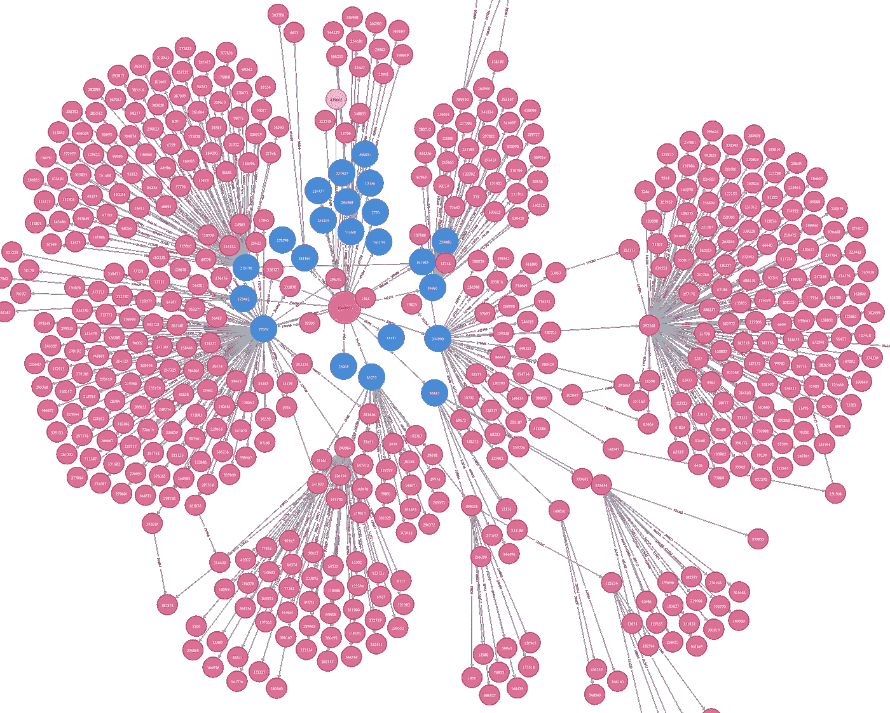
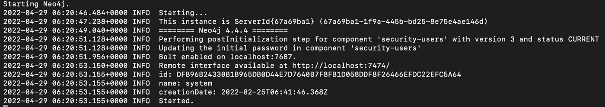
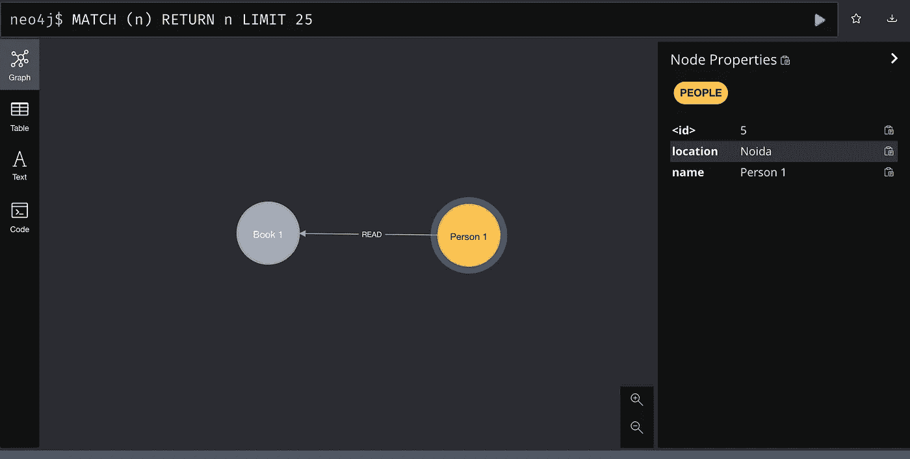
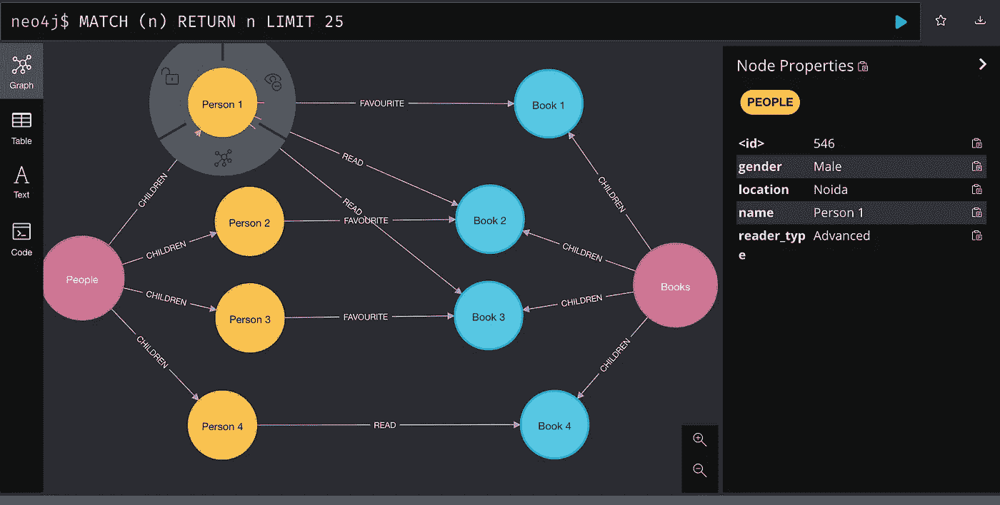

# 入门:图形数据库| Neo4j

> 原文：<https://towardsdatascience.com/getting-started-graph-database-neo4j-df6ebc9ccb5b>



*作者图片:复杂关系图可视化(neo4j Dashboard)*

传统上，各种基于 SQL 的数据库，也称为关系数据库管理系统(RDBMS ),如 MySQL、SQLite、PostgreSQL 等。为各种网络和移动应用提供动力。鉴于这种数据库在社区中的流行和熟悉程度，数据工程师和科学家已经将产品需求调整到关系数据库中，即使 NoSQL 数据库或图形数据库可能更适合这些需求。

即使对于数据分析师/科学家来说，SQL 也是最需要的数据提取和操作技能，而其他查询语言，如 MongoDB 查询语言( [MQL](https://www.mongodb.com/docs/manual/tutorial/query-documents/) )或 [Cypher](https://neo4j.com/developer/cypher/) 查询语言(Neo4j Graph)对社区来说大多是新的。因此，这篇博客的重点是提供一个循序渐进的入门指南，并从头开始构建一个基于图形的数据库。

在我们进入使用 [Neo4j](https://neo4j.com/) 的细节之前，让我们也了解一下为什么以及什么时候我们应该探索图形数据库的适用性——一般来说，如果数据集中的各种实体之间存在复杂的关系、层次或连接，以图形的形式存储数据不仅是可扩展的，而且还简化了各种复杂的分析。

**使用图表的其他一般好处是-**

*   有效利用关系
*   复杂而直观的数据存储方式
*   可扩展性和更好的性能
*   强大的分析和仪表板
*   根据业务需求的灵活模式

**让我们深入研究使用 Neo4j** 设置图形数据库

虽然现在有各种图形数据库，如 neo4j、Amazon Neptune、Tiger graph 等，但 Neo4j 是该领域历史最悠久的领先提供商之一，并且还具有特定于数据科学应用的功能。有趣的是，它是高度可扩展的，并且已经为其客户管理了具有数十亿个节点的图表。而且，它是开源的，可以免费使用。

虽然我们可以在其云版本 [Neo4j AuraDB](https://neo4j.com/cloud/platform/aura-graph-database/?ref=get-started-dropdown-cta) 上设置 Neo4j，并使用 python 驱动程序来读/写数据，但这篇博客更侧重于在本地系统上设置数据库，使我们也能够执行批量操作。

**图表的关键组件:**

*   节点—图表中表示各种实体的各种节点
*   关系—各种节点之间的连接
*   属性—每个节点或关系存储的详细信息
*   标签和索引—主要是为了编写更快、更简单的查询而添加的

**第一步:下载并设置 Neo4j**

*   neo4j(社区版)的最新版本可以从[这里](https://neo4j.com/download-center/#community)下载。
*   Neo4j 大部分是用 [Java](https://www.java.com/en/) 开发的，所以我们也需要安装最新版本的 Java 才能使用数据库

**第二步:启动 Neo4j 控制台**

```
cd neo4j-community-4.4.4
bin/neo4j console
```



*作者图片*

现在，我们可以使用[http://localhost:7474/browser/](http://localhost:7474/browser/)访问 Neo4j 控制台


*图片作者:neo4j dashboard*

**步骤 3:使用密码创建一些节点和关系**

*   Neo4j 支持 cypher 查询数据库，我们可以从控制台使用 cypher 创建一些节点

```
CREATE (p:PEOPLE {name: 'Person 1', location: 'Noida'}), (b:BOOK {name: 'Book 1', author: 'XYZ'})MATCH (p:PEOPLE), (b:BOOK)
WHERE p.name = 'Person 1' AND b.name = 'Book 1'
CREATE (p)-[r:READ]->(b)
```



*作者图片:使用 cypher 创建的简单的 2 个节点和 1 个关系图*

**步骤 4:使用** `neo4j-admin import`批量创建节点和关系

*   虽然我们可以使用 cypher 创建节点，但对于大量节点来说，这可能非常耗时。因此，我们可以使用`neo4j-admin import`在几秒钟内从 CSV 导入数百万行。但是这只能在创建数据库时从控制台执行一次。
*   [这里的](https://drive.google.com/file/d/1z2r_8jRZA0-C4dTCIM_RbYV8RneDepPT/view?usp=sharing)是一个示例 python 代码，可以用来生成示例数据。大型 CSV 文件可以按照[此处](https://neo4j.com/docs/operations-manual/current/tutorial/neo4j-admin-import/)指定的格式创建/重构。
*   Neo4j 支持节点/关系属性的`int`、`long`、`float`、`double`、`byte`、`short`、`char`、`string`、`point`、`date`、`localtime`、`time`、`localdatetime`、`datetime`、`duration`数据类型。默认值是`string`，数组类型可以通过在类型后追加`[]`来指定。此外，我们可以有效地向图中添加标签和索引，以便更快地进行扩展查询。

```
# To import csvs generated from the code abovebin/neo4j-admin import --nodes=import/nodes_roots.csv --nodes=import/nodes_people.csv --nodes=import/nodes_books.csv --relationships=import/relations_roots.csv --relationships=import/relations_read.csv --relationships=import/relations_favourite.csv --force
```

最后，我们的样本图形数据库看起来像这样—



*作者图片:使用 neo4j-admin 导入的示例图*

**步骤 4:使用 Cypher 运行分析**

例 1:通过`Person 1`得到`Books`即`READ`和`FAVOURITE`。

```
MATCH (p:PEOPLE), (b:BOOKS) 
WHERE p.name='Person 1' and (p)-[]->(b) 
RETURN p, b
```

例 2:得到被`People`评为 5 的`Books`

```
MATCH (p:PEOPLE)-[k:READ]->(b:BOOKS) 
WHERE k.rating=5 
RETURN p, b
```

[这里的](https://neo4j.com/docs/cypher-manual/current/)是学习编写高级查询的 Cypher 文档。

**第五步:部署**

Neo4j 数据库可以从 [AWS 市场](https://aws.amazon.com/marketplace/pp/prodview-k4c7xihxgbafk)部署。Neo4j 甚至提供了一个 Django 框架`[neomodel](https://neomodel.readthedocs.io/en/latest/)`用于在数据库顶部编写 API 服务。

如果你有兴趣了解更多，请在评论中告诉我:)

这只是“开始”,但图可以是巨大的，有数十亿个节点和关系，甚至在这种规模下表现良好。想象脸书网络图，数十亿人作为节点，相互连接。甚至像谷歌、LinkedIn 和 PayPal 这样的科技巨头也利用图形数据库的力量创造了蓬勃发展的业务。他们的秘密？他们每个人都使用图形数据库技术来利用数据连接的力量。

只要有关系，图数据库就可以成为更有效的数据库选择！