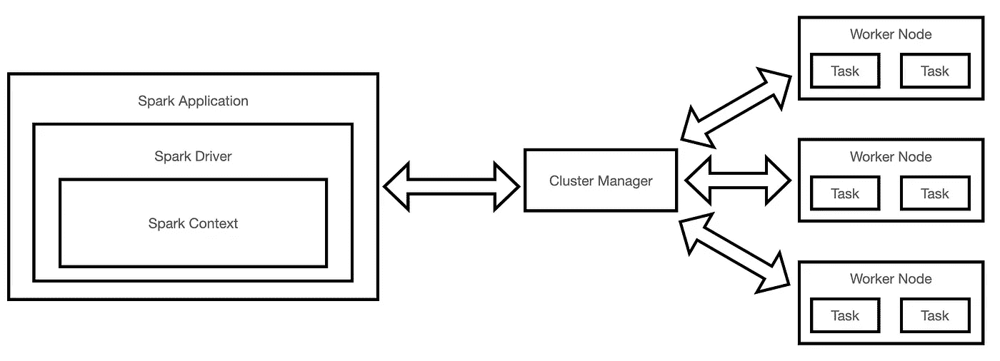
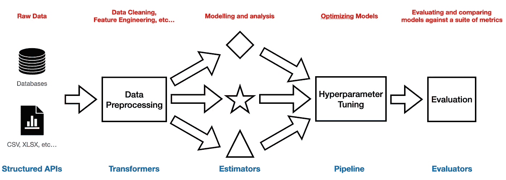

# Apache Spark 入门

> 原文：<https://towardsdatascience.com/getting-started-with-apache-spark-cb703e1b3ee9>

## 探索与 Spark 相关的一些关键概念，以及是什么决定了它在大数据领域的成功

伊恩·施耐德在 [Unsplash](https://unsplash.com?utm_source=medium&utm_medium=referral) 上拍摄的照片

# 介绍

正如我们今天所知，互联网发展初期的一个主要问题是无法扩展(例如，能够在短时间内搜索大量数据，支持不断变化的用户数量而不停机，等等)。

这最终是因为在一个网络世界中，不断产生和处理各种形状和大小的新数据(关于[大数据分析的更多信息可在我之前的文章](/big-data-analysis-spark-and-hadoop-a11ba591c057)中找到)。

试图解决这个问题的第一个方法是 **Apache Hadoop(高可用性分布式面向对象平台)**。Hadoop 是一个开源平台，旨在将数据作业分解为小块，并将它们作为作业分布在一个计算节点集群中，以便能够并行处理它们。Hadoop 可以分为 3 个关键组件:

*   **HDFS (Hadoop 分布式文件系统)**:为大数据支持和容错而设计的分布式文件系统。
*   **MapReduce** :一个框架，旨在促进集群中数据作业的并行化。在映射过程中，以键-值对的形式获取并处理输入，然后将输入传递给 reduce 操作，以便聚合输出并提供最终结果。
*   **YARN(又一个资源协商者)**:管理集群的不同节点(例如调度作业、任务等)并平均分配工作负载。

因此，使用 Hadoop，可以通过水平扩展我们的基础设施(添加更多机器)和并行执行来处理大量数据。由于[摩尔定律](https://en.wikipedia.org/wiki/Moore%27s_law)的放缓以及全球范围内云存储成本的同步降低，水平扩展操作事实上已经成为大多数应用程序中事实上的标准方法。

另一方面，Hadoop 也有许多限制:

*   没有完全设计为支持批处理以外的任务(例如流、机器学习等)
*   难以管理和优化。
*   过于冗长的 API 需要大量样板代码。
*   作为批处理过程的一部分，中间计算被写入，然后从磁盘读取(因此导致性能瓶颈)。

为了尝试解决所有这些限制，Apache Spark 应运而生。

# 阿帕奇火花

Apache Spark 始于 2009 年加州大学伯克利分校 Matei Zaharia 的一个研究项目，今天被公认为处理大量数据的最受欢迎的计算引擎之一(在某些工作中比 Hadoop MapReduce 快几个数量级)。Spark over Hadoop 的一些关键改进包括:

*   一套支持不同类型工作流的库(如 Spark ML、结构化流、Spark SQL、Graph X)。
*   高度容错和并行的生态系统。
*   多种编程语言的 API(例如 Scala、Java、Python、SQL、R)。独立于所使用的语言，程序被分解成字节码，并在集群的工人上执行。
*   用于中间计算的内存存储。
*   专注于计算(例如，Hadoop 同时包含计算和存储系统，而 Spark 几乎对任何存储选项都是开放的)。

Spark 应用程序可以分解成许多不同的组件(图 1)。使用驱动程序来实例化 Spark 会话，并使用它来与集群的不同组件(例如，集群管理器和执行器)进行交互。作为程序执行的一部分，驱动程序负责向集群管理器请求必要的资源(例如内存、CPU)，以便让执行器(例如 Java 虚拟机)继续执行它们的任务，并直接与执行器通信以优化执行。Spark 目前能够支持 4 种不同类型的集群管理器:standalone、Hadoop YARN、Apache Mesos 和 Kubernetes。

图 1: Apache Spark 架构(图片由作者提供)。

在整个过程中，数据被存储为分区，并且执行者优选地被分配需要处理离他们最近的数据的任务(以最小化网络带宽)。

Spark 可以对数据执行两种操作:**转换**和**动作**。变换会创建一个新的 Spark 数据框，而不会改变原始数据框，并且总是被延迟评估(它们不会立即执行，而是作为沿袭的一部分被记住)。这使得创建转换的**有向无环图(DAG)** 成为可能，然后可以利用 Spark Catalyst optimizer 基于规则和基于成本的优化，以最有效的方式运行。拥有一系列的转换和不可变的数据帧可以让 Spark 创建一个高度容错的系统。每当一个动作被调用时，转换最终被执行。

变换还可以分为**窄**或**宽**。窄转换采用单个输入分区并返回单个输出分区(例如*过滤操作*)，而宽转换使用多个分区并要求数据的重新洗牌(例如*分组操作*)。

在过去的几年里，为了让 Spark 更容易开发，在 Spark API 上开发了不同形式的结构。**rdd(弹性分布式数据集)**是 Spark 中最基本的抽象形式，如今主要被 **Spark 的结构化 API(数据集、数据帧 API)**等效命令所取代。事实上，Spark 结构化 API 完全构建在 rdd 之上，旨在为数据处理领域的大多数常见任务提供易于使用的预优化代码。此外，Spark 还可以通过**UDF(用户定义函数)**创建自定义函数。Spark UDFs 可以用不同的编程语言编写(例如 Python、Java、Scala 等)，尽管目前建议用 Java 或 Scala 编写 UDF，因为它们可以提供更好的整体性能(例如 UDF 就像 Catalyst Optimizer 的黑盒，因此如果用 Python 编写，就无法完全优化)。

最后，Spark 还使得使用 Spark ML 库运行机器学习工作流成为可能(图 2)。该库可分为 4 个关键组成部分:

*   **转换器**:主要用于执行数据工程/预处理任务(如缩放、特征选择等)，它们只应用基于规则的转换(没有从数据中学习)。它们将一个数据帧作为输入，并返回一个新的数据帧。
*   **估计器**:从数据中学习参数，并返回一个训练好的 ML 模型(它是一个变换器)。
*   **管道**:在单个对象中组织一系列转换器和估算器。
*   **评估者**:用于通过各种分类、回归等指标评估我们的机器学习模型。

图 2: Spark ML 工作流程(图片由作者提供)。

此外，Spark ML 可以与各种其他开源包集成，如 Hyperopt、Horovod、MLFlow 等，以提供完整的用户体验。

# 结论

总体而言，Apache Spark 是目前业内用于处理大数据的最受欢迎的技术之一，由 Databricks 和 Palantir 等公司提供支持。由于最近生态系统的加入，Spark 现在也变得越来越与传统数据科学用户相关(例如 Spark 上的 [Pandas API)，使其成为最有趣的学习技术之一。](https://spark.apache.org/docs/latest/api/python/user_guide/pandas_on_spark/index.html)

# 联系人

如果你想了解我最新的文章和项目[，请通过媒体](https://pierpaoloippolito28.medium.com/subscribe)关注我，并订阅我的[邮件列表](http://eepurl.com/gwO-Dr?source=post_page---------------------------)。以下是我的一些联系人详细信息:

*   [领英](https://uk.linkedin.com/in/pier-paolo-ippolito-202917146?source=post_page---------------------------)
*   [个人网站](https://pierpaolo28.github.io/?source=post_page---------------------------)
*   [中等轮廓](https://towardsdatascience.com/@pierpaoloippolito28?source=post_page---------------------------)
*   [GitHub](https://github.com/pierpaolo28?source=post_page---------------------------)
*   [卡格尔](https://www.kaggle.com/pierpaolo28?source=post_page---------------------------)