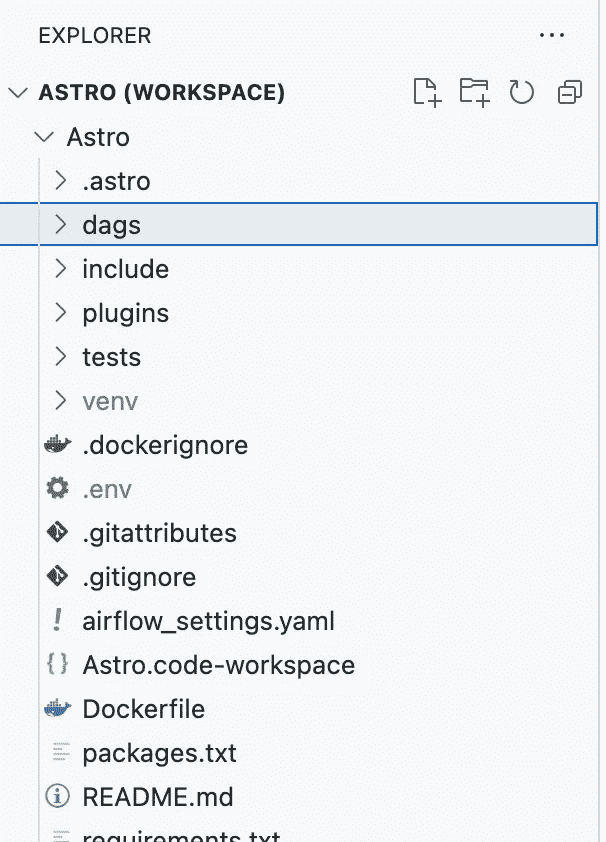
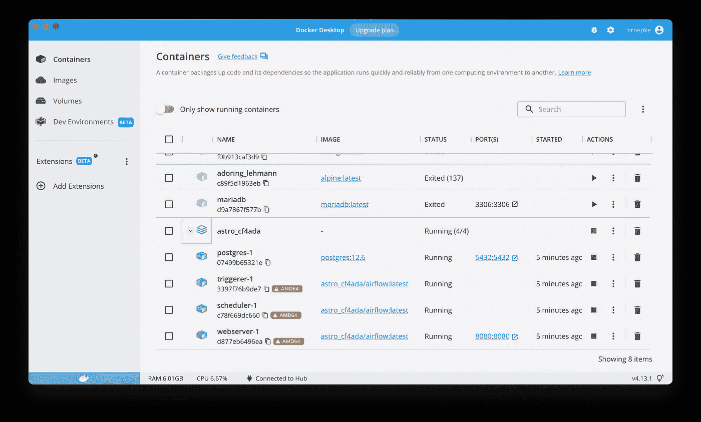
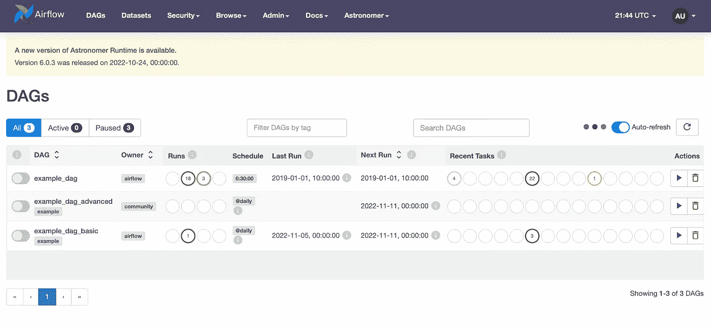
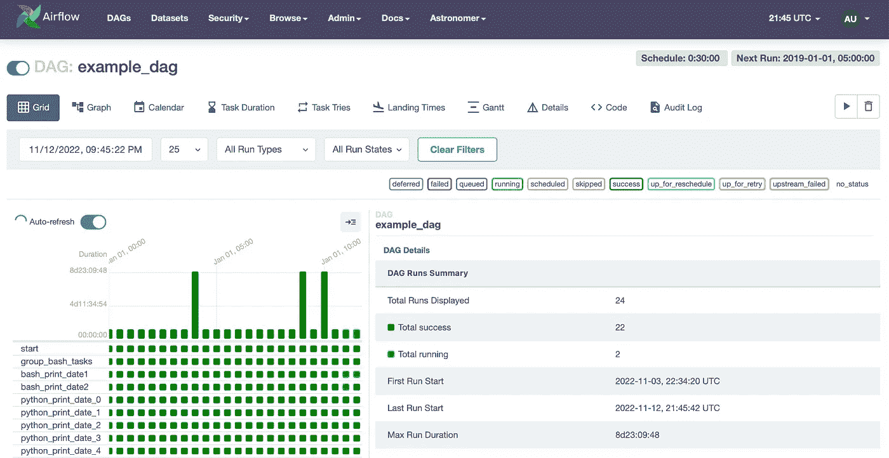
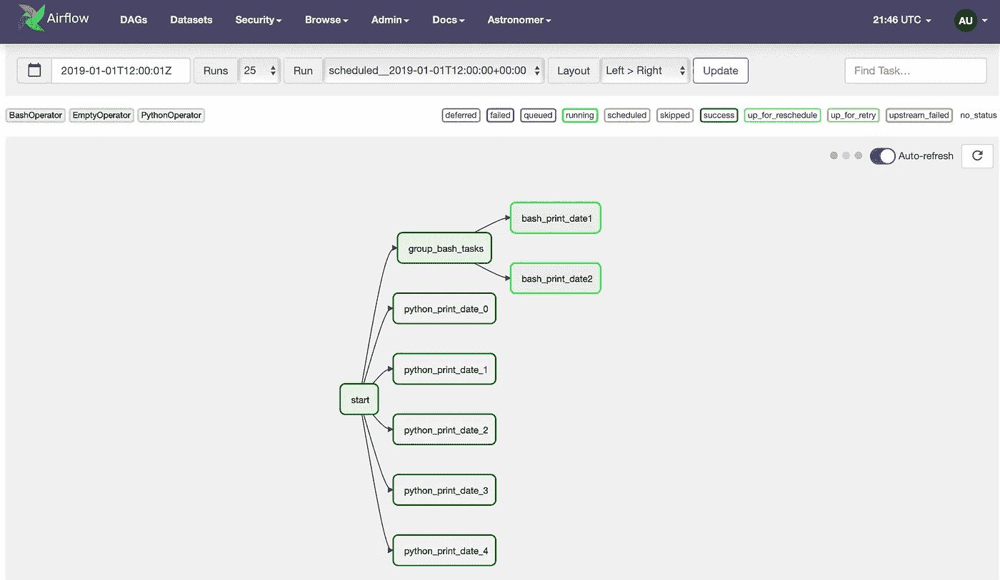

# 天文学家气流入门:数据工程的主力

> 原文：<https://towardsdatascience.com/getting-started-with-astronomer-airflow-the-data-engineering-workhorse-d5a5cf543c2c>

## 借助由 Python 支持的托管气流服务天文学家构建强大且可扩展的数据管道


[内森·安德森](https://unsplash.com/@nathananderson?utm_source=medium&utm_medium=referral)在 [Unsplash](https://unsplash.com?utm_source=medium&utm_medium=referral) 上拍照

# **什么是天体气流？**

我们将从**气流**开始。 [Apache Airflow](https://en.wikipedia.org/wiki/Apache_Airflow) 是一个开源的工作流管理平台，帮助您构建**数据工程管道**。Airflow 的最大优势之一，也是它如此受欢迎的原因，是你可以用 Python 以 DAG ( [有向无环图](https://en.wikipedia.org/wiki/Directed_acyclic_graph))的形式编写你的配置。使用 Python 编写 DAG 的强大功能意味着您可以利用强大的 Python 库套件来做几乎任何您想做的事情。

接下来是天文学家。[天文学家](https://www.astronomer.io)是一个受管理的气流服务，允许你在云环境中编排工作流程。Airflow 的一个常见用例是从一个数据源获取数据，通过几个步骤对其进行转换，然后将其加载到数据仓库中。您甚至可以利用气流进行[特性工程](https://medium.com/towards-data-science/6-tips-to-power-feature-engineering-in-your-next-machine-learning-project-d61530eee11b)，在这里您可以在数据仓库中应用数据转换，创建新的数据视图。在这篇文章中，我将介绍气流的基础知识以及如何开始使用天文学家。

我们开始吧！

# 安装自制软件

自制软件将是安装天文学家 CLI 最简单的方法。如果你没有安装家酿软件，你可以通过访问[家酿网站](https://brew.sh/)并运行他们提供的命令来安装。

# 安装 Docker

接下来，我们需要安装 **Docker** 。Docker 是一个**容器**管理系统，允许你在本地计算机和云中运行虚拟环境。Docker 是极其轻量级和强大的。Airflow 运行在 docker 容器中，并安装所需的一切，如 web 服务器和本地数据库。前往 Docker 网站，为你的操作系统安装 [Docker 桌面](https://docs.docker.com/get-docker/)。

*注意:在大型企业(超过 250 名员工或年收入超过 1000 万美元)和政府机构中商业使用 Docker Desktop 需要付费订阅。*

# 天文学家 CLI

最后，让我们安装[天文学家 CLI](https://docs.astronomer.io/astro/cli/install-cli) (命令行界面)。CLI 是一个命令行工具，允许您与天文学家服务进行交互。您可以使用 CLI 创建新项目、部署代码和管理用户。

```
brew install astro
```

**注意:**对于这个例子，我们不打算将我们的任何 Dag 发布到云中；我们将在本地运行它们，感受一下天文学家是如何工作的。

# 创建一个 Python 虚拟环境

虚拟环境是隔离您将用于运行 Airflow 的包的一种很好的方式，允许您拥有多个具有不同依赖关系的 Airflow 项目。您可以通过运行以下命令来创建虚拟环境:

```
python3 -m venv venv
```

然后在必要时激活环境。如果您使用的是 Visual Studio 代码，可以使用命令面板来激活环境，或者它应该在您打开项目时激活。

```
source venv/bin/activate
```

# 初始化项目

为您的项目创建一个新文件夹，并启动您选择的 IDE 我的工具是 Visual Studio 代码。在这个例子中，我将我的作业命名为`Astro`,但是用一个更具描述性的名称来描述您正在运行的作业会更合适。

运行命令`astro dev init`，用几个文件和文件夹创建一个新项目。最重要的文件是**docker 文件**。该文件用于构建 docker 映像，您将使用该映像来运行 Airflow 实例。Dockerfile 是一个文本文件，包含用户可以在命令行上调用的所有命令，以组合一个图像。使用 docker build，用户可以创建一个连续执行几个命令行指令的自动化构建。

您还会在文件夹中找到一个 **requirements.txt** 文件，其中包含运行 Dag 所需的所有 python 包。您可以根据需要向该文件添加其他包。当我们到达这里，我们将没有任何额外的依赖；唯一出席的将是`apache-airflow`。



作者图片

# 狗的解剖

放置在`/dags`目录中的 Dag 会自动出现在气流 UI 中。重要的是，包含 DAG 逻辑的`.py`文件具有 DAG 上下文管理器定义；你可以看到下面这条线`with DAG('example_dag'`。新版本的 Airflow 使用 decorator(`@dag(`)来完成同样的事情。

让我们看一个 DAG 示例，并讨论各种组件。

```
from airflow import DAG
from airflow.operators.dummy_operator import DummyOperator
from airflow.operators.bash_operator import BashOperator
from airflow.operators.python_operator import PythonOperator
from airflow.version import version
from datetime import datetime, timedelta

def my_custom_function(ts,**kwargs):
    """
    This can be any python code you want and is called from the python 
    operator. The code is not executed until the task is run by the 
    airflow scheduler.
    """
    print(f"Task number: {kwargs['task_number']}.")
    print(f"DAG Run execution date: {ts}.")
    print(f"Current time: {datetime.now()}")
    print("Full DAG Run context.")
    print(kwargs)

# Default settings applied to all tasks
default_args = {
    'owner': 'airflow',
    'depends_on_past': False,
    'email_on_failure': False,
    'email_on_retry': False,
    'retries': 1,
    'retry_delay': timedelta(minutes=5)
}

# Using a DAG context manager, you don't have to 
# specify the dag property of each task
with DAG('example_dag',
         start_date=datetime(2019, 1, 1),
         max_active_runs=3,
         schedule_interval=timedelta(minutes=30), 
         default_args=default_args,
         # catchup=False
         ) as dag:

    t0 = DummyOperator(
        task_id='start'
    )

    t1 = DummyOperator(
        task_id='group_bash_tasks'
    )
    t2 = BashOperator(
        task_id='bash_print_date1',
        bash_command='sleep $[ ( $RANDOM % 30 )  + 1 ]s && date')
    t3 = BashOperator(
        task_id='bash_print_date2',
        bash_command='sleep $[ ( $RANDOM % 30 )  + 1 ]s && date')

    # generate tasks with a loop. task_id must be unique
    for task in range(5):
        tn = PythonOperator(
            task_id=f'python_print_date_{task}',
            python_callable=my_custom_function,
            op_kwargs={'task_number': task},
        )

        t0 >> tn # inside loop so each task is added downstream of t0

    t0 >> t1
    t1 >> [t2, t3] # lists can be used to specify multiple tasks
```

# 积木

*   **Imports** :这只是您希望在项目中使用的 python 库的列表。像使用任何 python 项目一样使用它们。
*   **自定义函数**:自定义函数位于上下文管理器之外，由 Python 操作符调用。该函数可以是您想要的任何 python 代码，并从 python 操作符中调用。一旦气流调度程序运行任务，就会执行该代码。
*   **默认参数**:适用于所有任务的默认设置字典。这些可以在任务级别覆盖。
*   **DAG 上下文管理器**:更多关于下一个！
*   **任务**:工作流程中的各个步骤
*   **执行顺序**:气流运行各任务的顺序

# DAG 上下文管理器

DAG 上下文管理器是构建图形的逻辑所在。让我们浏览一下上面的 DAG 示例，并讨论各个组件。还有其他方法来构建 DAG，包括新的[任务流 API](https://airflow.apache.org/docs/apache-airflow/2.0.0/concepts.html#taskflow-api) 。但是，DAG 上下文管理器是构建 DAG 的常用方法。上下文管理器允许轻松地将任务分配给 DAG，并能够添加任务之间的依赖关系。

首先是 dag ( `example_dag`)的**名称**，稍后你会在 Astro UI 中看到。然后是一些**全局设置**，包括之前定义的`default_args`。

# 任务

接下来是我们的第一个任务，`t0 = DummyOperator`。**虚拟操作符**什么也不做，只是允许您对任务进行分组，以设置图中将要执行的顺序。接下来，我们有另一个虚拟操作符，后面是下一个任务`t2 = BashOperator`。Bash 操作符允许您执行 Bash 脚本。

最后，我们看到了循环中的下一组任务，`tn = PythonOperator`利用了 **Python 操作符**，它可以执行 Python 代码，甚至像在本例中一样，调用我们在文件开头定义的**函数**。

`op_kwargs`参数用于将`task_number`变量传递给函数。在上面的函数中，除了“ts”变量之外，还传递了`**kwargs`变量。此变量允许函数访问 DAG 运行的完整上下文。

我们的函数用`print(kwargs)`打印完整的上下文变量。我们可以查看日志，看看我们的`kwargs`。

# 执行次序

现在，把所有这些都带回家，我们设置任务执行的顺序。三行代码告诉 DAG 如何执行。首先是循环内部的`t0 >> tn`。这个位置告诉 DAG`tn`在循环的每次迭代中运行，从上面我们知道生成了五个任务。

接下来是`t0 >> t1`。虚拟操作符允许下一行`t1 >> [t2, t3]`执行并行任务。这里的逻辑是，我们有一个起始虚拟操作符，下一步有六个任务，最后一步有两个并行任务。

# 开始项目

运行`astro dev start`来启动项目和 docker 容器。

```
[+] Running 4/4
 ⠿ Container astro_cf4ada-postgres-1   Started    0.7s
 ⠿ Container astro_cf4ada-scheduler-1  Started    1.5s
 ⠿ Container astro_cf4ada-triggerer-1  Started    1.5s
 ⠿ Container astro_cf4ada-webserver-1  Started     2.2s

Airflow is starting up! This might take a few minutes… 
```

打开 Docker 仪表板，查看不同的容器运行情况。像上面的控制台输出一样，我们可以看到四个容器正在运行。



作者图片

在它完成启动过程之后，您将在您的 shell 中看到以下内容。请注意 URL 和凭据。当它准备好的时候，你的浏览器应该自动启动 Astro UI，但是你可以随时使用 URL 来访问它。

```
Airflow Webserver: http://localhost:8080
Postgres Database: localhost:5432/postgres
The default Airflow UI credentials are: admin:admin
The default Postgres DB credentials are: postgres:postgres
```

# 打开并浏览气流用户界面

看一下气流 UI。**Dag**页面将向您显示您的 **Astro 项目**中所有可用 Dag 的列表。您可以使用最左侧的滑块控制来启动 DAG。这样做之后，您将立即开始看到 DAG 运行！



作者图片

当您点击 DAG 的**名称**时，您将被带到**网格视图**。该页面显示了一个非常酷的彩色编码图，显示了每个任务运行的状态。您可以点击每一个来获得更多的细节，包括该任务的**日志**。如果出现故障，您可以点击**失败的**任务来查看日志。



作者图片

接下来是**图形视图**。图形视图向您显示了执行 DAG 的**顺序**。请查看我们任务执行的输出，并将其映射回我们上面写的代码。您可以看到执行的顺序和任务之间的依赖关系。



作者图片

# 停止项目

最后，当你完成了一天的开发，你可以用`astro dev stop`停止一切运行。

```
❯ astro dev stop
[+] Running 4/4
 ⠿ Container astro_cf4ada-triggerer-1  Stopped
 ⠿ Container astro_cf4ada-webserver-1  Stopped
 ⠿ Container astro_cf4ada-scheduler-1  Stopped
 ⠿ Container astro_cf4ada-postgres-1   Stopped
```

# 结论

天文学家是开源的阿帕奇气流服务的商业产品。它提供了高度可靠的托管服务，允许您为数据工程和数据科学构建强大的工作流编排。我们今天介绍了入门的基础知识，从安装到创建项目、运行 DAG 和停止项目。我们还讲述了 DAG 上下文管理器的基础知识以及如何构建 DAG。从这里，您可以开始尝试自己的 Dag 和工作流，并实现数据工程和数据科学工作流的现代化。编码快乐！

一如既往，本文的代码可以在 [GitHub](https://github.com/broepke/Astro) 上找到

如果你喜欢阅读这样的故事，并想支持我成为一名作家，考虑注册成为一名媒体成员。一个月 5 美元，无限量访问数千篇文章。如果你使用 [*【我的链接】*](https://medium.com/@broepke/membership) *注册，我将免费获得一小笔佣金。*